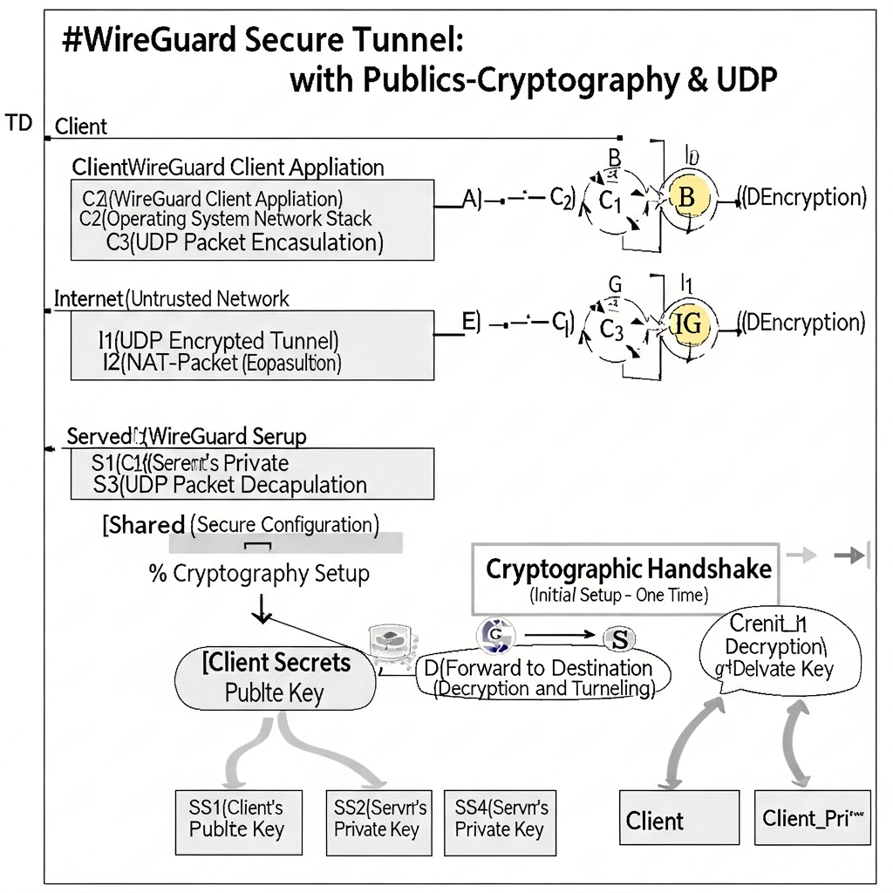

!

### 1. 技术摘要

| 类别 | 内容 |
| :--- | :--- |
| **英文名称** | WireGuard |
| **中文名称** | WireGuard |
| **缩写** | WG |
| **相关技术** | VPN, ChaCha20, Curve25519, UDP, Linux Kernel, Cryptokey Routing |

### 2. 核心摘要
WireGuard 是一款为了解决 IPsec 或 OpenVPN 等传统 VPN 协议的复杂性而诞生的开源协议。由于其在 Linux 内核层运行，处理速度极快；同时将代码量大幅缩减至 4,000 行左右，使得安全漏洞审查变得更加容易。它被评价为在性能和管理便利性方面都取得了卓越的平衡。

### 3. 开发背景
传统的 IPsec 和 OpenVPN 代码量高达数十万行，不仅配置繁琐，庞大的代码库也使得查找安全漏洞变得异常困难。2016 年，安全研究员 Jason A. Donenfeld 为了改善这一现状，引入了现代加密算法，并设计了一种全新的隧道标准，旨在移动设备或嵌入式设备上也能以极低的功耗实现高速通信。

### 4. 主要特点与工作原理

*   **加密密钥路由 (Cryptokey Routing)：** 类似于 SSH 的认证方式，将公钥 (Public Key) 与特定的隧道 IP 地址绑定。系统会通过加密方式检查进入接口的数据包源 IP 是否与预先允许的 Peer（对等节点）IP 匹配，从而使配置过程更加清晰明确。
*   **固定的加密套件 (Fixed Cryptographic Suite)：** 与提供多种加密算法选择不同，WireGuard 固定使用 ChaCha20、Poly1305、Curve25519 等经过验证的现代算法。这从根本上防止了因配置错误而导致安全级别降低的问题。
*   **基于无状态 (Stateless) 的连接性：** 基于 UDP 运行，支持“IP 漫游”功能。即使用户的 IP 地址发生变化（例如从 Wi-Fi 切换到 LTE），连接也能在无需重新认证的情况下保持顺畅，这在移动环境下具有显著优势。

### 5. 与 OpenVPN 的区别

| 比较项目 | OpenVPN | WireGuard |
| :--- | :--- | :--- |
| **代码规模** | 约 600,000 行以上 | 约 4,000 行左右 |
| **主要协议** | TCP 或 UDP | 仅限 UDP |
| **加密方式** | 基于证书及多种算法 | 公钥对及固定算法 |
| **主要特征** | 兼容性和通用性高，但配置复杂，且由于开销较大可能导致速度下降。 | 结构简洁、速度快且易于安全审查。但由于默认采用静态 IP 分配方式，实现匿名性需要额外操作。 |

### 6. 实务应用及相关术语

*   **实务应用：** 广泛应用于构建企业大规模远程办公系统、微服务 (MSA) 环境下的容器间安全通信 (Service Mesh)，以及作为商业 VPN 服务的高速隧道引擎。
*   **相关术语：**
    1.  **Noise Protocol Framework:** WireGuard 在设计握手过程时所基于的框架。
    2.  **完全正向保密 (PFS)：** 一种安全特性，确保即使当前的会话密钥泄露，也无法解密过去截获的通信内容。
    3.  **终点 (Endpoint)：** 指 WireGuard Peer 在互联网上实际交换数据的 IP 地址和端口。

## ✅ 常见问题 (FAQ)

  
什么是 WireGuard？

  

WireGuard 是基于现代加密技术和精简代码库，将速度与安全性最大化的下一代开源 VPN 协议。与传统的复杂 VPN 方式不同，它在 Linux 内核中运行，具有极高性能的特点。

  

  
WireGuard 的主要特点是什么？

  

它设计精炼，代码量仅约 4,000 行，便于安全漏洞审查，且配置流程清晰。此外，通过固定使用现代加密算法，它同时实现了强有力的安全性和低功耗高速通信。

  

  
这项技术的开发背景是什么？

  

传统的 IPsec 或 OpenVPN 代码量达数十万行，配置困难且难以发现安全隐患。为了改善这些问题，安全研究员 Jason A. Donenfeld 设计了这一新标准，使其在移动和嵌入式环境中也能高效运行。

  

  
什么是“加密密钥路由 (Cryptokey Routing)”？

  

这是一种类似于 SSH 认证的方式，将公钥与特定的隧道 IP 地址关联进行通信。它通过加密手段核实进入接口的数据包源 IP 是否与预设的 Peer IP 一致，从而确保连接的可信度。

  

  
WireGuard 使用哪些加密算法？

  

它固定使用 ChaCha20、Poly1305、Curve25519 等经过验证的现代算法。这从源头上杜绝了因用户选择安全性较低的算法而导致的配置失误。

  

  
与传统的 OpenVPN 相比，WireGuard 最大的优势是什么？

  

代码规模不到 OpenVPN 的 1%，速度更快且占用系统资源更少。此外，它使用简单的公钥对代替了复杂的证书方式，部署和维护都非常简便。

  

  
为什么 WireGuard 在移动环境下更受青睐？

  

因为它支持基于 UDP 的无状态连接，具有强大的“IP 漫游”功能。即使网络在 Wi-Fi 和 LTE 之间切换，也无需重新认证即可保持连接，实现在移动过程中的无缝 VPN 体验。

  

  
在实务中主要有哪些用途？

  

用于构建企业级大规模远程办公系统，或在微服务 (MSA) 环境中进行容器间的安全通信。由于其卓越的性能，也被许多商业 VPN 服务积极采用作为其高速隧道引擎。

  

  
安全术语中的“完全正向保密 (PFS)”是什么，它与 WireGuard 有什么关系？

  

PFS 是一种保护功能，确保即使某个会话密钥泄露，攻击者也无法解密过往的通信数据。WireGuard 的握手过程默认包含此功能，强化了长期通信的数据安全性。

  

  
引入 WireGuard 时需要注意哪些事项或缺点？

  

由于默认配置采用静态 IP 分配，若要实现完美的匿名性，可能需要额外的技术处理。此外，因为它仅使用 UDP 协议，需提前确认所在网络是否拦截了 UDP 流量。

  

