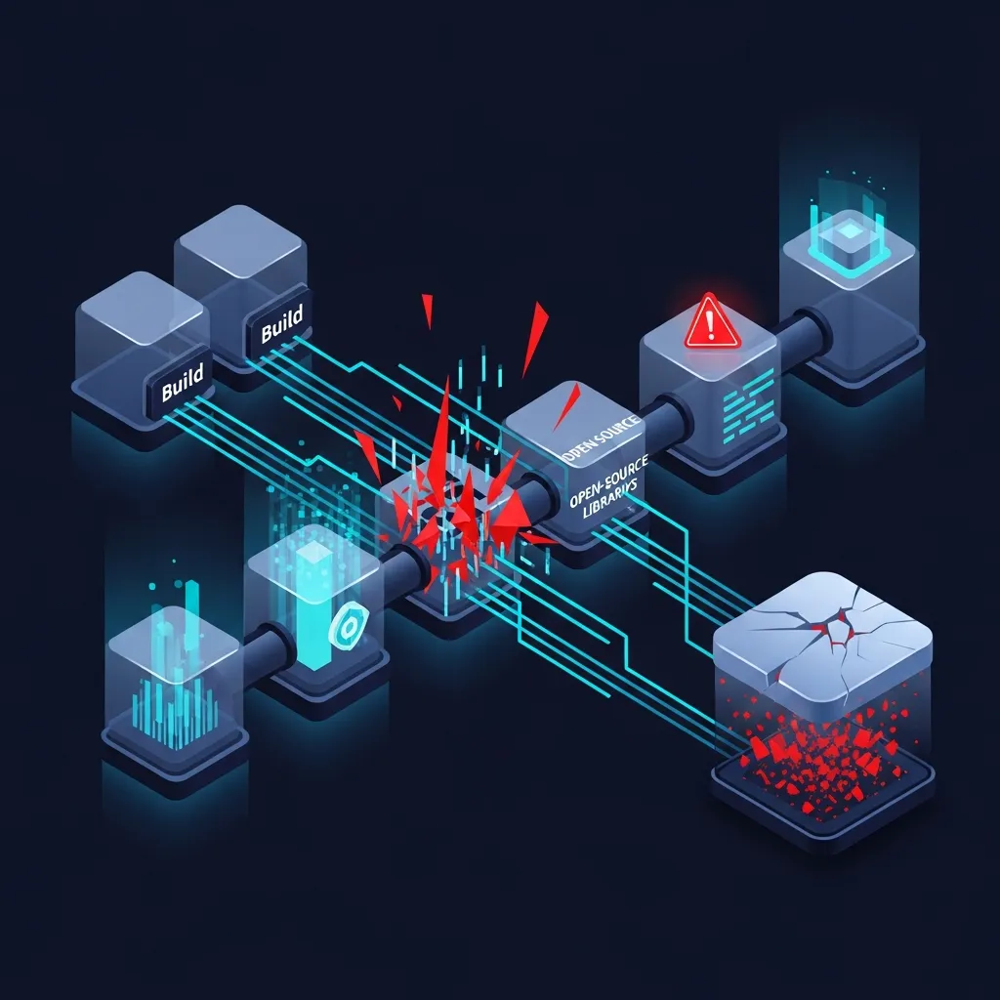
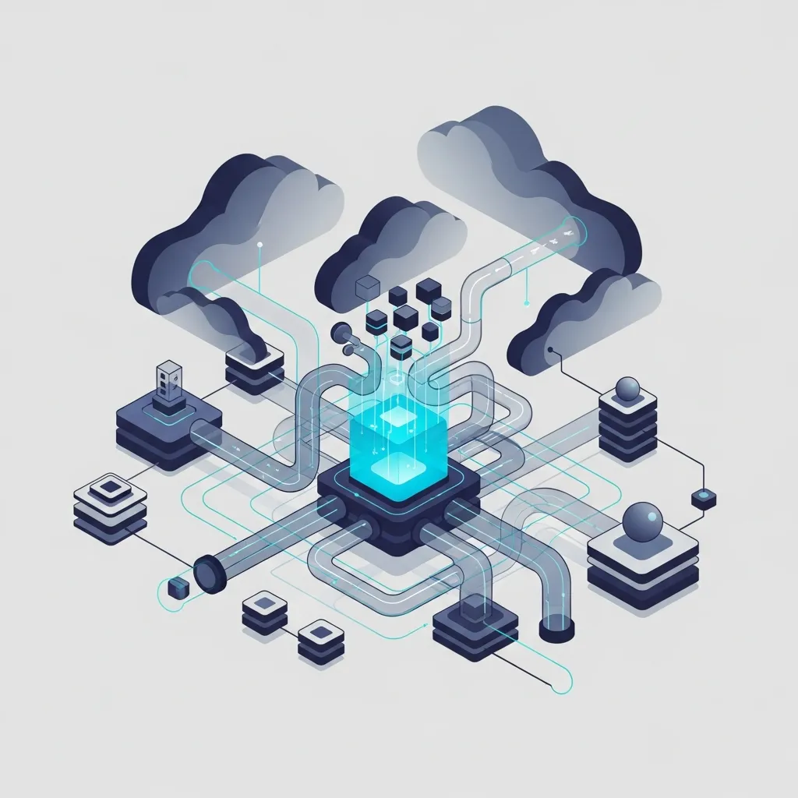

现代软件开发已不再是“从无到有”的写作过程，而是进入了通过编织无数外部模块和开源软件包来完成的“组装时代”。全球财富 500 强企业中，超过 90% 的业务基础设施是构建在外部代码之上的，这一事实表明，技术生态系统已成为一座建立在他人代码之上的庞大“依赖关系城堡”。然而，这种高效的组装方式也产生了一个悖论：它在企业安全的最深处制造了裂痕。这正是由于缺乏软件供应链安全 (SSCS) 体系所导致的后果。

攻击的目标不再是特定的服务器，而是转向了所有人共同信任的“根基”。在数万家企业共同使用的库中注入恶意代码，其破坏力极其惊人。2020 年发生的 SolarWinds 事件以及 Log4j 漏洞证明，我们每天使用的工具随时可能成为瘫痪系统的通道。在拥抱技术进步之前，我们是时候冷峻地审视一下，对于自己亲手组装的城墙，是否真的掌控着其中的每一块砖石。

### 隐形的架构师，依赖关系的枷锁

在现代开发流程中，开发人员直接编写的代码仅占整个应用程序的极小部分。其余部分则由开源软件包、第三方库以及分发它们的自动化 CI/CD 流水线填充。问题在于，这些供应链组成部分的交织程度如此复杂，以至于只要有一个点被污染，就会引发连锁性的安全侵害。

近期，在 AI 模型生成的代码中插入不存在的包名的“包幻觉攻击”，以及利用与正常包名相似名称的“泰波占位” (Typosquatting) 技术正频繁发生。这是开发环境碎片化带来的风险。特别是当构建系统本身被渗透时，即使源代码是完整的，最终生成的二进制文件也可能在包含恶意代码的情况下被发布。这意味着企业失去了对安全治理的控制。

### 清单的陷阱，<a href="/zh/glossary/sbom-definition-security-role" class="glossary-tooltip" data-definition="软件物料清单，详细记录了构成软件的所有模块、开源库及依赖关系，是识别安全漏洞和进行供应链管理的核心工具。">SBOM</a> 未能言说之事

许多企业正争先恐后地引入软件物料清单 (SBOM) 以保障供应链安全。虽然将软件原材料清单化是有意义的尝试，但列出清单与控制这些材料完全是两回事。

仅仅列出脆弱软件包的清单，极有可能沦为一种事后的行政记录。如果在成千上万的依赖项中，无法识别哪些元素在运行时真正执行，或者哪些路径可能导致权限被窃取，而只是盲目依赖工具告警，这更像是一种追求行政便利的安全防御。我们需要审视，自己是否被这种经过加工的“可见性”所带来的安逸感所蒙蔽，从而错失了真正的应对能力。

| 类别 | 传统应用安全 (AppSec) | 软件供应链安全 (SSCS) |
| :--- | :--- | :--- |
| 保护对象 | 直接编写的源代码及逻辑 | 外部库、构建工具、整个分发流水线 |
| 主要威胁 | SQL 注入、XSS 等代码缺陷 | 依赖混淆、恶意包注入、构建环境被劫持 |
| 核心工具 | SAST, DAST | SCA, SBOM, 代码签名, 证明 (Attestation) |
| 信任模型 | 对内部开发环境的预设信任 | 基于零信任的持续验证 |

### 内核监视器与加密完整性

超越简单的漏洞扫描，实时监控构建和运行时行为的高级技术正脱颖而出。其中最具代表性的便是 eBPF (extended Berkeley Packet Filter)。通过应用这种在内核级别监控系统调用的技术，可以立即捕捉到异常迹象，例如在编译过程中数据被发送到外部网络，或者发生了预料之外的文件修改。

企业还应考虑引入 SLSA (Supply-chain Levels for Software Artifacts) 框架，以保障软件制造过程的完整性。这是一种通过加密证明将从源代码到最终产物的所有阶段连接起来的方式。特别是应确立标准，通过将构建环境与主机完全隔离的“密封式构建” (Hermetic Build)，从源头上杜绝外部因素的干预。

构建精密的安全体系面临着开发速度下降或专业人才短缺等现实约束。在管理层看来，投入资源去防御眼前看不见的风险似乎效率低下。然而，考虑到单次事故可能导致的品牌信任崩塌和巨额恢复成本，这是一项关乎生存的必要投资。

如果软件供应链安全仅停留购买工具和管理清单的水平，那么业务无疑是建立在随时可能倒塌的沙堡之上。在复杂的依赖结构中，将安全主权让渡给他人，仅依赖自动化工具告警的被动态度，是现代安全的盲点。一旦将技术成就带来的透明度误认为控制力，供应链将再次成为阿克琉斯之踵。

归根结底，供应链安全的核心不在于工具，而在于对所使用的每一行代码负责到底的治理精神。市场将重组，重心将转向那些能够提供实质性控制权而非仅仅是可见性的解决方案。企业必须走出工具带来的舒适区。真正的安全创新并非始于华丽的仪表盘，而是始于对哪怕一行看不见的依赖项也保持怀疑并进行验证的冷静。

## 🔗 推荐阅读
- [瓦解 Linux 内核城墙的代码：eBPF 面临的可观测性理想与现实](/zh/posts/ebpf-observability-ideals-reality)
- [单一 Token 的统治：原生多模态如何重定义人工智能指标](/zh/posts/single-token-native-multimodal-ai)