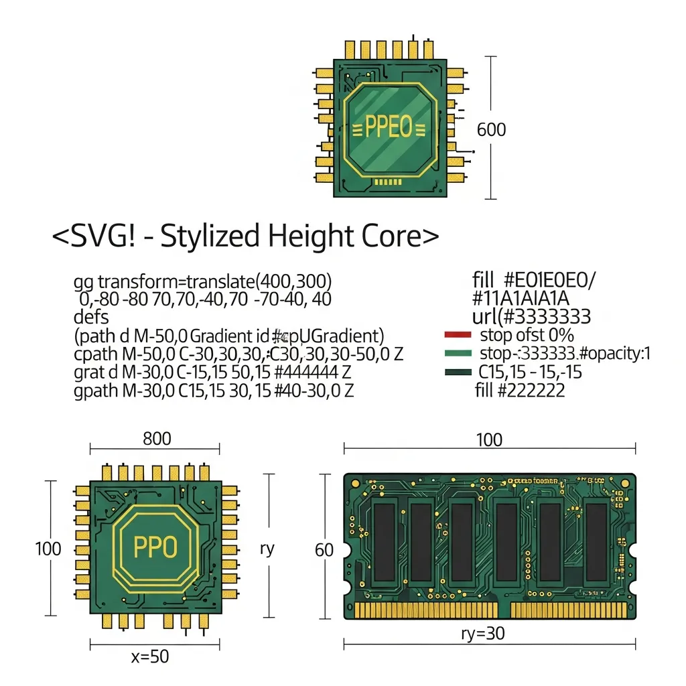

毫不夸张地说，软件架构的历史就是一部与内存管理不断斗争的历史。几十年来一直作为系统编程中流砥柱的 C 和 C++，最近之所以成为众矢之的，原因非常明确：即缺乏“内存安全 (Memory Safety)”所导致的致命系统瘫痪风险。然而，一种担忧也随之而来——为了安全而引入的现代防御机制，是否正在限制系统本质的效率和设计的自主性。

### 70% 的指标与 100 亿美元的代价

根据微软的研究，在其软件中发现的安全漏洞中，约 70% 源于内存安全问题。谷歌也承认，Chromium 项目中绝大多数严重的安全性错误都出自同一原因。这些技术缺陷不仅是简单的错误，更会导致巨大的经济损失。

2024 年 7 月发生的 CrowdStrike 宕机事件，充分展示了内存管理失败可能引发的连锁安全危害的破坏力。仅仅一次“越界读取 (Out-of-bounds read)”错误就导致全球 850 万台 Windows 系统瘫痪，估计造成的经济损失高达 100 亿美元左右。在开发者直接控制堆 (Heap) 内存的结构中，发生的段错误 (Segmentation Fault) 或双重释放 (Double-free) 等未定义行为，使系统暴露在不可预测的风险之中。

### 垃圾回收征收的“性能税”

为了解决内存管理的复杂性，垃圾回收 (Garbage Collection, 以下简称 GC) 已成为现代语言的标准。Java、Python、Go 等语言通过运行时系统直接回收内存，减轻了开发者的负担。然而，从资源消耗的角度来看，这需要付出并不轻松的机会成本。

即使是最普遍的标记-清除 (Mark-and-Sweep) 算法，或是提高了效率的三色标记 (Tri-Color Marking) 技术，从根本上说都是占用 CPU 周期并降低缓存命中率的因素。特别是暂时停止系统运行的 “Stop-the-world” 现象，是导致要求实时性的高性能系统出现延迟的主要原因。最终，为了获得 Memory Safety，开发者在很大程度上让渡了底层优化的主导权。

### 所有权模型与设计的局限

最近备受关注的 Rust 提出了所有权 (Ownership) 和借用检查器 (Borrow Checker) 系统作为替代方案，该系统无需 GC 即可在编译时验证内存安全性。虽然这在不产生运行时开销的情况下从源头阻断内存错误方面具有划时代意义，但在实际应用中也造成了另一种形式的瓶颈。

Rust 陡峭的学习曲线使得开发者在满足编译器限制条件上花费的精力比深化业务逻辑更多。有人指出，这种严格的引用规则有时会阻碍设计的灵活性，导致开发者沉溺于安全这一工具性目标，从而忽略了算法本身的效率或上位架构的完整性。

### 向硬件转移的防御机制

为了弥补软件解决方案的局限性，硬件层面的介入也正在全面展开。Apple 在最新芯片组中引入的内存完整性强制 (Memory Integrity Enforcement, MIE) 技术就是一个代表性案例。这是在硅片层面实现的 Arm 内存标签扩展 (Enhanced Memory Tagging Extension, EMTE)。

这种在分配内存时赋予特定标签并在每次访问时同步验证的方式，成为了阻断内核级漏洞的强力手段。但是，随着硬件复杂度增加导致的制造成本上升，以及第三方软件为了利用这些加速功能必须经历额外的优化过程，这些都为整个生态系统增加了新的成本负担。

| 类别 | C/C++ (手动管理) | Java/Go (GC) | Rust (Ownership) | Apple MIE (Hardware) |
| :--- | :--- | :--- | :--- | :--- |
| **安全保障时机** | 开发者责任 | 运行时 (持续性) | 编译阶段 | 运行时 (硬件验证) |
| **性能开销** | 无 (可优化) | 高 (发生 GC 停顿) | 低 (编译时成本) | 极低 (硅片增量) |
| **开发难度** | 极高 (易出错) | 低 | 极高 (学习曲线) | 中 (需 API 适配) |
| **主要风险** | 安全漏洞暴露 | 不可预测的延迟 | 灵活性下降及延迟 | 硬件依赖性加深 |

### 技术控制的背面与本质洞察

旨在加强安全的自动化工具和严格的语言限制，确实在减少安全盲区方面做出了贡献。然而，随着系统安全网变得愈发坚固，开发者与系统运作原理之间的疏离感也在加剧。过去，工程师们为了最大限度提高每一字节内存的效率而思考架构；而现在，资源却集中在解决工具提出的限制条件上。

自动化的保护层蕴含着成为遮蔽系统低效的隐蔽幕布的风险。在硬件标签化或编译器强制性逐渐取代底层优化能力的趋势下，我们或许正在忽视那些工具无法解决的根本性架构设计缺陷。真正的技术进步，将始于超越工具提供的安全性，并洞察被该工具所控制的系统本质。

## 🔗 推荐阅读
- [Attention 重塑的技术版图与 Transformer 的明暗面](/ko/posts/attention-transformers-tech-landscape)
- [MCP：穿透 AI 集成复杂性的标准协议蓝图](/ko/posts/mcp-ai-integration-standard-protocol)