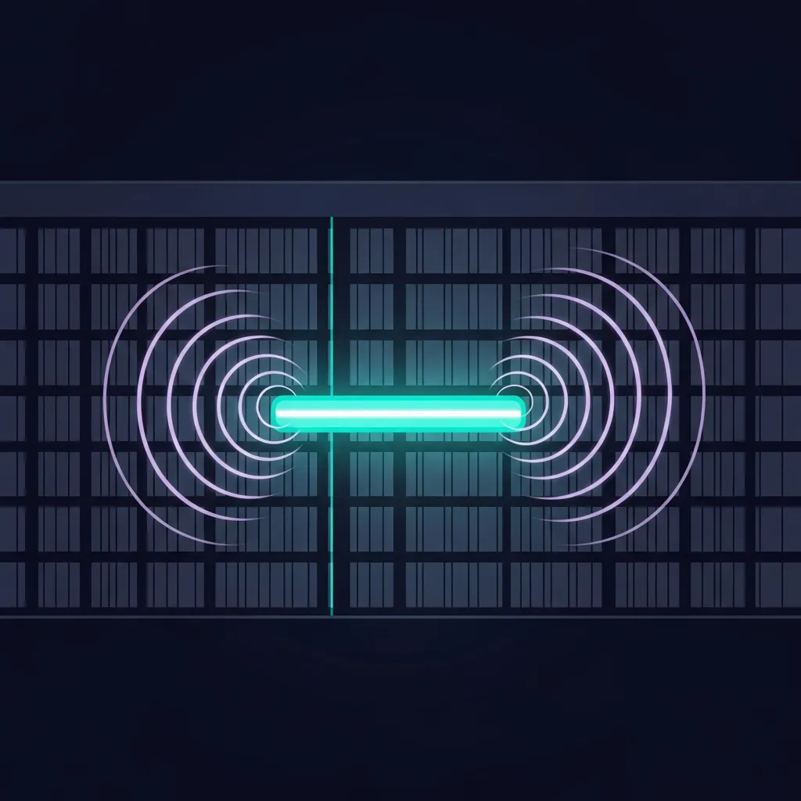
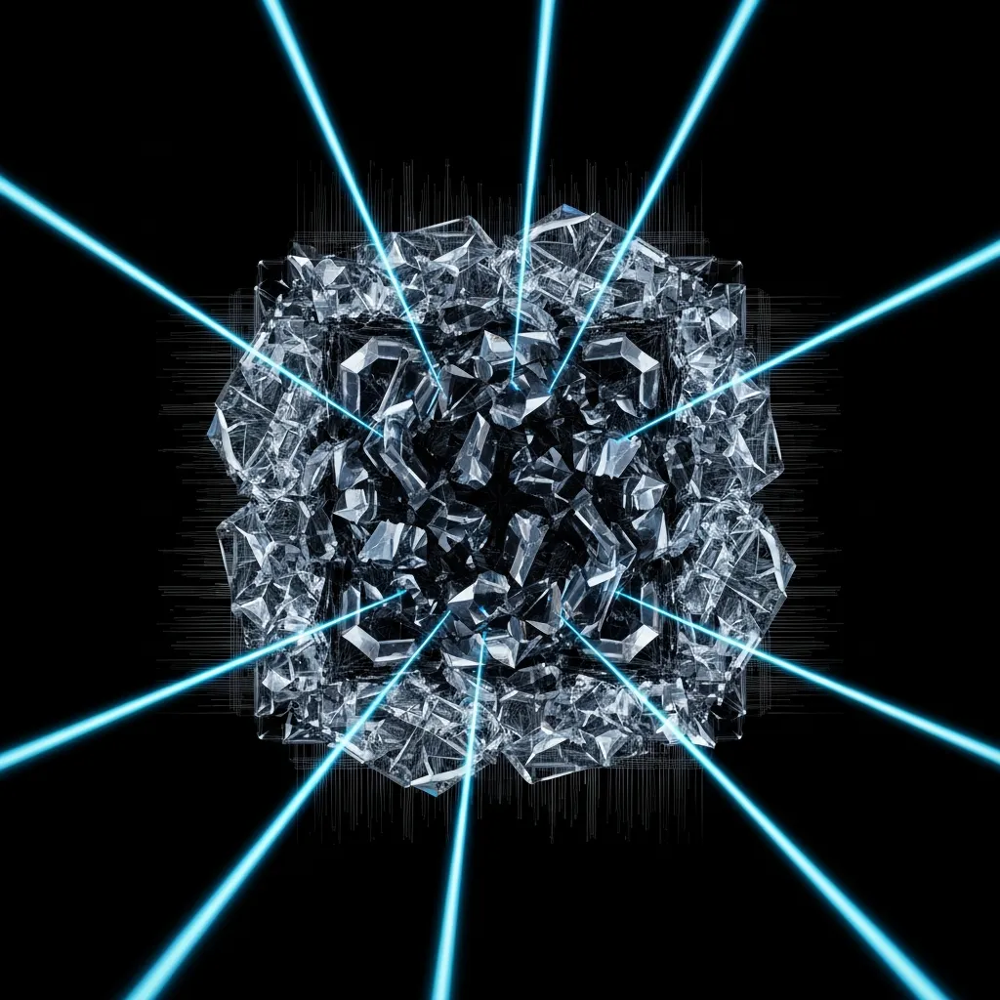
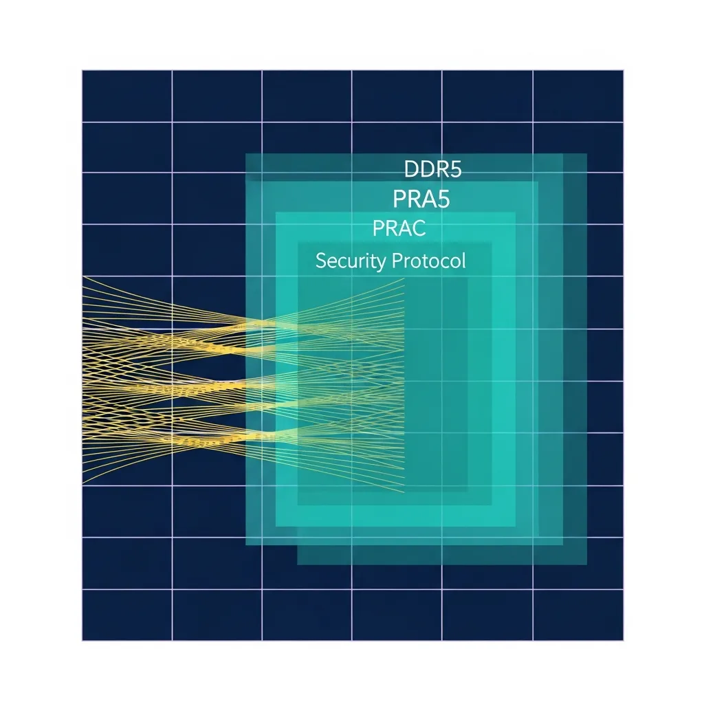

<strong>[BLUF]</strong>
关于 DDR5 可以免受 <a href="/cn/glossary/rowhammer" class="glossary-tooltip" data-definition="这是一种硬件安全漏洞，通过反复激活内存芯片的特定行，利用产生的电磁干扰来物理篡改相邻单元的数据。">Rowhammer</a> 威胁的乐观论调已不再成立。Phoenix 攻击和 GPUBreach 正在瓦解硬件层面的防御机制，而 PRAC 等替代方案在标准化的空白期内也无法完全抵御实质性的威胁。即使面临性能下降，迫切需要采取缩短刷新周期 (tREFI) 等即时的实务应对措施。

 长期以来，硬件安全行业一直认为 DDR5 的出现将终结 Rowhammer (行锤) 威胁。这主要得益于制造商在内存内部搭载的 Target Row Refresh (TRR) 技术，人们期待它能形成坚如磐石的防线。

 然而，近期发布的一系列研究结果清楚地表明，这种信念是多么危险的乐观主义。我们现在必须摒弃“硬件是安全的”这种盲目信任，直面日益精巧的攻击向量。

 

 2025 年震撼安全生态系统的核心威胁之一便是 Phoenix (凤凰) 攻击的出现。该攻击手法精准地利用了现有 TRR 所采用的基于采样的防御逻辑漏洞，从而诱发比特翻转 (Bit-flip)。

 特别是对 SK 海力士的 15 种 DDR5 模块进行的全面测试结果显示，所有型号都容易受到 Phoenix 攻击。这象征性地展示了制造商以“黑盒”形式隐藏的机密安全缓解措施是多么容易崩溃。

 > “制造商封闭的防御策略只会增加安全的不透明性，绝非根本解决方案。现在必须将硬件安全模型从‘信任’转向‘验证’领域。”

 攻击范围并不局限于系统主内存。多伦多大学研究团队发布的 “GPUBreach” 证明了 GPU 的 GDDR6 内存同样无法幸免于 Rowhammer 攻击。

 GPU 内存的污染不仅仅是数据篡改，它还提供了一条可能导致系统 Root 权限被夺取的致命路径。对于运营高性能计算 (HPC) 和 AI 基础设施的 Cloud 服务商来说，这已构成了前所未有的威胁。

 

 为了填补这些安全盲区，微软提议了一项名为 PRAC (Per-Row Activation Counting) 的宏伟技术。该方式基于 Project STEMA (Panopticon) 技术，旨在通过在 DRAM 内直接计算每一行的激活次数来预先拦截攻击。

 然而，由于 PRAC 在标准化过程中的阵痛，目前在现场应用中仍存在局限性。JEDEC 标准的空白以及各制造商实现方式的差异，正成为攻击者寻找另一个绕过路径的借口。

 | 攻击技术 | 主要特征及威胁对象 | 安全盲区 |
 | :--- | :--- | :--- |
 | **Phoenix** | 绕过 SK Hynix DDR5 全型号 | 利用 TRR 采样逻辑的盲区 |
 | **GPUBreach** | NVIDIA GDDR6 获取 Root 权限 | GPU 内存架构防御缺失 |
 | **PRAC** | 微软提议的 DRAM 内部计数技术 | 因标准未完成导致的互操作性缺乏 |

 我们现在必须从根本上改变看待硬件安全的方式。以 CVE-2025-6202 标识符为代表的最新漏洞警告我们，仅靠软件补丁已无法完美解决这些问题。

 实务上最确定的应对措施是，即使牺牲性能也要将内存刷新周期 (tREFI) 缩短至现有的 1/3 以上。虽然会产生约 8.4% 的性能损失，但为了确保数据完整性和系统稳定性，这是不可避免的选择。

 

 此外，企业的 CTO 和安全架构师应建立基于 “Zero Trust” 的硬件验证体系。与其依赖制造商的宣传口号，不如通过独立的安全审计，建立常态化检查自身硬件脆弱性的流程。

 正如瑞士国家网络安全中心 (NCSC) 的负责任披露流程一样，与全球安全生态系统的紧密合作也至关重要。因为只有消除信息不对称并实时共享威胁情报，才能真正跨越硬件安全的临界点。

 硬件安全不是一座静止的城墙，而是攻击者与防御者不断博弈的动态战场。以 DDR5 和 PRAC 展现出的局限性为教训，我们将不得不构建一个更加坚固且透明的安全生态系统。

## 🔗 推荐阅读
- [RLHF：是完成人工智能智能的最后一块拼图，还是反映人类偏见的精致镜子？](/cn/posts/rlhf-ai-intelligence-human-bias)
- [Transformer 架构的悖论：是并行性的胜利，还是效率的破产？](/cn/posts/transformer-architecture-paradox)