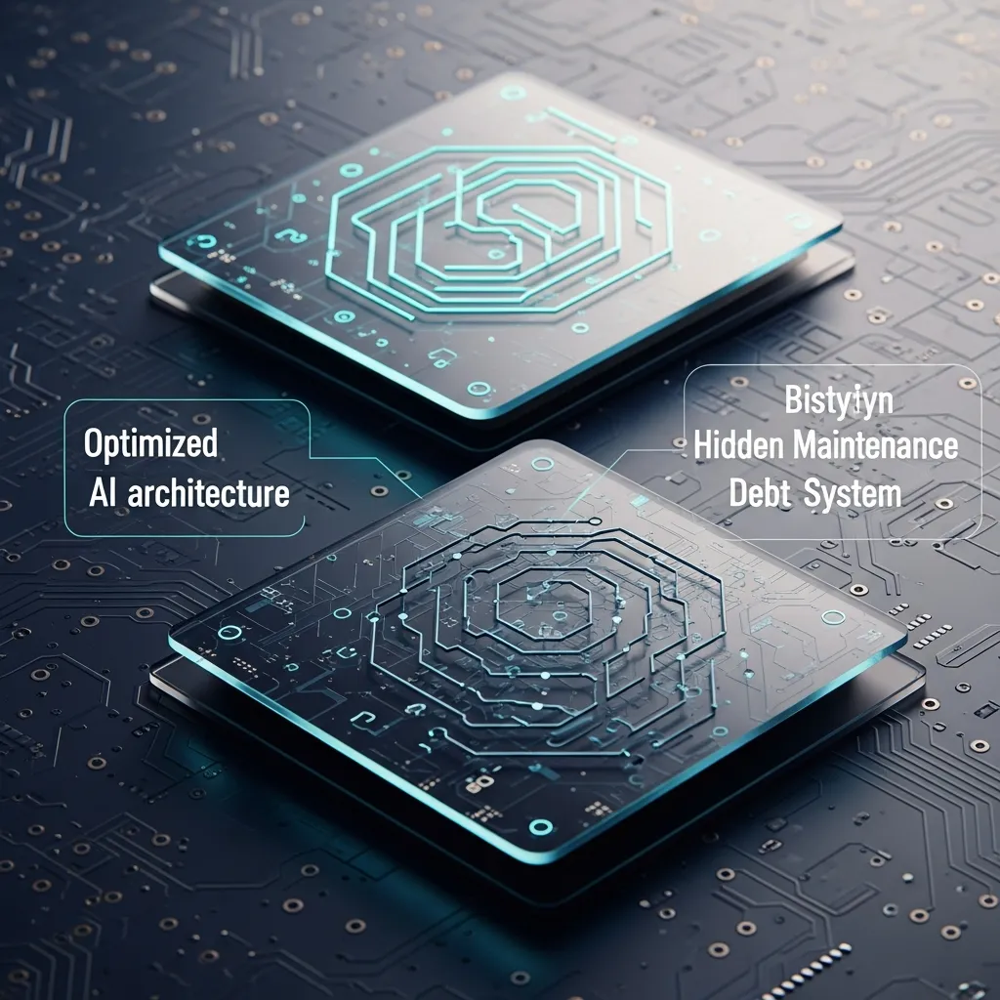
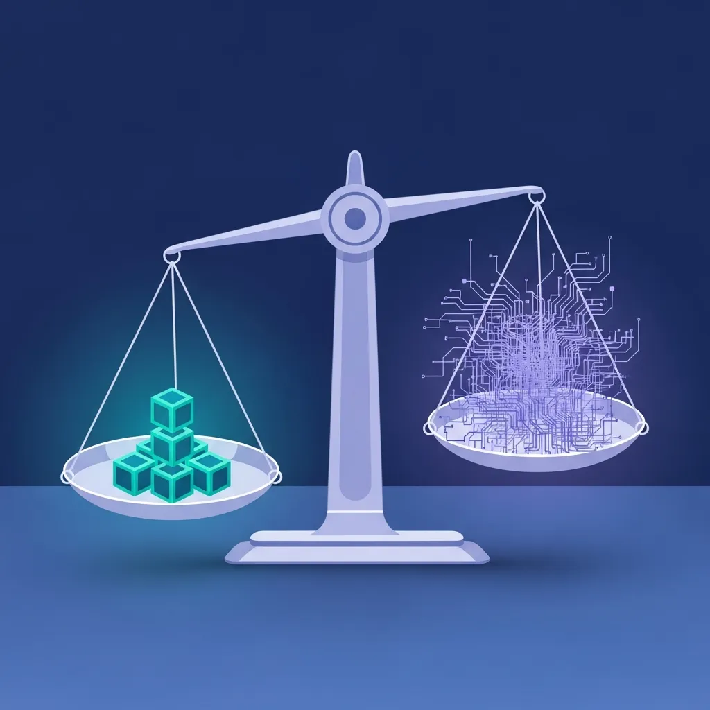

<strong>[BLUF]</strong>
GPT-5.5 相比 Claude Opus 4.7 节省了 72% 的 Token，提供了压倒性的成本效率，但由于代码解释的省略，可能会引发严重的“维护债务”。相比之下，Opus 4.7 提供了高度的解释责任（Accountability），在人机协作效率方面保证了更高的 ROI，更适合复杂的架构设计。

在评价人工智能模型的性能时，我们往往容易只关注显见的数值。但在企业环境中做出技术决策时，必须考虑 API 成本背后隐藏的巨大冰山——“人力成本”。

## 1. 市场数据揭示的极端效率：GPT-5.5 的独角戏？

### 1.1 节省 72% 输出 Token 的魔法与运营成本优化的诱惑

GPT-5.5 向市场传递的最强信号正是效率。与上一代 5.4 模型相比，在相同的编码任务中将输出长度缩减了 72%，这堪称是一次革新。

这种 <a href="/cn/glossary/gpt-5-5-coding-efficiency" class="glossary-tooltip" data-definition="GPT-5.5 模型相比现有模型，通过大幅减少输出 Token 数来执行编码任务的效率">GPT-5.5 vs Opus 4.7 coding efficiency</a> 的差距不仅仅是数字游戏。对于运营大规模 Agent 工作流的企业来说，这是能够立即节省数千美元成本的实质性诱因。

### 1.2 Agent 循环中的成本复利效应分析

在连续处理数百个任务的自主 Agent 环境中，这种 Token 的节省创造了复利效应。因为它不仅能腾出更多的 <a href="/cn/glossary/context-window" class="glossary-tooltip" data-definition="指人工智能模型一次性可以处理和记忆的最大数据范围。这个窗口越大，模型越能准确把握长对话或大容量文档的上下文，生成连贯的回答。">上下文窗口 (Context Window)</a>，还能随着物理数据传输量的减少，提升整体推理速度。

最终，对于想要兼顾速度和成本的 CTO 们来说，GPT-5.5 无疑是最具吸引力的选择。但在这里，我们需要进一步敏锐地提问：那些被节省掉的 Token 究竟“省略了什么”？

## 2. 简洁的悖论：GPT-5.5 的“沉默”对企业产生的致命影响

### 2.1 代码的解释责任 (Accountability)：为何 Opus 4.7 的“冗长”是资产？

> "Opus 4.7 的冗长并非浪费，而是为了质量保证 (QA) 投下的保险。因为它是防止维护阶段人力成本转嫁的唯一防御机制。"

Claude Opus 4.7 具有使用相对较多的 Token 进行“长篇大论”式解释的特性。但这并非简单的资源浪费，从 <a href="/cn/glossary/xai" class="glossary-tooltip" data-definition="使人工智能的推理过程和结果能够被人类理解和信任的说明技术">可解释 AI (XAI)</a> 的角度来看，这是非常宝贵的资产。

### 2.2 黑盒障碍：极端简洁性使开发人员的审核时间增加 3 倍

GPT-5.5 生成的极度压缩的代码给人类开发人员带来了所谓的“黑盒障碍”。省略了注释和推理过程的代码可读性较差，这会导致在后期维护时，无论是初级开发人员还是资深开发人员，其代码审核时间都会呈指数级增长。

结果就是，为了节省 20% 的 API 成本，却多支出了 300% 的首席开发人员时薪，从而引发了 <a href="/cn/glossary/ai-maintenance-debt" class="glossary-tooltip" data-definition="指 AI 生成的代码可读性低或解释不足，导致后期维护时人类开发人员成本增加的现象">AI maintenance debt</a>。这就是我们不应被“成本优化”一词所蒙蔽的原因。

## 3. 实战基准深度分析：ARC-AGI-3 与 SWE-Bench Pro 的启示

### 3.1 “无计划的代码” GPT-5.5 vs “有原则的推理” Opus 4.7

最近进行的 ARC-AGI-3 测试结果清晰地展示了两个模型根本哲学上的差异。GPT-5.5 虽然能生成广泛的假设，但在将其连接到具体执行计划的“压缩”过程中经常失败。

相比之下，Opus 4.7 即使给出错误答案，也表现出基于“强假设”维持逻辑一致性的模式。这意味着当发生错误时，人类更容易发现逻辑是在哪个环节出现了偏差。

### 3.2 工具使用能力与架构理解能力的权衡 (Trade-off)

<table><thead><tr><th>比较项目</th><th>GPT-5.5 (OpenAI)</th><th>Claude Opus 4.7 (Anthropic)</th></tr></thead><tbody><tr><td>输出 Token 效率</td><td><strong>节省 72% (超压缩型)</strong></td><td>维持现有水平 (包含解释)</td></tr><tr><td>ARC-AGI-3 分数</td><td>0.43% (推理压缩失败)</td><td>0.18% (错误压缩/执着于假设)</td></tr><tr><td>主要失败模式</td><td>假设生成广泛但缺乏执行计划</td><td>基于强假设的激进执行错误</td></tr><tr><td>每 1M Token 成本 (Output)</td><td>$30 (单价高但使用量少)</td><td>$25 (单价低但使用量多)</td></tr><tr><td>建议用途</td><td>高速 Agent 循环、单元功能实现</td><td>大规模架构审查、需要 XAI 的任务</td></tr></tbody></table>

在终端控制或文件系统导航等短期工具使用能力方面，GPT-5.5 表现出了压倒性的性能。然而，在需要理解超过 1 万行的庞大代码库整体结构的 SWE-Bench Pro 环境中，Opus 4.7 深度分析能力的优势依然存在。

## 4. 结论：在成本优化与技术债务之间取得平衡

### 4.1 人力成本 vs API 成本：如何计算真正的 ROI

我们应该追求的真正投资回报率 (ROI) 不是月底收到的 API 账单金额。相反，应该以“从代码生成到实际部署到服务中所花费的总时间”为基准来衡量成果。

* <b>以数据看维护风险</b>：
    * <b>72%</b>：GPT-5.5 相比 Opus 4.7 减少的输出 Token 量，这意味着“解释责任 (Accountability)”也相应缩减。
    * <b>3 倍 (300%)</b>：在审查省略了解释的 AI 代码时，资深开发人员估计需要花费的额外时间（黑盒障碍效应）。
    * <b>$5 vs $30</b>：两个模型的输入 Token 成本 ($5) 相同，但在输出成本上 GPT-5.5 贵了 20%，这种结构诱导用户通过 Token 效率来抵消成本。
    * <b>ARC-AGI-3 对比</b>：确认了 GPT-5.5 在扩展假设后因“压缩失败”而迷茫，而 Opus 4.7 则倾向于因“错误压缩”而陷入确认偏误。

### 4.2 混合路由策略：将“简单任务”交给 5.5，“核心逻辑”交给 Opus

> "GPT-5.5 的极致简洁虽然让 API 账单变轻了，但被剥离了解释的代码却向人类开发人员征收了名为‘黑盒障碍’的无形税收。"

明智的技术决策者不会在两个模型之间做二选一，而是会采取适才适所的混合策略。在生成简单的单元测试或进行规范化的数据转换时，利用 GPT-5.5 极大地降低成本是有利的。

相反，在设计业务核心逻辑或审查复杂的系统架构时，应利用 Opus 4.7 以获取“可解释的代码”。毕竟，最小化技术债务并建立可持续的开发文化，才是 AI 时代真正的竞争力。
