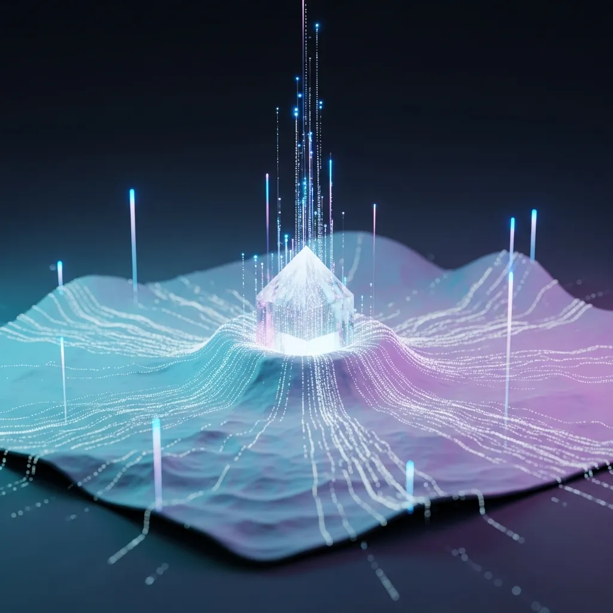

<strong>[BLUF]</strong>
2025年，AI产业已到达“量级扩张”的临界点（The Great Plateau），正在发生从单纯的规模扩张向以数据质量（Q）和<a href="/cn/glossary/test-time-computing" class="glossary-tooltip" data-definition="在AI模型给出答案前的推理过程中分配更多计算资源，通过自我思考步骤或验证，提高解决复杂问题能力的解析技术。">测试时间计算</a>为核心的范式转移。单纯的缩放竞争如今撞上了资本效率下降的墙，通往真正 AGI 的道路取决于架构创新。

曾几何时，人工智能的智能水平似乎魔术般地与投入的资本量成正比增长。2020年 OpenAI 研究人员发表的论文为全球科技企业指明了“越大越好”的明确方向，拉开了超大语言模型竞争的序幕。

然而，最近业界各处开始感知到进入“大平台 (The Great Plateau/临界点)”的信号。单纯的规模经济不再能保证智能的飞跃式进步，所谓的缩放定律 (Scaling Laws) 终结时代正在临近。

## “越大越好”的神话：从 Kaplan 到 Chinchilla 的历史脉络

### 寻找数据与计算资源的黄金比例

在 2020 年 Kaplan 等人提出 <a href="/cn/glossary/chinchilla-law" class="glossary-tooltip" data-definition="该定律指出模型参数数量与训练数据 Token 数量必须保持平衡，才能达到最佳计算效率。">Chinchilla 定律</a> 之前的观点认为，模型的大小 (N) 是性能提升最核心的变量。在“资本力即智能水平”的信念下，企业们赌上性命去增加参数数量。

然而，2022 年 DeepMind 给这种惯性敲响了警钟。他们证明了只有模型大小和训练数据量以相同的比例扩展，才能实现真正的计算效率，这要求 AI 投资策略进行全面修正。

### 规模保证智能的时代终结

现在，仅靠构建巨大的神经网络已难以获得差异化的竞争力。如下表所示，缩放范式正迅速从量级膨胀转向质效提升。

| 定律 (年份) | 核心指标 | 模型缩放指数 (alpha) | 数据缩放指数 (beta) | 核心洞察 |
| :--- | :--- | :--- | :--- | :--- |
| Kaplan (2020) | 模型大小 (N) | 0.076 | 0.095 | 模型大小是性能的决定性因素 |
| Chinchilla (2022) | 计算最优 (Compute-Optimal) | 0.50 | 0.50 | 模型大小与数据的均衡扩展 |
| Quality-Aware (2025) | 数据质量 (Q) | 可变 | 基于 Q 的权重 | 质量 (Q) 比量级膨胀更高效 |

## 看不见的墙：智能幻觉与投资效率的陷阱

### “假装在推理”的 LLM 局限性与智能的质性停滞

大语言模型流利的回答有时会让我们产生智能的幻觉。但越来越多的批评指出，与其说模型理解复杂的逻辑结构，不如说它只是在重现训练数据中的统计模式。

> “规模保证智能的时代已经结束。现在是后缩放时代，我们必须证明智能的性价比和质性价值，而非盲目的参数竞争。”

像 Yann LeCun 这样的学者指出，目前的 LLM 架构从根本上缺乏对世界的物理理解。这暗示了仅仅遵循 <a href="/cn/glossary/scaling-laws" class="glossary-tooltip" data-definition="随着AI模型规模、数据量和计算资源的增加，性能呈指数级提升的规律。">缩放定律</a> 无法达到人类水平的 AGI。

### 数据枯竭与质量变量 Q 的出现：量级膨胀的物理极限

更大的问题是，可供训练的数据本身正在枯竭。互联网上的高质量文本数据已接近极限，现在质量而非数量，即“数据密度”正成为决定性能的关键变量。

* **战略性泡沫的征兆：** 尽管 GPU 集群和数据中心基础设施成本呈指数级增长，但自 GPT-4 之后的下一代模型性能提升幅度已开始让用户感到迟钝。
* **数据质量研究 (arXiv:2510.03313)：** Subramanyam 等人引入了数据质量参数 'Q'，实证了如果能确保高质量数据，即使大幅减少模型参数，也能达到相同的性能。
* **智能的性价比转向：** 像 DeepSeek R1 这样的模型通过高效的架构和基于推理的训练，以仅为大型科技公司模型几十分之一的成本实现了类似性能，正对“缩放万能论”发起反击。

## 后缩放时代的新地图：架构创新与高效智能

### 测试时间计算 (Test-time Compute) 与推理模型的崛起

现在，业界的目光正从训练模型的过程 (Training) 转移到模型给出答案的过程 (Inference)。这种被称为“测试时间计算”的技术，通过让模型在回答前进行更多思考来提升智能。

作为一种无需无限扩充昂贵硬件即可最大化推理能力的路径，它正受到瞩目。OpenAI 的 o1 模型或 DeepSeek 的 R1 所展现的惊人成果，正是这种范式转移的产物。

### AI 2027：通向人类水平智能 (AGI) 之路是缩放还是创新？

关于到达 AGI 的时间点，乐观论和怀疑论正激烈交锋。当 Sam Altman 预言 2027 年并鼓励投资时，另一方则警告说目前的架构绝无法越过那堵“看不见的墙”。

> “大资本创造的缩放幻象在面临数据枯竭这一物理极限时，正预示着人工智能产业的‘战略性泡沫’。”

最终，未来的胜者将不是取决于谁拥有更多的服务器，而是取决于谁拥有能更高效提取智能的“算法炼金术”。

## 结论：跨越战略性泡沫，是时候思考“智能性价比”了

我们现在正处于 AI 产业的第一个巨大转折点。盲目扩张规模带来的甜美性能果实已接近尾声，现在，相对于投入资本能产生多少有价值的智能，已成为生存的尺度。

后缩放时代并非单纯的技术停滞，而是迈向更聪明、更高效智能的新创新起点。现在比任何时候都更需要拨开资本推动的“战略性泡沫”迷雾，洞察智能本质的慧眼。

