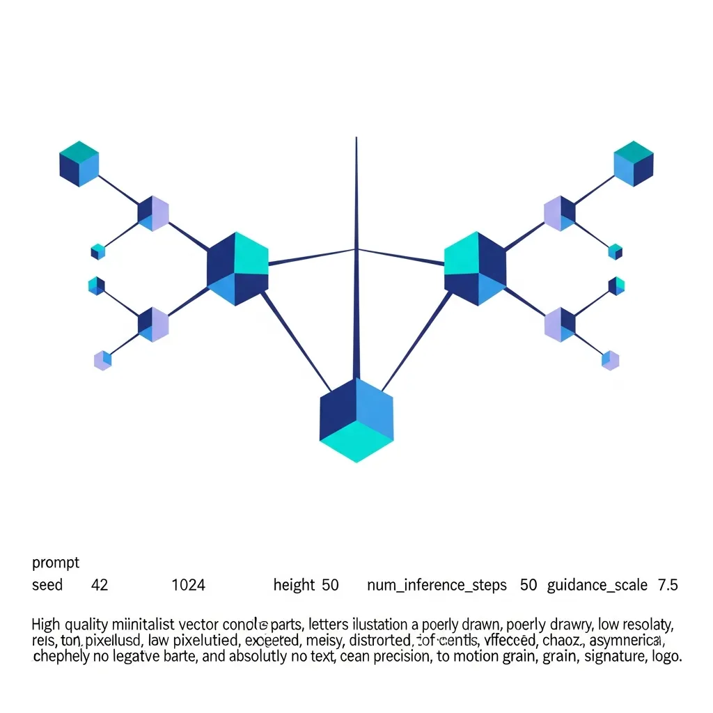

<strong>[BLUF]</strong>
Git 2.54 更新虽然通过 `git history` 和“基于配置的钩子”提升了开发效率，但也蕴含了让操作记录难以显式追溯的“阴影逻辑 (Shadow Logic)”风险。资深架构师必须建立更严格的全局配置管理体系，以防范便利性背后隐藏的数据一致性削弱和安全盲点。

我们每天像呼吸空气一样使用的版本控制系统开始出现裂痕。这次 Git 2.54 的发布不仅是工具的演进，更是在考验开发者长期以来坚守的信任根基。从资深系统架构师的角度来看，这次更新并非简单的便利功能添加，而是 Git 一直以来坚持的 <a href="/cn/glossary/vcs-integrity" class="glossary-tooltip" data-definition="版本控制系统内数据的一致性和可追溯性未受损的状态">VCS 一致性</a>哲学可能被连根拔起的重大转折点。

一直以来，Git 虽然显得有些“冷淡”，但作为工具，它极其精密且诚实。然而，从 2.54 版本开始，在“用户友好”的名义下，系统各处都被埋下了可能损害透明度的“阴影逻辑”种子。我们在获得短期便利的同时，长期的可追溯性和安全一致性将付出怎样的代价，现在是时候冷静地权衡一下了。

## 历史修改的民主化，还是完整性的崩塌？（`git history` 的登场）

这次更新中最受争议的无疑是 `git history` 命令的引入。在此之前，修改 Git 历史是一个极具目的性且痛苦的过程。但现在，我们可以像编辑文档一样，轻而易举地操纵过去的记录。这究竟是进步，还是损害记录价值的完整性崩塌？

### `rebase -i` 的复杂性曾是历史厚重的保障

过去 `rebase -i` 给我们带来的不便，反而是保障系统稳定性的安全装置。开发者为了修正错误，必须经过索引 (Index) 和工作树 (Working Tree) 的显式步骤，这个过程产生的“摩擦力”起到了心理防线的作用，让人审慎地对待历史。所有的修改都被记录，所有的变更都必须通过经过验证的索引。

### `git history reword/split`：轻量化修改可能导致的“记录碎片化”

相比之下，新出现的 `git history` 以类似于 <a href="/cn/glossary/shadow-logic" class="glossary-tooltip" data-definition="指在没有显式脚本文件的情况下，仅通过环境配置运行，导致可见性和调试变得困难的自动化逻辑">阴影逻辑</a> 的方式运作。它省略了索引过程，甚至可以在 <a href="/cn/glossary/bare-repository" class="glossary-tooltip" data-definition="不含可修改源代码文件的当前工作目录，仅包含版本控制信息和对象数据，主要用于共享和协作的服务器端仓库形式。">裸仓库 (Bare Repository)</a> 中直接操作对象数据。这种方式虽然在速度上有优势，但极易削弱提交作为“不可变证据”的权威性，并加速历史的碎片化。

### 合并冲突规避算法掩盖的潜在代码债务

特别是那些试图预先规避冲突的新尝试，可能会让我们变得更加盲目。表面上看起来修改已无冲突地圆滑完成，但反过来说，这也剥夺了验证其对整体架构逻辑影响的机会。肉眼可见的冲突修好即可，但潜伏在暗处的逻辑债务，日后可能会演变成瘫痪整个系统的致命剧毒，这一点绝不能忘记。

## “阴影逻辑”的诞生：基于配置的钩子 (Hooks) 带来的管理难题

作为架构师，最令人担忧的部分正是“基于配置的钩子 (Config-based hooks)”的强化。这意味着在系统内部运行的逻辑将完全丧失可见性。以前，为了确认运行了哪些自动化逻辑，只需查看 `.git/hooks` 目录即可。

### 超越 `$GIT_DIR/hooks` 的全局配置灵活性及其代价

现在，隐藏在全局配置文件 `.gitconfig` 或系统级配置某处的钩子掌握了执行的主导权。每个开发者的本地环境可能运行着不同的钩子，这不仅会导致“在我电脑上行，在服务器上不行”，更会演变成“连为什么这样运行都不知道”的管理黑洞。我们正以失去控制权为代价，换取所谓的灵活性。

### 无显式脚本的自动化：安全盲点与调试之痛

无需独立执行文件、仅靠配置即可运行的自动化，从安全角度看也是一个糟糕的剧本。如果恶意攻击者能访问用户的全局配置文件，就能在不留下任何显式痕迹的情况下，干预所有的提交和推送过程，实现截获或篡改代码的“Shadow Logic”。这必然会对现代软件供应链安全构成严重威胁。

### 多钩子执行结构中的执行顺序依赖风险

此外，多个钩子按序执行的结构将给系统工程师带来地狱般的调试体验。由钩子间相互作用产生的不可预测副作用，甚至难以重现。自动化越复杂，我们就应该创造更多能洞察其内部的窗口，而 Git 2.54 反而将这些窗口变得模糊不清。

| 分析项目 | Git 2.54 (新版) | Git 2.52 (旧主版本) | 架构影响 |
| :--- | :--- | :--- | :--- |
| **历史操作方式** | `git history` (实验性, Direct ODB) | `git rebase -i` (基于索引) | 审计追踪 (Audit Trail) 减少的风险 |
| **钩子 (Hook) 管理** | 基于配置的多重执行 (Config-based) | 基于单一执行文件 (Script-based) | “阴影逻辑”导致可见性下降 |
| **安全验证** | 接受过期的 GPG 密钥 (Good Signature) | 过期密钥警告 (Red Warning) | 安全标准的实用主义退让 |
| **索引优化** | 支持 Incremental MIDX Compaction | 基础 Incremental MIDX | 大规模仓库的 I/O 性能提升 20% 以上 |

## 技术进步背后的宏观影响：Git 的核心价值是否得以保存？

通过这次更新，我们目睹了 Git 的发展方向正急剧向“实用主义妥协”倾斜。安全和一致性这些略显刻板的原则，正被挤到用户体验 (UX) 这一华丽词藻的背后。

> “如果说过去的 Git 是精密的手动变速箱，那么 2.54 则宣告了向遮蔽控制权的自动变速箱的转型。”

### 过期 GPG 签名接受政策：安全标准的放宽，还是实用主义的折中？

尤其是将使用过期密钥签名的提交也显示为正常 (Good) 的政策调整，给安全架构师带来了巨大冲击。虽然在实操中可能有处理旧签名的必要性，但这不可避免地被视为在以安全一致性为首要原则上的倒退。我们从历史中学到，安全边界一旦崩塌，就很难再次建立。

### ODB (对象数据库) 重构暗示的未来存储引擎变化

当然，也有积极的信号。内部 ODB 的可插拔后端设计暗示了 Git 未来将超越文件系统的限制，演进为分布式数据库。这在大规模企业环境中令人期待更好的性能表现。事实上，在这一版本中，通过支持 Incremental MIDX Compaction，大规模仓库的性能在数值上得到了显著改善。

*   **贡献者多样性**：共有 137 名贡献者参与，其中 **约 48% (66名)** 为新贡献者，反映了代码库的快速民主化和变动性。
*   **更新周期**：这是自 2.52 版本以来历时约一年进行的重大变化，超越了简单的 Bug 修复，完成了 ODB 内部结构的 **基于函数指针的可插拔后端重构**。
*   **协作效率**：引入 `status.compareBranches` 选项，缩短了 Upstream 和 Push Remote 不同的 Triangular workflow 中的状态确认时间，减少了大规模开源贡献流程的开销。

## 结论：面对便利性这一“毒酒”的工程师姿态

Git 2.54 确实承诺给我们一个更快、更便利的开发环境。但作为资深工程师，必须意识到甜蜜承诺背后隐藏的“阴影逻辑”和可追溯性受阻的代价。为了不被工具奴役而是支配工具，我们决不能放松对维持系统透明度的监控。

> “阴影逻辑的扩散将加剧调试的痛苦，并导致安全可见边界的瓦解。”

最终，这次更新是福音还是灾难，取决于我们以多大的批判性态度去接纳这个工具。请更严格地管理全局配置，并不断质疑隐藏在便利命令背后的数据流。因为这正是我们作为系统架构师必须守护的最后自尊与责任。

## 🔗 相关阅读
- [Kubernetes 1.36，华丽功能背后隐藏的‘配置过载’与迁移风险深度分析](/cn/posts/kubernetes-1-36-configuration-overload-migration-risks)
- [Transformer 十年记录：并行处理的创新与数据治理的悖论](/cn/posts/transformers-10-years-data-governance-paradox)