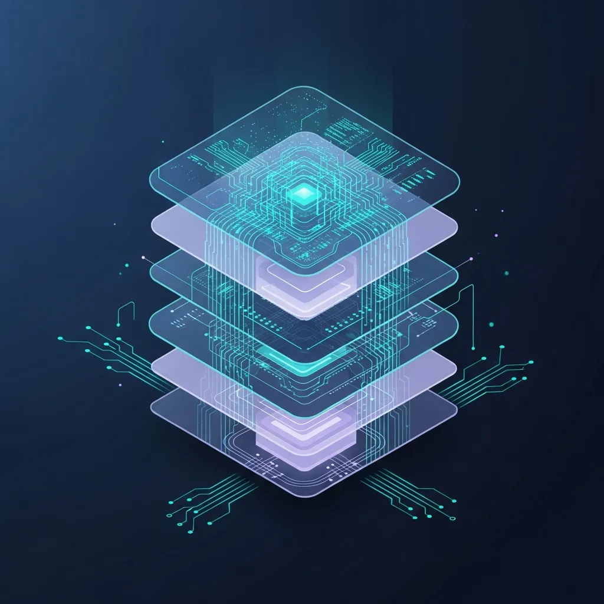

<strong>[BLUF]</strong>
2026 年云治理自动化通过 AI 和 Governance-as-Code 承诺效率，但复杂的政策冲突会导致“自动化悖论”，进而引发运营僵化。唯有以赋能（Enablement）为核心的设计，确保业务敏捷性，才能防止管理债务和 <a href="/cn/glossary/what-is-shadow-it" class="glossary-tooltip" data-definition="指在未经 IT 部门正式批准或管理的情况下，由个人或部门擅自引入并使用的信息技术系统及服务。">Shadow IT</a> 的扩张。

## 1. 2026 年治理趋势：“智能自动化”的甜美承诺

### 1.1. 从静态监控到自愈（Self-healing）系统的演进

 现代多云环境的复杂性已远超人类的认知极限。如果说过去的治理是事后报告违规行为的静态监控体系，那么 2026 年的智能控制已进入系统自动修复错误的“自愈”阶段。

 这听起来像是运营效率的极大提升，但现实是，精心设计的机械化控制正在取代人类的灵活判断，产生预料之外的摩擦。随着技术效率的提高，反而出现了与业务现场脱节的讽刺现象。

### 1.2. AI 与元数据驱动的 Policy-as-Code 崛起

 现在，所有政策都由代码定义，治理基于实时数据流运作。特别是 AI 已经发展到能通过分析基础设施元数据，自动生成最优安全与成本指南的阶段。

 在这种趋势下，企业往往沉迷于可以实现完美自动化的信念。然而，随着政策日益代码化，不可见的运营债务也在后台堆积，随时准备转化为巨大的技术壁垒。

## 2. 技术临界点：为何自动化控制反而成了“瓶颈”

### 2.1. 碎片化多云与代码化政策的冲突

 如果无视不同云服务提供商（CSP）的特性，强行应用统一的 <a href="/cn/glossary/cloud-governance-automation" class="glossary-tooltip" data-definition="利用 AI 和代码自动控制云资源成本、安全及合规性的体系">Cloud Governance Automation</a>，会导致严重冲突。不同的 API 结构和安全模型在代码化政策中纠缠，引发整个系统的延迟。

 运营团队往往面临一个矛盾：为了管理自动化控制，反而需要执行更多的手动操作。这就是所谓的“自动化悖论（Automation Paradox）”——工具并没有减少人类劳动，反而强加了极高的认知负荷。

### 2.2. 工具复杂度压倒治理本质的时刻

 治理的本质应该是支持业务安全增长。然而，当前的环境却让组织将大量精力耗费在维护华丽的仪表板和自动护栏上。

 当工具成为目标，治理体系就会加剧运营的僵化。最终，开发团队为了保证速度，不再将治理视为“应遵守的指南”，而是“必须跨越的障碍”，进而损害整个组织的业务敏捷性。

## 3. 治理债务（Governance Debt）与影子 IT 的回归

### 3.1. 严格的自动护栏引发开发团队的绕道尝试

 过度严格的自动护栏常被指责为阻碍开发团队创造力和速度的主因。当部署被拦截或资源创建被拒绝的情况反复发生时，工程师为了维持生产力，必然会寻找绕过正式程序的路径。

 这种尝试加速了受控范围外的云使用，即“Shadow IT”的回归。随着智能治理变得越发强势，组织的监控死角反而随之扩大，这一奇特现象绝不容忽视。

> “当自动化控制的速度超越创新时，治理将不再是盾牌，而成了运营的枷锁。”

### 3.2. <a href="/cn/glossary/finops-ai" class="glossary-tooltip" data-definition="利用人工智能分析云消费模式并优化成本的财务运营技术">FinOps AI</a> 自动化的盲点：管理成本激增而非成本削减

 越来越多的案例表明，为了优化成本而引入的 AI 技术产生了意料之外的管理开销。下表展示了 2026 年智能自动化所面临的现实临界点。

### 云运营效率及治理影响对比 (2025-2026 展望)
| 区分 | 传统治理 | 2026 智能自动化 | 自动化悖论 (临界点) |
| :--- | :--- | :--- | :--- |
| **核心机制** | 手动审计及静态政策 | 基于 AI 的自愈 & GaC | 复杂政策冲突及代码僵化 |
| **运营速度** | 低 (审批流程延迟) | 极高 (实时应用) | 低 (误报修复及政策调试) |
| **成本结构** | 人力驱动的资源浪费 | 高效 FinOps 优化 | 管理债务及工具维护成本激增 |
| **开发团队响应** | 遵守正式程序 | 接受自动护栏 | Shadow IT 及创建绕行路径 |

 从指标可以看出，随着自动化成熟度的提高，管理债务也随之激增。现实市场的数据证明，这些担忧并非臆测。

- **公有云浪费指标**：根据 Broadcom 的最新调查，由于缺乏可见性和治理控制不够精细，组织公有云支出中约 **25%~50%** 被无意义地浪费了。
- **治理自动化成熟度**：OvalEdge 2025 年的分析显示，引入智能工具后的初期 ROI 平均达到 **337%**，但其中 **42%** 的企业在 18 个月内因政策复杂性经历了严重的运营降速。
- **影子 IT (Shadow IT) 的回归**：2026 年预测数据警告，在实施严格代码控制的企业中，超过 **60%** 的开发人员为了维持生产力而使用未经授权的资源。

## 4. 结论：为了“赋能 (Enablement)”而非单纯控制的治理策略

### 4.1. 构建克服技术悖论的灵活治理框架

 我们前进的方向不应是将一切锁定在代码中的束缚型治理，而是一个能够理解业务上下文并根据情况调节阈值的灵活治理框架。

 技术是手段而非目的。自动化的目的应是“赋能（Empowerment）”而非控制。设计的最高境界是让开发团队在治理框架内仍能享有充分的自由度。

### 4.2. 寻找业务敏捷性与合规性的新平衡点

 2026 年的 Cloud 领导者不应盲目引入最新技术，而应在业务价值与稳定性之间寻找精妙的平衡。为了防止智能控制反成瓶颈，必须不断剥离并简化治理政策的复杂性。

> “2026 年的 FinOps AI 并非在节省成本，而是在创造一种管理该工具所需的新型运营成本。”

 这句话带给我们深刻启示。为了不让技术控制成为阻碍创新的枷锁，我们必须将治理从“控制”重新定义为“支持”。这是克服自动化悖论并实现 Cloud 真正价值的唯一途径。

## 🔗 延伸阅读
- [Model Context Protocol (MCP)，是 AI 联动的“USB-C”还是安全的“潘多拉魔盒”？](/cn/posts/mcp-model-context-protocol-usb-c-pandoras-box)
- [从 SD-WAN 到 SASE 的演进：统一赞歌背后的“基础设施奴役”与“全员瘫痪”真相](/cn/posts/sd-wan-to-sase-evolution-risks)