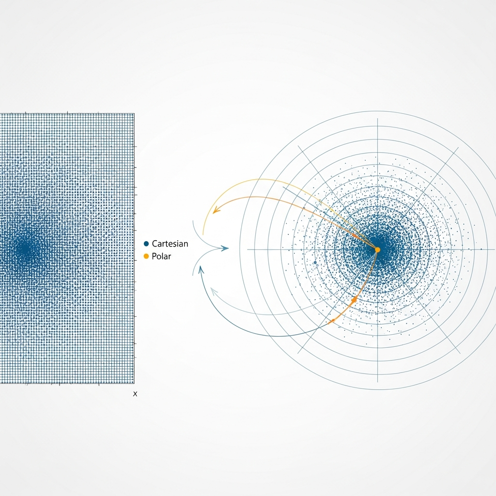

AI 行业的竞争重心正迅速从“模型规模”转向“资源效率”。与其说比拼训练了多少数据，不如说在有限的资源下如何聪明地输出结果，这已成为衡量实际业务竞争力的核心。最近谷歌研究（Google Research）公开的压缩技术“TurboQuant”便具有代表性。它不仅是一项技术成就，更对涵盖 NVIDIA、三星电子、SK 海力士等企业的硬件价值链产生了深远的启示。

当软件试图突破硬件的物理极限时，市场往往会表现出复杂的反应。一方面担心高性能存储需求会减少，另一方面又期待成本降低能推动 AI 的普及。本文将深入探讨 TurboQuant 的技术实质及其背后的商业逻辑。

****

## KV Cache，LLM 难以根治的瓶颈

在与 LLM 对话时，AI 必须实时记忆之前的上下文。此时，充当“数字笔记本”角色的就是 **KV Cache（键值缓存）**。问题在于，随着对话变长、上下文窗口（Context Window）扩大，这些缓存数据会呈指数级增长。

这些数据主要驻留在 GPU 的高带宽内存（HBM）中，一旦空间不足，处理速度就会大幅下降，或导致可同时处理的用户数受限。到目前为止，业界主要通过搭载更多 HBM 来应对，但谷歌选择了一种极度压缩数据本身的软件解决方案。

****

## 重新解读数据的两个维度：PolarQuant 与 QJL

TurboQuant 的核心在于“PolarQuant”和“QJL（Quantized Johnson-Lindenstrauss）”这两种算法。它们通过从根本上重新排列数据结构来提升效率。

首先，**PolarQuant** 改变了观察数据的坐标系。它引入了使用半径和角度的极坐标系，而非传统的基于横纵轴的直角坐标系。将数据分离为“方向”和“强度”进行表达，可以在保留核心信息的同时，显著降低计算负荷。特别是通过随机旋转技术使数据分布均匀，从而最大化压缩效率，这一点尤为引人注目。

随后的 **QJL** 负责执行精确的误差校正。利用将高维数据投影到低维同时保持数据间距离的数学原理，仅凭 1 比特的额外信息就解决了压缩过程中的失真问题。结果是，将原本 16 比特的数据缩减至 3 比特水平，同时将模型的推理准确度维持在可实际应用的范围内。

> “TurboQuant 不仅仅是简单地‘揉捏’数据，它更倾向于理解并重新排列数据所具有的几何结构。这将成为软件优化硬件资源的新基准。”

****

## 存储需求萎缩，还是市场扩张的引子？

技术公开后，部分半导体企业的股价反应敏感，是因为市场将其解读为“需求减少”。其逻辑是，如果减少 HBM 搭载量也能达到同等性能，那么销量将会下降。然而，从技术生态系统的历史来看，**“杰文斯悖论（Jevons Paradox）”**发生作用的可能性更大。

正如 19 世纪蒸汽机效率提升后，煤炭消耗并未减少，反而因其在整个工业领域的普及导致需求爆发一样。AI 运营成本降低后，原本因成本负担而犹豫不决的众多企业将涌入市场。当所有设备都能常时运行 AI 时，即使单台设备的内存使用量减少，整个市场的总需求仍会呈上升趋势。

特别是 TurboQuant 有望成为加速 **端侧 AI（On-device AI）** 时代的触发器。因为无需云端基础设施，仅凭智能手机或笔记本电脑的自带内存即可运行高性能模型。这将为存储厂商提供超越 HBM 供应、进入各设备定制化特殊存储市场的新机遇。

****

## 务实视角的应对与展望

TurboQuant 计划在 2026 年 ICLR 会议上发布，目前尚处于优化阶段。但值得注意的是，Anthropic、DeepSeek 等主要参与者也相继推出了类似的效率优化技术。

现在，与硬件性能同等重要的竞争点在于“如何无损且快速地推理压缩模型”。开发人员应敏锐关注支持量化技术的库更新，而企业则应思考如何在降低运营成本的基础上构建杀手级服务。

归根结底，TurboQuant 不是半导体行业的威胁，而是扩张 AI 生态系统的催化剂。效率越高，AI 就会越深入地渗透进日常生活，而支持这一过程的硬件基础也必须更加坚固。为了抢占技术进化带来的新市场份额，相关准备已迫在眉睫。

## ✅ 常见问题 (FAQ)

  
什么是 TurboQuant？

  它是谷歌研究（Google Research）发布的一项突破性人工智能（AI）数据压缩算法。该技术能将 LLM 或向量搜索引擎在处理数据时产生瓶颈的主因——**“KV Cache”内存占用量，在不损失模型准确度的前提下缩减至最高 1/6**。其原理类似于将 100 页的书籍内容在不损失原意的情况下压缩成摘要版本存储，从而节省内存。

  
TurboQuant 的工作原理是什么？

  它主要通过 **“PolarQuant”和“QJL”这两个创新阶段** 进行压缩。
  <ul>
    <li><b>PolarQuant（一级压缩）：</b> 通过随机旋转数据向量来简化几何结构，然后将传统的直角坐标系转换为极坐标系（半径和角度）进行高质量压缩。</li>
    <li><b>QJL（误差校正）：</b> 利用约翰逊-林登斯特劳斯（JL）引理，对一级压缩后残留的微小误差<b>仅通过 1 比特符号（+/-）进行校正，从而维持数据间的相似度（准确度）</b>。</li>
  </ul>
  通过这一过程，将原本以 16 比特（或 32 比特）浮点数处理的数据 **极限压缩至 3 比特水平**。

  
它与现有的内存压缩（量化）技术有何不同？

  KIVI 等现有的量化方案存在致命缺陷：一旦提高压缩率，AI 就会遗忘之前的内容或产生幻觉，导致 **准确度急剧下降**。而 TurboQuant 通过数学方式执行误差校正，**在几乎无损（Lossless）的水平上捍卫模型准确度**。最大的区别在于，它不需要重新训练或微调（Fine-tuning）模型，可以作为一种**后处理方式立即应用于已有的 AI 模型**。

  
引入 TurboQuant 后，AI 性能将如何提升？

  在减少内存占用的同时，以 NVIDIA H100 GPU 为基准，它能将 **AI 的 Attention（推理）运算速度显著提升最高 8 倍**。此外，利用腾出的内存空间，可以**大幅增加上下文窗口（AI 一次记忆的信息量），或同时运行执行复杂任务的多个 Agent AI**。

  
技术发布后三星电子、SK 海力士股价大跌，实际内存（HBM）需求会减少吗？

  由于担心 AI 要求的内存容量可能缩减至 1/6，三星电子、SK 海力士等相关企业的股价曾出现暂时性下跌。但专家认为这反而是需求爆发的开始，并引用 **“杰文斯悖论（Jevons Paradox）”** 作为依据。
    
  分析指出，随着技术效率提高、AI 运行成本降低，在智能手机等设备上运行的 **端侧 AI 以及企业进入 AI 生态系统的门槛将大幅降低，最终会导致整体 AI 规模和内存总需求的膨胀**。此外，TurboQuant 专注于“推理（Inference）”阶段的效率化，并不会损害 HBM 最大需求源——**大规模模型“训练（Training）”的需求**，也无法解决运算速度与数据供应速度之间的根本问题——**“带宽（Bandwidth）”瓶颈**本身。

  
商用时间表如何？

  TurboQuant 研究论文**计划于 2026 年 4 月在 AI 领域最高权威会议之一的 ICLR 2026 上正式发表**。谷歌已经向大众免费公开了该算法和论文，并允许商业用途。虽然要在 IT 企业的整体服务中实现全面商用还需要一定时间，但开源社区的 llama.cpp 等主要 AI 库已经开始了快速的算法移植工作。

