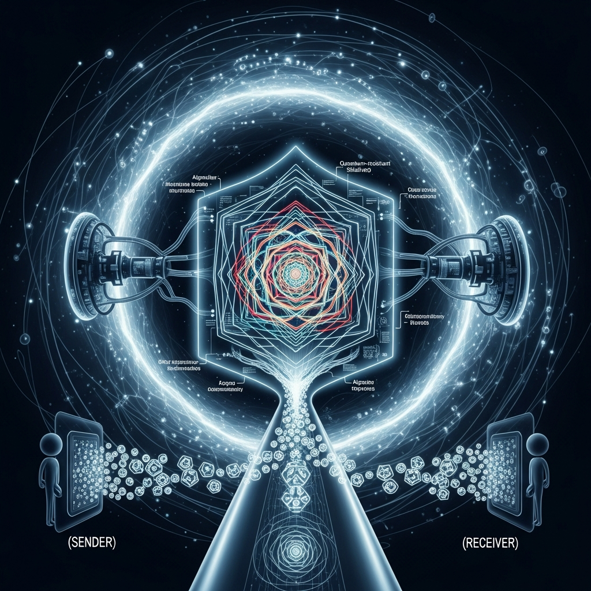

| Category | Content |
| :--- | :--- |
| **English Name** | Post-Quantum Cryptography |
| **Abbreviation** | PQC |
| **Related Technologies** | Lattice-based Cryptography, Shor's Algorithm, NIST PQC Standards, ML-KEM, ML-DSA |

## The Core of Post-Quantum Cryptography
Post-Quantum Cryptography (PQC) refers to new cryptographic algorithms designed to protect data from attacks by quantum computers capable of ultra-high-speed processing. As the mathematical problems that current public-key infrastructure (PKI) relies on face potential obsolescence due to quantum algorithms like Shor's algorithm, PQC ensures security by utilizing more complex mathematical structures, such as lattices or codes.

## Quantum Threats and the Background of Adoption
The RSA and ECC-based public-key encryption systems we use today are grounded in the difficulty of integer factorization or discrete logarithms. However, once sufficiently powerful quantum computers become commercially available, Shor's algorithm will be able to solve these problems in a very short amount of time.

A particularly concerning threat to the security industry is the "Harvest Now, Decrypt Later" (HNDL) attack model. In this scenario, an adversary collects encrypted sensitive data today, even if they cannot decrypt it immediately, with the intention of decrypting it in the future once quantum computers are available. This is why a preemptive transition to PQC is being discussed now to protect national secrets and long-term corporate data.

## Technical Features and Implementation
*   **Utilization of New Mathematical Problems**: PQC employs complex mathematical structures—such as lattice-based, multivariate, hash-based, and code-based systems—that have been proven difficult for even quantum computers to solve efficiently.
*   **High Compatibility with Existing Infrastructure**: Unlike Quantum Key Distribution (QKD), which requires specialized physical hardware, PQC is a software-based approach purely rooted in algorithms. It offers excellent versatility as it can be implemented on current digital communication networks and devices through simple algorithm updates.
*   **Hybrid Migration Strategy**: Until the stability of new algorithms is fully verified, a hybrid approach that uses both classical cryptography (RSA, ECC) and PQC in tandem is commonly adopted. This is a realistic strategy to prepare for quantum attacks while safeguarding against any unforeseen vulnerabilities in the new algorithms.

## Difference from Quantum Key Distribution (QKD)
*   **Post-Quantum Cryptography (PQC)**: Focuses on creating **mathematical algorithms** that are resistant to quantum computing. It operates as software within existing internet environments, primarily to maintain data confidentiality.
*   **Quantum Key Distribution (QKD)**: Utilizes the **physical properties** of quantum mechanics (such as the no-cloning theorem and state changes upon observation). It requires dedicated fiber-optic cables and expensive quantum hardware, and is mainly used to detect eavesdropping during key exchange.

## Real-world Applications and Related Concepts
*   **Apple’s PQ3 Adoption**: In 2024, Apple implemented a PQC protocol called 'PQ3' in iMessage. This is considered a landmark case where a global Big Tech company deployed PQC at scale, raising the bar for end-to-end encryption (E2EE) security.
*   **Key Terminology**:
    *   **Q-Day (Y2Q)**: The point in time when quantum computers will be powerful enough to completely break current cryptographic systems.
    *   **NIST PQC Standards**: Standard algorithms selected by the National Institute of Standards and Technology (NIST), including ML-KEM (formerly Kyber) and ML-DSA (formerly Dilithium).
    *   **Grover's Algorithm**: A quantum algorithm that effectively halves the security strength of symmetric-key cryptography. To counter this, PQC environments maintain security by increasing symmetric key lengths, such as using AES-256.
