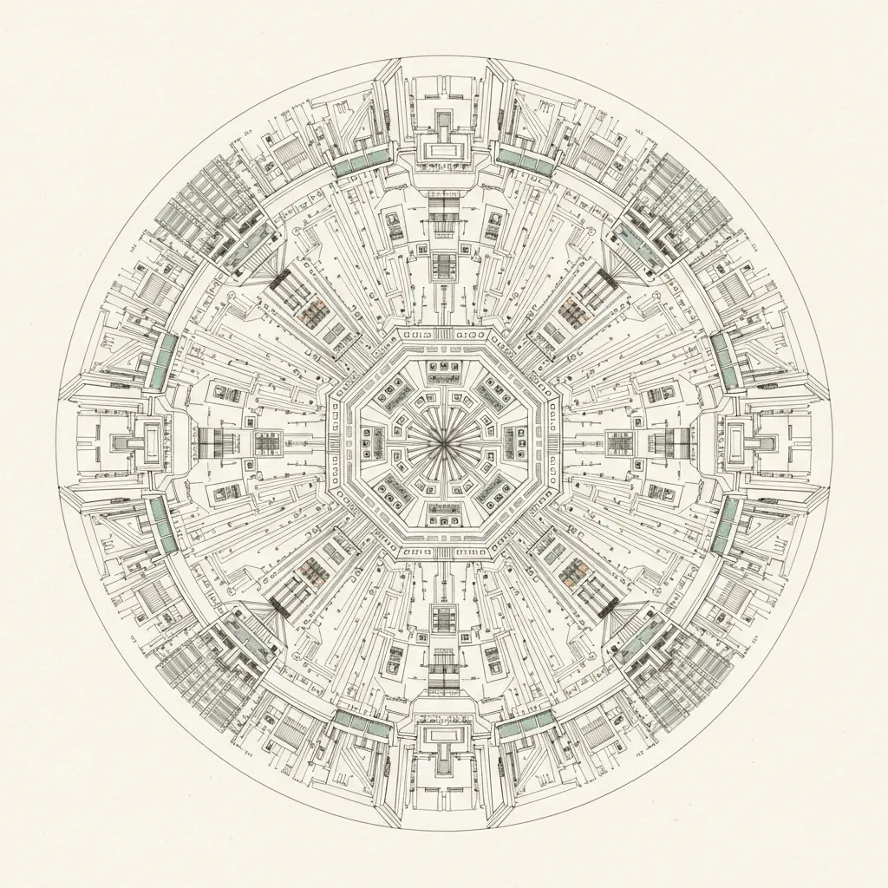
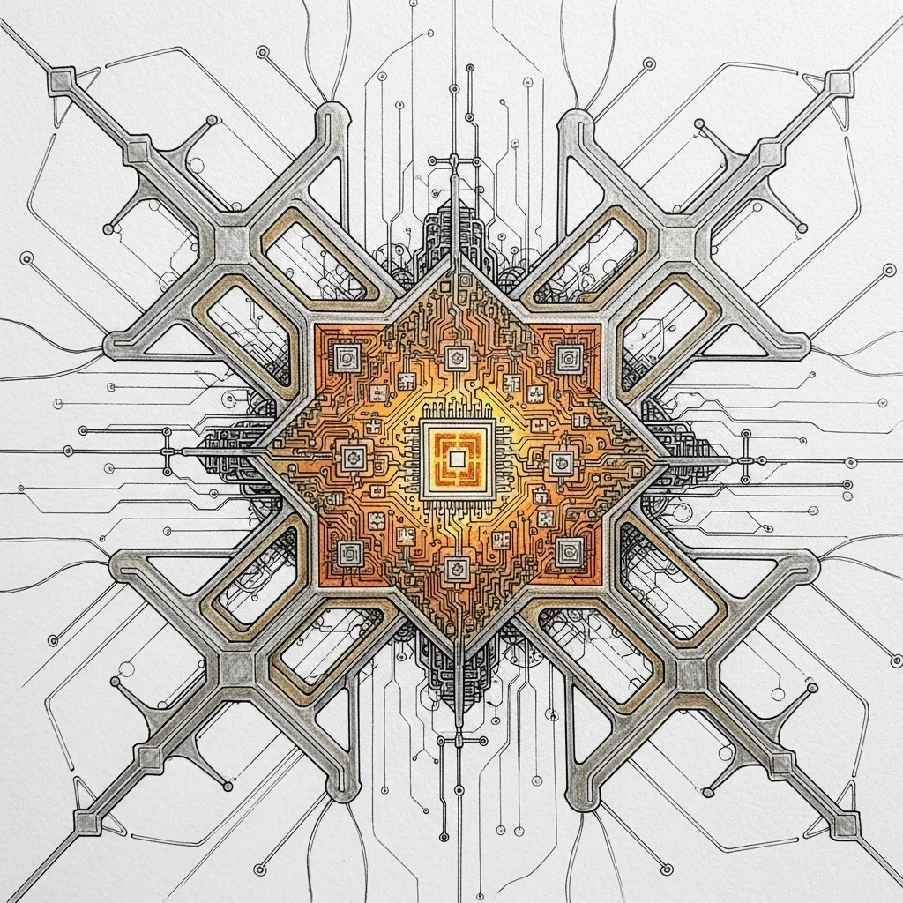

<strong>[BLUF]</strong>
Elon Musk's 'Terafab' project is likely to hit a wall due to the 1-terawatt power requirement, which exceeds physical infrastructure limits, and the daunting challenge of 'yield management' in nanometer-scale manufacturing. This vision lacks the specific precision and accumulated know-how inherent to the semiconductor industry—elements that cannot be solved by capital or economies of scale alone. Analysts warn this could be the prelude to an innovation icon falling into a 'cost trap.'

For the past decade, the name Elon Musk has symbolized the "realization of the impossible" for investors worldwide. Given Tesla’s disruption of the EV market and SpaceX’s transformation of the space industry, his new 'Terafab' vision might seem like the next world-changing innovation. However, this time is different. From the cold perspective of an IT industry analyst, the Terafab looks less like a feasible engineering project and more like a dangerous gamble obsessed with provocative figures.

The core of the Terafab concept is overwhelming production capacity. However, the "1 terawatt (TW)" power consumption mentioned by Musk to support that scale far exceeds what any semiconductor facility can realistically handle. This vision ignores both energy infrastructure realities and the fundamental laws of physics.

> "1 terawatt is not just a number. It is a massive physical barrier that can only be reached by redesigning the power grids of entire modern civilizations."

The absurdity of the 1-terawatt figure becomes clear when compared to the total power generation capacity of nations. The table below illustrates the reality of the energy required for a Terafab.

| Comparison Item | Total Power Capacity (South Korea) | Musk’s Terafab Goal |
| :--- | :--- | :--- |
| <b>Power Capacity</b> | Approx. 100 ~ 150 GW | 1,000 GW (1 TW) |
| <b>Comparative Scale</b> | National-level grid standard | Needs ~7-10x Korea's total power |
| <b>Feasibility Assessment</b> | Stable supply possible | Physically impossible for a single site |

As shown, for a single manufacturing facility to consume ten times the power of an entire industrialized nation, it would require dozens of dedicated nuclear power plants situated right next to the factory. Considering grid overhead and transmission efficiency, experts agree this is not a "technical challenge" but a physical impossibility.

Even more critical than power is 'Yield,' a factor unique to semiconductor manufacturing. Musk has maximized Tesla's productivity through "machines building machines" automation. However, 2-nanometer (nm) class ultra-fine processes are not a domain where results simply appear by speeding up an assembly line.

Semiconductor manufacturing is a realm of probabilistic control involving repeated atomic-level deposition and etching. No matter how much capital or machinery is injected, producing viable chips is nearly impossible without the "process recipes" and know-how accumulated by engineers over decades. While a rocket failure provides feedback for the next launch, semiconductor yield is a ruthless battle where a single vibration or impurity can turn trillions of won worth of wafers into scrap.

Furthermore, the "recursive innovation loop" Musk advocates could backfire in the semiconductor sector. Semiconductors suffer from a "recursive increase in cost," where costs rise exponentially as processes shrink. The <a href="/ko/glossary/what-is-euv" class="glossary-tooltip" data-definition="Short for Extreme Ultraviolet; a lithography technology using very short wavelengths of light to etch precise circuits on wafers in advanced semiconductor manufacturing.">EUV</a> lithography equipment required for 2nm processes costs hundreds of millions of dollars per unit, and the global pool of talent capable of operating them is extremely limited.

The recent discussions regarding a partnership with Intel likely stem from an attempt to hedge these risks. It suggests a realization that building an independent production facility from scratch is unfeasible, prompting a move to leverage Intel’s established manufacturing infrastructure. However, given Intel’s own recent struggles with process instability and declining profitability, it remains to be seen whether a union of these two giants will create synergy or act as a weight dragging both down.

Ultimately, the biggest bottlenecks for the Terafab project are 'Time' and 'People.' Relationships with key equipment suppliers like ASML cannot be solved with money alone, and a legion of skilled engineers who can calibrate the minute margins of error in ultra-fine processes cannot be acquired through short-term hiring.

> "Semiconductor innovation is not a war of attrition won by volume; it is a victory of precision earned through trillions of trials and errors. This is why Musk’s typical playbook may not work in this ecosystem."

In conclusion, Musk’s Terafab may be an overextended ambition that overlooks the physical realities and economic logic of the semiconductor industry. The optimistic belief that the "economies of scale" formula—which worked in the past—will apply to a market requiring atomic-level precision could lead to a "cost trap" that threatens the financial stability of Tesla and xAI as a whole.

We must look past the flashy announcements and face the cold physical data and engineering limits. Whether the Terafab becomes the key to a leap in human computing power or remains an engineering illusion depends on how Musk intends to scale a wall as invisible yet solid as 'Yield.'

## 🔗 Recommended Reading
- [AX (AI Transformation) Strategy: Securing the 'Golden Time' of Execution Beyond Human-Centricity](/en/posts/ax-strategy-golden-time)
- [LLM Wiki Guide: Logical Hallucination Risks in Reasoning Models and the Necessity of Knowledge Accumulation](/en/posts/llm-reasoning-hallucination-risk-knowledge)