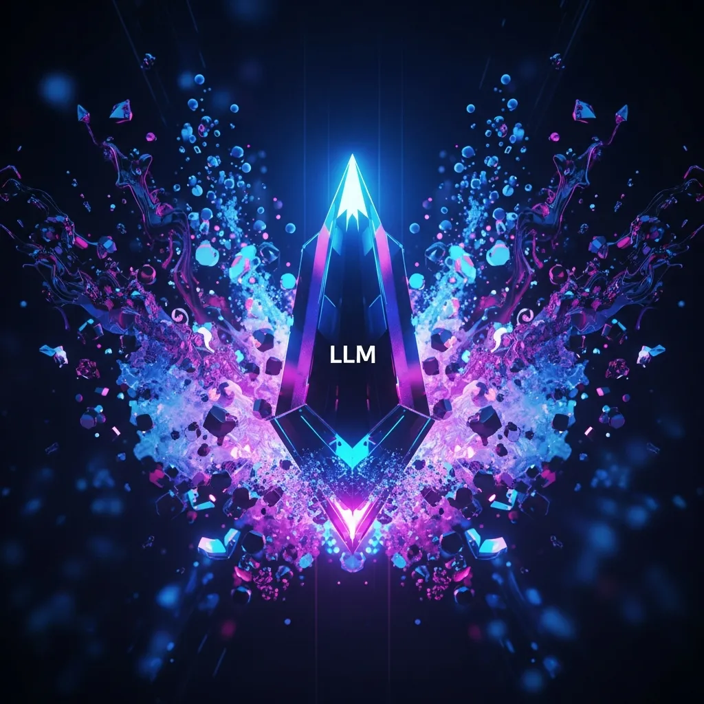

<strong>[BLUF]</strong>
While cutting-edge reasoning models like OpenAI o1 and DeepSeek boast powerful performance, they suffer from opaque thinking processes and astronomical inference costs. Andrej Karpathy's proposed 'LLM Wiki' architecture offers a solution by turning reasoning results into structured knowledge assets, securing both cost-efficiency and logical transparency for AI adoption.

The center of gravity in AI technology is shifting from merely training on massive datasets to 'inference-time scaling'—thinking more deeply at the point of execution. The emergence of the OpenAI o1 series and DeepSeek symbolizes this shift, drastically improving complex problem-solving capabilities.

However, behind the technical brilliance lies a harsh reality that CTOs and lead developers must face: the astronomical token costs incurred every time a model performs reasoning, and the 'black-box' nature of the process where the internal Chain-of-Thought (CoT) is largely hidden.

The outputs of reasoning models can seem like magic, but their opacity is a significant engineering risk. It is difficult to verify the logical steps taken to reach a conclusion, which often leads to a new form of error known as 'Logical Hallucination.'

To address these issues, the 'LLM Wiki' architecture recently proposed by Andrej Karpathy (former Director of AI at Tesla) is emerging as a compelling alternative. The LLM Wiki moves away from one-off consumption of AI reasoning, instead focusing on continuously updating a structured Markdown-based knowledge system.

> "We don't need to repeat the same complex reasoning every time. Intelligence should be an accumulating asset, not a fleeting calculation."

The LLM Wiki is fundamentally different from standard RAG (Retrieval-Augmented Generation). While traditional RAG stops at finding information in fragmented documents, the LLM Wiki 'compiles' raw sources into an optimal structure that the system can understand immediately.

This approach results in the 'assetization' of inference costs. Knowledge refined through a single high-cost reasoning session is stored in the Wiki, allowing subsequent similar requests to be served with immediate, high-quality answers at a significantly lower cost.

The following table summarizes the key differences between the current reasoning model approach and the LLM Wiki architecture.

| Category | Reasoning Model (o1/DeepSeek) | LLM Wiki (Karpathy Pattern) |
| :--- | :--- | :--- |
| Knowledge Processing | One-off Inference (Inference-only) | Incremental Accumulation & Compilation (Compounding) |
| Transparency | Black-box thinking (Hidden CoT) | Transparent Markdown records (Open Schema) |
| Cost Structure | High token costs per request | High initial cost, followed by minimal retrieval cost |
| Optimization Tech | Reinforcement Learning, Search | Distillation, Schema Engineering |

The LLM Wiki architecture consists of three main layers: 'Raw Sources' for original data, 'The Wiki' for refined Markdown content, and 'The Schema' which defines the data standards for the entire process.

A critical technical point here is the application of Richard S. Sutton’s "The Bitter Lesson" through <a href="/en/glossary/knowledge-distillation" class="glossary-tooltip" data-definition="A technique that refines and transfers the essence of complex reasoning from large AI models to smaller, lighter models to ensure efficiency without significant performance loss.">Knowledge Distillation</a>. By compressing the essence of complex reasoning into a Wiki format that smaller models can understand, the operational efficiency of the entire system is maximized.

Recent results from the o1 Replication Journey by GAIR Lab support this direction. They proved that standardizing reasoning paths into structured datasets is just as critical to future AI competitiveness as advancing the reasoning capabilities themselves.

> "Future corporate knowledge bases will not be static human-written documents, but 'living Wikis' structured, reasoned, and verified by AI."

For CTOs, adopting an LLM Wiki means fragmented organizational knowledge no longer remains as static files. Instead, it becomes a 'self-evolving knowledge system' where AI learns new information in real-time, resolves conflicts with existing knowledge, and updates itself into an optimal Markdown structure.

This creates business value far beyond technical efficiency by exponentially increasing the speed of organizational decision-making. Insights can be drawn instantly from a verified knowledge repository without constant reliance on expensive reasoning models.

AI adoption strategies must now shift from 'which model to use' to 'how to accumulate knowledge.' We must utilize the powerful intelligence of reasoning models while exercising the wisdom to store their outputs in the vessel of an LLM Wiki.

Technological progress is dazzling, but it is the power of architecture that turns that technology into a tangible organizational asset. The LLM Wiki will be the most potent design tool for controlling the uncertainty of reasoning and ensuring sustainable growth in the AI era.

Is your team wasting budget on one-off reasoning, or are you building a fortress of knowledge for the future? As Karpathy suggests, it is time to seriously consider the LLM Wiki as your 'compiler of intelligence.'
