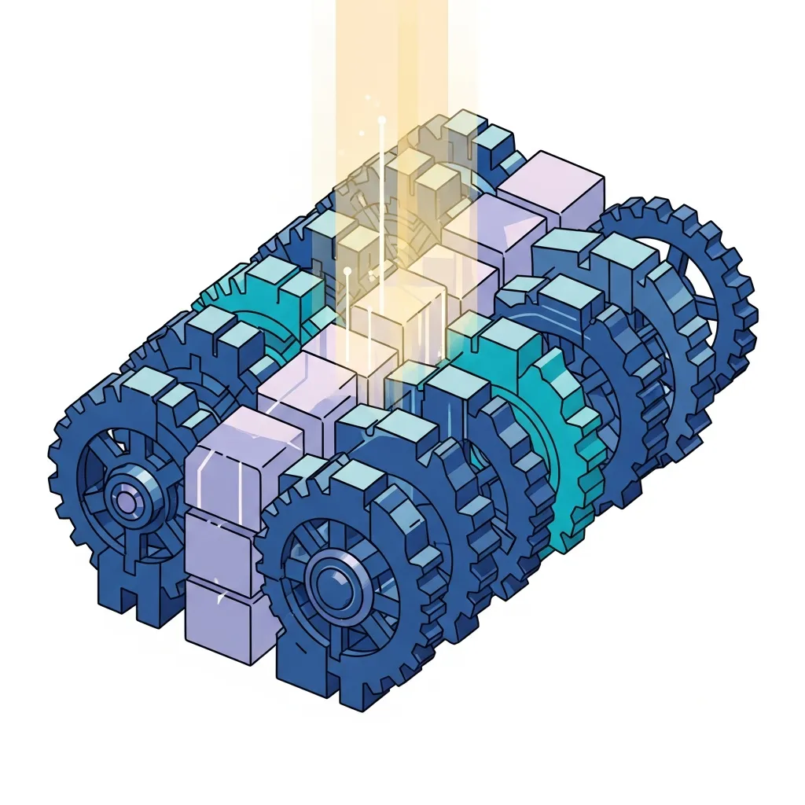

<strong>[BLUF]</strong>
The Transformer architecture is not a leap forward in the essence of intelligence, but rather a victory of 'brute force' that sacrificed computational efficiency (Quadratic Scaling) to maximize the parallel processing capabilities of hardware. By replacing the sequential nature of sequence data with an artificial technique called Positional Encoding, it has created a structural flaw that favors only corporations with massive computational resources.

Today, we often praise the Transformer as if it were the Holy Grail of AI. However, did you know that this architecture relies more on the historical luck of hardware availability than on algorithmic elegance?

As described by Sara Hooker's concept of the "Hardware Lottery," certain algorithms succeed not because they are the most outstanding, but because they are the best fit for the hardware of their era. Transformers can be considered the biggest winners of that lottery.

## The Cost of Abandoning the Sequence: The Truth Behind the 'Positional Encoding' Patch

Essentially, sequential data like language is defined by its temporal order. Past <a href="/en/glossary/rnn-recurrent-neural-network" class="glossary-tooltip" data-definition="A neural network architecture that processes input data sequentially, reflecting information from previous time steps into current calculations, specialized for handling sequence data where context and order are critical.">RNNs</a> processed data while maintaining this sequential instinct, but Transformers completely discarded the concept of order to secure parallelism.

By pouring sequence data in all at once, the model became unable to distinguish the front from the back of a sentence. To solve this, an artificial "patch" called "Positional Encoding" was introduced.

> "Transformers do not understand the order of data on their own. They merely 'mimic' order through externally injected numerical information, which is evidence of a structural flaw in the architecture itself."

Consequently, while we gained speed through parallel processing, we lost the elegance of structurally capturing the inherent flow and causality of data. This is the first paradox faced by the Transformer.

### The Pros and Cons of Parallelism Gained by Removing RNN's Sequential Instinct

RNNs resembled human thinking by remembering previous states to move to the next step. However, this sequential structure was too inefficient to utilize the thousands of cores in modern GPUs.

Transformers broke this chain of memory and opted to calculate all tokens simultaneously. This made large-scale data training possible, but as the model depth increased, training instability actually worsened.

### Why Can't Transformers Understand Sentence Order on Their Own?

The Self-Attention mechanism looks at all words in a sentence at once. This is excellent for finding "which word is important," but it is inherently ignorant of "which word came first."

Ultimately, the cutting-edge AI we use does not understand the logical flow of context. It is closer to a massive statistical machine calculating only the correlations between words within vast amounts of data.

## The Curse of the Quadratic: A 2017 Computational Cost Regressing from 1991 Linear Technology

The most fatal weakness of the Transformer is that the amount of computation increases quadratically (N²) as the length of the input data grows. This means that if the input doubles, the cost quadruples—a clear regression from a technological advancement perspective.

Surprisingly, the "Fast Weight Controller" technology proposed by Jürgen Schmidhuber in 1991 was already performing similar functions with linear complexity (O(N)). However, it was forgotten at the time due to a lack of hardware to support it.

| Model Type | Computational Complexity | Hardware Utilization |
| :--- | :--- | :--- |
| RNN/LSTM | O(N) | Low (Sequential) |
| ULTRA (1991) | O(N) | High (Linear Parallel) |
| Transformer (2017) | O(N²) | Very High (Quadratic Parallel) |

### Schmidhuber's Criticism: Forgotten 90s Tech and the Reinterpretation of 'Attention Is All You Need'

Jürgen Schmidhuber, one of the godfathers of modern AI, strongly criticizes the Transformer as essentially a repackaging of 90s technology. He argues that the 2017 paper is not the birth of a new intelligence but rather a byproduct of an era where computing power became cheap.

Mathematical analysis reveals that modern attention mechanisms have a structure very similar to the linear complexity models of 1991. Ultimately, instead of seeking efficient algorithms, we chose the path of pouring massive amounts of electricity into inefficient models.

### Forcing Through Efficiency Limits with Data and Compute

The performance of modern AI stems more from "economies of scale" than from architectural superiority. NVIDIA's powerful GPUs and nearly infinite data are masking the inefficiencies of the Transformer.

However, this "brute force" approach is not sustainable. The exponential increase in computational costs is resulting in small research labs and individual developers being marginalized from AI innovation.

## The Reality of Transformers: 'Massive Kernel Smoothing' That Hit the Hardware Lottery

Breaking down the Transformer from a mathematical perspective reveals it is actually a modern variation of "Nadaraya-Watson Kernel Smoothing," established in 1964. It is a very old statistical technique that calculates a weighted average by measuring the similarity between data points.

Furthermore, since all tokens are connected to exchange information, the Transformer mathematically aligns with Graph Neural Networks (GNNs) on a "fully connected graph."

> "What we are facing is not a revolutionary structure of intelligence. It is merely a sophisticated and massive kernel smoothing function that smoothly connects data through giant matrix operations."

### The Mathematical Consistency Linking GNNs and Transformers

Understanding the Transformer as a special case of a GNN makes its limitations clearer. Since all data is connected flatly, there are inherent limits to grasping complex hierarchical structures or deep causal relationships.

Scholars like Chaitanya K. Joshi are clarifying the reality of Transformers through these mathematical connections. They advise us to look into the fundamental mathematical structures rather than being buried in the shell of the algorithm.

### The Attention Mechanism: Nothing More Than a Modern Variation of Kernel Regression

Ultimately, Attention is not a new concept; it is a statistical methodology established decades ago that exploded with the help of hardware. We might be attributing too much meaning to this "old new thing."

Because matrix multiplication (GEMM) operations, which are advantageous for parallel processing, dominate over computational efficiency, modern accelerators create the illusion of peak efficiency when processing Transformers.

## Conclusion: Beyond the Era of Brute Force AI Toward New Architectures

While the Transformer is undoubtedly the massive engine driving modern AI, we must admit it is not the perfect answer. The method of implementing intelligence through a massive onslaught of computational resources is reaching its limit.

It is time to declare the bankruptcy of efficiency and pull out the wisdom of linear complexity that stopped in the 90s. Beyond the benefits of the hardware lottery, we look forward to the emergence of elegant architectures that truly pierce the essence of intelligence.

Now is the time to think about "how to be smarter" rather than "unconditionally bigger." Facing the shadows of inefficiency hidden behind the Transformer's flashy exterior will be the first step toward opening a new era of AI.

## 🔗 Recommended Reading
- [OpenAI MCR and GPT-5: A Revolution in Intelligence or a Giant Infrastructure Trap?](/en/posts/openai-mcr-gpt-5-revolution-trap)
- [LLM Wiki Guide: Logic Hallucination Risks in Reasoning Models and the Necessity of Knowledge Accumulation](/en/posts/llm-reasoning-hallucination-risk-knowledge)