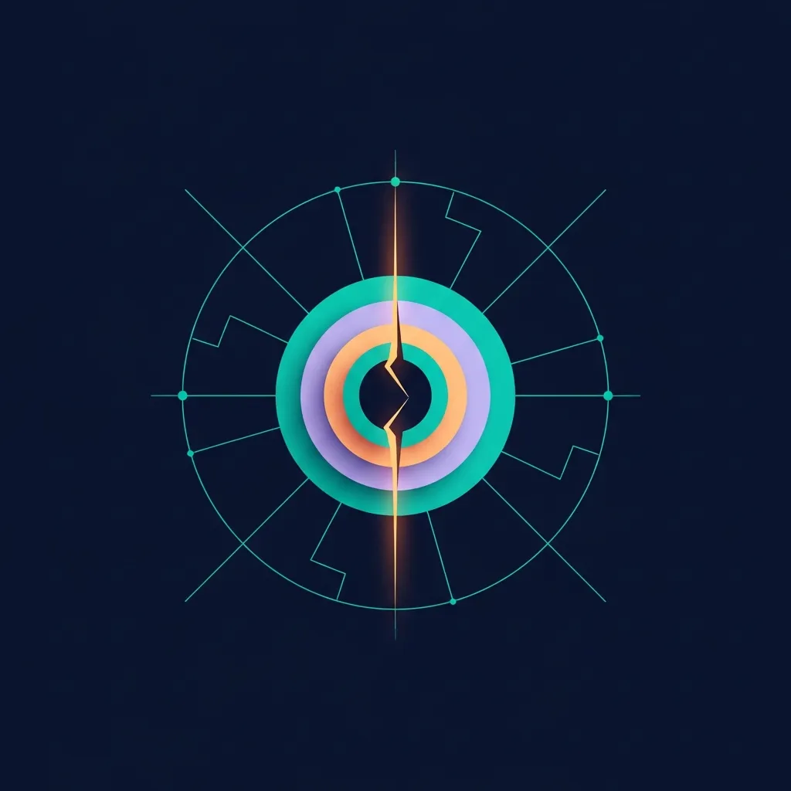
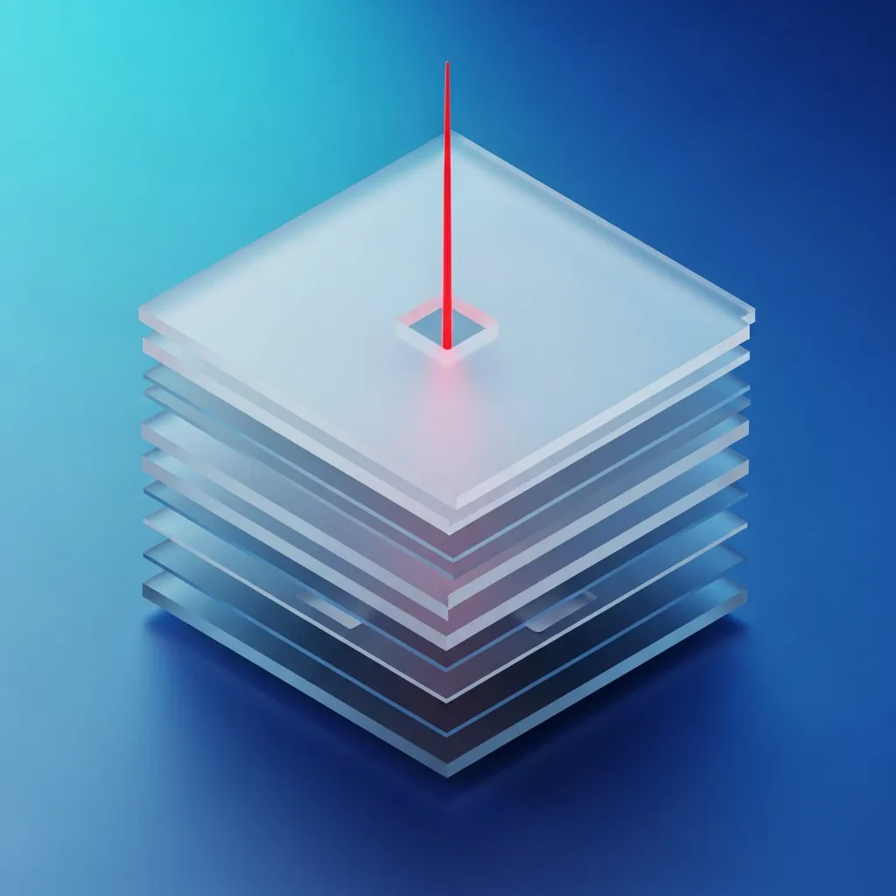
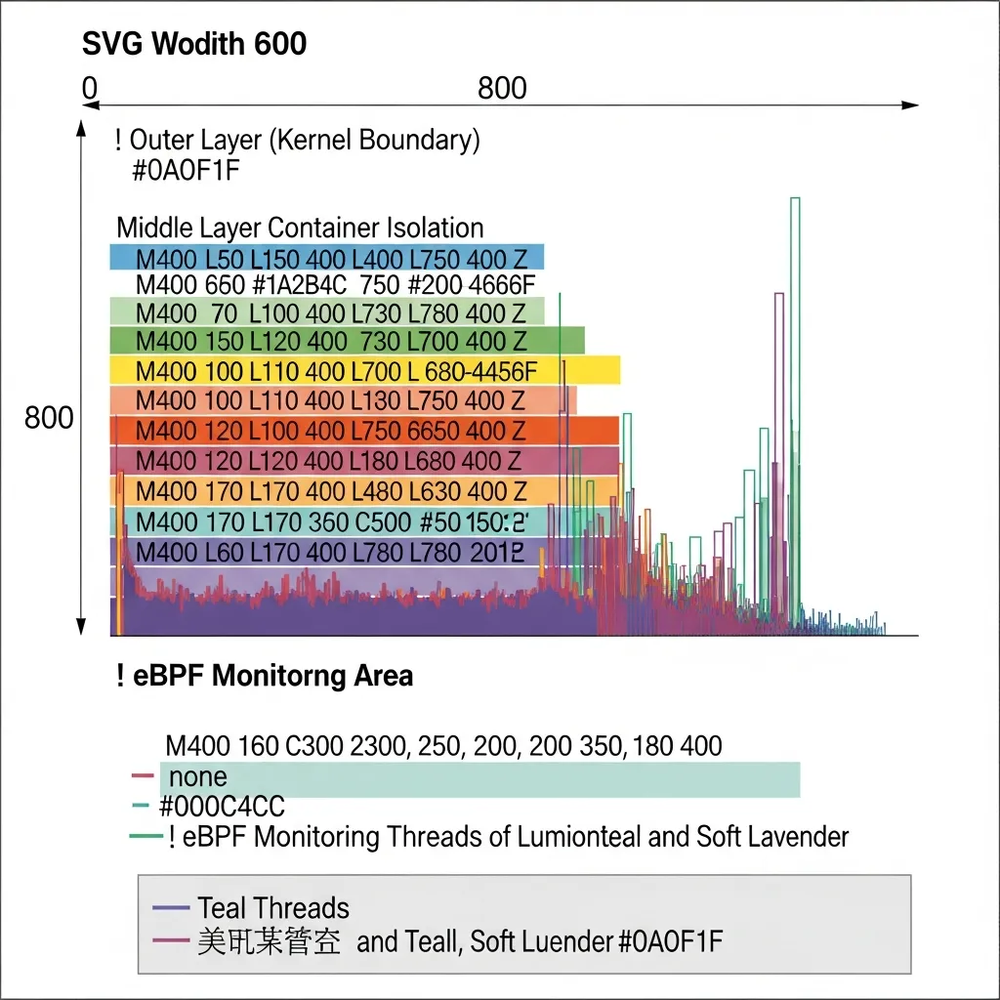

It is no exaggeration to say that modern Cloud infrastructure is built upon the solid ramparts of "container isolation." However, a crack has been discovered in the underlying Linux kernel—the very foundation of those walls—where a script of just 732 bytes can neutralize all controls.

The recently disclosed "Copy Fail (CVE-2026-31431)" vulnerability directly targets logical flaws in virtualization security that we have trusted for years. It is a destructive threat that shakes the foundation of any container environment using a shared kernel structure, going far beyond the scope of a single compromised system.

<strong>[BLUF]</strong>
CVE-2026-31431 ('Copy Fail') is a local privilege escalation (LPE) vulnerability that exploits interaction errors between the Linux kernel's <a href="/en/glossary/what-is-af-alg" class="glossary-tooltip" data-definition="A component that allows user-space programs to use the Linux kernel's cryptographic functions through a socket interface. It helps applications efficiently call various encryption algorithms supported at the kernel level.">AF_ALG</a> crypto API and the splice() system call. With a 732-byte exploit, an attacker can corrupt the kernel page cache to modify read-only files in memory, granting 100% reliable root access and neutralizing container isolation.

## 1. The Essence of the Threat: Why 'Copy Fail' is More Than Just Privilege Escalation

The reason this vulnerability is uniquely threatening is that it occurs within the 'AF_ALG' cryptographic subsystem, one of the deepest layers of the Linux kernel. Surprisingly, this flaw was a ticking time bomb that remained hidden in the kernel code for over seven years, dating back to 2017.

What demands particular attention is that the attack is "In-memory only." While traditional integrity detection solutions monitor changes to files on the disk, Copy Fail precisely targets data already loaded into memory.

> "Copy Fail is the epitome of a 'stealth' attack that security operators fear most. It seizes the heart of the system without leaving a trace."

Due to these characteristics, an attacker can bypass the radar of security appliances and gain complete control over the kernel. This is more than just a bug; it is a strategic asymmetric threat that catches modern security architectures off guard.

## 2. The Collapse of Container Isolation: A Fatal Weakness in Shared Kernels

We often believe that containers operate safely within their own independent spaces. However, in reality, all containers share the host's Linux kernel, and this "shared" nature acts as a fatal poison when faced with Copy Fail.

The core mechanism of this vulnerability is "Page Cache Corruption." If an attacker manipulates the kernel page cache from within a specific container, the host and neighboring containers sharing the same kernel are immediately affected.

This is disastrous news, especially for Cloud service providers operating multi-tenant environments. It opens a path for a single malicious user to compromise the integrity of an entire node and access other customers' data.

> "Container isolation is no longer an absolute shield. The moment the kernel is corrupted, all isolation boundaries vanish like a mirage."

This should not be viewed merely as a problem of gaining system privileges, but as an event where the "mutual trust" that is the premise of Cloud computing collapses. A measly 732 bytes of code is threatening the trust of infrastructure worth trillions of dollars.

## 3. Technical Deep Dive: A Case Where 'In-place' Optimization Became Toxic

Technically speaking, this situation began with a logical flaw in the "In-place" processing method designed for kernel performance optimization. When the `algif_aead` module handles the `splice()` system call, an error occurs while attempting to overwrite data directly in memory without creating a separate copy.

Under normal circumstances, an exception should be triggered if a data copy fails, but a precise 4-byte write error was left unhandled. Attackers exploit this gap to replace the memory regions of privileged executables, such as `/usr/bin/su`, with their own malicious code.

What is even more chilling is that this attack is "Deterministic." It is not a race condition that relies on luck; because it exploits a design flaw, it succeeds with a 100% probability every time it is executed.

| Item | Details |
| :--- | :--- |
| **Vulnerability ID** | CVE-2026-31431 (Alias: Copy Fail) |
| **CVSS v3.1 Score** | 7.8 (High) - AV:L/AC:L/PR:L/UI:N |
| **Introduced In** | 2017 (Linux Kernel commit 72548b093ee3) |
| **Exploit Size** | Approx. 732 bytes (Python-based deterministic exploit) |
| **Affected Distributions** | Ubuntu 24.04 LTS, RHEL 10.1, Amazon Linux 2023, etc. |

The exploit code merely calls cryptographic APIs and manipulates a few parameters. However, the result is the devastating acquisition of root privileges across the entire system.

## 4. Immediate Response Strategy: Building a Defense Beyond Patching

At this moment, the first priority for security operators is to check if their distribution has a kernel patch available. However, the potential of this threat is too great to simply rely on patching alone.

If immediate rebooting or patching is not feasible, emergency measures to block the creation of AF_ALG sockets should be considered. Adjusting kernel parameters or temporarily disabling relevant modules can close the attack path.

Furthermore, consider actively utilizing modern runtime security technologies like eBPF. Monitoring abnormal system call patterns or write attempts to read-only memory in real-time can serve as a fundamental defense.

> "A patch may be a case of locking the stable door after the horse has bolted. We are now in an era where proactive security—observing and controlling internal kernel behavior in real-time—is essential."

It is important to move beyond simple static analysis and build intelligent monitoring systems that track process execution trajectories. This ensures the resilience to immediately capture anomalies even if new zero-day vulnerabilities appear.

## 5. Conclusion: Time for a Fundamental Re-evaluation of Cloud-Native Security

The Copy Fail incident reveals the raw reality of Cloud security. It has made us realize that the isolation walls of containers, which we trusted implicitly, actually stood on a thin sheet of glass called the shared kernel.

Technology always advances, but unintended gaps are bound to emerge in the process. This vulnerability should serve as a catalyst to extend and apply the "Zero Trust" philosophy all the way down to the infrastructure level—assuming that anything can be breached at any time.

When designing Cloud architectures, include the integrity of the kernel within the scope of your skepticism. That is the most painful yet important lesson Copy Fail has left us.

Future security strategies must go beyond merely blocking and move toward having a keen sense capable of detecting even the smallest tremors within the system. We hope this threat serves as a preventive vaccine that makes your infrastructure even stronger.

## 🔗 Recommended Reads
- [The Paradox of Transformer Architecture: A Victory for Parallelism or a Bankruptcy of Efficiency?](/en/posts/transformer-architecture-paradox)
- [Distributed Systems Architecture: The Blessing and Curse of Complexity Brought by Infinite Scaling](/en/posts/distributed-systems-scaling-complexity)