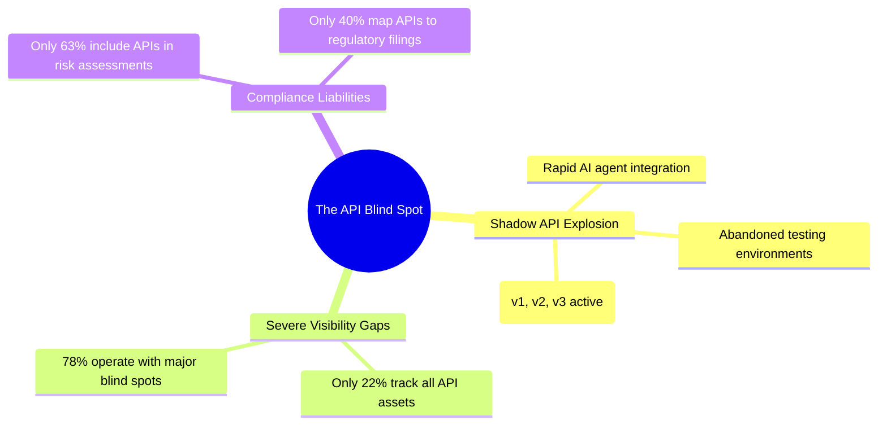
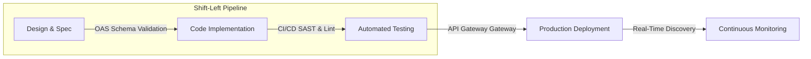

<strong>[BLUF]</strong>
According to Akamai's '2026 API Security Impact Study: APAC Edition,' a staggering 81% of organizations in the Asia-Pacific region experienced at least one API security incident in the past 12 months, with the average cost per incident soaring past $1 million. As enterprises rush to deploy Artificial Intelligence (AI) and Large Language Model (LLM) agents, a wave of undocumented 'Shadow APIs' is putting data sovereignty at risk. We dissect the findings of the report and outline a next-generation API security blueprint.

As modern software architectures shift toward microservices, and Generative AI becomes embedded within the core of enterprise products, <strong>Application Programming Interfaces (APIs)</strong> have become the vital circulatory system of global data traffic.

Yet, these very highways of digital exchange are rapidly turning into the ultimate <strong>Achilles' heel</strong> of modern security perimeters.

A recent comprehensive study by security giant Akamai reveals a shocking reality for APAC cybersecurity leaders. <strong>Over 81% of enterprises have suffered an API-related breach or security incident</strong> over the past year, and the financial liability of a single incident now averages <strong>over $1 million</strong> (representing an almost two-fold increase year-over-year).

We dive deep into the findings of this landmark report and deliver an actionable technical blueprint to protect your API endpoints from high-impact exploitation.

## 01. The Alarming Numbers: Breaking Down the APAC API Crisis

The data published in Akamai’s latest research demands immediate attention from enterprise architects, security leaders, and infrastructure managers:

* <strong>81% Incident Rate:</strong> Over the last 12 months, 81% of surveyed organizations across major APAC markets (including China, India, Japan, and Singapore) experienced at least one serious API-related data breach or security failure.
* <strong>Cost Per Incident Exceeds $1M:</strong> The average cost associated with a single API breach exploded from <strong>$580,000</strong> last year to <strong>over $1,000,000</strong> today. This sharp rise reflects the growing cost of incident response, recovery overhead, regulatory penalties, business downtime, and lasting reputational damage.
* <strong>AI-Related APIs as Primary Targets (43%):</strong> The most frequent target of attackers was not legacy REST endpoints but APIs integrated with <strong>AI agents and Large Language Models (LLMs)</strong>. A significant 43% of respondents witnessed active attacks aimed directly at stealing data or injecting malicious payloads into their AI application layers.

---

## 02. The Visibility Paradox: 78% of Enterprises Left in the Dark

The core vulnerability in modern enterprise environments is not the sophistication of external attacks, but a severe lack of internal visibility: <strong>only 22% of surveyed organizations stated they fully understand their API assets and can identify exactly which endpoints return sensitive data</strong>.

In the race to launch AI-driven features, development teams frequently spin up new microservices without properly documenting or registering the resulting API endpoints in central directories. These <strong>Shadow APIs</strong> and legacy endpoints remain active, serving as undocumented backdoors that threat actors can easily exploit to access internal production databases without triggering any system alerts.

---

## 03. The Preparedness Gap: C-Level Optimism vs. Operational Reality

The study also highlights a dangerous misalignment in threat perception between organizational leadership and frontline security practitioners:

* <strong>Executive Optimism (56%):</strong> A comfortable 56% of C-level executives expressed absolute confidence that their organizations are fully prepared to defend against AI and API-level threats.
* <strong>Practitioner Reality (44%):</strong> In contrast, only 44% of application security engineers and operational practitioners felt they possessed sufficient defenses.

This <strong>12% perception gap</strong> occurs because executives often judge security readiness based on static compliance certifications and high-level vendor SLAs. Frontline engineers, however, are acutely aware of the daily realities of continuous deployment pipelines, code changes, and undocumented API endpoints created by rapid development cycles, underscoring the need for a structural change in how API risks are tracked and reported.

---

## 04. The Impending AI Compliance Storm

While API breaches historically resulted in simple system patches and minor public statements, the implementation of strict frameworks like the EU AI Act and updated APAC data protection regulations has transformed API security into an urgent compliance concern.

According to Akamai's research, while most organizations claim to account for APIs in their general compliance policies, <strong>only 63% regularly include APIs in official risk assessments</strong>, and a mere <strong>40% reflect API security in their public disclosure filings</strong>.

If an undocumented API leaks sensitive customer records or proprietary training data, regulatory bodies can penalize the target organization with fines reaching up to several percentage points of global annual revenue for failing to implement proper data governance.

---

## 05. The Enterprise Blueprint to Securing the API Perimeter

To mitigate these risks and secure your digital assets, modern enterprise architectures must implement three core defensive strategies:

### ① Automated, Real-Time API Discovery
Legacy spreadsheet tracking and manual documentation must be replaced immediately. Modern infrastructures should deploy automated <strong>API Discovery engines</strong> that continuously analyze network gateway and middleware traffic to identify new endpoints, map data pathways, and automatically update central inventories in real-time.

### ② Absolute Commitment to "Shift-Left" Testing
Security must not be treated as a final checkbox checked the night before a release. Organizations must <strong>Shift-Left</strong> by integrating automated security validation directly into early development stages. This is achieved by embedding Static Application Security Testing (SAST), OpenAPI Specification (OAS) validation, and strict access token checks directly into the continuous integration and deployment (CI/CD) pipelines.

### ③ WAAP and Microsegmentation Integration
Traditional Web Application Firewalls (WAF) are no longer sufficient for API traffic. Enterprises must deploy <strong>Web Application and API Protection (WAAP)</strong> platforms that leverage machine learning to analyze API request patterns and establish behavioral baselines. 

If an endpoint suddenly requests large batches of LLM training embeddings or begins exporting bulk files to anomalous IPs, the system must immediately terminate the session and isolate the affected containers using zero-trust segmentation, protecting the wider network from catastrophic compromise.

---

## 🔗 Recommended Reading
- [The Zero Trust Paradox: Analyzing Continuous Verification and Resilience under NIST 800-207](/en/posts/zero-trust-paradox-nist-800-207-cyber-resilience)
- [The Quantum Apocalypse (Y2Q) and HNDL Threat: Technical Deep Dive into Quantum Security (QKD vs PQC)](/en/posts/quantum-apocalypse-pqc-qkd-guide)
---
