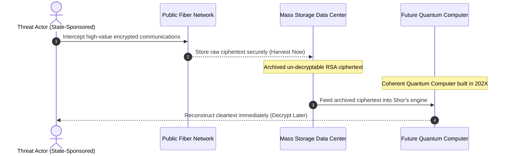

<strong>[BLUF]</strong>
The mathematical prime factorization walls that protect modern public-key infrastructure (RSA, ECC) are facing complete collapse under the processing power of quantum-fueled Shor’s Algorithm. Security experts refer to this turning point as Y2Q, and are actively deploying defenses against 'Harvest Now, Decrypt Later' (HNDL) attacks using a dual-track quantum security paradigm: Quantum Key Distribution (QKD) and Post-Quantum Cryptography (PQC). We break down the technical architectures of this next-generation cybersecurity shield.

Every day, the global digital sovereignty that we take for granted—from mobile banking transfers to classified enterprise clouds and tactical military data links—is protected by an invisible steel wall: <strong>Public Key Infrastructure (PKI)</strong>.

Yet, an absolute weapon is approaching, capable of destroying these mathematical calculation barriers in seconds. By bypassing physical transistor limitations through parallel processing, <strong>Quantum Computers</strong> are poised to render conventional cryptography obsolete.

Confronting this massive paradigm shift, IT architects and cybersecurity leaders are entering the most significant migration era in internet history: <strong>Quantum Security</strong>. We conduct an in-depth architectural analysis of why legacy cryptosystems must fail, and how QKD and PQC form a dual-layered defense system.

## 01. Cracking the Factorization Wall: Y2Q and the Cryptographic Apocalypse

Today, standard algorithms securing global financial networks and government communications are <strong>RSA</strong> and <strong>ECC (Elliptic Curve Cryptography)</strong>. The security of these algorithms relies on a simple mathematical law: it takes billions of years (equivalent to the age of the universe) for classical computers to find the prime factors of a multi-hundred-digit integer.

However, unlike classical computers that process information in bits (representing 0 or 1), quantum computers leverage the fundamental quantum mechanics of <strong>Superposition</strong> and <strong>Entanglement</strong> to compute using qubits (quantum bits).

By running <strong>Shor's Algorithm</strong> (developed by mathematician Peter Shor) within a coherent quantum superposition state, a quantum computer can find prime factors and solve discrete logarithms in seconds—effectively searching for answers across infinite calculation paths simultaneously.

The cybersecurity community refers to the point when public-key encryption fails as <strong>Y2Q (Years to Quantum)</strong> or the <strong>Quantum Apocalypse</strong>.

---

## 02. The HNDL Attack: "Harvest Now, Decrypt Later"

A common objection from business leadership is: "Since stable, fault-tolerant quantum computers with enough physical qubits are still years away, why should we invest heavily in infrastructure migration today?"

The answer lies in a highly active threat vector: <strong>HNDL (Harvest Now, Decrypt Later)</strong>.

Adversaries and nation-state threat actors are actively tapping international telecommunication trunks to <strong>intercept and store (Harvest)</strong> massive volumes of encrypted military communications, corporate intellectual property, national infrastructure diagrams, and lifetime health records.

While this data remains secure in its encrypted state today, adversaries are saving it for the exact day they gain access to a functional quantum computer. When that day arrives, they will run Shor's Algorithm on their archived data, <strong>decrypting years of historical intelligence (Decrypt)</strong> in one swift blow.

Because any encrypted data transmitted today remains vulnerable to future decryption, <strong>cryptographic migration must happen years before the first quantum computer is turned on</strong>. This reality is driving the urgent global push for quantum-safe architectures.

---

## 03. Inside the Core Defense Engines: QKD vs. PQC

To counter the threat of quantum computers, two distinct defense systems have emerged, utilizing fundamentally different security principles: <strong>QKD</strong> (physics-based) and <strong>PQC</strong> (mathematics-based).

### ① Quantum Key Distribution (QKD)

QKD bypasses mathematical algorithms entirely, relying instead on <strong>the laws of quantum physics</strong> to establish a secure hardware-based communication channel.

* <strong>How It Works:</strong> The sender (Alice) and receiver (Bob) exchange a symmetric cryptographic key by transmitting single <strong>photons</strong> (light particles) polarized in specific quantum states.
* <strong>No-Cloning and Heisenberg’s Uncertainty Principle:</strong> According to the quantum no-cloning theorem, any attempt by an eavesdropper (Eve) to intercept or measure these photons alters their quantum states, introducing detectable errors.
* <strong>The Security Edge:</strong> The communication terminals calculate the Quantum Bit Error Rate (QBER) in real-time. If an eavesdropper is detected, the compromised key is immediately discarded. This hardware-based system guarantees <strong>zero eavesdropping capability, backed by physical law</strong>.

### ② Post-Quantum Cryptography (PQC)

PQC leverages existing classical internet architectures and fiber backbones but swaps legacy mathematical puzzles for <strong>complex, high-dimensional geometric structures</strong> that quantum computers cannot solve.

* <strong>How It Works (Lattice-Based Cryptography):</strong> While RSA relies on two-dimensional prime number calculations, lattice-based cryptography creates mathematical traps in multi-thousand-dimensional vector spaces, requiring users to solve the "Shortest Vector Problem" (SVP). Even with quantum parallel processing, finding these vector coordinates remains computationally impossible without the private key.
* <strong>Standardizing the Future (NIST ML-KEM & ML-DSA):</strong> The US National Institute of Standards and Technology (NIST) finalized the primary standards for post-quantum algorithms:
  * <strong>ML-KEM (formerly Kyber):</strong> The finalized standard for key encapsulation and secure key exchange.
  * <strong>ML-DSA (formerly Dilithium):</strong> The finalized standard for digital signatures and identity verification.
  * <strong>SLH-DSA (formerly SPHINCS+):</strong> A state-of-the-art hash-based digital signature standard, serving as a backup defense if lattice mathematics are ever compromised.

---

## 04. Technical Comparison: QKD vs. PQC

Choosing between QKD and PQC is a trade-off between absolute physical security and deployment scalability.

<table>
  <thead>
    <tr>
      <th>Metric</th>
      <th>🛡️ Quantum Key Distribution (QKD)</th>
      <th>🔑 Post-Quantum Cryptography (PQC)</th>
    </tr>
  </thead>
  <tbody>
    <tr>
      <td>Security Foundation</td>
      <td><strong>Laws of Physics</strong> (Quantum No-Cloning)</td>
      <td><strong>Mathematical Complexity</strong> (Multi-Dimensional Lattices)</td>
    </tr>
    <tr>
      <td>Infrastructure Requirements</td>
      <td><strong>Specialized optical transmitters, quantum receivers, dedicated dark fiber networks</strong></td>
      <td><strong>Standard public networks, existing data centers, legacy cloud servers</strong></td>
    </tr>
    <tr>
      <td>Cost and Scalability</td>
      <td><strong>High CAPEX</strong> (Requires major physical hardware investments and dedicated lines)</td>
      <td><strong>Low CAPEX</strong> (Deploys via software updates, firmware patches, and software libraries)</td>
    </tr>
    <tr>
      <td>Distance Limitations</td>
      <td><strong>Significant</strong> (Signal attenuation limits transmission to ~100-150km without trusted repeaters)</td>
      <td><strong>Unlimited</strong> (Fully compatible with global routing and edge networks)</td>
    </tr>
    <tr>
      <td>Primary Use Case</td>
      <td>Military command links, bank central vaults, hyper-scale data center trunks</td>
      <td>Web browsers, mobile banking, V2X connected vehicles, mass IoT devices</td>
    </tr>
    <tr>
      <td>Metaphorical Analogy</td>
      <td><strong>"A self-destructing letter that vaporizes the moment an eavesdropper looks at it."</strong></td>
      <td><strong>"An intricate mathematical maze that even an alien supercomputer cannot navigate."</strong></td>
    </tr>
  </tbody>
</table>

---

## 05. The Hybrid Architecture: The Ideal Path Forward

Modern cybersecurity leaders are moving away from treating QKD and PQC as competing solutions, opting instead for a unified <strong>Hybrid Quantum Security Architecture</strong>.

* <strong>At the Core Data Center Backbone</strong>, where physical security is critical and CAPEX can be justified, administrators deploy <strong>QKD hardware nodes</strong> to establish a physical defense line between central sites.
* <strong>At the Distributed Edge (Last-Mile)</strong>, where billions of mobile phones, smart grids, and web clients connect, developers inject <strong>PQC lattice software algorithms</strong> to provide high-speed, scalable, quantum-safe encryption without requiring a hardware overhaul.

This hybrid approach is already materializing in production. Apple deployed <strong>'PQ3'</strong>, a state-of-the-art cryptographic protocol, to protect its iMessage communications, while Google Chrome integrated NIST-approved PQC key exchange mechanisms natively. The countdown to Y2Q has begun, and the architects who fortify their systems today will hold the keys to a secure, quantum-safe future.

---
