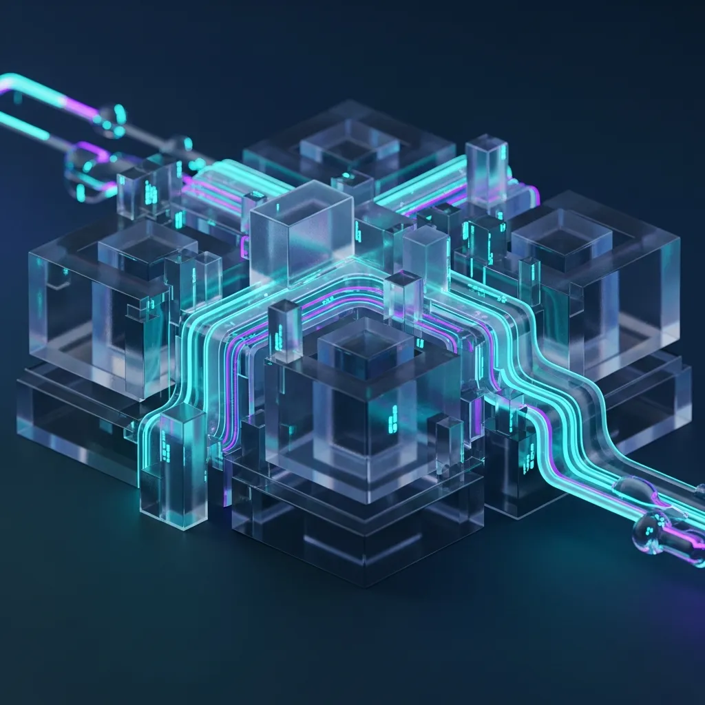
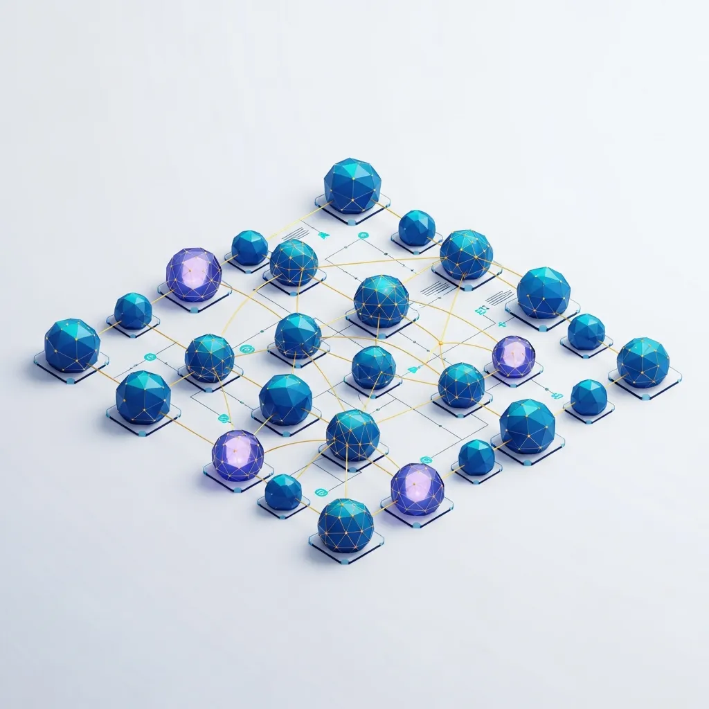

<strong>[BLUF]</strong>
RDBMS has been the standard of trust for 50 years by providing ACID-based data integrity. However, in today's hyper-scale data ecosystem, it faces the 'Paradox of Order'—a lack of flexibility due to strict schemas and structural limits in horizontal scaling. Future data strategies are evolving into hybrid architectures that maintain the stability of relational models while integrating the scalability of <a href="/en/glossary/what-is-nosql" class="glossary-tooltip" data-definition="A non-relational database system that stores data without a fixed table schema and excels in horizontal scalability, making it suitable for processing large-scale unstructured data.">NoSQL</a> and the semantic connectivity of Knowledge Graphs.

In the early 1970s, a paper proposed by Dr. Edgar F. Codd ended the era of file systems—the dark ages of data. Back then, data was riddled with redundancy and inconsistency, and the engineers managing it suffered through a complex tangle of data dependencies.

The relational model presented by Dr. Codd defined data as "tables," which are mathematical sets, establishing a monumental value in the history of information technology. For the next 50 years, RDBMS has reigned as the most trusted guardian of order at the heart of every business worldwide.

## 1. The Birth of Order: E.F. Codd's Legacy and the Value of Relational Models

### 1.1 The Logic of Tables: Ending the Disorder of File Systems

Past data management methods were dependent on specific applications, often leading to the tragedy of having to rewrite entire programs whenever a data structure changed. The relational model broke this dependency by completely separating the logical structure of data from its physical storage.

By confining data within logical rectangles where rows and columns intersect, we were finally able to clearly define and handle the meaning of information. This was more than just a technical advancement; it represented a philosophical shift in how humanity organizes and handles information.

### 1.2 The Rectangle of Trust: ACID Principles and Business Consistency

In environments that do not permit even a single cent of error, such as financial payments or airline reservation systems, RDBMS holds unrivaled authority. This is possible thanks to the <a href="/en/glossary/acid" class="glossary-tooltip" data-definition="An acronym for Atomicity, Consistency, Isolation, and Durability, which are properties guaranteed to ensure that database transactions are processed reliably.">ACID</a> principles, which guarantee the safety of database transactions.

The guarantee that a transaction is processed as "All or Nothing" under any circumstance has become the foundation for building trust in modern business. Data integrity is an absolute legacy of RDBMS that cannot be traded for anything else.

> "The 'strict order,' which is the greatest strength of RDBMS, paradoxically becomes the most powerful constraint in the face of rapidly changing modern business requirements."

## 2. The Shadow of Perfect Design: Loss of Flexibility Caused by Integrity

### 2.1 The Prison of 'Schema': Limits of Rigid Data Structures

Ironically, the limitations of traditional RDBMS begin with the very strict schema design it is so proud of. <a href="/en/glossary/normalization" class="glossary-tooltip" data-definition="The process of structuring a database to reduce data redundancy and improve data integrity by separating tables.">Normalization</a>, performed to eliminate data redundancy and maximize consistency, often becomes a massive shackle as systems become more sophisticated.

When a business grows and needs to add new data attributes, changing the schema of an already massive table is a nightmare that keeps architects awake at night. This is the point where the 'Paradox of Order' occurs—where a design intended to maintain order actually erodes the flexibility needed to respond to a changing market.

### 2.2 The Trap of Normalization: Join Operations and Performance Degradation

While it is good to store data efficiently by splitting it up, the process of reassembling it to show the user comes at a very high cost. The computational load generated by joining numerous tables becomes the primary culprit for system performance collapse in the face of heavy traffic.

As the information split for data integrity forms complex relationship networks, query response times inevitably increase exponentially. Eventually, one faces the contradiction of having to choose "denormalization"—merging data back together—and sacrificing consistency for the sake of performance.

## 3. Challenges in the Distributed Era: Structural Limits of Horizontal Scaling (Scale-out)

### 3.1 Crossroads of the CAP Theorem: Choosing Between ACID and BASE

In today's world, where Cloud and distributed computing are the norm, RDBMS has hit a fundamental physical limit. It is nearly impossible for all nodes in a distributed environment to share the same data in real-time and maintain strong consistency due to network latency.

Consequently, modern architectures have begun to embrace the BASE principles of NoSQL, which prioritize availability and scaling even if it means compromising consistency slightly. This is not merely a matter of preference but an engineering decision necessary to survive in a hyper-connected ecosystem.

| Property | RDBMS (Relational) | NoSQL (Non-relational) | Knowledge Graph |
| :--- | :--- | :--- | :--- |
| **Data Model** | 2D Tables (Rows/Cols) | Key-Value, Document, Column | Nodes and Edges |
| **Schema** | Strict (Fixed) | Flexible (Dynamic) | Ontology-based (Semantic) |
| **Scaling** | Vertical (Scale-up) | Horizontal (Scale-out) | Flexible relational expansion |
| **Data Consistency** | ACID (Strong) | BASE (Eventual) | Relational Consistency |
| **Primary Use** | Finance, ERP, Structured Data | Big Data, Real-time logs | AI Inference, Recs, Analysis |

### 3.2 Bottlenecks in High Traffic: Distributed Joins and Latency

Vertical scaling (Scale-up), which involves increasing the performance of a single server, eventually reaches the limits of cost and technology. On the other hand, horizontal scaling involves adding multiple inexpensive servers, but RDBMS struggles to handle the overhead of Join operations that occur when data is distributed across multiple nodes.

As network communication costs between nodes increase exponentially, the response speed of the entire system drops sharply. Ultimately, in modern services that must process millions of requests per second, a standalone RDBMS model often becomes the core cause of bottlenecks.

## 4. Evolution and Coexistence: Variations of RDBMS and the Leap to Knowledge Graphs

### 4.1 Expansion Efforts of ORDBMS Represented by PostgreSQL

However, this doesn't mean RDBMS is disappearing into the archives of history. Object-Relational Databases (ORDBMS) like PostgreSQL are striving to overcome their own limits by supporting JSON data types and introducing complex object-oriented elements.

These attempts to accommodate the flexibility of unstructured data while maintaining the stability of structured data prove that RDBMS is still evolving. Modern architecture has now entered the era of Polyglot Persistence, where various databases tailored to specific purposes are used in combination rather than relying on a single engine.

### 4.2 Solutions for the AI Era: Knowledge Graphs Containing Meaning Beyond Relationships

Data must now go beyond mere storage and be able to explain its own "meaning." Data strategies in the AI era are evolving into Knowledge Graphs that understand the contextual relationships between entities, moving beyond simple connections between tables.

> "The shift toward Knowledge Graphs that understand the semantics of data, rather than simple data joins, is the core of data strategy in the AI era."

Knowledge Graphs encompass the precision of RDBMS and the flexibility of NoSQL, making them optimized for discovering hidden insights between data. This may be the way we truly fulfill the vision of data freedom that Dr. Codd dreamed of 50 years ago.

**[Evolution of Data Models and Market Indicators]**
* **1970**: E.F. Codd publishes the relational model paper at IBM Research, marking the start of the RDBMS era.
* **99.999%**: The availability and consistency metric for RDBMS-based transaction data required by the financial sector.
* **3 Major Constraints**: Out of Consistency (C), Availability (A), and Partition Tolerance (P) according to the CAP theorem, RDBMS possesses structural characteristics that primarily favor C and A.
* **2025 Outlook**: According to Gartner, more than 30% of AI-based enterprises are predicted to adopt Knowledge Graph technology to strengthen semantic connections between structured and unstructured data.

For 50 long years, RDBMS has supported the world. Now, while respecting that legacy of order, it is time for us to exercise new architectural imagination to move beyond the limits we have reached. The journey from relationship to meaning, and from order to flexibility, will be the most fascinating challenge facing modern architects.
