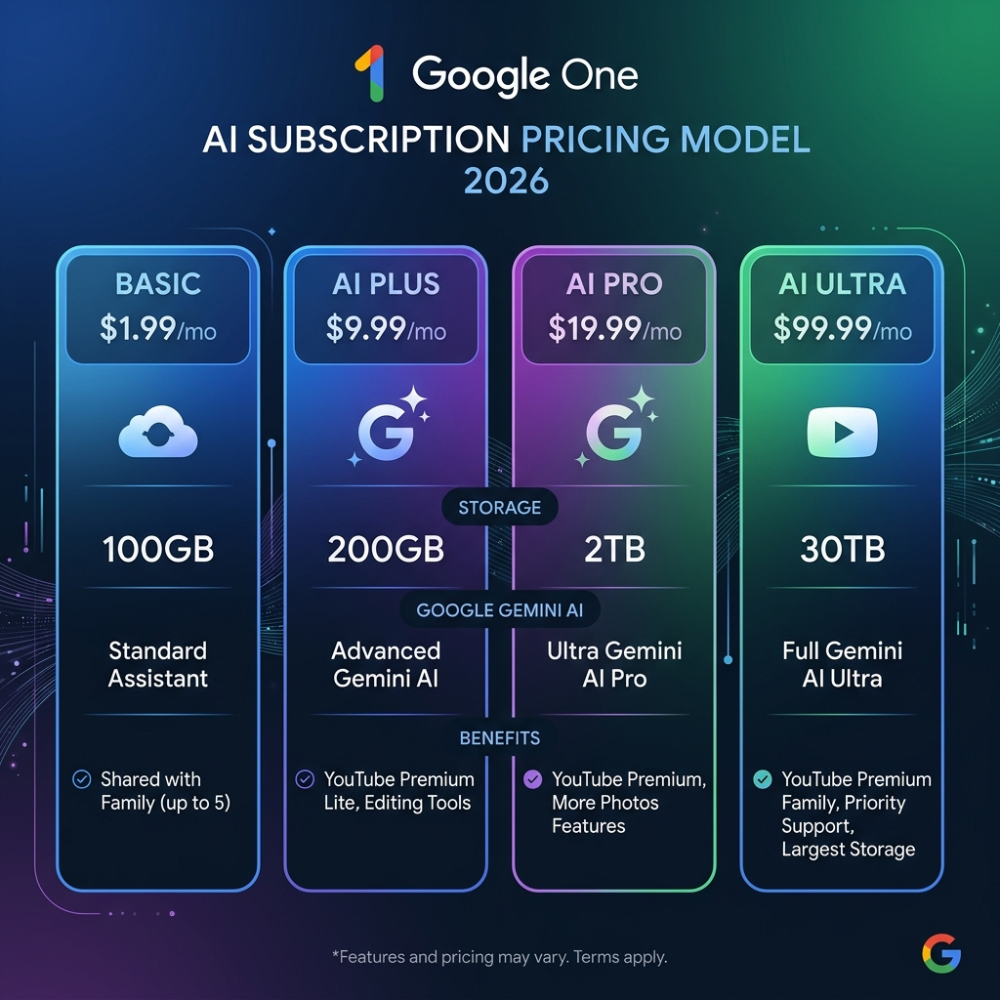

<strong>[BLUF]</strong>
Starting with Google I/O 2026, Google One has evolved from a simple cloud storage provider into an 'AI-centric subscription model.' This new system powerfully integrates Gemini's high-performance logic models with YouTube Premium benefits. It is time to carefully analyze your actual usage patterns and wisely choose the plan that best optimizes your productivity.

## 1. The End of Simple Cloud: The Dawn of an AI Ecosystem

Are you aware that Google One storage plans have undergone a massive overhaul? Following the Google I/O 2026 announcements, Google has completely restructured Google One storage into a **Google AI subscription framework**. This is a sophisticated platform lock-in strategy designed to move beyond merely renting data space and instead deeply integrate users into the ecosystem of Gemini, Google's hyper-scale multimodal model.

In the past, users considered Google One because they were "out of Drive space." Now, the new criteria for subscription is "how to organically combine Google Workspace with an AI assistant to maximize work productivity." To achieve this, Google isn't just bundling AI models; it's integrating them with popular digital services that subscribers use daily to fundamentally reduce the churn rate.

## 2. What Has Changed? (3 Key Transitions)

The 2026 overhaul can be summarized by three core changes.

### 2.1. Complete Realignment and Segmentation of the Lineup
Google has moved away from dry, capacity-based naming like 100GB, 200GB, or 2TB. The lineup is now clearly segmented into **Basic, AI Plus, AI Pro, and AI Ultra** based on the user's AI proficiency and task nature. Notably, the addition of the "AI Plus" tier for casual AI users and the "AI Ultra" tier for professionals requiring peak coding and reasoning performance is quite impressive.

### 2.2. Aggressive Bundling of Premium Benefits
Subscribers to the higher-tier AI Pro plan and above now receive **YouTube Premium (or the Lite package)** and Google Home Premium features as standard bundles. This is a clever reallocation of benefits that significantly increases the perceived discount rate compared to subscribing to these services individually.

### 2.3. Introduction of the 'Compute-used' Billing Model
Google has overcome the limitations of previous AI subscription models that relied on simple "per day" or "per hour" prompt limits. The newly introduced "Compute-used" model analyzes the difficulty of the operations requested by the user (e.g., simple text summarization vs. complex multi-step Python coding and debugging) and deducts usage weights accordingly. This effectively removes artificial barriers for users who use high-performance logic models for lighter tasks.

## 3. 2026 Pricing Comparison at a Glance

| Plan Name | Base Storage | Key Included Benefits | Target Audience |
| :--- | :--- | :--- | :--- |
| **Basic** | 100GB | Storage only (No AI) | Light users for smartphone photos and simple document backups |
| **AI Plus** | 200GB | Advanced Gemini (Limited) | Beginners wanting storage and light AI features at an affordable price |
| **AI Pro** | 2TB | Gemini 3 Pro, VPN, YouTube Premium (Lite), up to 6-person family sharing | Professionals and families using generative AI for work and coding |
| **AI Ultra** | 30TB | Gemini 3.1 Pro, Deep Think, $100/mo Cloud Credits | AI heavy developers, data scientists, and professionals with max storage needs |

## 4. Which Pick is Right for You?

In Google's meticulously crafted pricing matrix, which tier should you choose to avoid wasting monthly fixed costs? We can narrow it down to three options based on usage type.

### 4.1. Type A (Pure Cloud Users): **Basic (100GB)**
If your only goal is backing up smartphone photos or expanding the base capacity for personal Gmail and Drive, there is no need to switch to an expensive AI plan. The Basic plan maintains the lowest price tag by excluding AI features, making it the most practical defensive line against unnecessary tech subscription waste.

### 4.2. Type B (The Value-Conscious AI Beginner): **AI Plus (200GB)**
If high-performance AI subscription fees (often nearly $20-$30/month) have been a burden on your wallet, the newly established **AI Plus** is the clear alternative. At a practical price point of around $10/month, it is the optimal entry tier, offering 200GB of space and the ability to test the core features of the latest Gemini performance.

### 4.3. Type C (Work Efficiency & Family Sharing): **AI Pro (2TB)**
For smart workers who create slides, write bulk emails daily, and frequently generate code, I unhesitatingly recommend the **AI Pro** plan with 2TB of space. Beyond the storage, you can share the highest-grade AI features and YouTube Lite benefits with up to 6 family members, each using their own independent account. Since both storage and AI reasoning permissions are shared while respecting individual privacy, the actual cost per person becomes overwhelmingly low in a family setting.

## 5. Google's Grand Design: Is it Worth Subscribing?

On the surface, the 2026 Google One reform looks like a gift of various digital benefits to subscribers. In reality, it hides Google's "Big Picture" of completely binding users to the Google AI Workspace environment. Once a user experiences the convenience of Gemini deeply embedded in Gmail, Google Docs, and Slides, the "switching cost" to migrate to a competitor's simple cloud storage becomes very painful.

However, from a consumer perspective, this package integration is a powerful and pragmatic opportunity to consolidate multiple scattered subscriptions and eliminate redundant spending. I recommend calculating how high the share of Google apps is in your daily workflow and taking full advantage of new member promotions to pioneer a smarter IT subscription life.
