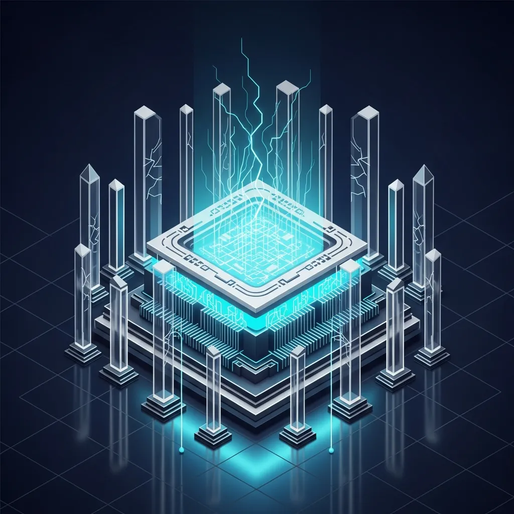

<strong>[BLUF]</strong>
SilverTorch achieves a 23.7x throughput increase through its "Index as Model" architecture, but this is a strategic choice that trades fault isolation and operational flexibility for pure performance. This leads to Operational Rigidity—where even minor filter updates require a full model redeployment—and turns the GPU into a Single Point of Failure (SPOF). For companies without absolute control over their infrastructure, the technical debt of surging management costs hidden behind the performance gains may outweigh the benefits.

Meta's recently announced SilverTorch (arXiv:2511.14881) is shaking up the industry with unprecedented performance figures for recommendation systems. Solving the computational bottlenecks of traditional Deep Learning Recommendation Models (DLRM) through hardware acceleration and architectural integration is undoubtedly an encouraging achievement.

However, from the perspective of an infrastructure architect looking behind the curtain, these dazzling numbers appear more like a warning sign. This is because the principles of "modularity" and "fault isolation" that we have upheld for decades have been discarded in an instant, sacrificing all flexibility for the sake of a single value: performance.

## Index as Model: The End of the Microservices Era for Recommendation Systems?

The core of the <a href="/en/glossary/index-as-model" class="glossary-tooltip" data-definition="An architecture that integrates all components of a recommendation system—such as indexing, filtering, and scoring—as layers within a single neural network model rather than separate services.">Index as Model</a> strategy is to absorb the complex, fragmented structures of the past into one massive neural network. This is essentially a declaration to fundamentally eliminate the massive network communication overhead that previously occurred in pipelines spanning retrieval, filtering, and ranking.

### Breaking the 100ms Barrier: The Technical Mechanism of 'Single Neural Network Integration'

SilverTorch employs a mechanism that performs index retrieval and filtering simultaneously within a single forward pass. This process dramatically reduces latency, successfully shattering the "100ms barrier"—a long-standing challenge in recommendation systems—with ease.

By integrating components that were physically separated into a single computational graph, data no longer needs to move back and forth between the host and the device. Consequently, the overall system response speed has increased exponentially, leading directly to an improved user experience.

### The Reality of Efficiency: GPU-Native Bloom Index and Int8 <a href="/en/glossary/what-is-ann" class="glossary-tooltip" data-definition="A search technology that, when searching for items most similar to a specific data point in a vast dataset, uses mathematical algorithms to quickly find approximations within an acceptable margin of error instead of conducting an exhaustive search.">ANN</a> Kernels

Meta focused on drastically reducing GPU memory footprint through dedicated kernel optimizations. In particular, the combination of Approximate Nearest Neighbor (ANN) search using Int8 precision and GPU-native Bloom indices is a prime example of maximizing actual computational efficiency.

These low-level optimizations go beyond just writing good software code; they are designed to exploit the parallel processing characteristics of GPU hardware to the limit. Empirical case studies show that this structure provides a robust foundation for maintaining steady performance even with industry-scale massive datasets.

## Strategic Warning: Three Critical Risks Hidden by SilverTorch

Amidst the intoxication of performance, we must not forget that all these gains come at the high price of abandoning <a href="/en/glossary/fault-isolation" class="glossary-tooltip" data-definition="A design principle that logically or physically separates system components so that a failure in one part does not spread to the entire system.">Fault Isolation</a>. The risk of the entire system grinding to a halt if just one part fails has become a reality.

> "SilverTorch is a regression to a 'Giant Monolith' that trades architectural flexibility for performance, which can be a fatal risk in typical enterprise environments where fault isolation is essential."

### Operational Rigidity: The Redeployment Nightmare Triggered by Minor Filter Updates

The biggest issue arises from "Operational Rigidity." In a traditional structure, changing a single piece of business logic or a filter rule only required updating the relevant microservice. In SilverTorch, even a minor change means retraining or redeploying the entire massive model.

This is a fatal weakness in modern business environments where agility is paramount. As model deployment cycles lengthen, the speed of responding to market changes slows down, and the fatigue of operations teams will increase exponentially.

### Resource Monopoly and Lack of Fault Isolation: The GPU as a Single Point of Failure

With all logic concentrated on a single GPU, the GPU has become more than just an accelerator; it is now the "Single Point of Failure (SPOF)" holding the fate of the entire system. A small memory error in the index retrieval layer could paralyze the entire ranking and filtering process.

From a resource allocation perspective, this is also concerning. As the GPU takes over business logic processing, other computational tasks are pushed out in the competition for resources, ultimately undermining the stability of the entire infrastructure.

### Degraded Hardware Flexibility: Depriving Opportunities for CPU-GPU Hybrid Optimization

The decision to make system survival entirely dependent on specific hardware—especially expensive GPU resources—blocks any opportunity to utilize hybrid infrastructure. The waste of costs incurred by forcing logic into a GPU that a CPU could handle more efficiently cannot be ignored.

Is this structure, which mandates only high-performance GPUs instead of a flexible architecture that allocates tasks to the right places, a sustainable model for companies that lack Meta's capital? The answer is likely negative.

## Conclusion: Meta's Choice for Ultra-High Performance Might Be 'Poison' for Average Enterprises

The overwhelming numerical performance shown by SilverTorch is technically marvelous. However, behind those numbers lies a mountain of operational risks that we call technical debt.

| Item | Traditional Microservices (CPU-centric) | SilverTorch (GPU Native) | Analytical Perspective (Risk) |
| :--- | :--- | :--- | :--- |
| Throughput | 1.0x (Baseline) | Up to 23.7x Improvement | Maximized infra-intensive processing efficiency |
| Latency | Communication overhead exists | 5.6x Reduction (Sub-100ms) | Complete elimination of data movement overhead |
| Operational Flexibility | High (Individual module updates) | Very Low (Model-unit deployment) | Operational Rigidity occurs |
| Cost Efficiency (TCO) | 1.0x (Baseline) | 13.35x ~ 20.9x Improvement | Hardware dependency and SPOF risk |

> "Technical debt does not just mean code becoming complex; it starts with decisions that make system survival entirely dependent on specific hardware characteristics (GPU Native)."

Adopting this without fully considering the architectural trade-offs is dangerous. It is time to look at the core data of SilverTorch again and soberly judge whether your organization truly needs "23x speed" or "stable operations."

* According to the arXiv:2511.14881 paper, SilverTorch recorded a 23.7x throughput improvement and 5.6x lower latency compared to existing SOTA.
* It demonstrated a cost-efficiency (TCO) improvement of approximately 13.35x to 20.9x compared to CPU-based solutions and was accepted into SIGIR 2026.
* However, these achievements shown in an evaluation of 80M items may be optimization results possible only in Meta’s highly controlled, specialized infrastructure environment.

Ultimately, SilverTorch is a double-edged sword. Only companies prepared to handle the risks of operational rigidity and the lack of fault isolation hidden behind immense performance will be able to wield this powerful tool effectively.

## 🔗 Recommended Reading
- [Cloudflare's PQC Declaration and the 'Half-Shield': Why Defending Against Harvest Now, Decrypt Later (HNDL) Isn't Enough](/en/posts/cloudflare-pqc-hndl-defense)
- [The Paradox of Zero Trust Implementation: Is Your Security Network a Fortress or a Shackle?](/en/posts/zero-trust-implementation-paradox)