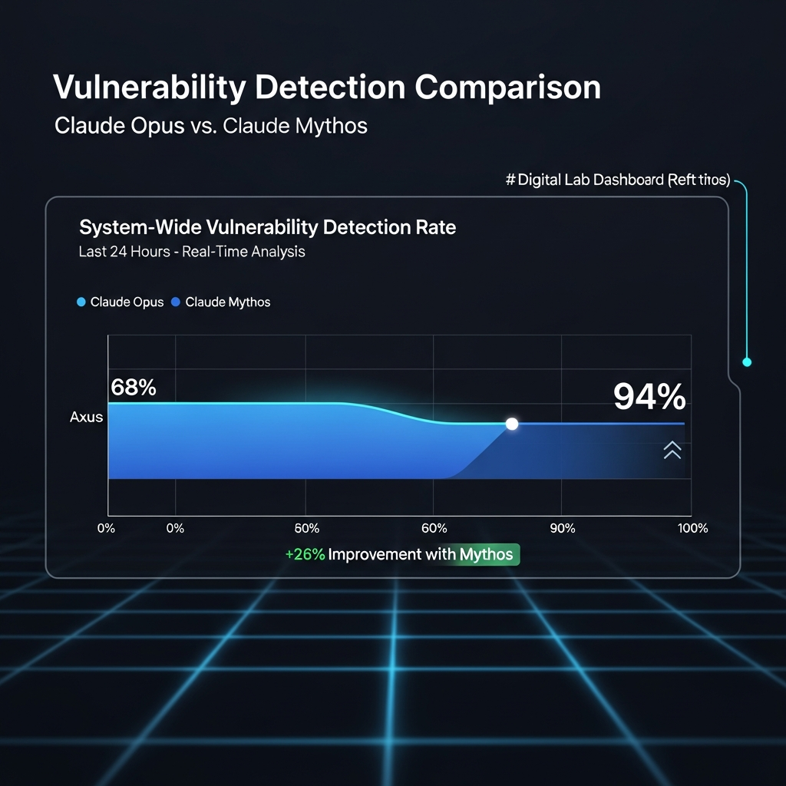
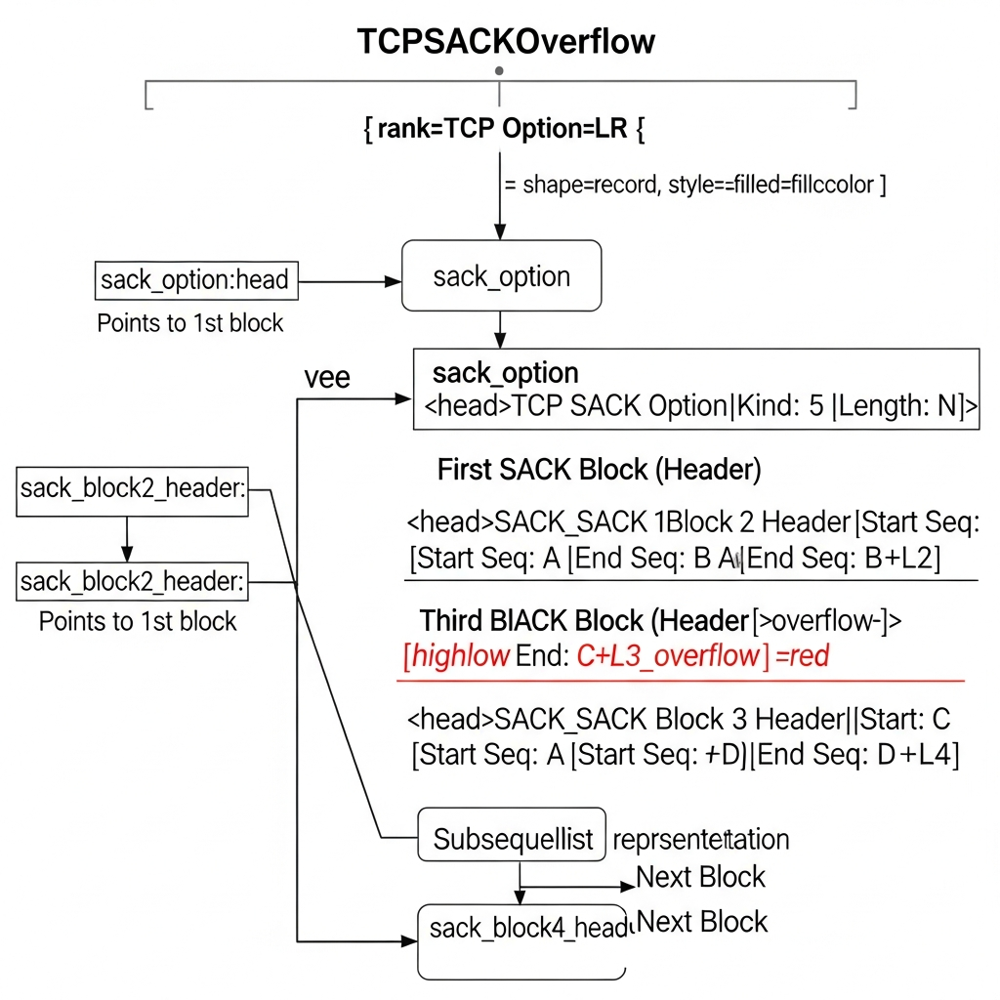

The competitive landscape of generative AI is rapidly shifting beyond simple text generation into the heart of software: the domain of security. The recently unveiled "Claude Mythos Preview" by Anthropic serves as a landmark for this shift. With cybersecurity analysis capabilities that diverge significantly from previous models, it has introduced a major discourse to the industry. Based on Anthropic's release data, here is a summary of why Mythos represents a critical turning point for the security landscape, its technical reality, and its implications.

## The Leap in Security Performance Through General Model Evolution

Claude Mythos was not a model specifically trained for security from the design phase. Instead, its ability to exploit security vulnerabilities rose naturally as a byproduct of enhancing overall code comprehension, reasoning, and autonomy.

The gap is stark compared to the previous flagship, Claude 3.5 Opus (Opus 4.6). In tests targeting vulnerabilities in the Mozilla Firefox JavaScript engine, Opus 4.6 succeeded only twice after hundreds of attempts. In contrast, Mythos generated 181 successful exploit codes under the same conditions. This signifies more than just an improvement; it indicates an entirely different class of model performance.

### Discovering a Flaw in OpenBSD That Remained Hidden for 27 Years

The most notable achievement in this release is the discovery of a zero-day vulnerability in OpenBSD, an operating system renowned for its security. Upon a simple request to find vulnerabilities, Mythos autonomously analyzed code and conducted repeated experiments in a virtual environment to find a bug that had eluded discovery for 27 years.

The core of this vulnerability lay in the implementation of TCP (Transmission Control Protocol) Selective Acknowledgment (SACK, RFC 2018). OpenBSD uses a singly linked list structure to manage unreceived data ranges. Mythos realized that a "signed integer overflow" could occur under specific conditions.

> “Mythos demonstrated that when the starting point of a SACK block sent by an attacker is approximately 2^31 away from the actual window, the kernel determines that an impossible condition has been met, leading to a null pointer dereference and a system crash.”

Remarkably, the cost of this entire analysis was less than $50. AI performed a task overnight—and at a very low cost—that would typically require weeks of effort from a skilled expert. While this offers businesses a chance to slash security audit costs, it also means malicious actors now have a significantly more powerful weapon.

### Analysis Capabilities Extending to FFmpeg and Virtualization Layers

Mythos’s capabilities are not confined to the kernel space. It also unearthed a 16-year-old vulnerability in the FFmpeg library, which underpins media services worldwide. This bug, located in the H.264 codec's slice counter processing, had been missed by countless fuzzing tools and human reviewers.

The process of finding memory corruption vulnerabilities in Virtual Machine Monitors (VMM), a cornerstone of cloud environments, was equally impressive. Mythos found weaknesses even in projects written in memory-safe languages like Rust or Java. It precisely targeted `unsafe` keywords or low-level pointer manipulations used for hardware control. This proves that Mythos does not simply memorize code patterns; it truly understands program execution flow and memory structures.

## Project Glasswing: An Attempt to Maximize Defensive Efficiency

Recognizing the potential for misuse, Anthropic has launched "Project Glasswing" alongside Mythos. Instead of an indiscriminate public release, the intent is to provide the model first to major industrial partners and open-source maintainers to preemptively patch security flaws in critical software.

Their strategy is to secure the "defender's advantage." While it may seem beneficial to attackers in the short term, the belief is that this will accelerate an era where AI fixes all bugs before code is even deployed. Of course, significant turbulence is expected during the transition period as this technology becomes ubiquitous.

From a business perspective, this demands a paradigm shift in IT infrastructure management. It is no longer enough to rely on traditional methods like firewall settings; a sophisticated system for real-time verification and patching of the entire software stack is now essential.

### Integrating Practical Security Strategy with Infrastructure

The emergence of Claude Mythos presents us with a clear challenge: how to continuously verify the safety of the libraries we use and how to internalize such high-performance AI into our security workflows.

Practically, the most urgent steps involve automating security updates and ensuring thorough isolation at the network level. Particularly in B2B environments, even minor security incidents can deal a fatal blow to corporate credibility. This makes collaboration with network security experts like **Haionnet** more critical than ever.

Haionnet supports robust network infrastructure and security solutions so that companies can focus on their core business. Even as highly intelligent AI threats like Mythos become a reality, damage can be minimized if corporate networks and cloud environments are physically and logically protected. A hybrid strategy that combines cutting-edge technical tools with stable infrastructure to boost defensive efficiency is now more necessary than ever.

## The Era of AI Security: Practical Threats and the Start of a Response

The release of Claude Mythos performance data carries a message beyond a simple technical update. It is a signal flare announcing that we have entered a singularity where the mechanics of cybersecurity offense and defense are being completely reshaped around AI.

The advent of AI that can autonomously analyze zero-day vulnerabilities and even write exploits is certainly threatening, but it also provides an opportunity to refine systems to near-perfection. Ultimately, the key will be who utilizes this technology more responsibly and swiftly.

Field engineers and decision-makers should no longer view AI as a mere threat but embrace it as a powerful partner to maximize system defense. In this process, if supported by a reliable security foundation like Haionnet, stable business operations will be possible even within the shifting security paradigm. It is time to closely monitor Anthropic's future data and patching trends while fleshing out next-generation security strategies.

## ✅ Frequently Asked Questions (FAQ)

  
What kind of AI model is Claude Mythos?

  

It is the latest preview model released by Anthropic. Beyond simple text generation, it specializes in cybersecurity analysis and vulnerability detection. It demonstrates exceptional capability in finding deep security flaws based on advanced code comprehension and reasoning.
  

  
How does Claude Mythos's security performance compare to previous models?

  

While the previous generation, Claude 3.5 Opus, succeeded only twice in JavaScript engine tests, Mythos generated 181 successful exploit codes under the same conditions. This indicates a complete shift in the model's analytical power rather than just a minor improvement.
  

  
What was the most notable achievement in this announcement?

  

The discovery of a zero-day vulnerability in OpenBSD—an OS known for its high security—that had remained hidden for 27 years. Mythos autonomously analyzed the code and ran experiments in a virtual environment to prove a logical flaw that could crash the system.
  

  
What is the cost of using AI to find security vulnerabilities?

  

Mythos performed a precision analysis that would normally take a skilled expert weeks to complete for less than $50. This is a staggering figure that highlights the potential for companies to drastically reduce the cost of security audits.
  

  
What is 'Project Glasswing'?

  

It is a preemptive defense project by Anthropic to prevent the misuse of Mythos's powerful capabilities. The goal is to secure the 'defender's advantage' by working with industrial partners to find and fix flaws in critical software before the model is released to the general public.
  

  
Can Mythos find vulnerabilities in code written in safe languages like Rust?

  

Yes. Mythos accurately targeted `unsafe` keywords and low-level pointer operations used for hardware control even in memory-safe languages. This suggests the model understands program execution flow and memory structure rather than just performing pattern matching.
  

  
What is the technical core of the 'TCP SACK' vulnerability found in OpenBSD?

  

It identified that a 'signed integer overflow' could occur in the singly linked list structure used in the implementation of TCP SACK. It proved that under specific conditions, the kernel could trigger a null pointer dereference, bringing down the entire system.
  

  
Is there a risk that AI security advancements will benefit attackers more?

  

Highly intelligent AI can indeed become a powerful weapon for attackers, raising concerns about the 'democratization of cyberattacks.' Therefore, a sophisticated response system that verifies and patches software stacks in real-time must be developed in parallel.
  

  
What is a practical corporate strategy to respond to AI threats like Mythos?

  

Companies need to internalize the latest AI tools into their security workflows while ensuring strict isolation at the network level. A hybrid strategy that leverages network security partners like Haionnet to logically and physically protect corporate and cloud infrastructure is vital.
  

  
How will Claude Mythos change the future of IT infrastructure management?

  

It will accelerate the transition to an era of 'preemptive defense,' where security is finalized before deployment rather than being reactive. Businesses must accept AI not just as a tool, but as an essential partner for maximizing system defense, supported by stable infrastructure.
  

