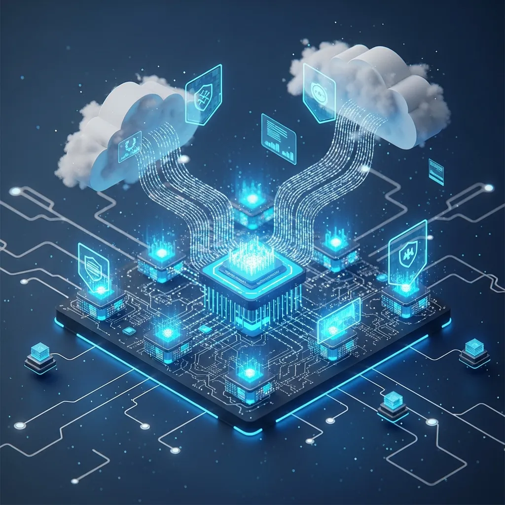
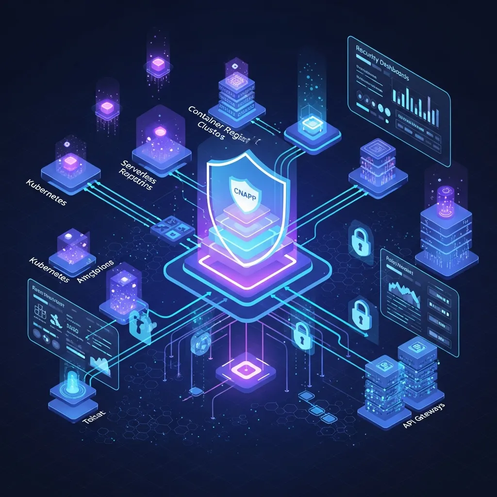
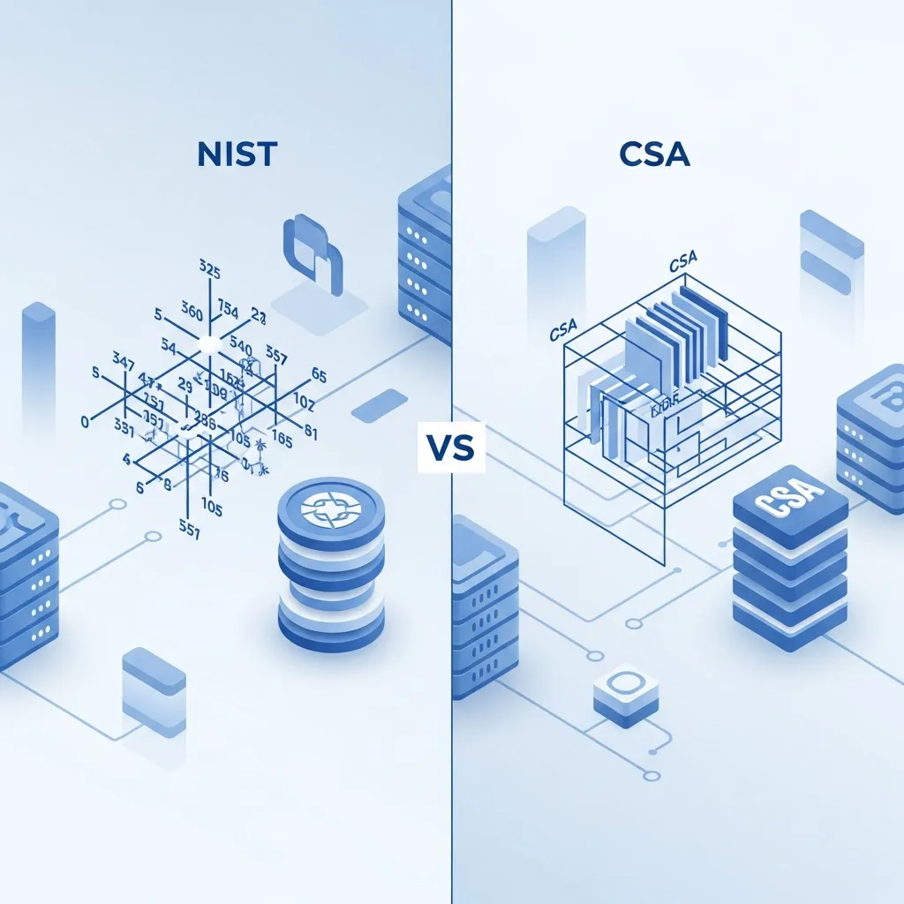

The convergence of Cloud computing and Artificial Intelligence has rendered enterprise infrastructure more complex than ever. Operating AI models reliably across environments interwoven with thousands of containers and data pipelines has become a primary challenge for practitioners. In this landscape, the most critical topic is 'Cloud-Native AI Security.' To fully leverage AI performance while maintaining agility, a security approach of a different dimension is required. Based on the CNCF whitepaper and major security frameworks, we have summarized the security challenges and response strategies currently facing enterprises.

## The Emergence of New Threat Models with the Expansion of AI Workloads

Recently, the CNCF (Cloud Native Computing Foundation) Technical Oversight Committee (TOC) published the 'Cloud Native AI Security Whitepaper,' highlighting the urgency of securing AI workloads. In a Cloud-native environment, AI systems have evolved beyond simple tools to become the core of decision-making. If these systems are compromised, it could shake the very foundation of business operations, far beyond simple data breaches. Specifically, attempts to manipulate model prediction results or steal model weights—a core piece of intellectual property—can deal fatal blows to a business.

What deserves particular attention here are threat models specifically tailored to AI. While traditional security focused on server availability and simple access control, we must now defend against attacks like Data Poisoning and Model Extraction. Data Poisoning involves injecting malicious data during the training phase to cause the model to make incorrect decisions in specific scenarios, which is extremely difficult to detect with standard firewalls alone. Ultimately, securing integrated visibility across the entire Cloud infrastructure is the cornerstone of this security architecture.

## CNAPP Integrated Management and Real-time Defense Strategies using eBPF

The concept of CNAPP (Cloud-Native Application Protection Platform) has emerged to manage complex security threats. CNAPP integrates previously siloed functions such as posture management (CSPM), workload protection (CWPP), and entitlement management (CIEM) into a single platform. Given that AI workloads run on massive GPU clusters and distributed Kubernetes nodes, the role of CNAPP—enabling monitoring from a single console—is bound to become even more vital.

Digging deeper into the technical aspects, runtime monitoring utilizing eBPF (Extended Berkeley Packet Filter) serves as a practical solution. By analyzing events occurring at the kernel level while the AI model is operating, it can capture abnormal access to model weight files or anomalies in API call patterns in real-time. For instance, if a specific container sends an unusually high volume of read requests to object storage containing training datasets, it can be flagged as a data exfiltration attempt and blocked immediately. Building such a security environment using specialized services like Haionnet allows for the application of Zero Trust principles from the network infrastructure level, effectively neutralizing external threats.

> "Cloud-native AI security is more than just adopting tools; it is a process shift that ensures the integrity of the entire lifecycle, from development to operations."

## Utilizing NIST and CSA Frameworks for Establishing Governance

In addition to technical protection measures, establishing a governance framework is essential. In 2025, the U.S. NIST (National Institute of Standards and Technology) and the CSA (Cloud Security Alliance) presented specific guidelines for AI security. NIST’s COSAIS (Control Overlay for AI Systems) is characterized by extending the existing SP 800-53 standards to fit AI environments. This is useful for public institutions or large enterprises already following NIST standards to naturally integrate AI security into their existing processes.

On the other hand, the CSA’s AICM (AI Control Matrix) is optimized for a Cloud-native perspective. It provides 243 specific control items across 18 domains and clearly defines the 'Shared Responsibility Model' for each entity, from model providers to application developers. For example, while the Cloud Service Provider (CSP) is responsible for infrastructure security, the enterprise must focus on input validation for deployed models and defending against prompt injection. Using these two frameworks complementarily allows an organization to build a more robust security system.

## The Importance of a Practical Security Roadmap and Infrastructure Partnerships

At this stage, the core of Cloud-native AI security is the combination of 'Shift-Left' and 'Runtime Protection.' It is necessary to create a structure where configuration errors are corrected through IaC (Infrastructure as Code) scanning in the early development stages, while AI-based detection systems continuously monitor during the operational stage. However, implementing this perfectly across complex network paths and multi-Cloud environments is no easy feat.

To solve these technical difficulties, leveraging the capabilities of partners like Haionnet is one effective strategy. By combining stable dedicated lines with powerful security solutions, enterprises can reduce the burden of security and establish a foundation to focus more on AI innovation itself. The threats hidden behind the possibilities brought by AI technology are a very real problem. It is now time to establish and execute security strategies optimized for Cloud-native environments. When the depth of security matches the speed of technological advancement, a true digital transformation will be achieved.
