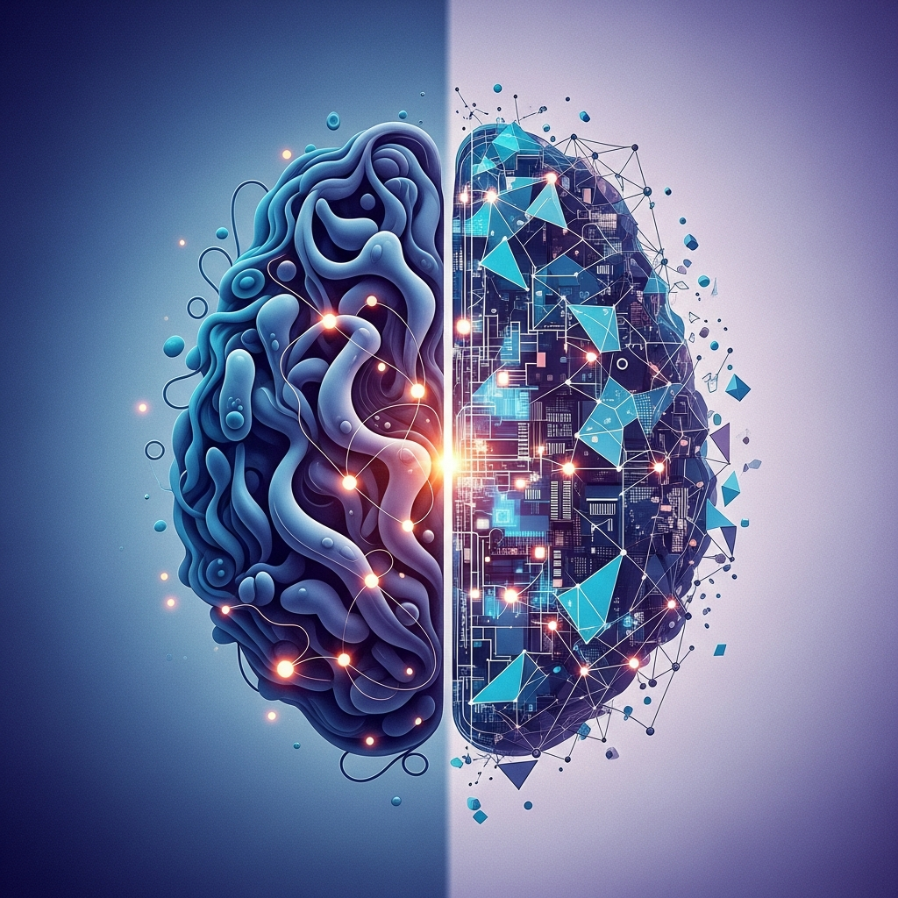

The reason we consume massive amounts of information daily yet fail to retrieve it when needed is the high "cost of organization." No matter how sophisticated a tool you adopt, knowledge remains fragmented if you cannot overcome the barrier of "bookkeeping"—the manual labor of classifying and connecting information. Recently, Andrej Karpathy, former Director of AI at Tesla, proposed the "LLM-Wiki" pattern as a solution to this chronic problem. His suggestion is to build a self-evolving personal knowledge base powered by AI.

Karpathy recently revealed that he is spending more tokens on building his personal knowledge repository than on writing code. The core idea is to move beyond chatbots that simply answer questions and strive for a "Persistent Wiki" that incrementally accumulates knowledge. This can be seen as an attempt to address the structural limitations of the traditional RAG (Retrieval-Augmented Generation) approach.

****

## Knowledge Compilation: Complementing RAG's Volatility

Currently, most AI-driven document utilization relies on RAG. When you upload numerous files, the AI finds relevant "chunks" to generate an answer. Features like ChatGPT's file upload or Google’s NotebookLM are prime examples. However, the downside of this method is that information does not "accumulate."

Even if you ask the same question, the AI must re-extract information from the original source every time. For complex queries requiring the synthesis of information scattered across multiple documents, the AI repeats the effort of piecing together fragmented data. In contrast, LLM-Wiki operates on the concept of "compiling" knowledge in advance. When new information arrives, the AI understands the context of the existing wiki, updates the content, and automatically generates cross-references between documents. Over time, knowledge doesn't evaporate; it builds up like compound interest.

****

## A Three-Layer Structure Ensuring Data Integrity and Expansion

LLM-Wiki consists of three layers with clearly defined roles, a design intended to ensure both system stability and scalability.

The first is the **'Raw Sources'** layer. This includes original data such as collected articles, papers, and meeting minutes. This data must remain "immutable." The AI only reads the information without modifying it, serving as the "Source of Truth" that maintains data integrity.

The second is the core space, **'The Wiki'** layer. The AI reads the raw sources to create summaries or individual pages for specific concepts. For example, if you add an article about Anthropic, the AI finds existing "AI Companies" and "Claude" pages, appends the new information, and links them. The user only needs to verify the final output; the writing and maintenance are handled by the AI.

The third is **'The Schema'** layer. These are files that provide system operation guidelines to the AI. Similar to `CLAUDE.md` in Claude Code, it acts like the settings of an operating system, defining the wiki's structure, link formats, and styling.

> "The Wiki is a persistent, compounded artifact. Cross-references are already organized, contradictions are flagged, and synthesis is already reflected." - Andrej Karpathy

****

## Streamlining Knowledge Management through Automated Bookkeeping

The most difficult part of operating a Personal Knowledge Management (PKM) system is not the act of writing notes, but the process of managing them. Finding and connecting related past records and cleaning up duplicates requires significant cognitive overhead. LLM-Wiki performs three core tasks to minimize this cost.

First is **Ingest**. When a new source is entered, the AI analyzes it and updates relevant wiki pages simultaneously. What would take over an hour to process manually is completed in seconds. Next is **Query**. Valuable answers obtained by querying the wiki can be immediately saved as new wiki pages. Exploration directly leads to knowledge accumulation.

Finally, **Linting** is key. Just as errors are detected in programming code, the AI checks the entire wiki for contradictions between information or broken references. This can be described as a regular health check for your knowledge repository.

****

## Technical Stack Based on Markdown and Hybrid Search

This system is practical because it utilizes the universal Markdown format. It creates significant synergy when combined with tools like Obsidian. Karpathy likened Obsidian to an "IDE (Integrated Development Environment)," the LLM to the "Programmer," and the Wiki to the "Codebase."

From an implementation standpoint, the use of **YAML Frontmatter** is noteworthy. By inserting structured metadata such as `tags`, `date`, and `source_count` at the top of files, you can generate dynamic dashboards via Obsidian's "Dataview" plugin. The AI moves beyond text writing to act as a database architect.

To improve search efficiency, a hybrid approach mixing the **BM25** algorithm and vector search is used. For a personal wiki, BM25—a keyword-based probabilistic retrieval model—is often sufficient to secure accurate context. By connecting an **MCP (Model Context Protocol)** server that helps the AI call tools directly, the AI can freely perform tasks ranging from reading/writing local files to real-time information retrieval.

****

## Vigilance Against Model Collapse and the Outsourcing of Thought

Of course, LLM-Wiki is not a magic bullet. The tech community has raised ongoing concerns about "Model Collapse." If the process of AI summarizing and learning from AI-generated outputs repeats, there is a risk that information will lose specificity and quality will degrade toward a mediocre average.

Cognitive side effects must also be considered. The process of writing and organizing is not just about keeping records; it is an exercise in structuring one's thoughts. If all organization is left to AI, the wiki may become rich in content, but the user may experience the "outsourcing of thought," where no actual knowledge remains in their mind.

Nevertheless, the LLM-Wiki pattern remains valid because the amount of information an individual must handle has passed a critical threshold. We have entered an era where it is physically impossible for a human to classify all information manually.

****

## Practical Advice for Sustainable Knowledge Management

LLM-Wiki is more of a design pattern than a finished product. Rather than building a massive system from the start, I recommend applying it incrementally to small areas.

First, try creating an Obsidian Vault for a specific research topic or reading notes. Then, assign a "Wiki Manager" persona to Claude or ChatGPT and let it handle document summarization and linking. The most important thing is to maintain a **"Human-in-the-loop"** structure where the human performs the final review of the output rather than delegating full authority to the AI.

The essence of technology is not to think instead of humans, but to remove repetitive labor so that humans can focus on essential reasoning. LLM-Wiki is a promising methodology that will free us from tedious management tasks and realize the compound interest effect of knowledge. Start turning your knowledge into an asset through your own AI librarian.

## ✅ Frequently Asked Questions (FAQ)

  
What exactly is an LLM-Wiki?

  

An **LLM-Wiki** is a way to use AI as a smart **"Librarian"** rather than just a simple search bar. When you feed various materials into a folder, the AI reads and summarizes the documents and connects related content via links, incrementally building your own personal encyclopedia.

  

  
How is it different from just uploading a file to ChatGPT and asking questions?

  

Typical AI conversations (the RAG method) require the AI to sift through documents from scratch every time you ask a question, and once the conversation ends, the knowledge is scattered. In contrast, LLM-Wiki **"pre-saves (compiles)"** what the AI has analyzed into Markdown pages. Therefore, as you ask more questions, knowledge isn't forgotten but keeps building up like compound interest.

  

  
Do I have to manually set links and organize all the documents?

  

No! Personal knowledge management is difficult because of the tedious "maintenance" work—updating links and revising summaries. In an LLM-Wiki, the tireless **AI handles all these repetitive tasks**. The human only needs to focus on the "thinking role," such as choosing which materials to include and asking the AI questions.

  

  
How is the system structured? Is it complicated?

  

It consists of a very simple three-layer structure:
*   **Raw Sources:** The original folder of collected materials like internet articles, papers, and memos. The AI only reads these and does not modify them.
*   **The Wiki:** Markdown documents that the AI writes by summarizing and organizing the raw sources.
*   **The Schema:** Guidelines (configuration files) that tell the AI, "Organize it like this!"

  

  
What does the AI do automatically when I add data?

  

When you put new material into the source folder, the AI reads it and creates a core summary (Ingest stage). The amazing part is that even if you just add a single document, the **AI finds 10 to 15 existing wiki pages it previously created and updates and links them simultaneously.**

  

  
What software do I need to use this?

  

The most recommended tool is **Obsidian**, a note-taking application. Using its "Web Clipper" feature allows you to save internet articles with a single click, and Obsidian's "Graph View" lets you visually see the network of relationships between the pieces of knowledge the AI has automatically connected.

  

  
What is the best use case for this?

  

It is good for any activity where information accumulates over time:
*   Personal records such as journals, health, and goals.
*   Long-term research involving months of gathering papers and data.
*   Reading notes for organizing characters and world-building while reading books.
*   Team wikis for organizing meeting minutes or Slack conversations at work.

  

