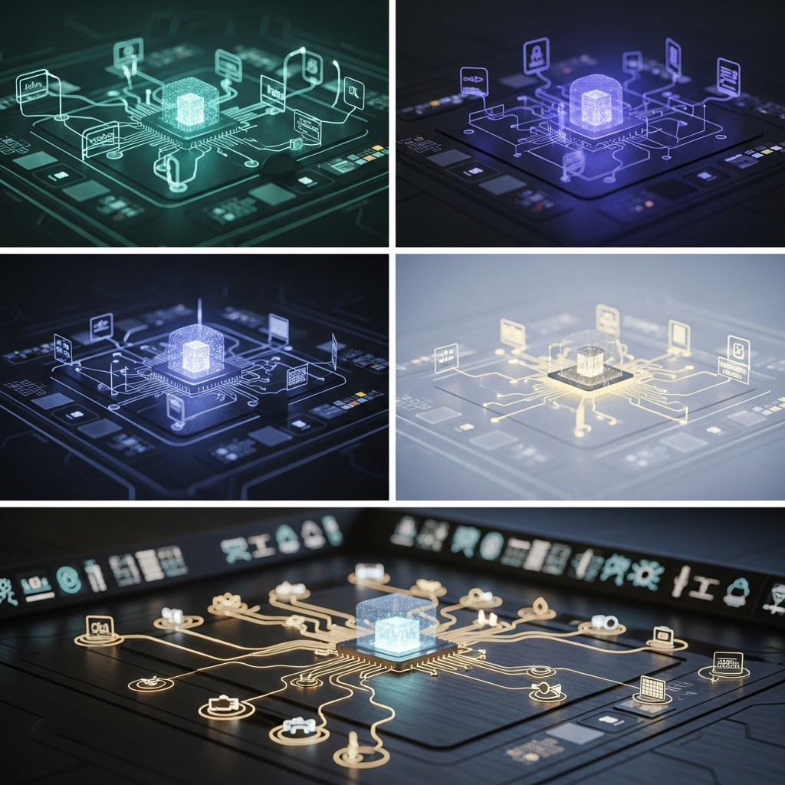
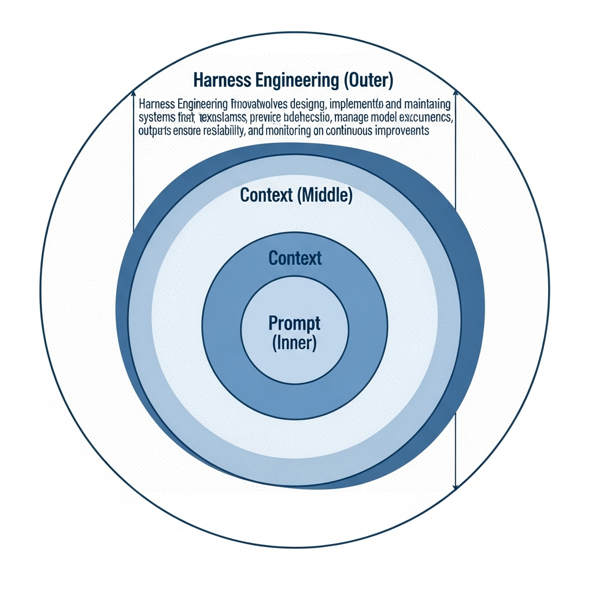
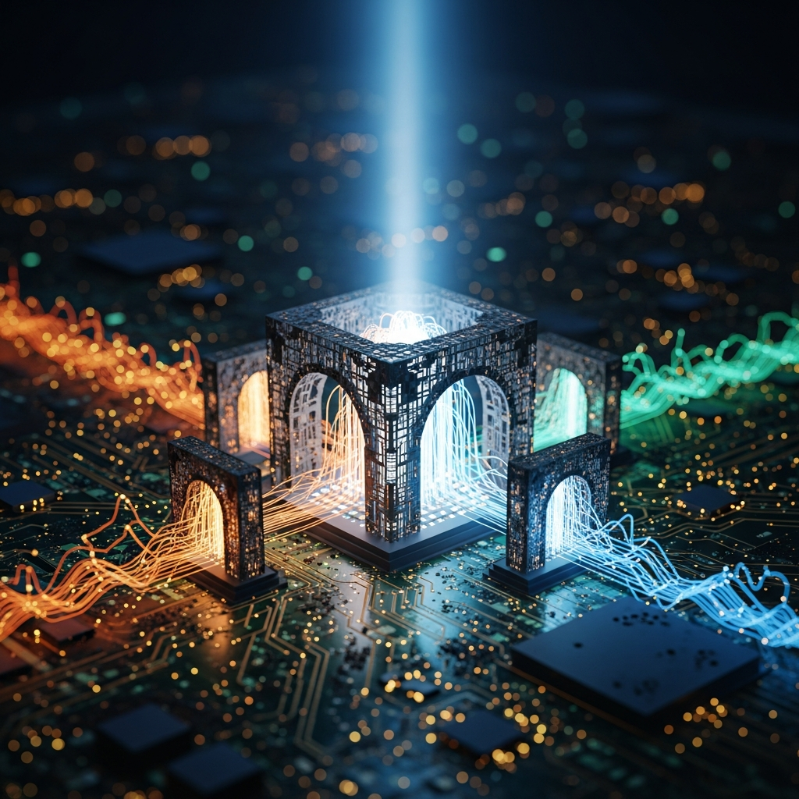

The way we utilize AI is evolving rapidly. Previously, the focus was on Prompt Engineering—determining "what questions to ask to get the desired answer." Today, the practical discourse has shifted to "how to ensure AI performs tasks safely without deviating from established rules." This is where the concept of **Harness Engineering** is gaining significant attention.

****

## Moving Beyond the Art of Questioning to Environmental Design

A "harness" refers to the reins used to control a horse or a safety belt used in climbing. The essence of Harness Engineering is identical. It involves designing a "systemic fence" that controls powerful AI models, preventing unexpected behavior and ensuring they move only in the intended direction.

The difference becomes clear when compared to existing methodologies. While Prompt Engineering consists of "direct commands" given to an AI, and Context Engineering involves providing "data" for reference, Harness Engineering is the domain of building the "business rules and infrastructure" in which the AI operates. This includes repository structure design, CI (Continuous Integration) environment configuration, external API access management, and strict restrictions on output data formats—essentially every control environment operating outside the agent itself.

An experimental case announced by OpenAI last February highlights the importance of this concept. They succeeded in developing production-grade software using only AI agents without human code intervention. The core of that success lay not just in the model's intelligence, but in a meticulously crafted harness environment that prevented the agent from veering off course.

****

## Control Loops and Sandboxes: Technical Pillars of Stability

Harness Engineering goes beyond simply providing guidelines. In practice, it is implemented through two major technical pillars.

First is **State-based Guardrails**. By applying Finite State Machine (FSM) algorithms, developers define the current stage of the AI agent and create a logical structure to verify the mandatory conditions required to move to the next stage. For example, before an agent issues a command to delete information from a database, the system forcibly verifies whether it has passed through specific states such as 'Target Confirmed' and 'Backup Completed.' This prevents accidents caused by the AI skipping logical steps.

Second is the combination of a **Sandboxed Execution Environment** and **RBAC (Role-Based Access Control)**. Code generated by an AI agent is designed to execute only within an isolated container environment, not on the actual production server. Simultaneously, the API call permissions granted to the agent must be granular. Instead of simply "Allowing Network Access," the core task is to establish control protocols that only allow 'GET' requests for specific domains or grant 'Read' permissions only for specific DB tables.

> "Every time an agent makes a mistake, design the system so it can never make that mistake again." - Mitchell Hashimoto

Only when these structural safeguards are in place does AI gain the "reliability" required for deployment in commercial services. We have reached a point where engineering judgment is needed to take responsibility for overall system availability and security, moving beyond merely increasing answer accuracy.

****

## Why Harness Design is Essential in the Field

The primary reason companies hesitate to adopt AI is "unpredictability." Incidents where chatbots promise incorrect compensation to customers or leak internal secrets can deal a fatal blow to a business. Harness Engineering brings these risks within a controllable range.

1. **Structural Suppression of Hallucinations**: To prevent AI from fabricating information, it is forced through a data-driven fact-check loop before outputting any response.
2. **Security and Regulatory Compliance**: In strictly regulated fields like finance or healthcare, control is exercised at the architectural level to ensure AI operates within privacy protection principles.
3. **Operational Cost Optimization**: Efficient harness design prevents AI from redundantly calling APIs or falling into infinite loops, thereby reducing cloud costs.

When choosing a technology partner, the focus of your questions must change. "Which model do you use?" is no longer the core issue. Models are components that can be replaced with better ones at any time. Instead, you must verify **"how they are designing the harness structure to control the AI's unexpected behavior."** You need to see if they have the capability to create a "real tool" that works safely within a business workflow, rather than just a flashy chatbot.

****

## Shifting from Model-Centric to System-Centric

The rise of Harness Engineering signifies that the center of gravity in AI development has shifted from the model itself to the "entire system." In the future, the sophistication of the control environment surrounding a model will determine the quality of the service more than the performance delta between language models. This is why leading companies like Anthropic and LangChain are focusing on sharing technologies related to harnessing.

If you are preparing for a successful AI integration, you must now allocate a portion of your time from refining prompts to designing the harness. Building a robust architecture for exception handling and designing security hooks for when AI uses external tools will become your core competitive advantage.

When considering professional AI implementation, it is wise to look for partners who excel in exception handling, security, and stable architectural design rather than those merely focused on feature implementation. In Korea, teams like **Toktokhan-Dev** are creating substantial business value through designs based on Harness Engineering. They focus on building the "environment" so that AI agents can perform optimally within corporate guidelines, going beyond simple API integration.

We have moved past the era of writing code directly into an era of designing optimal environments where AI can work safely. Harness Engineering will be the most practical and powerful tool supporting this trend. Does your AI agent have a secure harness today?

## ✅ Frequently Asked Questions (FAQ)

  
What exactly is Harness Engineering?

  

It is the technology of designing a "systemic fence" that controls AI models so they perform tasks safely without deviating from set rules. It means building the entire infrastructure and business logic environment in which the AI operates, rather than just improving the performance of the model itself.

  

  
Why is the word 'Harness' used in this technology's name?

  

A harness refers to a horse's reins or a climbing safety belt. It serves as a metaphor for the control mechanisms that prevent a powerful AI from exhibiting unexpected behavior. It represents the safety device that helps the AI agent move safely only in the direction we intend.

  

  
Why has Harness Engineering recently become important in the AI industry?

  

It is to control the "unpredictability" and risks that companies fear most when introducing AI into actual services. Moving beyond increasing answer accuracy, designing for overall system availability and security has become a critical practical issue.

  

  
What are the two core technical pillars of Harness Engineering?

  

They are 'State-based Guardrails,' which verify the AI's logical steps, and 'Sandboxed Execution Environments,' which provide a safe, isolated area for operations. These prevent the AI from skipping logical steps or performing actions that could harm the overall system.

  

  
What are the primary expected benefits of Harness Engineering?

  

It structurally suppresses AI hallucinations and enables security and regulatory compliance in fields requiring strict oversight, such as finance and healthcare. It also contributes to optimizing operational costs by preventing unnecessary repetitive tasks by the AI.

  

  
How does it differ from existing Prompt Engineering or Context Engineering?

  

If a prompt is a direct 'command' and context is the 'data' for reference, a harness is the creation of the 'playground (infrastructure)' itself. It focuses on the control environment operating outside the system, such as repository design and API permission management, rather than just the art of questioning.

  

  
How specifically do 'State-based Guardrails' prevent AI errors?

  

They utilize Finite State Machine (FSM) algorithms to verify if the AI has met mandatory conditions before moving to the next stage. For example, the system forcibly checks if a 'Backup Completed' state was reached before deleting data, preventing accidents caused by logical errors.

  

  
How do Sandboxes and RBAC (Role-Based Access Control) work together for security?

  

AI-generated code is restricted to run only in an isolated sandbox environment, and API call permissions granted to the agent are divided into granular levels. By setting access permissions only for specific domain requests or specific DB tables, security incidents are blocked at the source.

  

  
How can efficient harness design reduce cloud operational costs?

  

A sophisticated harness environment monitors and blocks situations where an AI agent might repeatedly call APIs unnecessarily or fall into infinite loops while trying to achieve a goal. This prevents resource waste and ensures the agent operates at an optimal cost within the business workflow.

  

  
What questions should I ask when choosing a technology partner for successful AI adoption?

  

Instead of "Which model do you use?", you should ask "How are you designing the harness structure to control the AI's unexpected behavior?" The engineering capability to build robust exception handling architectures and design security hooks determines the ultimate quality of the service.

  

