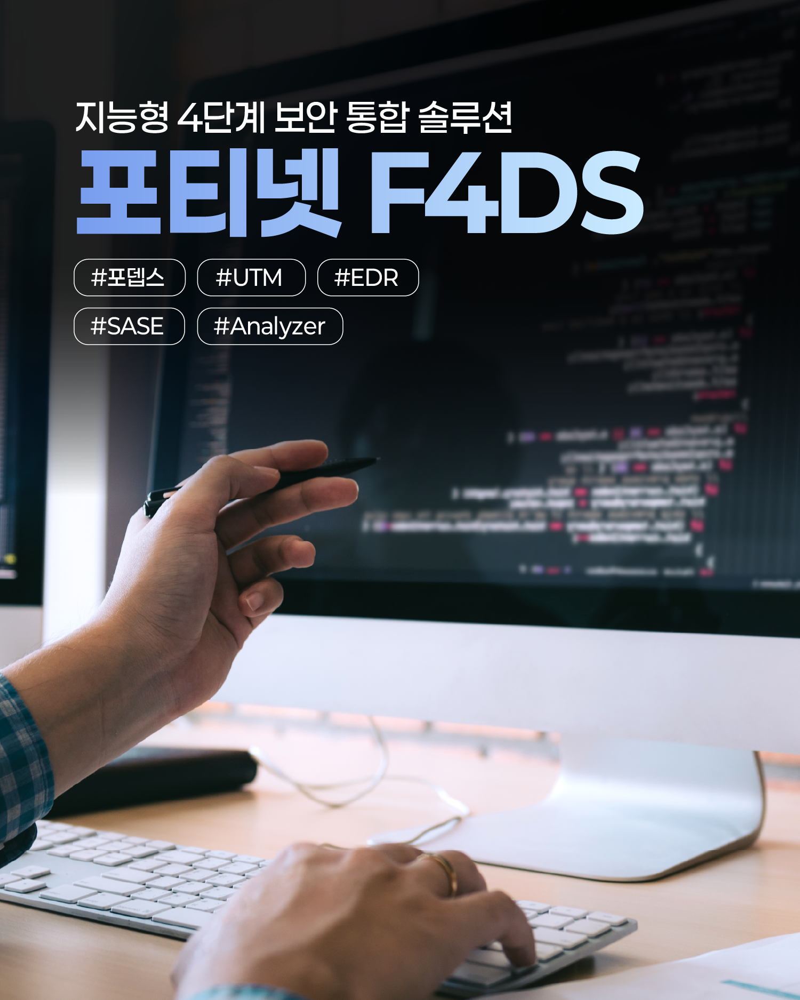
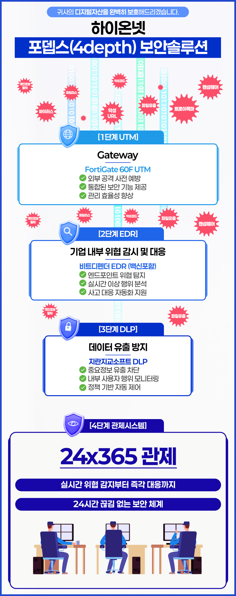
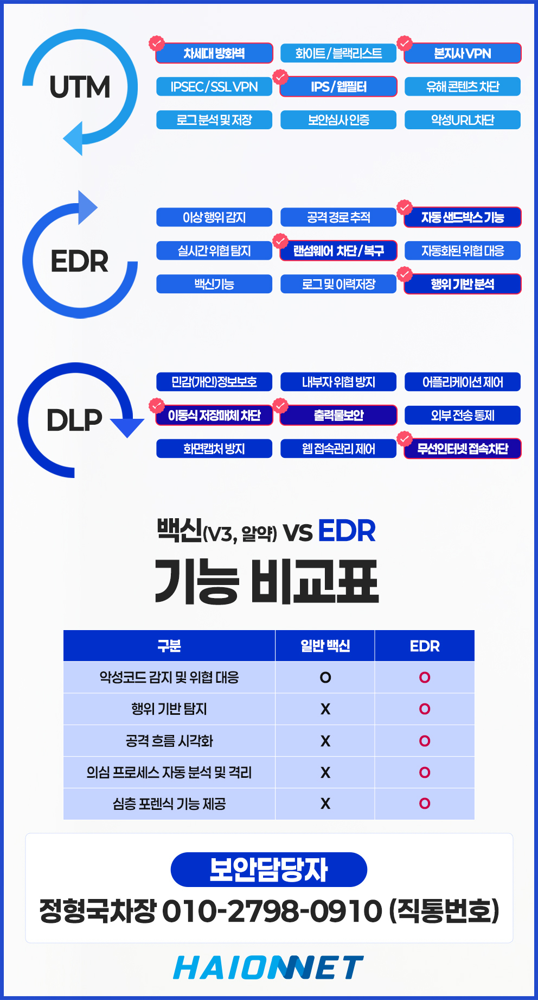

# 단 1초의 통신 중단도 허용치 않는 기업의 절대 무기: 하이온넷 포뎁스(4depth) 스마트 라우팅

인터넷 강국이라는 대한민국에서도 해마다 대형 통신사의 유선 백본망 단선 사고나 전국 단위 먹통 사태가 심심치 않게 일어납니다. 실시간으로 수만 명의 동시 접속자를 제어하는 온라인 게임사, 금융 결제 승인을 정시 처리해야 하는 핀테크 플랫폼, 혹은 실시간 데이터가 끊어지면 안 되는 스마트 팩토리 제조 공장에게 **단 몇 분간의 네트워크 두절은 곧 브랜드 신뢰도 파괴와 수억 원 규모의 재정적 대참사**로 직결됩니다.

일반적인 1+1 회선 백업 방식을 뛰어넘어, 대한민국 특허 기술로 한 차원 다른 절대 끊어지지 않는 초안정 회선 생태계를 제공하는 **하이온넷 포뎁스(4depth) 지능형 다중 경로 라우팅 솔루션**을 소개합니다.

## 기존 수동 회선 이중화(Active-Backup)의 심각한 맹점

네트워크 단선을 예방하기 위해 보조 회선을 추가해 두었다고 해서 안심할 수 없습니다. 시중의 흔한 수동식 이중화 솔루션들은 결정적인 한계를 가집니다.

* **지연되고 답답한 수동 대기 시간**: 평소에는 메인 회선만 쓰다가 단선이 발생하면 그제야 기기에서 백업 회선으로 경로를 넘깁니다. 이 인지 및 세션 전환 과정에서 짧게는 수십 초에서 길게는 수 분간 통신 정체와 사내 ERP 연결 강제 종료 현상이 기필코 뒤따릅니다.
* **유실되는 데이터 패킷**: 회선 단선 돌발 순간에 통과 중이던 모든 데이터 패킷은 그대로 증발해 버려 금융 승인 실패나 게임 렉 튕김을 그대로 유발합니다.
* **아까운 백업 예산 낭비**: 평소에는 전혀 쓰지 않는 백업 회선의 값비싼 월 기본 요금을 고스란히 낭비하게 됩니다.

## 4차원 실시간 동시 전송 및 0.1초 무손실 전환 아키텍처

하이온넷 포뎁스(4depth)는 대한민국 지식재산권 특허를 당당히 거머쥔 실시간 능동 다중 가속 라우팅 기법을 구현합니다.

* **동시 다중 상시 가동(Active-Active)**: 들여온 모든 회선을 가만히 놀려두지 않고, 대역폭을 묶어서 병렬로 상시 동시 통과시킵니다. 회선 병렬 처리에 힘입어 대역폭 가속 합산 부스팅 효과를 즉각 체감하게 됩니다.
* **0.1초 미세 무손실 우회(Failover)**: 특정 선로에 장애가 나거나 굴착 공사로 물리 케이블이 잘려 나가는 순간, 포뎁스 지능형 분산 알고리즘이 단 0.1초 만에 데이터 세션 유실 없이 살아있는 대조 경로로 트래픽을 완벽 바이패스시킵니다.

## 포티넷(Fortinet) 글로벌 1위 지능형 방화벽 엔진과의 정합

.jpg)

포뎁스 솔루션은 단순히 회선 속도를 묶어주는 데 그치지 않고, 다중 라인 전역을 완벽한 외부 사이버 위협으로부터 차단하는 글로벌 최고봉 보안 강자 **포티넷(Fortinet) 지능형 차세대 방화벽 하드웨어**를 기본 포팅 조합하여 일체형 올인원 패키지로 장전해 드립니다.

## 네트워크 로드 밸런싱 가용성 극대화 및 지연율 향상 지표

.jpg)

여러 지사직원이나 유저들의 동시 세션 요청이 몰려와도 회선별 대역폭 부하 분배율을 지능적으로 분산하는 로드 밸런싱 테크놀로지가 가동됩니다.

.jpg)

해외 지사 간 원격 연동 시에도 포티넷 기반 전용 가속 암호 터널링이 상시 매칭되어, 일반 보안 가설망(VPN) 대비 속도가 크게 상승하고 대량 트래픽에 의한 전송 기체 병목 지점을 말끔히 예방합니다.

## 가변 대역폭 자동 튜닝 및 패킷 이중 복제 알고리즘

.jpg)

포뎁스 엔진은 중요도가 매우 높은 본-지사 사내 ERP 결제 데이터나 화상 실시간 패킷은 '이중 복제 기법'으로 수십 갈래 선로에 복사본을 동시 투하 전송합니다. 

하나의 통신 선로가 미세 정체 구간을 지나며 패킷 유실(Packet Loss)을 유발하더라도, 살아있는 인접 선로를 통해 도달한 또 하나의 복사본 데이터가 수신 장치에서 완벽한 보정 제어를 수행하므로 실질적인 유실률이 완벽히 0%로 실현됩니다.

## 실시간 24시간 가시성 확보 트래픽 통합 관제 웹 포털 제공

.jpg)

현재 사내에서 회선별로 얼마나 많은 기가비트 트래픽이 통과하고 있으며, 어떤 선로에 미세 패킷 정체가 감지되는지 한눈에 직관적으로 알아볼 수 있는 실시간 관제 대시보드 가시성을 제공합니다. 담당자는 더 이상 까막눈 상태에서 네트워크 상태를 유추할 필요가 없습니다.

## 당일 단독 테스트 CPE 배정 및 사전 무상 실측 단계

.jpg)

기존 방화벽 구조를 그대로 살려 브릿지 연동이 가능하며, 하이온넷은 속도 개선도와 회선 강제 탈거 정전 상황 시의 실시간 Failover 연속성을 미리 실감해 보실 수 있도록 전 장비 무상 대여 프리 테스트 검증을 적극 지원해 드립니다.

## 하이온넷 포뎁스(4depth) 이중화 회선 비교 요약표

네트워크 가용율을 극적으로 끌어올려 장애 리스크를 제로화하려는 실무자분들을 위해 수치 지표 기준의 사양 대조표를 전해 드립니다.

<table style="width: 100%; border-collapse: collapse; border: 1px solid #cbd5e1; text-align: left; font-size: 15px; margin-bottom: 24px;">
<thead>
<tr style="background-color: #0f172a;">
<th style="padding: 12px; border: 1px solid #cbd5e1; color: #ffffff !important; font-weight: bold; text-align: center;">비교 평가 기준</th>
<th style="padding: 12px; border: 1px solid #cbd5e1; color: #ffffff !important; font-weight: bold; text-align: center;">하이온넷 포뎁스(4depth) 특허 라우팅</th>
<th style="padding: 12px; border: 1px solid #cbd5e1; color: #ffffff !important; font-weight: bold; text-align: center;">기존 수동형 이중화 (Active-Backup)</th>
</tr>
</thead>
<tbody>
<tr>
<td style="padding: 12px; border: 1px solid #cbd5e1; font-weight: bold;">장애 회선 자동 절체 속도</td>
<td style="padding: 12px; border: 1px solid #cbd5e1; font-weight: bold; color: #059669; background-color: rgba(16, 185, 129, 0.08); text-align: center;">단 0.1초 미만 (데이터 무손실 순각 우회)</td>
<td style="padding: 12px; border: 1px solid #cbd5e1; color: #ef4444; text-align: center;">최소 30초 ~ 2분 상당 소요 (세션 강제 폭파)</td>
</tr>
<tr>
<td style="padding: 12px; border: 1px solid #cbd5e1; font-weight: bold;">실질 패킷 유실률 (Packet Loss)</td>
<td style="padding: 12px; border: 1px solid #cbd5e1; font-weight: bold; color: #059669; background-color: rgba(16, 185, 129, 0.08); text-align: center;">0.00% 수렴 (중복 패킷 보정 테크놀로지)</td>
<td style="padding: 12px; border: 1px solid #cbd5e1; text-align: center;">장애 구간 통과 시 무더기 패킷 소멸</td>
</tr>
<tr>
<td style="padding: 12px; border: 1px solid #cbd5e1; font-weight: bold;">백업 회선 대역폭 합산 가속</td>
<td style="padding: 12px; border: 1px solid #cbd5e1; font-weight: bold; color: #059669; background-color: rgba(16, 185, 129, 0.08); text-align: center;">지원 (Active-Active 묶음으로 전체 속도 증속)</td>
<td style="padding: 12px; border: 1px solid #cbd5e1; text-align: center;">미지원 (평소에는 백업 회선 유휴 및 방치)</td>
</tr>
<tr>
<td style="padding: 12px; border: 1px solid #cbd5e1; font-weight: bold;">차세대 방화벽 보안 일체화</td>
<td style="padding: 12px; border: 1px solid #cbd5e1; font-weight: bold; color: #059669; background-color: rgba(16, 185, 129, 0.08); text-align: center;">기본 탑재 (Fortinet 고성능 보안 엔진 연동)</td>
<td style="padding: 12px; border: 1px solid #cbd5e1; text-align: center;">별도 방화벽 고가 추가 도입 및 라이센스 요구</td>
</tr>
<tr>
<td style="padding: 12px; border: 1px solid #cbd5e1; font-weight: bold;">트래픽 가시성 웹포털</td>
<td style="padding: 12px; border: 1px solid #cbd5e1; font-weight: bold; color: #059669; background-color: rgba(16, 185, 129, 0.08); text-align: center;">기본 제공 (실시간 세션 가시 대시보드 무료)</td>
<td style="padding: 12px; border: 1px solid #cbd5e1; text-align: center;">수동 로그 대조 또는 시중 고가 관제 연동 요망</td>
</tr>
</tbody>
</table>

---

## 1:1 하이온넷 포뎁스(4depth) 특허 이중화 솔루션 무료 도입 분석 및 장비 데모 신청

통신망 불시 장애 대란 앞에서 언제 터질지 모르는 사내 서버 중단 리스크, 이제 특허로 안전하게 무장한 포뎁스 4중 보호막으로 정밀 무장하십시오. 귀사의 기존 회선 종류 분석과 함께 0.1초 Failover 연속성 테스트 개선 결과를 눈앞에서 실측 대여 검증해 드립니다.

* **하이온넷 대표 통합 가속 관제 센터**: 📞 **1588-1456**
* **공식 온라인 테크 포털**: 🌐 [www.haion.net](https://www.haion.net)
* **특화 장점**: **100% 무상 가속 올인원 어플라이언스 사전 대여 및 이중화 성능 무료 리포트 발급**
