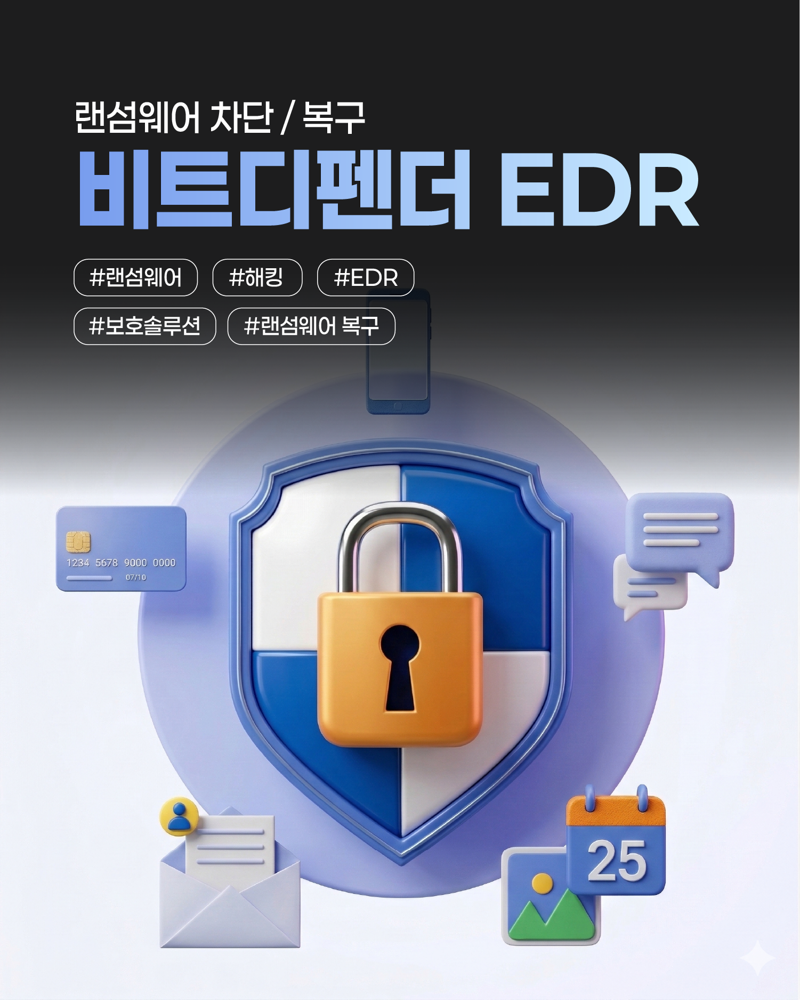
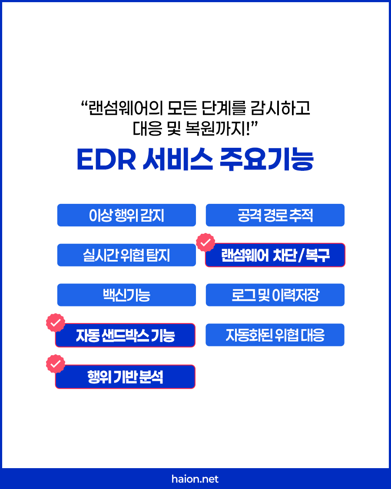
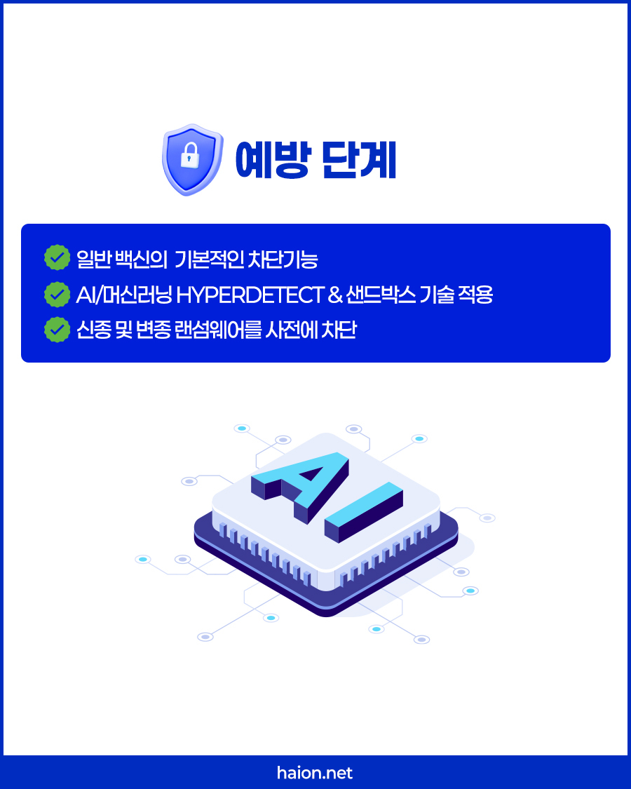
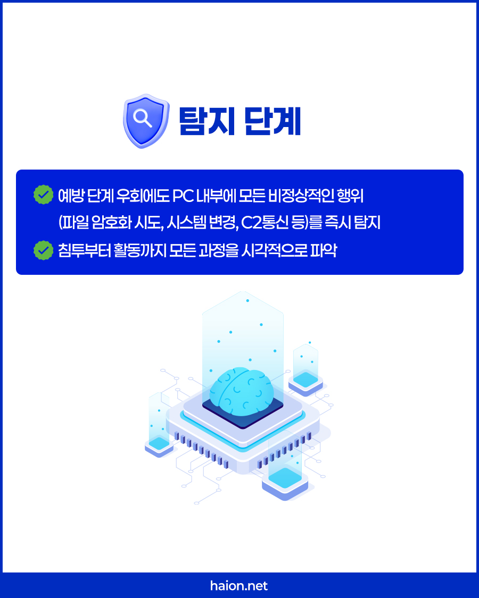
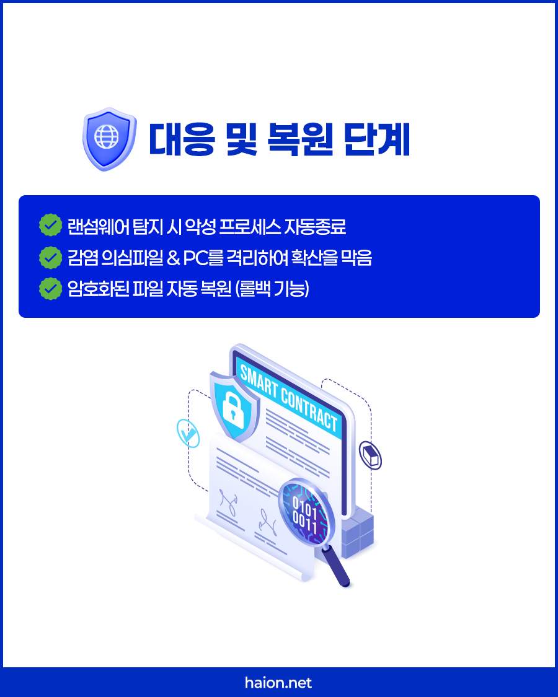

# 단말기 보안의 마침표: 하이온넷 비트디펜더 EDR 백신 솔루션 및 파일 자동 롤백 복원

사무실 PC 단말기에 널리 보급된 일반 저가형 무료 백신 프로그램들을 열심히 켜두었음에도 불구하고, 어느 날 출근해 보니 사내 메인 PC와 파일 서버 전체의 확장자가 `.lock` 혹은 정체불명의 암호로 변조되어 기밀 견적서, 계약 자료가 통째로 복구 불가능하게 마비되는 랜섬웨어 대참사를 겪어 보셨거나 주변에서 보신 적이 있으신가요? 

오늘날의 지능형 해킹 공격 조직들은 기존의 단순 알려진 패턴 매칭 백신을 무력화하기 위해 매시간 수만 종류의 변종 랜섬웨어 패키지를 가공하여 유포합니다. 침입 예방을 넘어, 기존 방화벽과 백신 방어선을 교묘하게 뚫고 기어 들어온 악성 침투자가 파일을 강제 오염 암호화하려는 찰나의 '불량 거동'을 포착 격리하고, <b>오염된 중요 핵심 기밀 문서를 감염 이전 완벽 무결한 상태로 원스톱 롤백 복원</b>해 드리는 <b>하이온넷 비트디펜더 차세대 EDR 백신 가이드</b>를 전격 소개합니다.

## 고질적 도마뱀: 랜섬웨어 감염 피해가 끝없이 도돌이표인 원인 4가지

수많은 기업 전산 기기들이 악성 랜섬웨어의 먹잇감으로 전락하는 고질적 허점은 크게 아래의 네 가지에서 출발합니다.

* <b>교묘한 지능형 침투 수법</b>: 구형 시그니처 백신이 안전하다고 오인하게끔 은밀히 코드 우회 가공.
* <b>보이지 않는 보안 구멍</b>: OS 및 브라우저의 긴급 최신 패치가 소홀해 생기는 0-Day 취약성 방치.
* <b>사내 전산 전문가 전무</b>: 이상 징후나 침입 흔적이 로그 파일에 남아도 해독 및 대응 능력 결핍.
* <b>EDR 탐지 차단 인프라 전무</b>: 해킹 패킷이 들어와 파일 암호화를 시작해도 속수무책 관망 방치.

## 랜섬웨어 종식 선언: 비트디펜더 EDR 차세대 보호 솔루션의 강력 기능군

단 한 번의 가벼운 설치로, 귀사의 수많은 업무용 PC 단말 영역에 정교하고 튼튼한 무장애 웰니스 방패막을 선물해 드립니다.

* <b>이상행위 실시간 감지</b>: 기존 백신을 가볍게 우회하는 파일 암호화 조짐 감지 시 즉각 개입.
* <b>공격 침투 경로 완벽 추적</b>: 해킹 메일의 유입로, 파일의 상세 전파 지도를 시각적으로 투명 표시.
* <b>랜섬웨어 즉각 종료 & 롤백</b>: 변조 암호화 시도 포착 즉시 해당 프로세스를 정지시키고 원본 복원.
* <b>자동 샌드박스 가설 격리</b>: 의심스러운 정체불명 파일의 악성 거동을 폐쇄형 가상 실험실에서 선제 테스트.

## 1단계 - 철저한 선제 예방: AI HyperDetect 및 가상 샌드박스 기술

정교한 AI 머신러닝 최신 탑티어 기술이 내재되어 사고 터지기 전 입구 컷을 수행합니다.

* <b>AI 머신러닝 HyperDetect</b>: 기존 보안 목록에 없던 변종 코드가 포착되는 순간, 고품질 머신러닝 알고리즘 분석을 통해 잠재적 악성 위협 요소를 미리 실측 추출 정제합니다.
* <b>클라우드 샌드박스</b>: 위험성 판별이 지연되는 모호한 파일은 가상 격리 검사실에서 선제 작동 대조하여 사용자 윈도우 환경의 물리적 다운타임을 보장 보위합니다.

## 2단계 - 무오류 실시간 탐지: 침투 및 활동의 100% 시각화

해커가 아무리 정교하게 파일 이름을 정상 파일로 위장하더라도, 시스템 주요 뼈대를 건드리는 미세한 불량 거동까지 1도 놓치지 않고 입체 포착합니다.

* <b>실시간 행동 패턴 스캔</b>: 시스템 파일 강제 암호화, 주요 레지스트리 비인가 수정, 불법 외부 해커 C2 조종 서버와의 비인가 교차 통신 감지 즉시 탐지 처리.
* <b>전체 공격 흐름 시각화</b>: 관리 화면을 통해 해커가 어떤 통로로 기어 들어와 어떤 폴더를 거치며 활동했는지 100% 한눈에 쉽게 식별할 수 있는 일사불란한 통제 가이드라인을 부여합니다.

## 3단계 - 대응 및 기적의 파일 복원: 감염 즉시 무손실 자동 롤백

비트디펜더 EDR 최고의 필살기이자 타사 일반 백신과의 결정적 클래스 대조 품질을 입증하는 무결 복구 단계입니다.

* <b>악성 프로세스 킬 차단</b>: 랜섬웨어 악성 파일 암호화 징후 실시간 감지 순간, 해당 프로그램을 즉시 강제 파괴 종료합니다.
* <b>사내 내부망 자동 즉시 격리</b>: 감염 의심 단말기의 LAN 회선 연결 통로를 자동 정지시켜 사내 전체 PC로의 수평 2차 전염 감염 전파 경로를 원천 차단합니다.
* <b>자동 롤백 (Rollback) 데이터 기적 복구</b>: 감염 직전 비트디펜더 EDR의 무손실 미러 쉐도우 영역에 상시 무정전 안전 백업되어 보존 중이던 원본 기밀 문서를 꺼내어, <b>해커에 의해 잠겨버린 암호화 파일을 원래 상태로 완전무결 원상 자동 복원</b>시킵니다.

## 24시간 365일 지연 없는 전문 보안 관제 허브 지원

보안 관리가 귀찮고 어려운 기업 총무 담당자님을 위해 하이온넷 전문 인프라가 든든하게 무정전 보좌해 드립니다.

* <b>네트워크 보안 허브 안내</b>: 📞 <b>1588-1456</b>
* <b>전담 긴급 대응 파트너 기술직통</b>: 📱 <b>010-9945-7510</b> (평일 09:00 ~ 18:00 상시 1:1 실시간 즉각 대응 원격 서포트 지원)
* <b>카카오 상담 채널</b>: 플러스친구 <b>@하이온넷</b> 등록
* <b>자가 보안 검증 특전</b>: 귀사의 사무실 업무용 PC들에 기어 들어와 숨어 있는 랜섬웨어 불량 잠복 징후가 있는지 무상으로 밀착 정밀 스캐닝 받아 보실 수 있도록 <b>100% 무상 사전 EDR 에이전트 실측 테스트 및 취약점 무상 자가 검증 점검</b>을 전폭 무료 개동해 드립니다.
