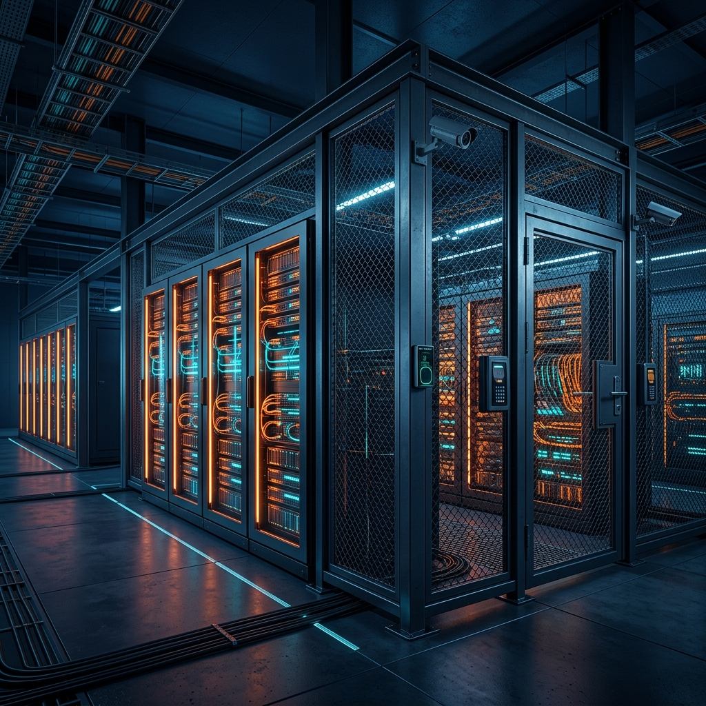
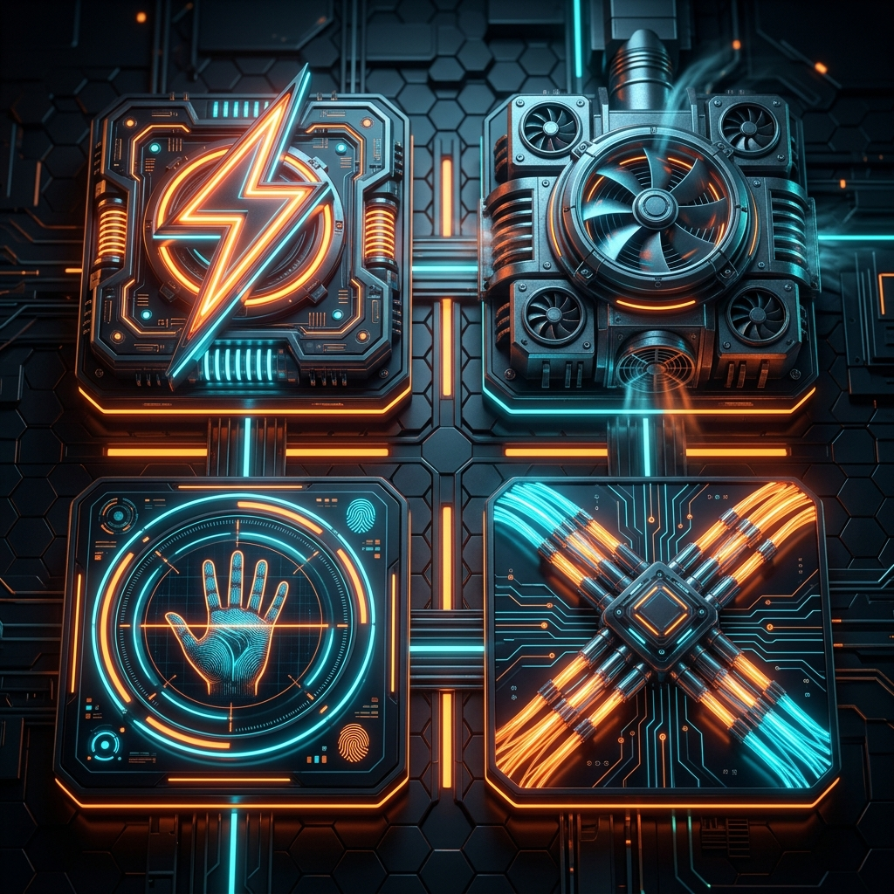
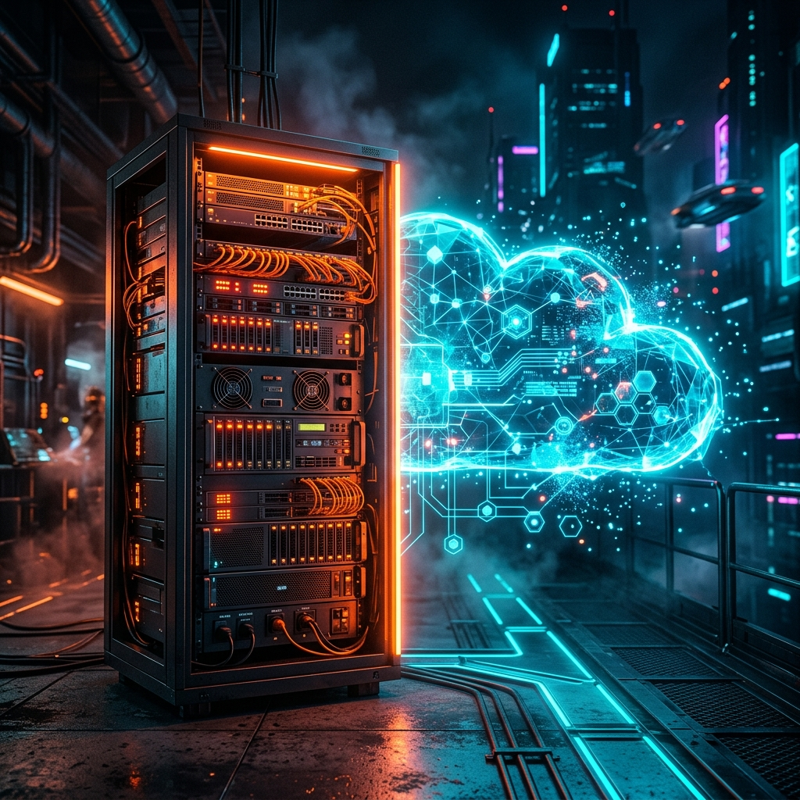
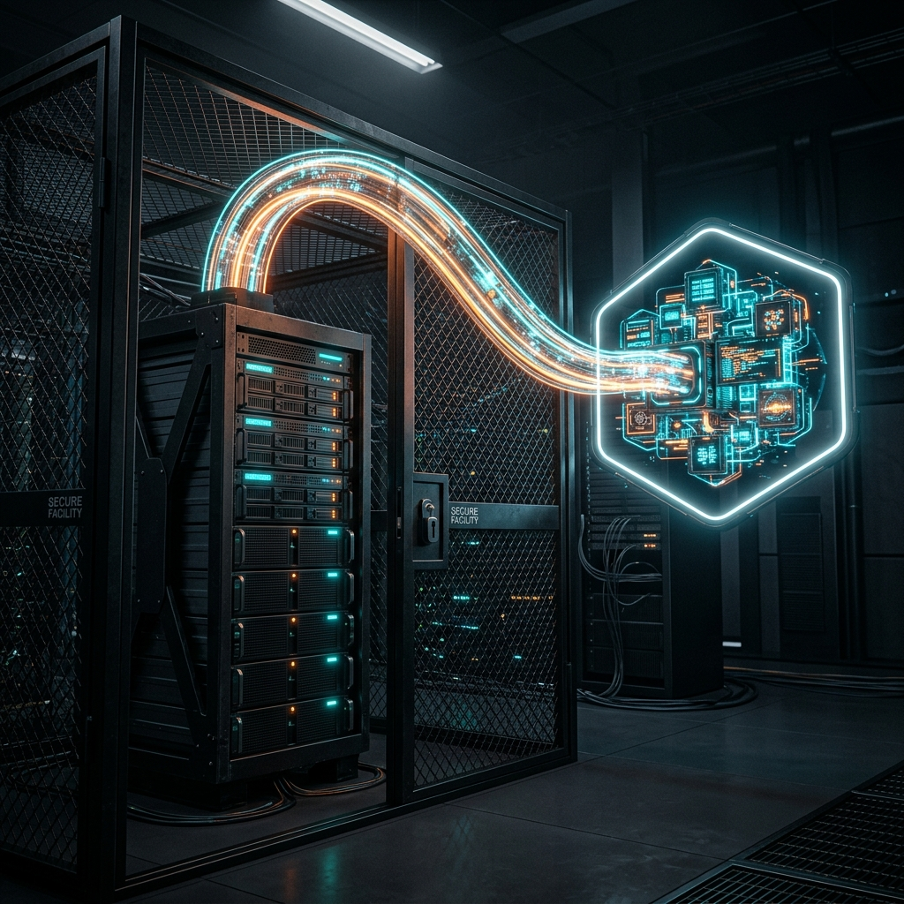

# 기업 인프라의 견고한 심장부: 코로케이션(Colocation) 기술 가치 및 도입 가이드

인터넷 서비스 기업, 온라인 게임 개발사, 혹은 보안 규제가 엄격한 금융 및 핀테크 스타트업까지, 규모를 막론하고 IT 인프라를 확장하다 보면 결국 마주하게 되는 중대한 기술적 질문이 있습니다. 

<strong>"우리 회사의 소중한 서버 컴퓨터들을 대체 어디에 두고 운영해야 가장 안전하고 저렴할까?"</strong>

서버 하드웨어는 기업 비즈니스를 움직이는 전산망의 심장이자 생명선입니다. 하지만 이 민감한 하드웨어를 회사 사무실 캐비닛이나 에어컨 아래에 방치하는 것(On-Premise)은 전력 안정성, 냉각 효율, 그리고 도난 위험 면에서 언제 터질지 모르는 시한폭탄과 같습니다.

이러한 오프라인 인프라의 물리적 한계를 극복하고 대기업급의 무정전 인프라 환경을 완벽하게 확보하기 위해 도입하는 최적의 아웃소싱 전략이 바로 <strong>코로케이션(Colocation) 서비스</strong>입니다. 

코로케이션의 본질적인 동작 메커니즘과 퍼블릭 클라우드와의 구조적 비교, 그리고 실전 아키텍처 전략에 대해 자세히 파헤쳐 보겠습니다.

## 01. 코로케이션 데이터 센터(IDC)가 보장하는 4대 생존 핵심 인프라

코로케이션은 단순히 서버 장비를 얹어둘 '컴퓨터용 선반(Rack)' 공간만 월세 형태로 빌려 쓰는 단순한 부동산 임대가 아닙니다. 서버가 지구 종말급 천재지변 속에서도 1년 365일 단 1초도 멈추지 않고 영속 가동될 수 있도록 돕는 <strong>'데이터 센터(IDC) 전방위 무정전 부대설비 전체'</strong>를 공급받는 종합 인프라 보위 계약입니다.

* <strong>① 완벽한 이중화 무정전 전력망 (Power System)</strong>
  * <strong>핵심 장치</strong>: 서버 장비에 정전이 발생하는 순간 하드 디스크 헤드가 손상되어 전체 고객 데이터베이스가 증발해 버립니다. IDC는 한전 전선이 물리적으로 끊기더라도, 수 밀리초 내에 전기를 대체 밀어주는 <strong>대형 UPS(무정전 전원 공급 장치)</strong> 배터리가 1차 방어합니다. 동시에 지하다목적실에 구비된 <strong>대형 공업용 디젤 발전기</strong>를 자동 구동시켜 며칠간 자체 전력을 생산해 완벽 방수 방어합니다.
* <strong>② 미세 온도·습도 맞춤 항온항습 (Industrial Cooling)</strong>
  * <strong>핵심 장치</strong>: 고밀도 랙에 집약된 수십 대의 멀티코어 서버 CPU와 그래픽 카드(GPU)가 뿜어내는 열은 일반 가정용 에어컨으로 절대 감당하지 못합니다. 24시간 내내 실시간 냉기를 아래에서 위로 회전 제어 송풍하는 <strong>항온항습 시스템</strong>을 통해 서버실 습도와 내부 온도를 완벽한 마지노선(온도 20~24도, 습도 40~50%)으로 철저히 동결 보존하여 정전기 및 열화 현상을 원천 방지합니다.
* <strong>③ 요새 수준의 다중 차단 물리적 보안 (Physical Security Check)</strong>
  * <strong>핵심 장치</strong>: 아무나 사무실에 들어와 백업 외장 하드를 뽑아 도망갈 수 있는 온프레미스와 달리, 코로케이션 센터는 요새와 같은 입출 관리를 자랑합니다. 외곽 지문/홍채 생체 인식 카운터, 24시간 도트 모니터링 CCTV, 특수 무장 경비가 3중 통제합니다. 또한 화재 발생 시 물 대신 서버 장비를 전혀 부식시키지 않는 <strong>소방 전용 비전도 가스 분사 소방 가설</strong>과 규모 7.0 지진에도 장비를 견디게 해주는 <strong>면진/내진 아키텍처</strong>를 기본 장착합니다.
* <strong>④ 대륙 간 초고속 전용 통신 회선 백본 (Carrier-Neutral Network)</strong>
  * <strong>핵심 장치</strong>: 데이터 센터는 다수의 국내 대형 기간 통신사(KT, LGU+, SKB) 백본과 다이렉트로 이중화 연동되어 있습니다. 이를 통해 사용자는 병목 없는 무제한 대역폭의 백업 회선이나 국제전용회선(IPLC)을 우리 서버 네트워크 포트에 거침없이 물리적으로 다이렉트 바인딩해 활용할 수 있습니다.

## 02. 온프레미스(On-Premise) 대비 코로케이션 도입의 정당성

회사 내 작은 골방을 개조해 에어컨을 상시 가동시키는 자사 사설 서버실(온프레미스) 아키텍처는 얼핏 초기 세팅 비용이 저렴해 보일 수 있으나, 규모가 누적될수록 기하급수적인 비용 블랙홀을 형성합니다.

1. <strong>설비 구축 비용(CAPEX)의 현격한 격차</strong>
   * 직접 UPS 설비, 항온항습 냉각기, 화재용 가스 소화제, 소방 허가 및 3중 방화문을 설계 시공하려면 최하 억 대에서 최대 수십억 원의 막대한 일시 자본 비용이 날아갑니다. 코로케이션은 수백억 원을 들여 완벽 시공된 데이터 센터 전문 인프라를 월 고정 사용료(상면료 + 회선 요율) 형식으로 분할 납부(OPEX 전환)하여 압도적으로 효율적인 현금 흐름을 이끌어 냅니다.
2. <strong>24시간 전담 엔지니어 관제 인적 리소스 부담 제로</strong>
   * 사내 서버실 가동 시 한밤중 정전이나 장비 냉각 팬 정지 경고가 울렸을 때, 퇴근했던 시스템 엔지니어 직원이 긴급 콜을 받고 현장으로 달려가 대처해야 합니다. 반면 코로케이션 데이터 센터에는 IDC 시스템 전문 상주 엔지니어가 24시간 교대 감시 근무를 돌며 돌발 하드웨어 이슈에 대응하므로 전문성과 인건비 세이빙이 극대화됩니다.

## 03. 퍼블릭 클라우드(Cloud) vs 코로케이션(Colocation) 심층 비교

요즘 화두인 퍼블릭 클라우드(AWS, GCP, Azure)의 무조건적인 우위를 맹신하기 전에, 코로케이션과 무엇이 근본적으로 다르고 성능 차이가 왜 발생하는지 뼈대를 대조해 보아야 합니다.

| 비교 항목 | 🏢 코로케이션 (Colocation) | ☁️ 퍼블릭 클라우드 (AWS 등) |
| :--- | :--- | :--- |
| <strong>장비 소유권</strong> | <strong>우리 회사</strong> (자산 소유 및 감가상각 가치 잔존) | 클라우드 사업자 (무형의 인프라 대여) |
| <strong>비용 구조</strong> | 초기 서버 하드웨어 구매비 + <strong>고정형 월 상면비</strong> | 초기 비용 0원 + <strong>사용량에 정비례하는 가변 누적 요금</strong> |
| <strong>하드웨어 성능</strong> | 물리 자원을 100% 독점해 하드웨어 가속 성능 만끽 | 가상화(Hypervisor) 레이어를 거쳐 자원 분할 사용 |
| <strong>인프라 확장성</strong> | 장비를 사서 IDC에 넣기까지 며칠간 하드웨어 수급 소요 | 마우스 클릭 몇 번으로 수 초 만에 수백 대 인스턴스 확장 |
| <strong>물리적 보안/규제</strong> | 하드웨어 장치 및 디스크 드라이브 위치 of 100% 추적 | 내 소중한 데이터가 지구 어느 서버에 박혔는지 추적 난망 |

## 04. 비즈니스 현장 도입 시나리오: 최적의 도입 기업 가이드

장점과 단점이 명확한 만큼, 다음과 같은 실제 기업 비즈니스 특성에 맞춤 설계하여 스마트하게 도입할 때 최고의 시너지를 얻습니다.

### 🚀 1. 트래픽 소모량과 CPU 부하가 365일 일정하게 고공행진하는 기업

* <strong>대표 사례</strong>: 대형 MMORPG 온라인 게임 퍼블리셔, 트래픽 유입이 고정된 대형 뉴스 포털, 동영상 중계 전송망
* <strong>도입 당위성</strong>: 클라우드는 24시간 트래픽을 상시 대량 점유하면 매달 말일에 엄청난 요금 고지서(트래픽 대역 아웃바운드 비용 폭탄)를 맞게 됩니다. 이럴 경우 최상급 고성능 서버 장비들을 직접 통구매하여 코로케이션에 단 한 번 입주시킨 뒤 고정된 물리 상면 요율과 계약된 무제한 대역선으로 몇 년간 감가상각을 뽑아내 운용하는 편이 클라우드 대비 누적 인프라 비용(TCO)을 최대 60% 이상 드라마틱하게 아끼는 지름길입니다.

### 🛡️ 2. 법적 고객 정보망 분리 규제 및 금융 감독 제재를 받는 기업

* <strong>대표 사례</strong>: 일금융/핀테크 기관, 공공 의료 포털, 공공 행정 망 입찰 기업
* <strong>도입 당위성</strong>: 국가 망 분리 고시 규정과 개인신용정보법에 따라, 타 기업과 혼용되는 퍼블릭 멀티테넌트 클라우드 환경에 고객 금융 원장이나 민감한 생체 의료 데이터를 저장하는 행위는 위법이거나 라이선스 탈락 요인이 됩니다. 따라서 오직 우리 회사 관리자만 열 수 있는 실물 하드웨어 고유 드라이버가 필요하며, IDC 내에 별도의 철망 장벽을 두른 <strong>'단독 케이지(Cage)'</strong>를 임대해 코로케이션으로 격리 가두어 관리해야만 합법적인 감사 검증을 충족시킬 수 있습니다.

### 🤝 3. 보안과 유연성을 동시에 잡는 '하이브리드 클라우드(Hybrid Cloud)' 구축

* <strong>대표 사례</strong>: 현대 고도화된 거의 모든 엔터프라이즈 B2B 테크 기업
* <strong>도입 당위성</strong>: 가장 현실적이고 강력한 융합 아키텍처입니다. 회원 가입 원장, 핵심 회계 데이터베이스(DB) 등 보안 감경과 초고성능 I/O 속도가 극대화되어야 하는 무거운 백엔드 허브는 IDC 내부의 <strong>'코로케이션 물리 전용 서버'</strong>에 견고히 모셔둡니다. 반면 대형 신제품 출시 마케팅 이벤트나 블랙프라이데이 할인으로 인해 단숨에 트래픽이 만 배 가까이 수시로 요동치는 <strong>전면 웹사이트 앱 프론트엔드</strong> 영역은 유연한 가상 <strong>'퍼블릭 클라우드'</strong>에 올려 확장성과 안전성을 예술적으로 완벽 절충하여 운용합니다.

## 📊 코로케이션 vs 온프레미스 vs 클라우드 3자 총체 비교

| 평가 핵심 지표 | 🏢 코로케이션 (Colocation) | 🖥️ 온프레미스 (사내 서버실) | ☁️ 퍼블릭 클라우드 (AWS 등) |
| :--- | :--- | :--- | :--- |
| <strong>초기 자본비(CAPEX)</strong> | <strong>보통</strong> (서버 하드웨어만 구매) | <strong>매우 높음</strong> (서버실 건축, 방화, 공조 시공) | <strong>없음</strong> (초기 인프라 투자 비용 제로) |
| <strong>월간 유지비(OPEX)</strong> | <strong>고정</strong> (매월 고정 상면비 및 회선료) | <strong>불규칙</strong> (누진 전력세, 노후 장비 수리비) | <strong>가변</strong> (사용 트래픽 급증 시 기하급수적 상승) |
| <strong>물리 시설 신뢰도</strong> | <strong>최상급</strong> (UPS 이중화, 전문 엔지니어 상주) | <strong>취약함</strong> (단전, 천재지변, 관리 부실 노출) | <strong>최상급</strong> (빅테크 글로벌 물리 인프라) |
| <strong>네트워크 커스터마이징</strong> | <strong>매우 높음</strong> (다양한 통신사 회선 직접 선택) | <strong>보통</strong> (사무실 입주 회선 가용 범위 내) | <strong>제한됨</strong> (제공되는 가상 전용 네트워크 내 통제) |
| <strong>추천 비즈니스 규모</strong> | 중형 마케팅, 대형 포털, 하이브리드 요구 기업 | 로컬 전산 중심의 초소형 사무실 혹은 연구소 | 스타트업, 트래픽 유입이 가변적인 신규 서비스 |

