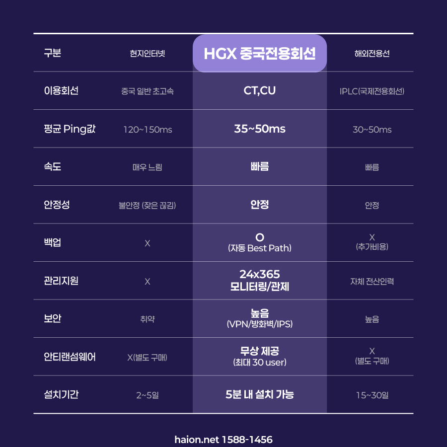
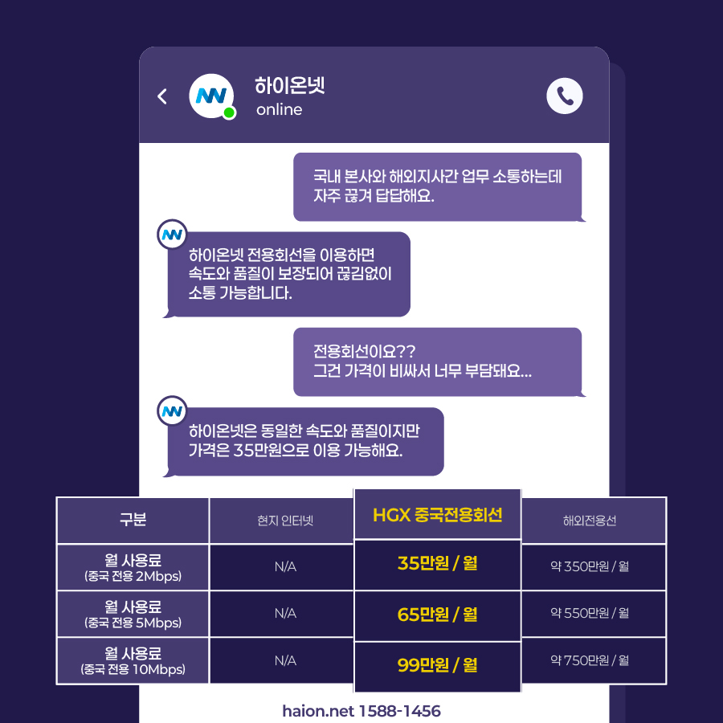
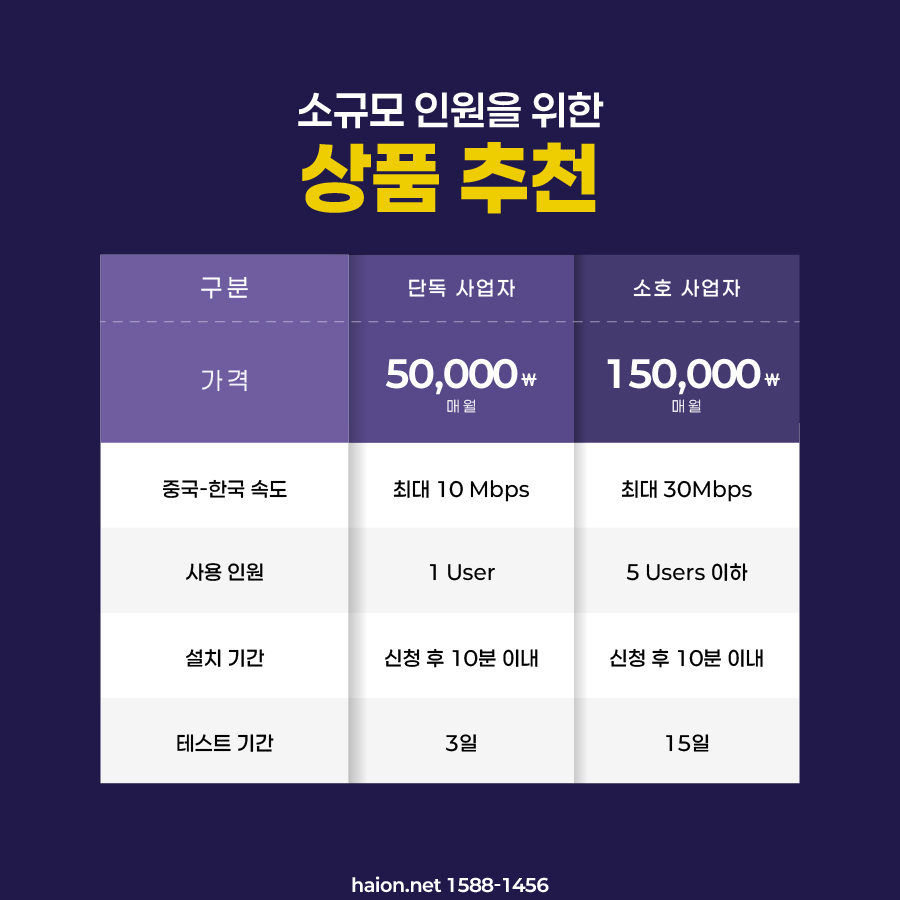
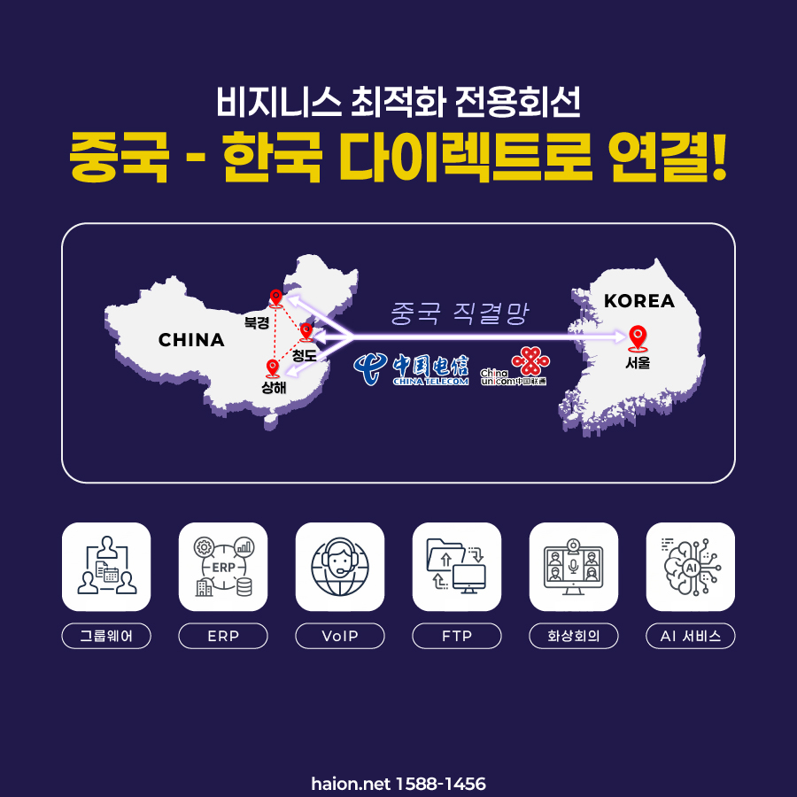
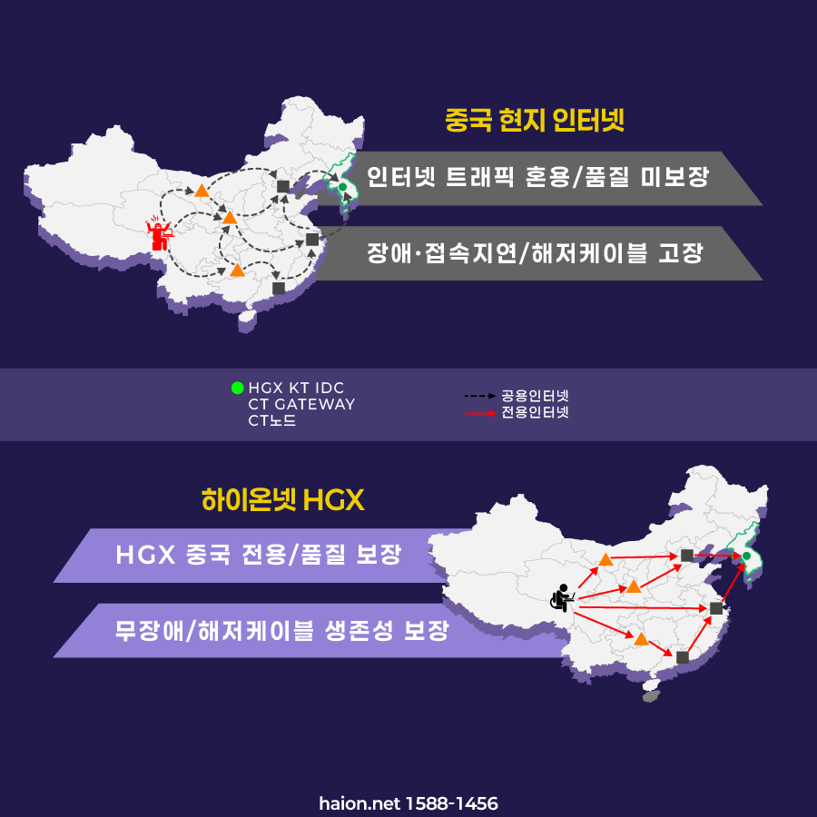
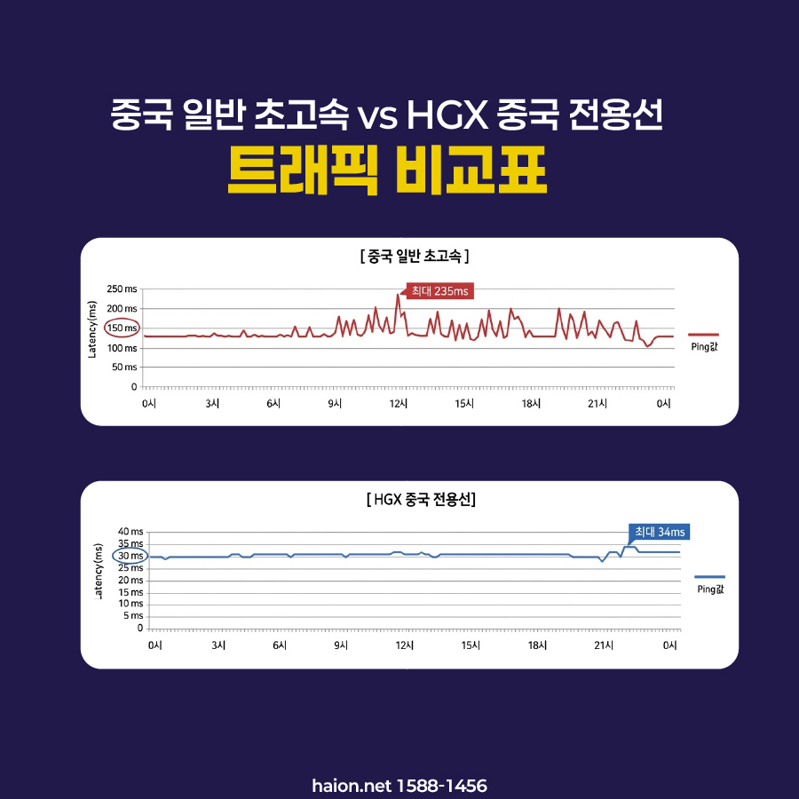
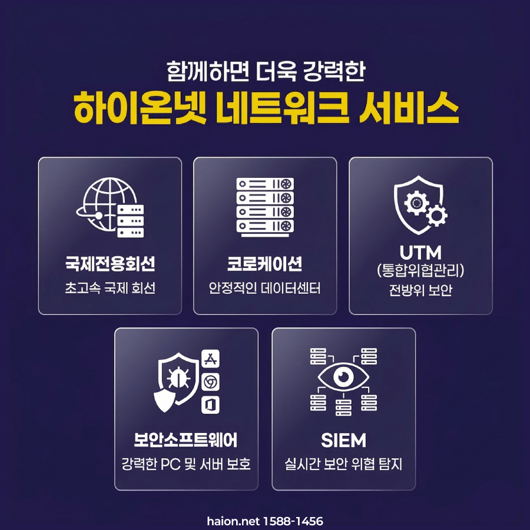
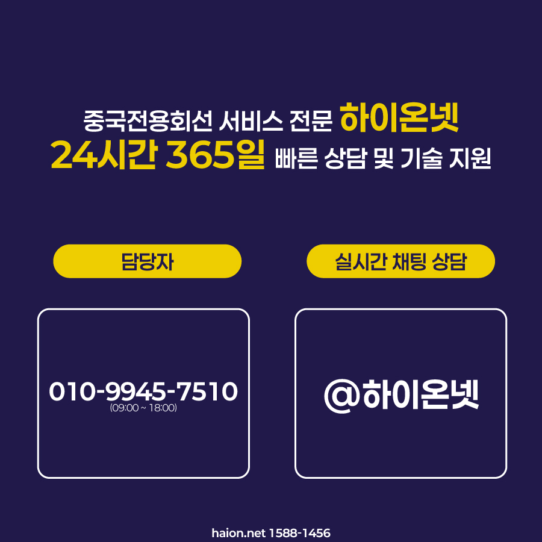
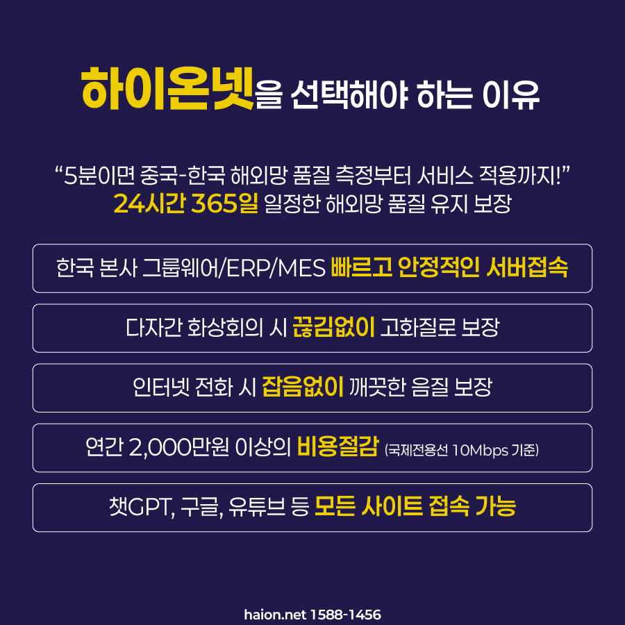
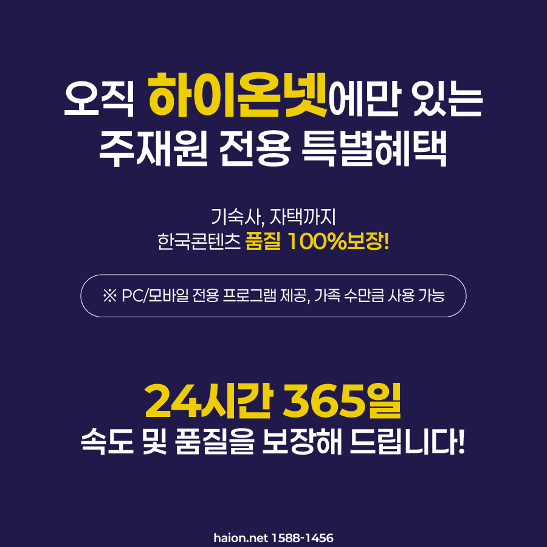

# 한-중 비즈니스의 네트워크 치트키: HGX-CN 중국 전용선 솔루션

## 🚀 INTRO: 왜 중국 비즈니스 네트워크는 이토록 끊기고 느릴까요?

중국에 공장이나 지사를 둔 기업의 네트워크 담당자분들이 가장 많이 겪는 고질적인 스트레스가 있습니다.  
바로 **"갑자기 끊기는 ERP"**, **"전송하다 멈추는 대용량 도면과 파일"**, 그리고 **"로딩만 무한 반복되는 화상회의"**입니다.

이러한 현상이 발생하는 이유는 중국 정부의 강력한 인터넷 방화벽인 **만리방화벽(GFW, Great Firewall)**으로 인한 해외 트래픽 검열과, 한-중 해저 광케이블 구간의 대역폭 정체 때문입니다. 아무리 값비싼 기가 인터넷을 신청해도 일반 공용 인터넷망(Public Internet)을 거치는 한, 이 고질적인 지연 시간(Latency)과 패킷 손실(Packet Loss)은 절대 근본적으로 해결되지 않습니다.

하이온넷이 제안하는 **HGX-CN**은 이러한 한계를 단숨에 파괴하는 **가장 확실하고 합리적인 네트워크 치트키**입니다.

## 📂 HGX-CN 서비스란 무엇인가요?

### 한-중 프리미엄 전용망 서비스 HGX-CN

**"느리고 불안정한 인터넷은 비즈니스의 치명적인 손실로 이어집니다."**  
하이온넷의 **HGX-CN**은 한국 본사와 중국 지사 간의 끊김 없고 빠른 인터넷 연결을 실현하는 기업 전용 하이브리드 직결망 서비스입니다. 일반 초고속 인터넷의 한계를 뛰어넘어, 전용망 수준의 고대역폭과 압도적인 안정성을 바탕으로 기업 비즈니스의 새로운 성공 통로를 개척합니다.

### 중국 네트워크 환경의 고질적인 한계

중국 지사에서 한국 본사 서버로 접속할 때 발생하는 잦은 끊김, 극심한 Ping 지연, 그리고 데이터 먹통 현상은 사내 업무 효율을 극도로 저하시키는 핵심 요인입니다. 검열망과 정체 구간을 통과해야만 하는 일반 초고속 인터넷 인프라로는 글로벌 비즈니스의 속도를 감당할 수 없습니다.

### 한-중 비즈니스의 동맥 경화: ERP 및 그룹웨어 마비

수 수십억 원을 들여 구축한 고성능 ERP(SAP, Oracle, Douzone 등)와 그룹웨어가 네트워크 성능 한계로 제 성능을 발휘하지 못한다면, 이는 고스란히 기업의 재무적 손실로 이어집니다. 본-지사 간 유기적인 업무 연속성이 차단되는 순간, 생산 관리는 물론 출하, 물류 등 모든 비즈니스 체인이 동맥경화 상태에 빠지게 됩니다.

### 문제를 단숨에 타파하는 HGX-CN 전용망 아키텍처

하이온넷의 독자적인 네트워크 공학 기술로 구축된 **HGX-CN**은 본-지사 사이에 보장된 고품질 우회 직결 루트를 확보합니다. 정체구간과 검열 필터링 장벽을 우회하여 데이터를 일직선으로 고속 전송함으로써 무손실 패킷 보장 및 극소화된 레이턴시를 실현합니다.

### 중국 1티어 ISP(차이나텔레콤, 차이나유니콤) 백본과의 다이렉트 직결

중국 대표 국영 통신사인 차이나텔레콤(China Telecom) 및 차이나유니콤(China Unicom)의 핵심 1티어 백본망과 다이렉트 가속 경로로 직결되어 있습니다. 물리적으로 가장 빠른 최단 경로만을 찾아 전송하므로, 일반 가상 사설망(VPN)과는 비교 불가능한 차원의 속도적 차별성을 선사합니다.

### 해외전용선 대비 최대 90% 비용 절감 효과

수천만 원을 웃도는 기존의 국제전용회선(IPLC / IEPL)의 높은 비용 부담 때문에 도입을 망설이셨나요? **HGX-CN**은 기존의 초고속 인터넷 회선을 그대로 활용하면서도 고품질 전용선 효과를 내는 하이브리드 가속 망을 구축하여, **동일 성능 기준 해외전용선 대비 최대 90%의 극적인 예산 절감(1/10 가격, 2Mbps 기준 약 350만 원에서 35만 원으로 축소) 효과를 약속드립니다.

### 화상회의 및 인터넷 전화(VoIP) 무손실 품질 보장 (QoS)

실시간 전송이 매우 민감한 고화질 화상회의(Zoom, Teams 등) 및 고음질 VoIP 인터넷 전화망의 음질을 완벽하게 다듬어 줍니다. 지능형 대역폭 최우선 지정 기술(QoS)을 탑재하여 다른 대용량 파일 전송 중에도 음성과 실시간 미팅 패킷에 고속도로를 즉시 내어주므로, 끊김 없는 원활한 글로벌 협업이 상시 유지됩니다.

### 24시간 365일 무중단 실시간 관제 및 기술 대응 시스템

네트워크 장애는 예고 없이 찾아오며, 단 몇 분의 마비로도 심각한 운영 타격을 줍니다. 하이온넷은 고도로 훈련된 보안·네트워크 엔지니어들이 24/365 체제로 기업의 트래픽 흐름을 실시간 관찰하며, 이상 징후 발생 시 선제적으로 탐지 및 복구하는 완벽한 실시간 장애 방어 시스템을 가동하고 있습니다.

### 선 테스트 후 도입: 100% 무상 데모 서비스 제공

**"우리 사무실에서도 정말 속도가 개선될까?"** 걱정하실 필요 전혀 없습니다. 하이온넷은 고객사의 실제 네트워크 환경에 장비를 무상으로 먼저 설치하여 충분히 속도 향상과 핑(Ping) 개선율을 체감하신 후 정식 도입을 결정하실 수 있도록 **100% 무료 장비 임대 및 데모 테스트 서비스**를 상시 지원합니다. **특히 신청 후 단 5분 이내 즉시 개통이 가능하며, 소규모 사업장의 경우 평균 10분 내에 모든 설치를 마칠 수 있는 업계 최속의 기동력을 갖추고 있습니다.

### 비즈니스 날개를 다는 실제 도입 성공 시나리오

제조업, 물류업, 글로벌 무역, 게임 퍼블리싱 등 다양한 분야의 한-중 합작 기업 및 대기업 지사들이 하이온넷 HGX-CN을 통해 본·지사 인프라를 극적으로 가속하였습니다. 생산 리드 타임 단축, 데이터 전송 누락 0%, 해외 원격 디버깅 속도 3배 향상 등의 눈부신 시너지 효과를 직접 증명해 내고 있습니다.

## 💎 하이온넷 HGX-CN VS 타사 솔루션 비교 분석

기업의 중요한 비즈니스 인프라를 결정할 때 꼼꼼한 비교는 필수적입니다. 하이온넷 HGX-CN의 독보적인 우위점을 아래 표를 통해 투명하게 확인해 보십시오.

<table style="width:100%; border-collapse: collapse; margin: 20px 0;">
<thead>
<tr style="background-color: #1e293b;">
<th style="padding: 12px; border: 1px solid #cbd5e1; color: #ffffff !important; font-weight: bold; text-align: center;">평가 기준 및 요소</th>
<th style="padding: 12px; border: 1px solid #cbd5e1; background-color: #0f172a; color: #34d399 !important; font-weight: bold; text-align: center;">하이온넷 HGX-CN 서비스</th>
<th style="padding: 12px; border: 1px solid #cbd5e1; color: #ffffff !important; font-weight: bold; text-align: center;">일반 하드웨어 VPN (공용망)</th>
<th style="padding: 12px; border: 1px solid #cbd5e1; color: #ffffff !important; font-weight: bold; text-align: center;">고비용 국제전용회선 (IPLC)</th>
</tr>
</thead>
<tbody>
<tr>
<td style="padding: 12px; border: 1px solid #cbd5e1; font-weight: bold;">한-중 평균 레이턴시(Ping)</td>
<td style="padding: 12px; border: 1px solid #cbd5e1; font-weight: bold; color: #059669; background-color: rgba(16, 185, 129, 0.08); text-align: center;">35ms ~ 50ms (공식 스펙 보장 수치로 매우 안정적)</td>
<td style="padding: 12px; border: 1px solid #cbd5e1; text-align: center;">80ms ~ 200ms 이상 (잦은 스파이크)</td>
<td style="padding: 12px; border: 1px solid #cbd5e1; text-align: center;">30ms ~ 40ms 내외 (안정적)</td>
</tr>
<tr>
<td style="padding: 12px; border: 1px solid #cbd5e1; font-weight: bold;">패킷 손실률 (Packet Loss)</td>
<td style="padding: 12px; border: 1px solid #cbd5e1; font-weight: bold; color: #059669; background-color: rgba(16, 185, 129, 0.08); text-align: center;">0.1% 미만 (무손실 전송 보장)</td>
<td style="padding: 12px; border: 1px solid #cbd5e1; text-align: center;">5% ~ 20% 이상 (잦은 패킷 탈락)</td>
<td style="padding: 12px; border: 1px solid #cbd5e1; text-align: center;">0.1% 미만 (무손실 전송 보장)</td>
</tr>
<tr>
<td style="padding: 12px; border: 1px solid #cbd5e1; font-weight: bold;">인프라 구축 비용</td>
<td style="padding: 12px; border: 1px solid #cbd5e1; font-weight: bold; color: #059669; background-color: rgba(16, 185, 129, 0.08); text-align: center;">기존 해외전용선 대비 최대 90% 비용 절감 (1/10 가격)</td>
<td style="padding: 12px; border: 1px solid #cbd5e1; text-align: center;">아주 저렴함 (그러나 업무 성능 불량)</td>
<td style="padding: 12px; border: 1px solid #cbd5e1; color: #ef4444; text-align: center;">매우 높음 (수백 ~ 수천만 원/월)</td>
</tr>
<tr>
<td style="padding: 12px; border: 1px solid #cbd5e1; font-weight: bold;">설치 및 긴급 개통 기간</td>
<td style="padding: 12px; border: 1px solid #cbd5e1; font-weight: bold; color: #059669; background-color: rgba(16, 185, 129, 0.08); text-align: center;">신청 후 5분 이내 즉시 개통 (소규모 10분 내 세팅 완료)</td>
<td style="padding: 12px; border: 1px solid #cbd5e1; text-align: center;">자가 설치 즉시 개통</td>
<td style="padding: 12px; border: 1px solid #cbd5e1; color: #ef4444; text-align: center;">실제 광케이블 포설 및 심사 필요 (4~8주)</td>
</tr>
<tr>
<td style="padding: 12px; border: 1px solid #cbd5e1; font-weight: bold;">사후 장애 예방 대응</td>
<td style="padding: 12px; border: 1px solid #cbd5e1; font-weight: bold; color: #059669; background-color: rgba(16, 185, 129, 0.08); text-align: center;">24시간 365일 실시간 관제 및 즉시 패치</td>
<td style="padding: 12px; border: 1px solid #cbd5e1; text-align: center;">장애 시 자체 해결 (대응 부재)</td>
<td style="padding: 12px; border: 1px solid #cbd5e1; text-align: center;">통신사 고객센터 SLA 대응 (다소 느림)</td>
</tr>
</tbody>
</table>

---

## 📞 실시간 1:1 맞춤 상담 및 무료 데모 테스트 신청하기

한-중 간의 답답하고 스트레스 가득했던 네트워크 지연 현상, 더 이상 방치해 두지 마십시오.  
하이온넷 전문 엔지니어가 귀사의 비즈니스 트래픽 분석부터 최적화 대역폭 추천, 무상 장비 임대를 통한 개선율 실측까지 막힘없이 일괄 가이드해 드립니다.

* **하이온넷 대표 전화**: 📞 **1588-1456**
* **공식 홈페이지**: 🌐 [www.haion.net](https://www.haion.net)
* **특화 장점**: **100% 무료 장비 임대 및 네트워크 개선율 실측 데모 지원**
