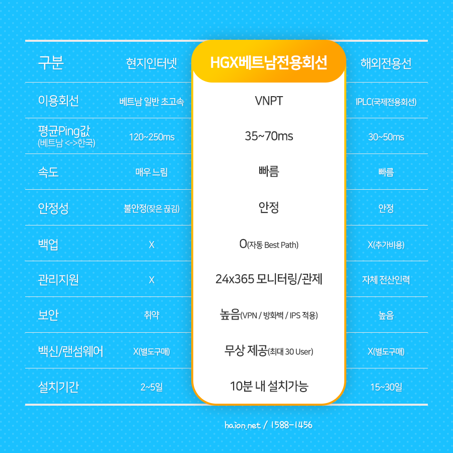
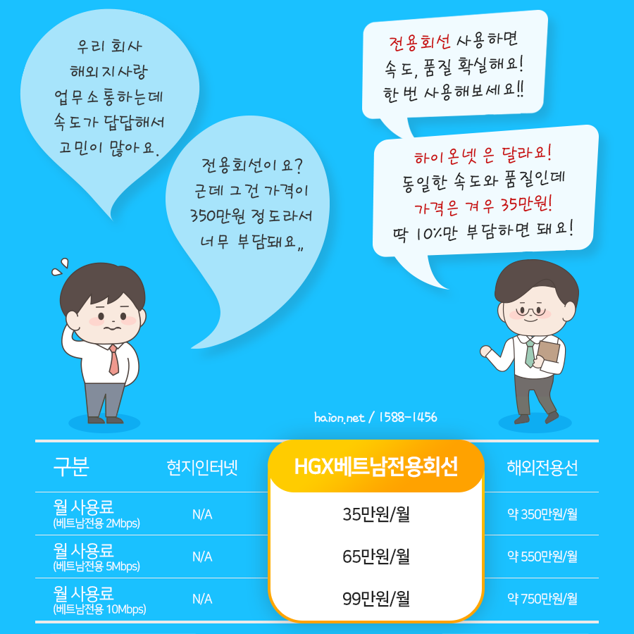

# 한-베트남 비즈니스의 초고속 네트워크 치트키: HGX-VN 베트남 전용선 솔루션

베트남에 현지 공장이나 지사, 해외 법인을 설립하여 활발히 비즈니스를 전개 중인 중소·중견 기업의 네트워크 담당자분들이 이구동성으로 털어놓는 고민이 있습니다. 바로 한국 본사와 베트남 지사 간의 숨이 턱턱 막히는 속도 저하와 잦은 연결 끊김 현상입니다.

본사의 전산 서버나 대량의 ERP 데이터를 실시간으로 로드해야 하는 베트남 법인 직원들은 무한 로딩 앞에서 아까운 업무 시간을 고스란히 낭비하곤 합니다. 심지어 화상회의 중간에 튕기거나 대량의 설계도면(CAD), 데이터 백업 파일 전송이 실패하는 일이 잦아 정상적인 협업이 어려운 지경에 이르기도 합니다.

이러한 해외 트래픽 단절과 지연의 근본 원인을 해결하는 하이온넷의 명품 해결책, <b>HGX-VN 베트남 전용선 솔루션</b>을 소개합니다.

## 해외 네트워크 정체와 끊김이 발생하는 근본 이유

베트남 현지 공용 인터넷망은 외부로 나가는 국가 관문인 해저 광케이블(AAG, APG, IA 등)에 전적으로 의존합니다. 하지만 이 해저 광케이블은 기후 변화, 선박 닻 충돌, 노후화 등으로 인해 수시로 단선 사고가 일어나 복구에만 수주일씩 걸리기로 유명합니다.

게다가 한-베트남 구간은 기하급수적으로 폭증하는 트래픽에 비해 가용 대역폭이 턱없이 부족하여, 일반 공용 인터넷망(Public Internet)을 사용할 경우 데이터 패킷이 정체 구간을 통과하는 과정에서 무더기로 누출되거나(Packet Loss) 응답 지연(Ping)이 수백 ms대로 치솟게 됩니다.

따라서 현지 인터넷 품질을 아무리 비싼 기가급으로 증속해도, 한-베트남 국가 간 관문을 넘는 해외 트래픽 정체는 절대 공용 인터넷 회선으로 극복할 수 없습니다.

## 하이온넷 HGX-VN 베트남 전용선의 혁신적인 원리

하이온넷 HGX-VN은 전통적인 전용망의 강력한 성능과 공용망의 비용 합리성을 동시에 취한 지능형 하이브리드 전용망 솔루션입니다.

* <b>지능형 가상 암호 터널 가속화</b>: 베트남 지사에 간편하게 설치되는 전용 장비(CPE)를 통해, 공용 인터넷 망을 마치 우리 기업만 단독으로 이용하는 사설 고속 전용 터널처럼 기밀하게 승격시킵니다.
* <b>1티어 직결 글로벌 가속 백본망</b>: 베트남 현지 주요 국영 통신사인 비엣텔(Viettel), VNPT 및 한국 메이저 백본망 구간을 중간 필터링 정체 없이 고속 1:1 다이렉트로 연동하여 초고속 전송을 이룩합니다.

## 타사 일반 전용망 대비 압도적인 HGX-VN의 비용 절감폭

.jpg)

많은 기업들이 한-베트남 간의 통신 품질 극복을 위해 물리 광케이블을 단독 포설해 사용하는 일반 국제전용선(IPLC) 도입을 검토하지만, 매달 부과되는 천문학적인 월 요금 때문에 결국 도입을 포기하고 맙니다.

하이온넷 HGX-VN은 이러한 비용 장벽을 완벽히 부숴버렸습니다.

.png)

하이온넷은 베트남 현지 지사의 인프라 구축 비용을 기존 해외전용선 대비 <b>최대 90% 이상 극적으로 절감(1/10 수준의 파격 가격)</b>하면서도, 패킷 무손실 전송(Loss율 0.1% 미만)과 초안정 레이턴시를 완벽 보장합니다.

## 실제 업무 시스템 로딩 및 전송 가속 실측 지표

.png)

하이브리드 다이렉트 백본망을 통과하는 트래픽은 데이터가 가속 처리되어 베트남 현지 공장에서도 마치 국내 본사 사무실에 앉아 일하는 듯한 이질감 없는 네트워크 반응 속도를 즉각 체감하게 됩니다.

* <b>본-지사 간 사내 ERP/그룹웨어</b>: 무한 로딩 대기 현상이 즉시 제거되어 마감 및 전산 처리 업무 생산성이 비약적으로 증가합니다.
* <b>대용량 도면(CAD) 및 파일 전송</b>: 대형 첨부 파일들이 네트워크 정체에 걸려 튕기지 않고 막힘없이 다이렉트로 정시 수신됩니다.
* <b>화상 회의 및 인터넷 전화</b>: 음성 싱크가 밀리거나 화면이 깨지는 현상을 제거하여 끊김 없는 고화질 화상 회의 협업을 선사합니다.

## 365일 24시간 철저한 원격 실시간 관제 및 예방 대응

.png)

기업의 글로벌 비즈니스는 단 1분 1초의 네트워크 두절도 허용하지 않아야 합니다. 하이온넷은 이를 위해 베트남 현지 지사 가속 회선을 철저히 방어하는 밀착 기술 지원을 구현합니다.

* <b>전문 네트워크 엔지니어 실시간 장애 탐지</b>: 365일 24시간 실시간 통합 관제 시스템을 가동하여 미세한 트래픽 손실이나 장비 성능 저하도 선제 포착합니다.
* <b>하드웨어 선출고 교환 시스템</b>: 장비 결함 판정 즉시 최신 교체용 새 장비를 신속히 지사로 배송하여 비즈니스 단절 다운타임을 철저히 방지합니다.

## 복잡한 설정을 건드리지 않는 투명한 기존 인프라 연동

.png)

네트워크 담당자를 가장 골치 아프게 하는 것이 바로 새로운 회선 도입에 따른 사내 방화벽 재설정 및 장비 교체 공사입니다.

하이온넷의 H-CPE 가속 기기는 사내 공유기, L2/L3 스위치, 그리고 Cisco나 Fortinet 같은 고가 방화벽의 라우팅 구조를 훼손하지 않는 '브릿지 모드(Bridge Mode)'로 이중 연동됩니다. 기존 보안 체계와 인프라 구성을 고스란히 온존하며 오직 한-베트남 트래픽에 초고속 가속 부스터만 달아줍니다.

## 100% 무상 사전 장비 임대 및 네트워크 개선 속도 테스트 실측 신청

.png)

하이온넷은 품질에 대한 절대적인 자신감을 바탕으로, 고객사 현장에 장비를 무상 임대하여 속도 개선율을 눈앞의 핑(Ping) 수치와 실측 데이터로 직접 대조해 보실 수 있는 <b>사전 프리 테스트 프로그램</b>을 전면 무상 운영 중입니다.

단 5분이면 회선 개통이 끝나며, 10분 내로 지사 장비 연동이 마감되므로 일체의 비즈니스 중단 없이 우아하게 사전 검증해 보신 후 안전하게 고품질 가속망을 정착시키십시오.

## 하이온넷 글로벌 해외 전용선 사양 비교 총정리

현업 네트워크 담당자분들이 각 솔루션 도입 전 의사결정을 빠르고 정합하게 내리실 수 있도록, 실제 운영 수치 기반의 솔루션 사양 대조표를 아래와 같이 엄숙히 선사해 드립니다.

<table>
<thead>
<tr>
<th>비교 평가 항목</th>
<th>하이온넷 HGX-VN 하이브리드 전용망</th>
<th>일반 소프트웨어 VPN 솔루션</th>
<th>일반 국제전용선 (IPLC 물리 회선)</th>
</tr>
</thead>
<tbody>
<tr>
<td>한-베트남 실측 Ping 수치</td>
<td>최상의 레이턴시 극대화 단축 보장</td>
<td>중간 우회 서버 정체로 잦은 속도 급감</td>
<td>최상의 레이턴시 고정 보장</td>
</tr>
<tr>
<td>패킷 유실률 (Packet Loss)</td>
<td>0.1% 미만 (무손실 전송 보장)</td>
<td>해외망 병목 시간대 10%~30% 폭증</td>
<td>0.1% 미만 (무손실 전송 보장)</td>
</tr>
<tr>
<td>인프라 구축 예산</td>
<td>기존 해외전용선 대비 최대 90% 이상 예산 세이브</td>
<td>매우 저렴 (품질 및 보안 무보장)</td>
<td>매우 비쌈 (월 수백 ~ 수천만 원 상당 부과)</td>
</tr>
<tr>
<td>선로 개통 및 세팅 기일</td>
<td>즉시 5분 내 가상 개통 (지사 10분 설정 마감)</td>
<td>프로그램 다운로드 후 즉각 연동</td>
<td>굴착 공사 및 각국 승인 필요 (4주~8주 이상)</td>
</tr>
<tr>
<td>전문 실시간 트래픽 관제</td>
<td>365일 24시간 실시간 전문 관제 및 예방 패치</td>
<td>사용자 자체 수동 해결 (기술 지원 무)</td>
<td>해당 국가 기간 망 통신사 SLA 지원 (다소 긴 복구)</td>
</tr>
</tbody>
</table>

---

## 실시간 1:1 베트남 전용선 전문 엔지니어 무료 기술 상담 및 테스트 데모 신청

베트남 지사 공장 현업 부서원들의 느리고 불규칙한 업무 통신 끊김 스트레스, 더 이상 고통받으며 비즈니스 손실을 키워가지 마십시오. 하이온넷의 베트남 가속 선로 전문가들이 귀사의 데이터 유실 분석과 함께 확실한 핑(Ping) 개선 폭을 무상으로 완벽 실측 지원해 드립니다.

* <b>하이온넷 대표 통합 고객 전화</b>: 📞 <b>1588-1456</b>
* <b>공식 온라인 테크 포털</b>: 🌐 [www.haion.net](https://www.haion.net)
* <b>특화 장점</b>: <b>100% 무상 장비 임대 및 베트남-한국 가속 성능 수치화 실측 데모 제공</b>
