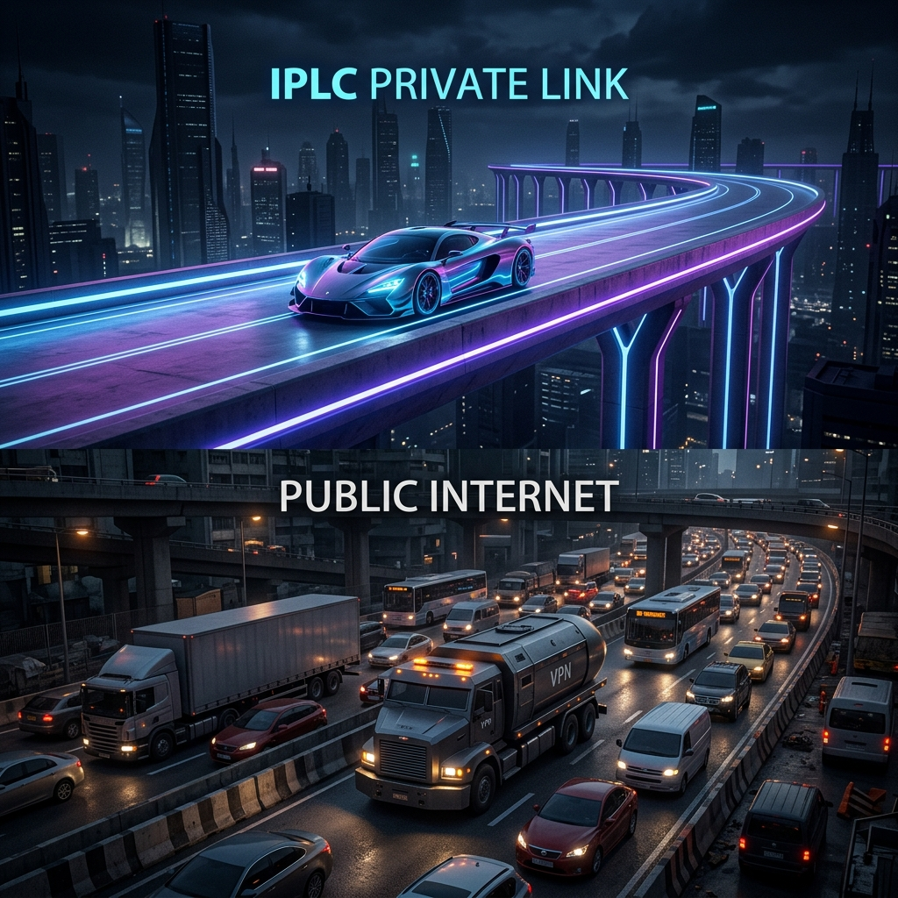

# 대륙을 잇는 글로벌 네트워크 전략: 국제전용회선(IPLC) vs 글로벌 VPN 완벽 가이드

글로벌 시대를 맞아 수많은 국내 기업들이 미국, 중국, 동남아, 유럽 등 전 세계 다양한 국가로 비즈니스 전초기지를 넓혀가고 있습니다. 이에 따라 **'한국 본사와 해외 지사 간의 전산 인프라를 얼마나 안정적이고 안전하게 연결할 수 있는가'**는 기업 비즈니스의 사활을 결정짓는 핵심 과제가 되었습니다.

글로벌 B2B 가설망 설계 시, 실무 담당자들이 가장 핵심적으로 고려하게 되는 기술은 바로 **국제전용회선(IPLC, International Private Leased Circuit)**과 **글로벌 인터넷 VPN**입니다. 

단순히 IP를 우회하는 개인용 VPN 수준을 넘어, 수천 마일 떨어진 대륙 간에 거대한 기업 내부 ERP 데이터, 실시간 제조 공정 제어 패킷을 실시간 수발신하기 위한 두 기술의 핵심 특성과 기술 아키텍처의 격차를 심도 있게 정리해 드립니다.

---

## 01. 국제전용회선(IPLC)의 핵심 특징: 오직 우리 회사를 위한 데이터 초고속 전용선

**국제전용회선(IPLC)**은 국가와 국가 사이에 위치한 두 지점(예: 서울 본사와 샌프란시스코 지사)을 물리적·논리적으로 직접 연결해 주는 **'1:1 기업 단독 독점 통신 대동맥'**입니다. 

쉽게 말해, 수많은 사람들이 몰려 극심한 정체와 병목이 일어나는 퍼블릭 인터넷이라는 일반 고속도로 대신, **오직 우리 회사의 데이터 차량만 단독으로 지나갈 수 있도록 아예 '새로운 물리적 전용 차선'을 해저에 깔아 임대하는 하이엔드 개념**입니다.

* **대역폭 100% 독점 보장 (Dedicated Bandwidth)**
일반 기업 인터넷은 주위 건물이나 다른 가입자의 과도한 다운로드 등 트래픽 정체 상황에 따라 네트워크 대역폭이 상시 출렁입니다. 반면 IPLC는 계약한 대역폭(예: 10Gbps) 전체를 24시간 365일 온전히 계약한 한 기업이 독차지하므로 외부 패킷 폭주의 영향이 전무하며 속도 일관성이 100% 영속 유지됩니다.
* **물리적 차단을 통한 완벽한 은닉 보안 (Physical Security)**
IPLC망 내부의 데이터는 공용 웹(Public Web) 전산 노드 자체로 애초에 나오지 않습니다. 오직 시작점과 끝점을 유선으로 다이렉트 이은 거대 폐쇄 사설망으로만 기밀 정보가 흐르기 때문에, 외부 해커의 잠입 통로나 DDoS 불량 트래픽이 유입될 기회조차 원천 박탈됩니다. VPN처럼 복잡하고 무거운 알고리즘으로 암호화할 필요조차 없을 정도로 물품 보안성 자체가 우수합니다.
* **지연 시간의 한계 극복 (Ultra-Low Latency)**
패킷이 전 세계의 국외 기간망 및 수많은 라우터 허브 노드를 불규칙하게 경유하며 속도가 끊어지는 일반 연결과 달리, IPLC는 두 대륙을 최단 라우팅 패스로 직접 묶어 통신 지연(Ping)을 전송 지리적 한계 수준의 최저값으로 무조건 영속 수렴시킵니다.

---

## 02. 앞서 알아본 VPN과의 결정적 체급 차이

글로벌 B2B 전산망 수립을 고민할 때, 통신망 구축 비용 예산과 요구되는 전산 트래픽 품질 등급에 따라 두 서비스는 확실하게 나뉘게 됩니다. 

* **글로벌 인터넷 VPN - 공용 도로 위에 뚫는 논리적 터널**
인터넷 VPN은 전 세계인이 다 함께 공유하며 탑승하는 공용 퍼블릭 인터넷(Public Internet) 인프라를 이용합니다. 그 위에 가설 장비를 탑재해 논리적으로 안전해 보이는 '암호화 방어막 가상 통로'를 가설하는 합리적인 방식입니다. 
* **국제전용회선 (IPLC) - 해저와 대륙을 잇는 단독 물리 도로**
IPLC는 공용 인터넷 인프라 자체를 타지 않는, 독점적으로 가설된 폐쇄 전용 백본 케이블을 임대하여 운용하는 물리적 독립 전용 통신망입니다.

| 비교 구분 | 🛡️ 국제전용회선 (IPLC) | 🌐 글로벌 인터넷 VPN |
| :--- | :--- | :--- |
| **인프라 형태** | 물리적/논리적 폐쇄망 (독점 임대) | 퍼블릭 인터넷망 내부 가상 터널 (공유) |
| **패킷 전송 경로** | 대륙간 최단 거리 다이렉트 고정 전산망 | 퍼블릭 라우터 노드를 통한 유동적 가변 경로 |
| **속도 보장 품질** | 24시간 365일 계약 대역폭 **100% 완벽 보장** | 공용망 혼잡 상황 및 해외 게이트정체 시 느려짐 |
| **구축 및 유지 비용** | **매우 비쌈** (지리적 거리, 대역폭 따라 기하급수적) | 상대적으로 저렴함 (월정액 인터넷 비용 + VPN 장비) |
| **구축 필수 목적** | 단 0.1초의 통신 지연 및 패킷 유실도 불허하는 핵심 업무 | 일반적인 글로벌 화상 회의, 자료 공유, 가성비 업무망 |

---

## 03. 어떤 비즈니스 상황(어떤 기업)에서 필수적으로 도입할까?

국제전용회선은 약정하는 거리와 요구 대역폭 스펙에 따라 월 수천만 원에서 수억 원에 달하는 막대한 전산 인프라 비용 예산이 수반됩니다. 따라서 단순히 직원들의 이메일 수발신이나 소규모 문서 보고 수준에서는 쓰이지 않으며, **'단 몇 밀리초(ms)의 통신 단절이 즉각적으로 수억, 수십억 원의 실제 매출 손실로 직결되는 핵심 비즈니스 군'**에서 선택 도입하게 됩니다.

1. **글로벌 금융 거래소 및 외환 투자 증권사**
   * 초 단위가 아닌 0.001초 미세 찰나의 네트워크 딜레이 격차로 실시간 수억 엔의 차익 거래 향방이 갈리는 고빈도 매매(HFT, High-Frequency Trading) 인프라나, 국가 간 최고 등급의 보안 송금 데이터 교환이 요구되는 글로벌 중앙은행 간 전산 백본 연동망에 반드시 사용됩니다.
2. **글로벌 대형 스마트 팩토리 제조 대기업**
   * 국내 본사 기술 전산 허브와 동남아(베트남, 중국 등) 현지에 건설된 대단위 로봇 조립 제조 라인, 생산설비 기기(MES, 제조 실행 시스템) 간에 정밀한 기계 작동 원격 제어 신호를 주고받을 때 사용합니다. 만약 찰나의 인터넷 순단(끊김) 현상이 생기면 현지 로봇 팔이 오작동하여 수조 원짜리 웨이퍼나 조립 라인 전체 자재가 오염 소멸하는 재앙을 예방합니다.
3. **글로벌 IT 메이저 공룡 플랫폼 및 클라우드 기업**
   * 전 세계 주요 요충지에 구축된 하이퍼 스케일 데이터 센터(IDC) 상호 간에 대용량 동기화 및 동영상 전송, 실시간 백업 데이터를 주고받거나, 글로벌 동시 접속 배틀로얄 게임 서버의 핑을 완벽하게 하나로 통일시키는 중심 뼈대 네트워크로 채택합니다.

---

## 04. B2B 기술의 세대교체: 하이브리드 전용망 IEPL 및 글로벌 MPLS VPN으로의 확장

과거의 고전적이고 전통적인 IPLC 전송선은 완벽한 전용 대역을 독점 제공하는 뛰어난 안정성에도 불구하고, 트래픽 증설을 위한 설비 추가 시 엄청난 장비 구축 시간과 높은 요금제 문턱, 다소 유동성이 결여된 고정 대역 운용이라는 한계점이 있었습니다.

이에 따라 현대 B2B 통신 서비스 시장은 한 단계 더 진화하여, 대역폭 유연성과 실리적인 네트워크 비용 모델을 양립하는 하이브리드 솔루션으로 스펙트럼을 넓혀 제공 중입니다.

* **IEPL (International Ethernet Private Line)**
  * 전통적인 전파 전송선 방식인 IPLC의 막강한 1:1 독점 보안 장점은 그대로 온존 계승하면서, 소프트웨어적 제어가 유연한 광대역 이더넷(Ethernet) 프로토콜 규격을 연동한 진화된 전용선입니다. 이로 인해 기업 고객이 원할 때 언제든지 대역폭 스펙을 온라인 전산 명령으로 유연하게 스케일 아웃 및 다운이 가능해 유지 효율이 뛰어납니다.
* **글로벌 MPLS VPN (Multi-Protocol Label Switching)**
  * 퍼블릭 인터넷이 아닌, 통신사가 자체 운영하는 초고속 독자 사설 전송망(MPLS 백본 가속망) 내부에 라벨 기반의 가상 보안 경로를 가설해 전용선 수준의 저지연 안정성을 서비스하는 대표적인 '가성비 하이브리드 기업 전용 통신 가설망'입니다. 완전한 단독 해저 광선(IPLC)을 까는 비용 대비 30~50% 이상의 인프라 고정비를 절감하면서 기업용 전산 전용선에 육박하는 훌륭한 속도 품질을 확보해 줍니다.

---

* 글로벌 통신 비즈니스 인프라는 회사의 지속 성장과 보안 무결성을 완벽히 구현하는 인프라 기초 체력입니다. 전 세계 주요 B2B 회선 인프라 허브망을 완비한 **하이온넷**은 전통적인 하이엔드 국제전용회선(IPLC/IEPL)부터, 기업 예산안에 맞춰 탁월한 비용 효율성을 도출하는 고품질 글로벌 가속 사설 VPN 솔루션까지 완벽 제공하고 있습니다. 지금 하이온넷 원격 기업 전문 고객 상담 채널을 통해 귀사에 딱 맞는 세계 연결 패스를 무상 진단받아보세요!
