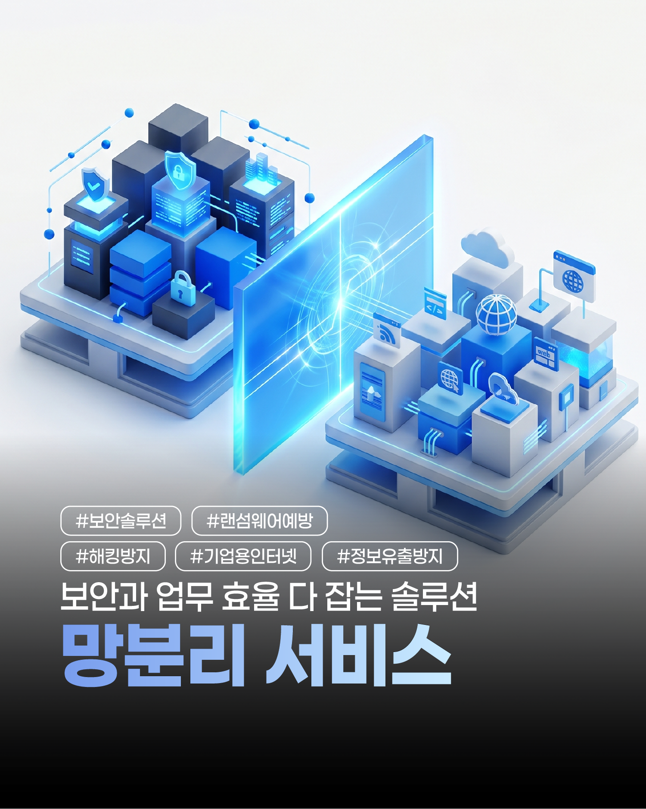
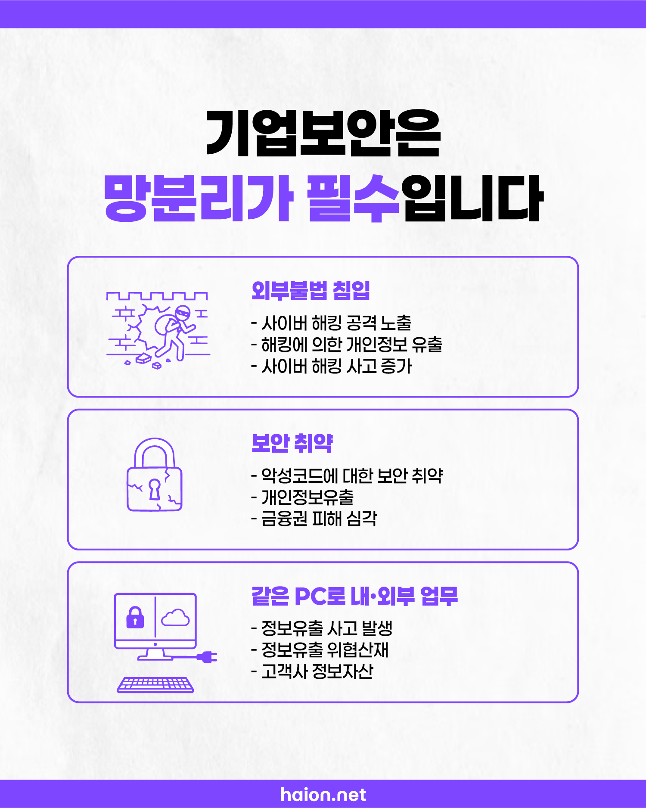
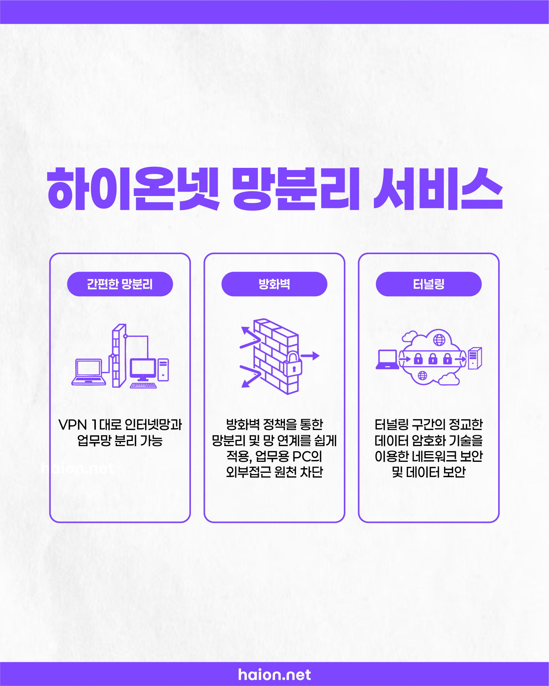
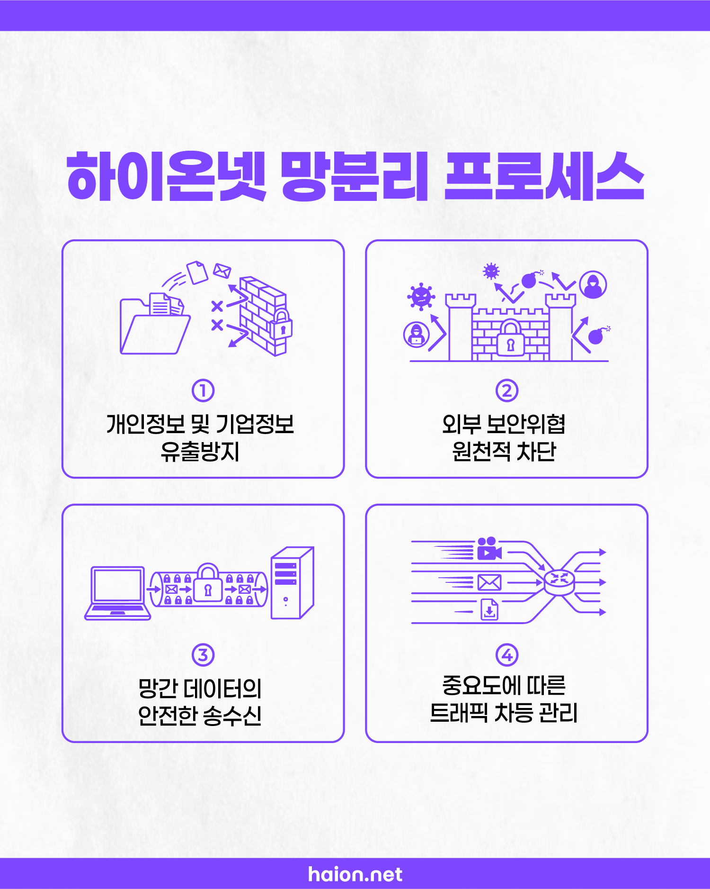
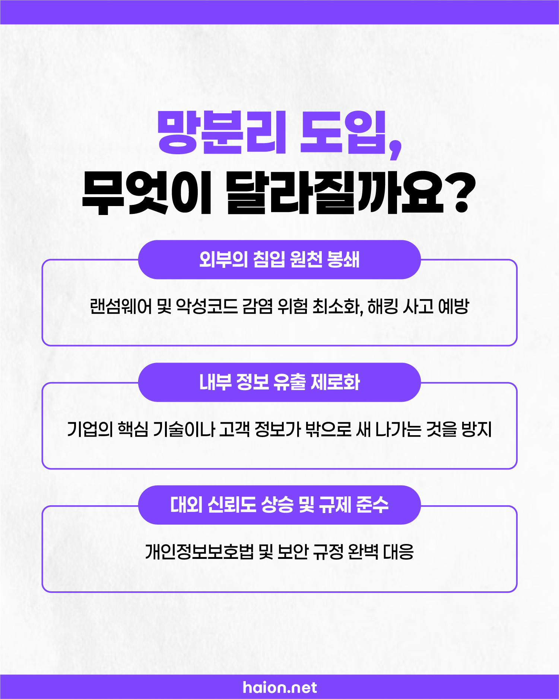

# 정보 유출 원천 매립 선언: 하이온넷 VPN 이중 망분리 및 강력한 네트워크 이원화

인터넷 익스플로러나 크롬 브라우저를 통해 악성 광고 배너를 수시로 누르는 사내 PC와, 회사 대외비 핵심 마스터 설계 도면 및 수십만 명의 고객 카드 정보 DB가 보관된 인트라넷 서버가 단 한 대의 공유기 허브 하단에 여과 없이 함께 엮여 작동하고 있지는 않으신가요? 

이러한 느슨한 단일 네트워크 구조는 사내 단 1명의 신입 직원이 악성 피싱 메일을 클릭해 실행하는 찰나의 실수만으로도 사내 모든 업무 전산망과 백업 장치를 통째로 좀비 랜섬웨어 오염 감염시키는 치명적 도미노 파멸을 야기합니다. 최강의 네트워크 논리 구획 제어 기술을 통해 사내 업무 전용 데이터 전송망과 고대역 인터넷 서핑망 사이에 물 한 방울 통과할 수 없는 거대 철문 장벽을 가설해 드리는 <b>하이온넷 VPN 고성능 통합 망분리 서비스</b>의 실전 요약 가이드를 소개합니다.

## 위협의 온상: 같은 PC와 대역으로 수발신하는 내·외부 통신망

망분리가 완비되지 않은 평이한 사내망 구조는 외부의 교묘한 타겟형 스캔 해커들에게 열려 있는 오픈 게이트와 같습니다.

* <b>외부 불법 침입</b>: 타겟형 스피어 피싱 공격, 포트 취약점 강제 오버플로우를 통한 사내 망 스캔 노출 증가.
* <b>보안 취약점 악성코드 전파</b>: 단 1대 감염 시, 수평 이동(Lateral Movement) 기법을 통해 사내 모든 ERP 허브 감염.
* <b>정보 자산 가로채기</b>: 고객 식별 데이터 및 회사 내부 설계 도면이 불량 스파이웨어 채널을 통해 은밀히 탈출 유출.

## 하이온넷이 제시하는 혁신: 고성능 VPN 단 1대로 구축하는 완벽 이중 격리

수천만 원 상당의 기가비트 이중 물리 허브 장비를 대량 일시불 매입할 필요가 결코 없습니다. 하이온넷은 전산 예산의 극적인 세이브를 주도합니다.

1. <b>간편한 인라인 VPN 망분리</b>: 인터넷 게이트웨이 입구 단에 하이온넷 전용 VPN 1대를 인라인 결합하는 것으로, 업무용 가설 IP 구역과 일반 인터넷 대역을 칼로 자르듯 분할 가속 격리 구동합니다.
2. <b>방화벽 정책의 엄격한 제어</b>: 업무용 내부 PC 군이 승인되지 않은 비인가 사이트나 클라우드로 몰래 정보 업로드를 감행하려 할 시 관문 필터링 단계에서 상시 완벽 정지 컷 차단합니다.
3. <b>정교한 가설 터널링 암호화</b>: 본사 내부 DB와 전국 지사나 연구소 간 전송되는 기밀 패킷 데이터를 뚫을 수 없는 군용 등급 터널링 암호화 기술에 봉인하여 수송합니다.

## 흔들림 없는 완벽 보안 실현 프로세스 4단계

하이온넷 엔지니어 기술진은 고객사 인프라에 꼭 필요한 핵심 가치 지표 4가지를 최우선 단행합니다.

1. <b>정보 유출 원천 매립</b>: 개인정보 대량 아카이빙 보안 가설 장막을 철저하게 구축.
2. <b>외부 위협 게이트 컷</b>: 악성 백도어나 비인가자 포트 스캔 패킷 침투 시 관문 단계 즉시 봉쇄.
3. <b>망간 연계 터널 안전 암호화</b>: 인라인 필터를 통과한 정상 승인 데이터의 고대역 안전 송수신 완수.
4. <b>QoS 트래픽 관리</b>: 대용량 멀티캐스트 통신 폭주 시에도 ERP 등 중요 사내 트래픽 대역폭을 최우선 무정전 고정 보존.

## 도입 즉시 가져오는 압도적 변화: 비즈니스의 평온과 도약

망분리 솔루션 도입은 단순한 보안 셋업 변경을 넘어, 귀사의 지속 성장과 평판 보위를 이끄는 최고 권위의 컴플라이언스 마크가 됩니다.

* <b>외부 침입 원천 거부</b>: 악성코드 및 유해 랜섬웨어 유입 통로 소멸로 자산 감염 파괴 피해 최소화.
* <b>핵심 유출 제로 보정</b>: 경쟁사 유출 시 돌이킬 수 없는 특허 업무 문서 및 설계 파일 철통 밀폐.
* <b>대외 규제 준수 프리미엄</b>: 공공 조달 입찰, 금융 거래 규격 및 개인정보보호법 실사 기준을 당당하고 쾌적하게 100% 만족.

## 24시간 365일 쉼 없이 열려 있는 다이렉트 소통 파트너십

보안 가설 터널링 구성 및 망 연계 설정 문의를 위해 하이온넷 긴급 전담 소통 창구를 상시 적극 오픈해 두었습니다.

* <b>네트워크 통합 설계 안내</b>: 📞 <b>1588-1456</b>
* <b>전담 기술 지원 모바일 직통</b>: 📱 <b>010-9945-7510</b> (업무 시간 09:00 ~ 18:00 상시 1:1 실시간 즉각 패치 적용)
* <b>실시간 스마트 톡상담</b>: 카카오 채널에서 <b>@실시간 채팅상담</b> 검색 친구 추가 등록
* <b>무료 보안 진단 특전</b>: 우리 회사의 현재 단일 IP 공유기망 보안 취약성이 몇 점인지 정밀 체크해 보실 수 있는 <b>무상 사전 네트워크 보안 점검 및 무료 기술 진단</b> 세션을 상시 100% 무료 공급 중입니다.
