# 우리 기업 전산망과 면학 공간의 완벽한 철옹성 방패: 하이온넷 UTM 종합 보안 서비스

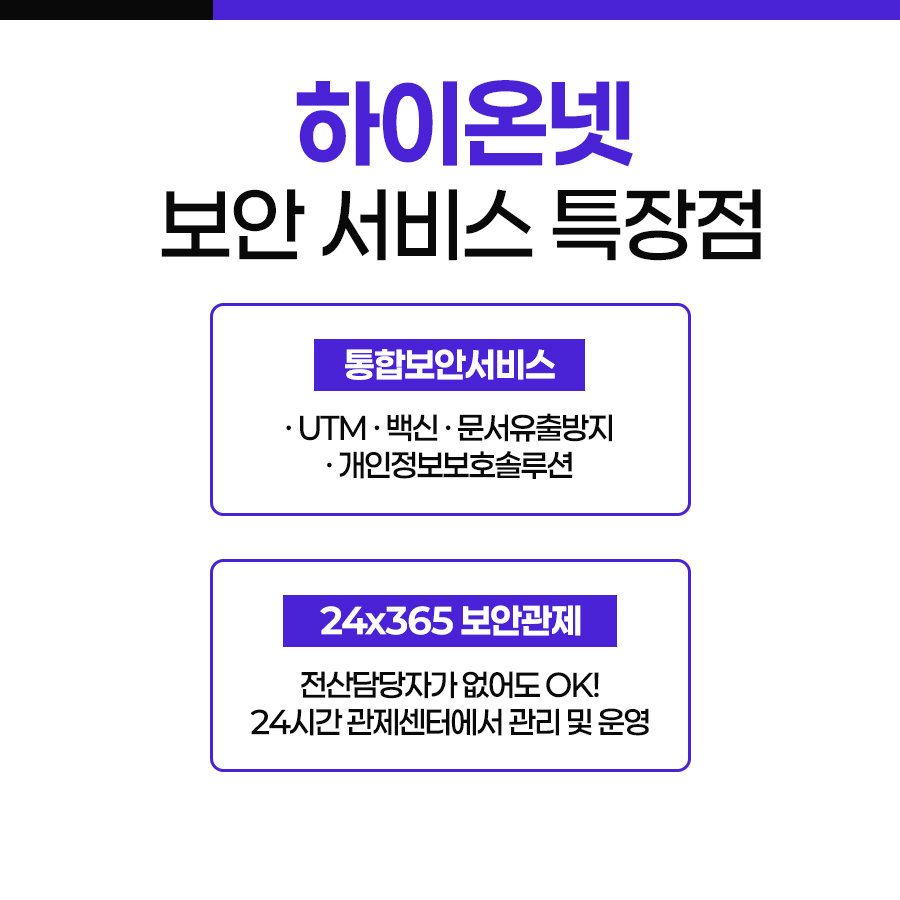

고객들의 민감한 금융 거래 정보와 고유 식별 개인정보를 상시 취급하는 기업, 혹은 기밀 핵심 설계도면이나 특허 업무 파일이 잠들어 있는 사내 전산 서버를 보안 필터링 장치 없이 일반 초고속 공유기 회선에 그대로 노출해 두고 계시지는 않으신가요? 

인터넷에 흐르는 수많은 트래픽 속에는 무차별적인 DDoS 침입 공격, 랜섬웨어 악성 배포 패킷, 그리고 관리자도 모르게 은밀히 기밀 유출 통로를 뚫는 악성 스파이웨어가 항시 침투 경로를 엿보고 있습니다. 사내 전담 보안 인력을 확보하기 어려운 중소·중견 기업부터, 딴짓 없는 100% 완벽한 학습 분위기 구축이 당면 과제인 학원가 원장님들의 가장 정교하고 실리적인 인프라 보완책, <b>하이온넷 지능형 다중 필터 방화벽 UTM 서비스</b>의 무결한 도입 가이드를 소개합니다.

## 하이온넷 지능형 UTM 방화벽을 주력 도입해야 하는 5가지 핵심 메리트

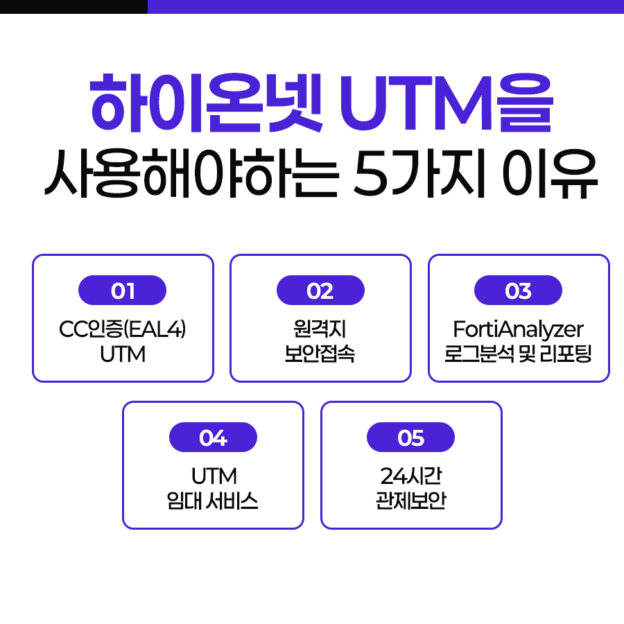

하이온넷의 UTM(통합 위협 관리) 서비스는 단순한 IP 제한 스크리닝을 뛰어넘어, 최신 공인 보안 규격을 완비하고 철저한 관제 가드를 제공하는 최고 등급의 올인원 어플라이언스망을 구축합니다.

* <b>CC인증 EAL4 등급 공인 검증</b>: 국가 관공서 및 금융 정보 보안 준수 표준을 당당히 획득한 검증된 차세대 물리 방화벽 장비를 공급합니다.
* <b>본-지사 간 안전한 암호 터널 (SSL VPN)</b>: 외근 중이거나 재택근무, 혹은 해외 원격 지사에서도 사내 보안 전산망에 기밀하게 우회 접근할 수 있는 고강도 다중 보안 채널을 형성합니다.
* <b>FortiAnalyzer 연동 정밀 리포팅</b>: 현재 사내 트래픽 중 어떤 이상 통신 흐름이 감지되었으며 어떤 사이트로 침입 시도가 있었는지 정교한 분석 로그 데이터 보고서를 실시간 투명 제공합니다.
* <b>합리적인 소액 임대(렌탈) 정책</b>: 초기 수백만 원에 호가하는 방화벽 기기 및 에이전트 소프트웨어 일시불 구매비용 부담을 완벽 소멸시켜 드립니다.
* <b>365일 24시간 실시간 통합 보안 관제</b>: 사내에 골치 아픈 전산 전문가를 채용하지 않아도, 하이온넷 관제 허브 엔지니어들이 트래픽 장벽을 상시 요새화하여 방어해 드립니다.

## 타사 대비 압도적인 하이온넷 자체 기술력 및 밀착 케어 시스템

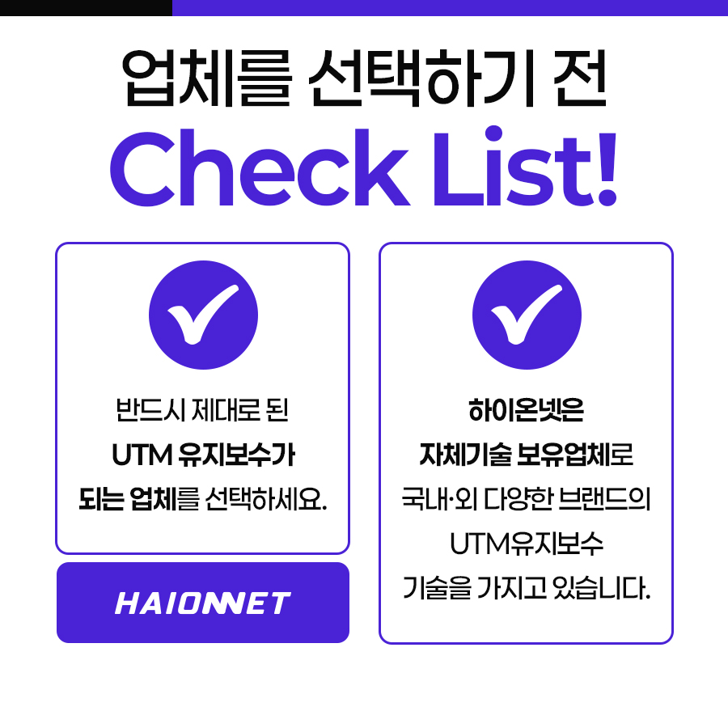

단순히 장비를 배송하여 납품하는 데 그치는 유통 업체와 비교를 엄숙히 불허합니다. 하이온넷은 축적된 자체 가속 기술망 네트워크 엔지니어링 역량을 바탕으로 전 세계 메이저 브랜드 방화벽 기기들의 정밀 유지보수 능력을 정합해 두고 있습니다.

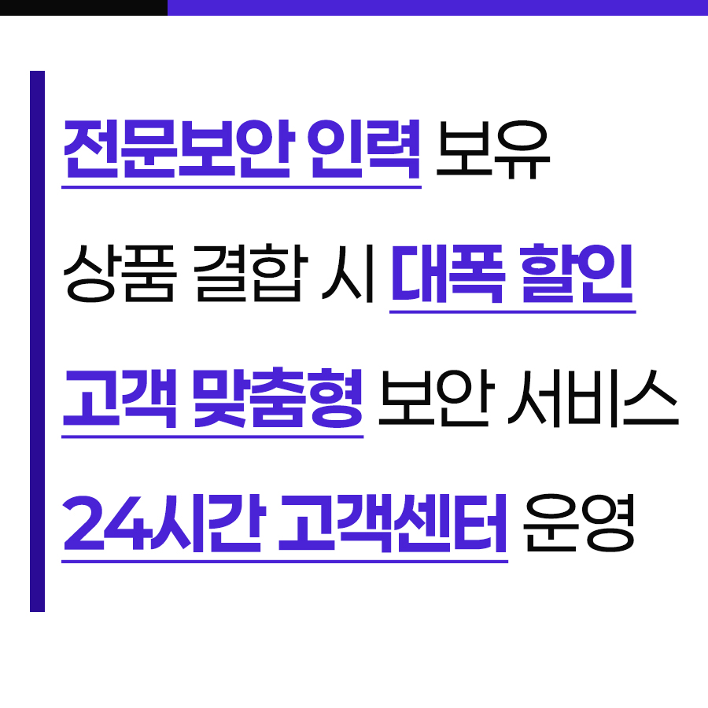

고객사의 통신 포트 변경, 블랙리스트 세팅 조정 요구 등 돌발 정책 수정 건이 일어날 때마다 외주 업체 지연 대조 없이 하이온넷 전담 헬프데스크 및 24시간 긴급 서포트 창구를 통해 숙련된 기술진이 실시간 원격 다이렉트 패치를 무상 단행해 드립니다.

## 랜섬웨어 및 정보 유출 원천 박멸 3중 융합 보안 대책 패키지

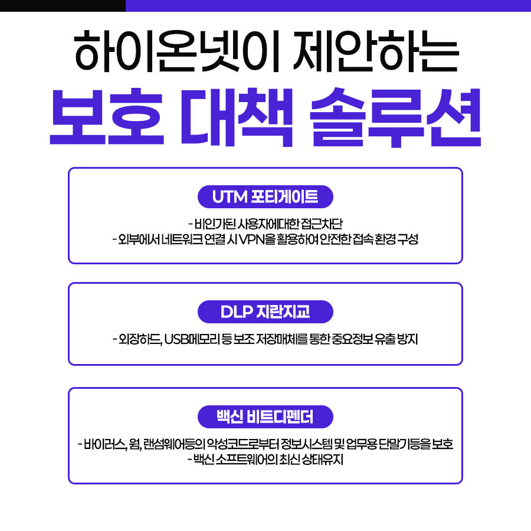

하이온넷은 네트워크 초입 장비 제어와 개별 사용자 단말(Endpoint) 영역을 동시에 입체 방어하는 <b>3대 시너지 보호망</b>을 일체형 결합 패키지로 맞춤 제안해 드립니다.

1. <b>UTM 포티게이트</b>: 외부 경계선상에서 승인되지 않은 부정한 비인가자의 강제 스캔 침입을 입구 컷 차단하고 본-지사 원격 구간 암호 전송로(VPN)를 확보합니다.
2. <b>DLP 지란지교</b>: USB 드라이브, 외장 HDD, 모바일 기기 무단 장착 등 보조 저장매체를 통해 사내 업무 문서나 핵심 설계 도면이 불법 탈취되는 정보 유출 경로를 철저히 차단 제어합니다.
3. <b>백신 비트디펜더</b>: 최신 랜섬웨어, 고도 지능형 악성 웜 바이러스 침투 순간에 단말기 내 저장 장치의 암호화 감염을 정교하게 방어하고 시스템 오염을 격리합니다.

## 거품 없는 합리적인 하이온넷 엔터프라이즈 결합 요금 실측 가격표

중소기업 네트워크 관리자분들의 기안 예산 승인을 도울 수 있도록, 실제 장비 대수 및 소프트웨어 라이센스 수량이 모두 매칭된 정량 패키지 가격 대조표를 아래와 같이 투명하게 대령해 드립니다.

<table>
<thead>
<tr>
<th>패키지 분류</th>
<th>결합 제공 스펙 및 솔루션 수량</th>
<th>월 서비스 요금 (VAT 별도)</th>
</tr>
</thead>
<tbody>
<tr>
<td>소규모 전산망 (5인 패키지)</td>
<td>- CC인증 엔터프라이즈형 고성능 UTM 장비 1대 임대 - 최신 랜섬웨어 차단 비트디펜더 백신 에이전트 5 Copy - 기밀 문서유출방지 DLP 지란지교 에이전트 5 Copy</td>
<td>73,000 원</td>
</tr>
<tr>
<td>중소형 사무실 (30인 패키지)</td>
<td>- CC인증 엔터프라이즈형 고성능 UTM 장비 1대 임대 - 최신 랜섬웨어 차단 비트디펜더 백신 에이전트 30 Copy - 기밀 문서유출방지 DLP 지란지교 에이전트 30 Copy</td>
<td>223,000 원</td>
</tr>
</tbody>
</table>

## 기업 네트워크 방화벽 구성 및 지능형 위협 차단 메커니즘

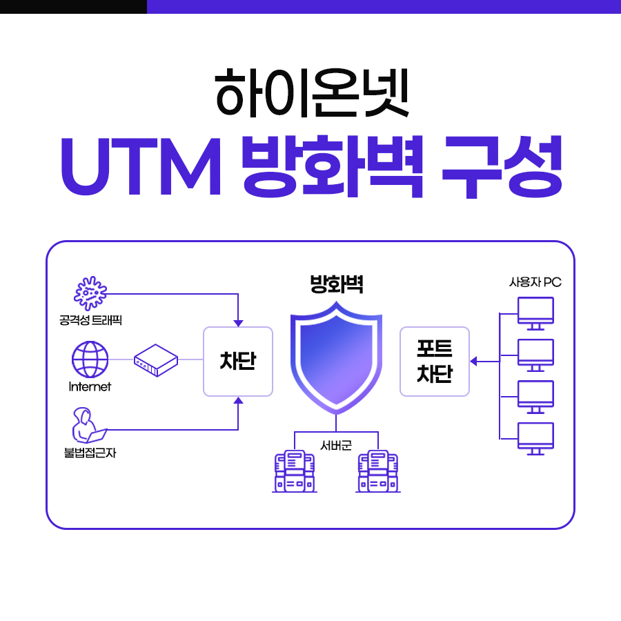

하이온넷의 UTM 보안 방화벽은 인터넷망과 업무용 사내 서버 및 사용자 PC 군 사이에 인라인 교차 통제 방식으로 배치되어, 정상적인 데이터 패킷만 통과시키고 악성 트래픽은 원천 정지 격리시킵니다.

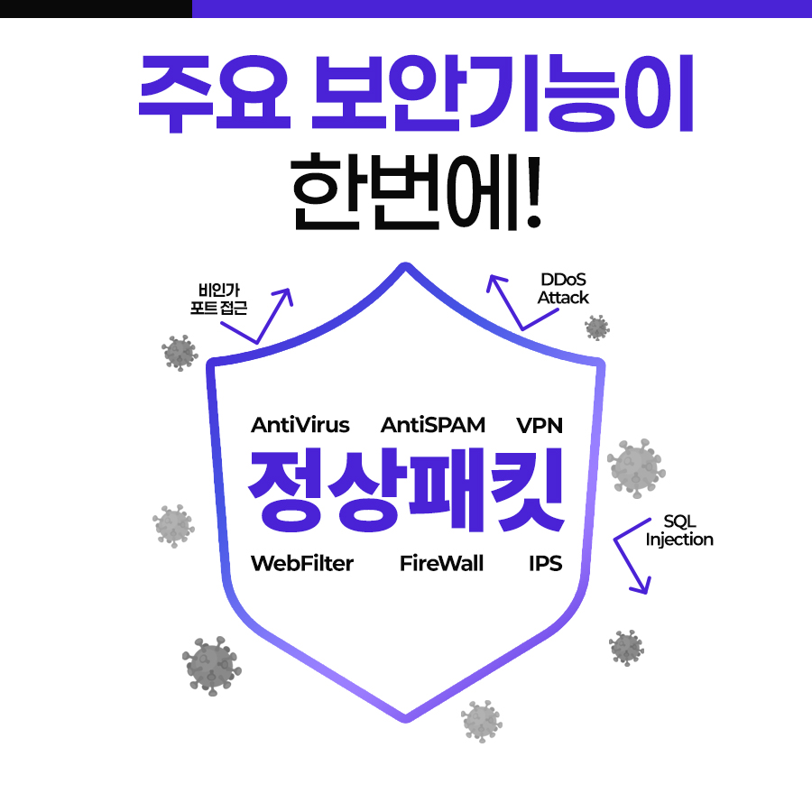

비인가된 포트를 뚫고 기어 들어오려는 원격 무단 접근, 타사 사이트를 정지시키는 DDoS 공격, 그리고 웹 데이터베이스를 탈취하려는 SQL Injection 시도를 UTM 엔진 내부의 AntiVirus, AntiSPAM, IPS, WebFilter 가속 필터링이 일차 차단 보정하여 깨끗하게 정화된 정상 트래픽 연속성을 보장합니다.

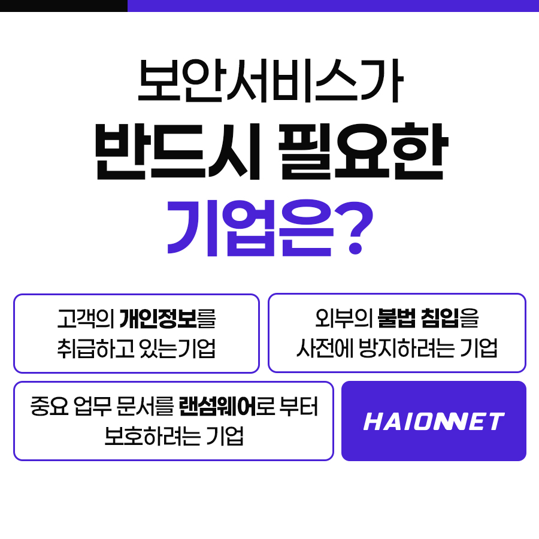

특히 개인정보보호법에 의거하여 고객의 금융 정보나 가입 민감 데이터를 전산 데이터로 가공 및 온존 보관 중인 기업, 비인가 접속자를 원격 필터링하려는 전산실, 랜섬웨어 감염 시 복구가 불가능한 고부가가치 R&D 연구소 및 스타트업에게 필수적인 인프라 백신입니다.

## 국내외 글로벌 TOP 브랜드 방화벽 하드웨어 완벽 대응 라인업

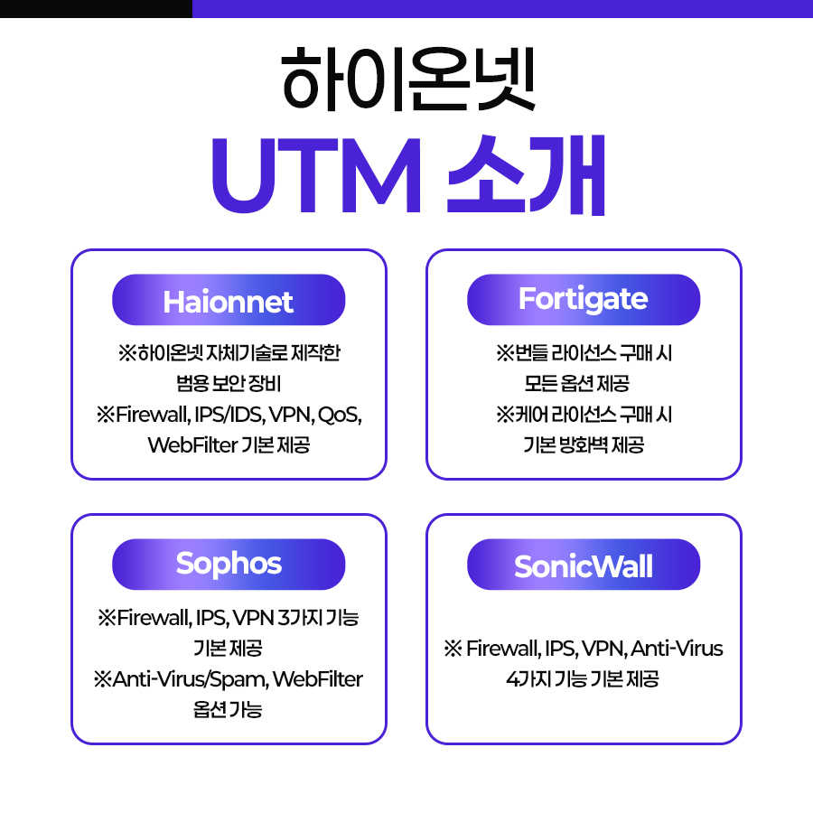

고객사 내부의 회선 요건 및 트래픽 규모에 알맞게 선택하실 수 있는 다각적인 장비 라인업 포트폴리오를 제공합니다.

* <b>Haionnet (하이온넷 자체 범용 보안 장비)</b>: 하이온넷 독자적 기술로 정교화한 범용 보안 어플라이언스입니다. Firewall, IPS/IDS, VPN, QoS, WebFilter 기능을 기본 장전하여 합리적인 비용에 서비스합니다.
* <b>Fortigate (글로벌 1위 포티게이트)</b>: 모든 번들 보안 라이센스 탑재 제어부터 기본 방화벽 모드를 수행하는 케어 라이센스 제어까지 1:1 최적화 셋업을 완벽 수행합니다.
* <b>Sophos (소포스 방화벽)</b>: Firewall, IPS, VPN 3가지 통제 기술을 기본 장착하며 필요 요구 사양에 맞춰 Anti-Virus, Anti-Spam, WebFilter 옵션 가속을 자유롭게 커스터마이징합니다.
* <b>SonicWall (소닉월 방화벽)</b>: 대량의 동시 세션 처리를 자랑하는 고성능 Firewall, IPS, VPN, Anti-Virus 통합 기능을 기본 세팅 패키징하여 안전하게 공급해 드립니다.

## 스터디카페 및 독학 재수 기숙학원 맞춤형 안심 면학망 화이트리스트 차단 솔루션

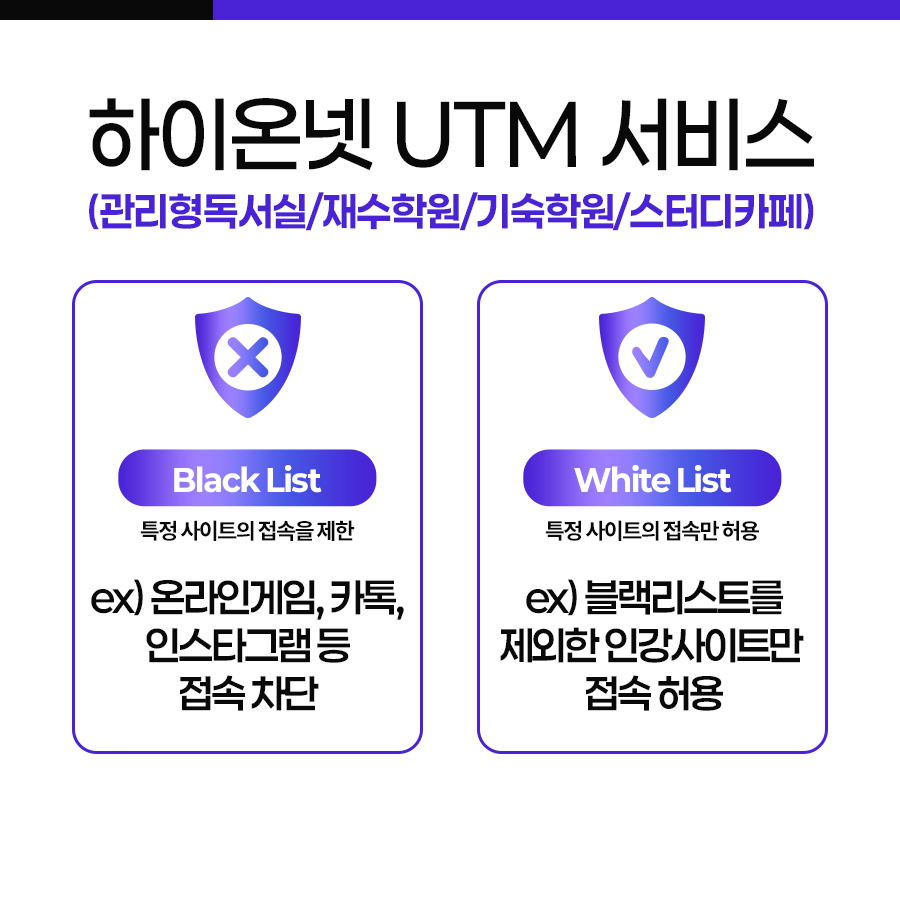

인터넷 강의용 태블릿과 PC 환경이 무상으로 보급된 오늘날의 학습실 풍경에서 원장님들과 관리 강사분들이 매일 씨름하는 고질적인 딴짓 스트레스가 있습니다. 바로 공부하라고 지급해 준 기기를 통해 인스타그램 피드를 넘기거나, 틱톡 쇼츠를 시청하고, 온라인 게임이나 카톡 대화방을 켜두는 행위입니다.

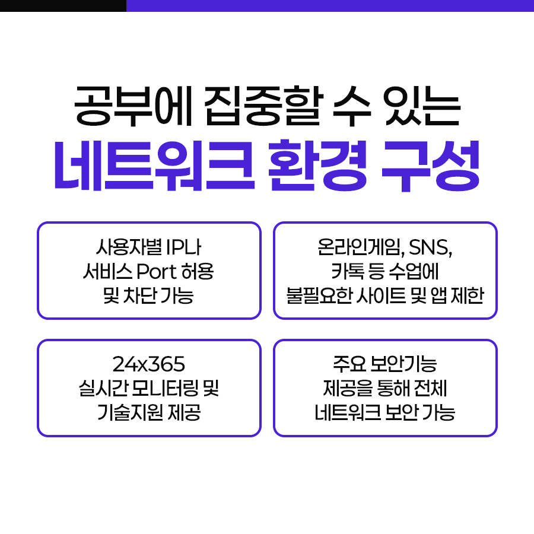

하이온넷은 이를 획기적으로 개선하는 <b>학원가 특화 화이트리스트 면학 필터링 시스템</b>을 전격적으로 완성했습니다. 

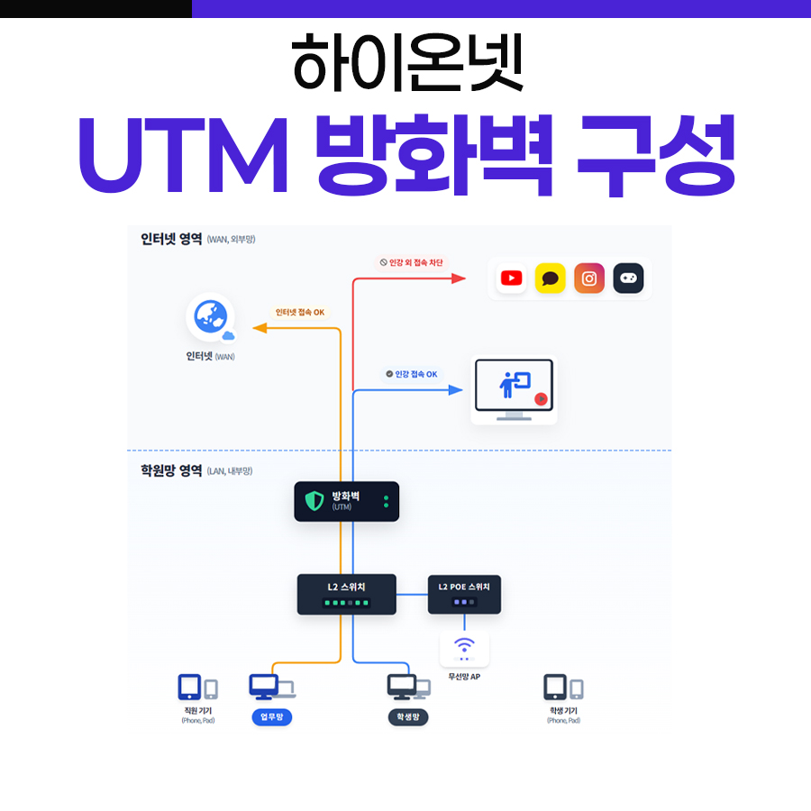

학원 내의 내부망(LAN) 영역에서 학생들이 외부 인터넷망(WAN)으로 나갈 때, 하이온넷 UTM 지능형 화이트리스트 가드가 학생 기기의 통신 대역을 정밀 제한하여 <b>오직 사전 지정된 온라인 강의(인강) 사이트와 교육 포털만 100% 정상 로딩</b>되도록 문을 열어두고, 인강 외 모든 게임, SNS, 메신저 접속 시도는 방화벽 게이트웨이 단계에서 완벽하게 차단 알림 및 연결 불가 처리를 수행합니다.

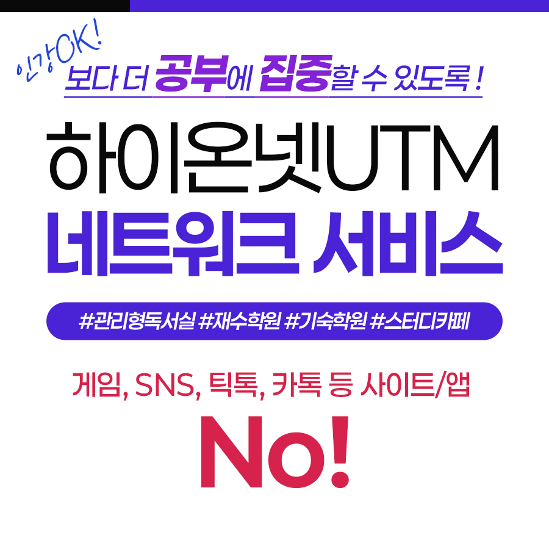

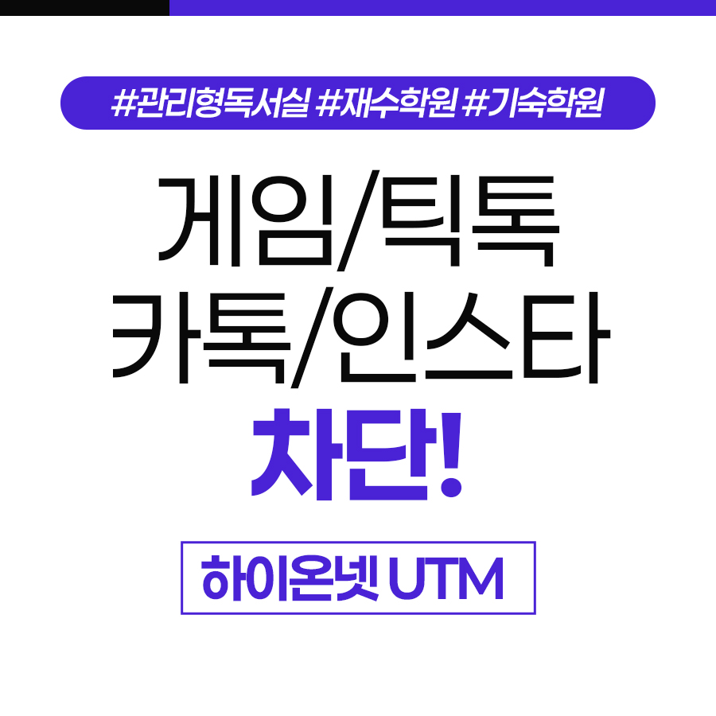

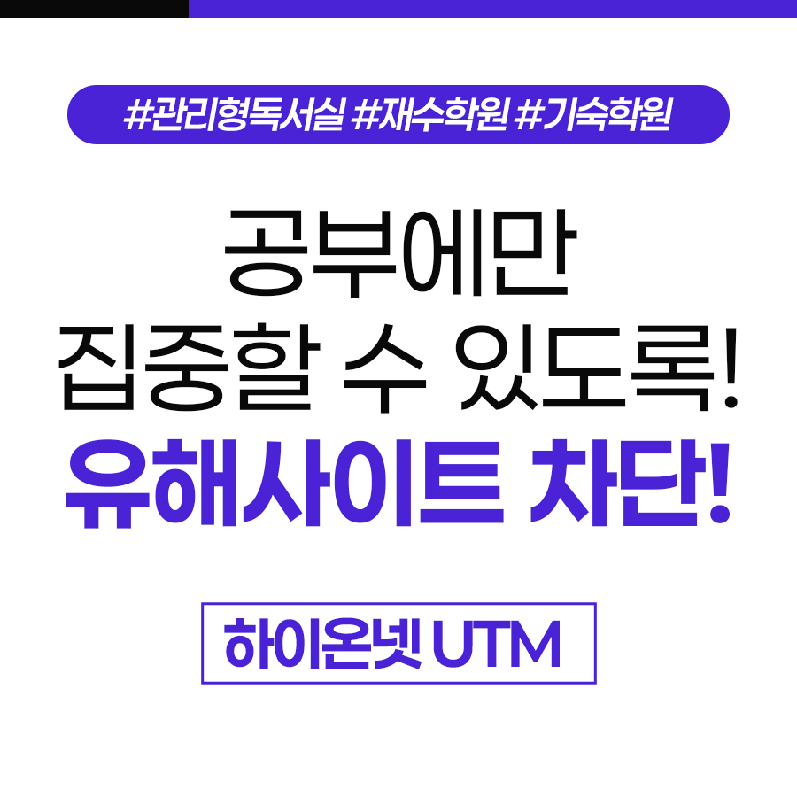

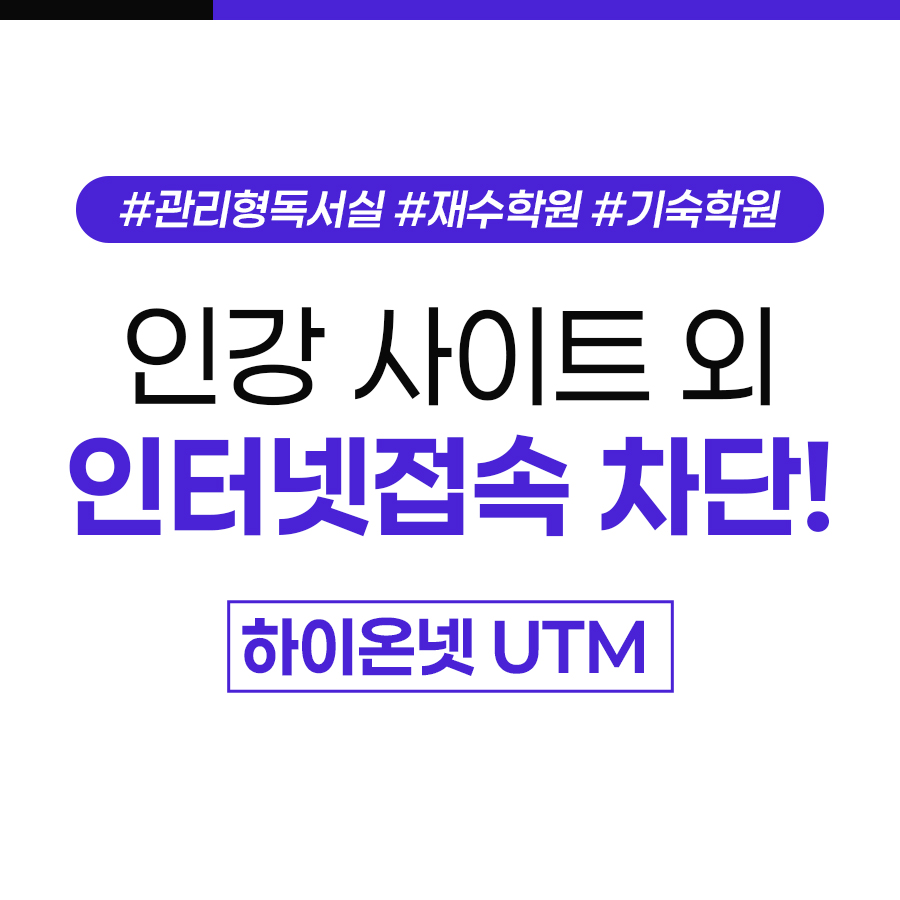

관리형 독서실, 독학 재수학원, 명문 기숙학원 및 프리미엄 스터디카페 현장에서 도입 즉시 강사가 일일이 태블릿 뒤로 다가가 감시할 필요가 없는 완벽하게 깨끗한 스마트 무결 면학 환경이 완벽 실현됩니다.

## 하이온넷 지능형 UTM 보안 서비스 상세 비교 대조표

업무 전산실 담당자 및 학원 행정 실무자분들이 직관적인 차이점을 한눈에 파악할 수 있도록 솔루션별 특화 지표를 선사합니다.

<table>
<thead>
<tr>
<th>비교 평가 영역</th>
<th>하이온넷 지능형 관리형 UTM 서비스</th>
<th>일반 소프트웨어형 웹 필터 방식</th>
<th>시중 가정용 공유기 간이 차단</th>
</tr>
</thead>
<tbody>
<tr>
<td>공인 보안 인증 신뢰성</td>
<td>CC인증 (EAL4 등급) 최고 안심 마크 획득</td>
<td>없음 (단순 소프트웨어 조작 방식)</td>
<td>전무 (보안성 검증 및 해킹 취약)</td>
</tr>
<tr>
<td>화이트리스트 통제 강도</td>
<td>네트워크 관문 단독 제어로 100% 차단 완결</td>
<td>우회 프로그램 설치 시 손쉽게 무력화</td>
<td>미지원 또는 극히 초보적 키워드 제한</td>
</tr>
<tr>
<td>DLP / 백신 시너지 결합</td>
<td>지란지교 DLP & 비트디펜더 백신 3중 정합 지원</td>
<td>개별 소스 구매 필요 (대형 추가 예산 발생)</td>
<td>개별 에이전트 연동 불가 (방치 상태 유지)</td>
</tr>
<tr>
<td>24시간 실시간 전문 관제</td>
<td>하이온넷 전용 관제 센터 365일 실시간 관제 연동</td>
<td>장애 시 고객이 직접 자체 복구 시도</td>
<td>기술 지원 전무 (공유기 리셋 외 조치 불가)</td>
</tr>
</tbody>
</table>

## 1:1 하이온넷 UTM 방화벽 및 학원 집중망 무료 기술 진단 신청

외부의 지능형 해킹 공격과 불시 랜섬웨어 위협, 그리고 학습을 방해하는 원인 불명의 유해 트래픽 대역폭 낭비로부터 전산망을 안전하게 지키십시오. 하이온넷의 전문 네트워크 보안 엔지니어들이 귀사 사내 PC 및 학원 단말기 수량에 완벽하게 부합하는 가장 합리적인 가성비 UTM 결합 최적화 견적을 신속 상담해 드립니다.

* <b>하이온넷 UTM 보안 관제 통합 센터</b>: 📞 <b>1588-1456</b>
* <b>공식 온라인 테크 포털</b>: 🌐 [www.haion.net](https://www.haion.net)
* <b>특화 서비스</b>: <b>100% 무상 사전 장비 임대 및 화이트리스트 차단 성공률 사전 눈앞 대조 테스트 지원</b>
