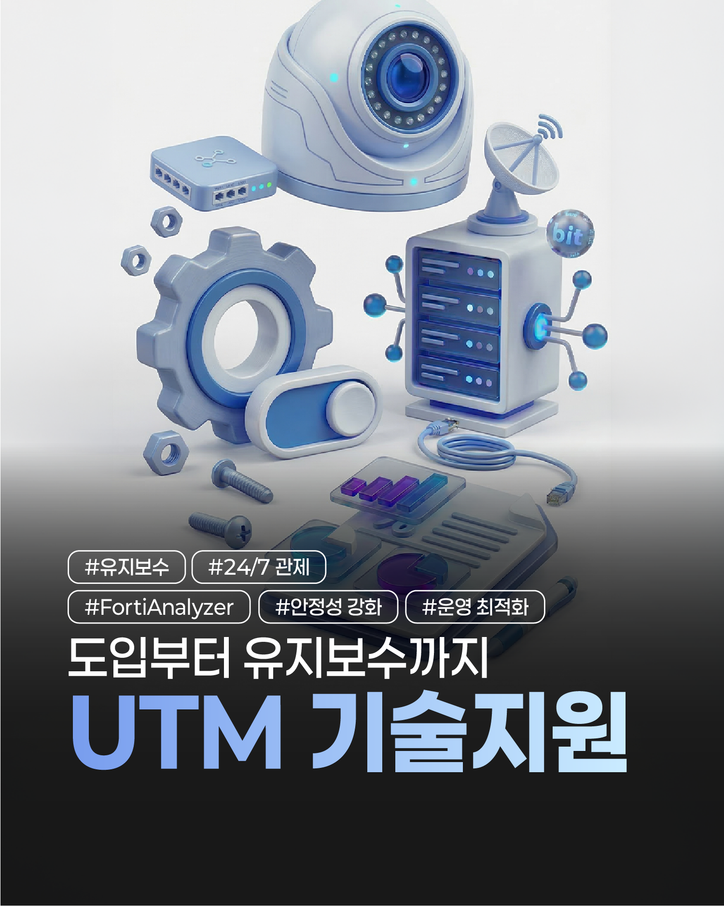
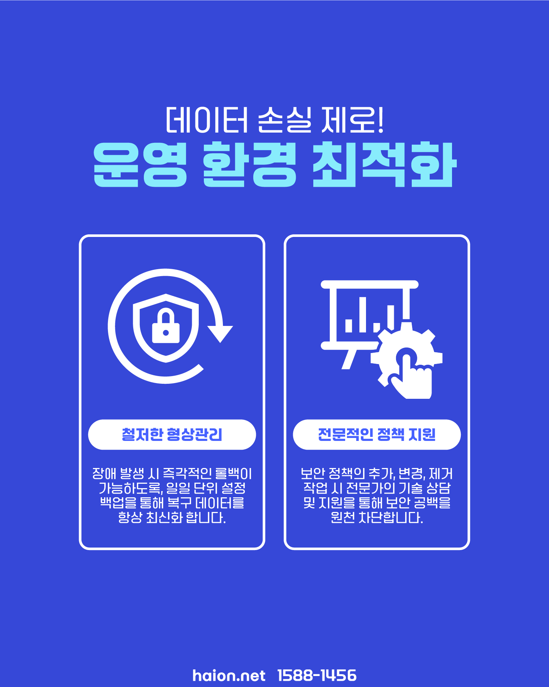
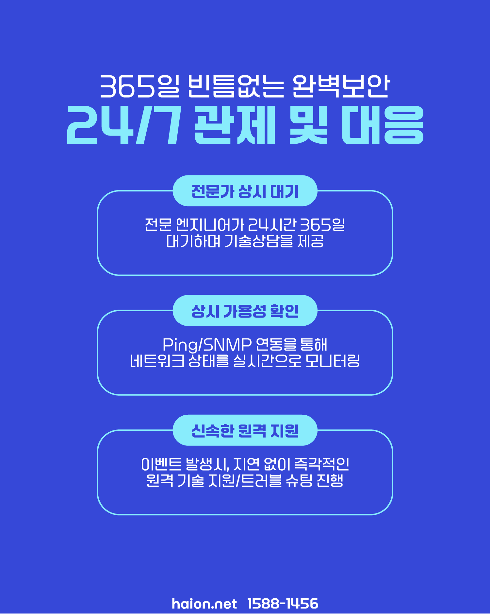
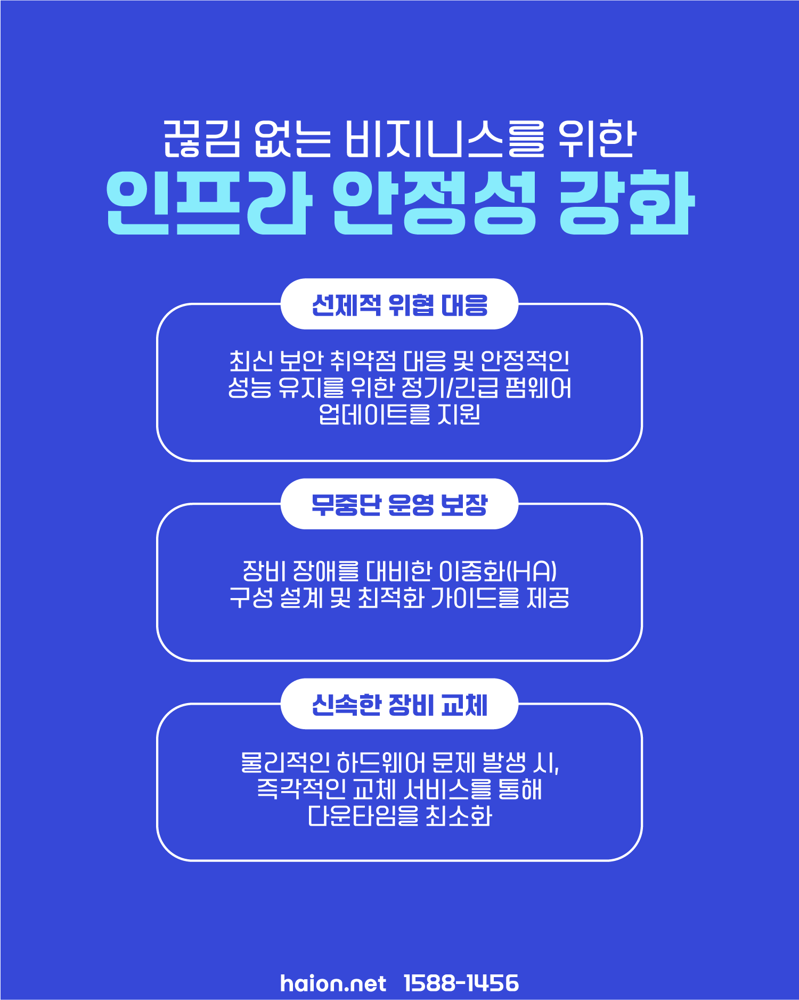
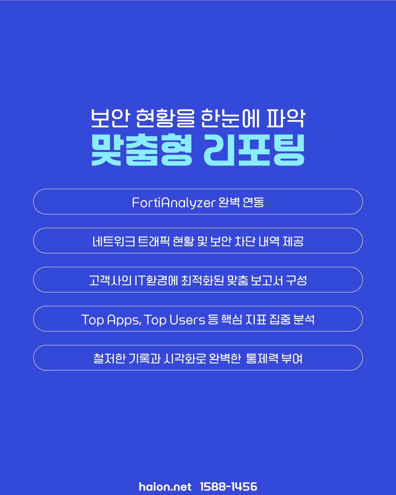

# 보안 장비 방치 방지 선언: 하이온넷 UTM 차세대 기술지원 및 무장애 밀착 유지보수

수백만 원짜리 고급 보안 방화벽 장비를 회사 네트워크 관문에 떡하니 거치해 두고도, 초기 비밀번호와 2~3년 전 보안 설정 그대로 아무런 취약점 펌웨어 업데이트 없이 방치해 두고 계시지는 않으신가요? 

네트워크 보안 인력이 전무한 중소기업 현장에서는 신임 사원이 입사해 포트 개방 요청을 할 때마다 방화벽 관리자 페이지에 직접 접근하기가 두려워 정책 설정을 건드리지 못하거나, 정작 외부 해커 공격이 가해질 때 장비 내부 리소스 모니터링 로그를 볼 줄 몰라 무방비로 회선 차단을 당하는 비즈니스 다운타임 사고가 빈번히 속출합니다. 보안 장비의 생명은 도입이 아닌 '살아 숨 쉬는 유지보수'에 있습니다. 귀사의 철저한 보안 장벽을 매일 무결하게 요새화하는 **하이온넷 UTM 지능형 상시 밀착 기술지원 솔루션**의 핵심 매뉴얼을 전격 해부해 드립니다.

## 데이터 유출 및 설정 꼬임 방지 2대 마스터 엔지니어링

하이온넷 기술진은 고객사가 업무에만 온전히 전념할 수 있도록 보이지 않는 곳에서 네트워크 기반을 극적으로 강화해 드립니다.

* **철저한 실시간 형상 관리 (Configuration Backup)**: 보안 설정 오류나 하드웨어 노후 징후가 있을 때 단 1초 만에 정상 시점으로 되돌아갈 수 있도록, **일일 단위 정기 설정 자동 백업**을 철저히 수행하여 최신 롤백 데이터를 항시 안전 저장합니다.
* **전문적인 보안 정책 조율 (Policy Management)**: 사내 전산 담당자의 실수로 포트를 잘못 건드려 백업망 전체를 마비시키는 대참사를 배제합니다. 정책 추가, 무단 세션 제어, 불량 사이트 IP 차단 변경 요청 시 당사 보안 전문가들이 사전 타당성 체크 및 대조를 완료한 후 안전 적용합니다.

## 365일 빈틈없는 완벽 가용성: 실시간 원격 기술 대응망

주말이나 심야 공휴일에 불시의 정전이나 트래픽 오염으로 사내 ERP 서버망이 기약 없이 먹통이 되어 식은땀을 흘려본 담당자분들의 고질적 고통을 시원하게 소멸시켜 드립니다.

* **전문가 24/365 긴급 관제 대기**: 고도로 숙련된 네트워크 보안 엔지니어들이 24시간 365일 실시간 관제 허브를 운영하며 상시 원격 기술 지원을 제공합니다.
* **Ping / SNMP 연동 상시 웰니스 검진**: 귀사 방화벽 장치의 가용성을 전산망 신호로 실시간 체크하여 일시 단선이나 전원 중단 감지 즉시 경보(Alert) 시스템을 구동합니다.
* **지연 제로 트러블 슈팅**: 트래픽 병목 감지 순간, 지연 없이 실시간 원격 패치 연결을 개시하여 이상 트래픽 유입 구간을 미세 수술 교정합니다.

## 선제적 예방 조치: 인프라 안정성 및 무중단 HA 가이드라인

사고가 터진 후 수습하는 초보적 사후 약방문식 대처를 지양하고, 하이온넷은 선제적인 인프라 안정성 강화 프로토콜을 수행합니다.

* **정기 및 긴급 펌웨어 패치**: 하드웨어 자체 제로데이(0-Day) 보안 구멍 침투를 원천 배제하기 위해 전문 정기 최신 OS 업그레이드 지원.
* **무중단 이중화 (HA) 설계**: 1번 UTM 기기 낙뢰 파손 즉시 2번 백업 기기가 0.1초 만에 전산 업무망을 무정전 자동 승계(Failover)하는 Active-Standby 이중화 최적화 아키텍처 지원.
* **초고속 물리 장비 대체 발급**: 물리적 메인보드 고장 확인 순간, 긴급 **선출고(Advanced Replacement)** 제도를 즉각 개동하여 대체 UTM을 초고속 발송해 비즈니스 정지 다운타임을 극소화합니다.

## 완벽한 IT 통제권 선사: FortiAnalyzer 연동 정밀 리포팅

보이지 않는 트래픽을 정교하게 분석하여, 기업 대표님과 총무팀 관리자분들에게 최고 효율의 IT 자원 가이드를 완성해 드립니다.

* **FortiAnalyzer 인텔리전스 연동**: 네트워크 데이터 흐름과 외부 해커들의 IP 차단 정화 내역을 투명하게 누적 기록합니다.
* **핵심 지표 선별 분석**: 사내 대역폭을 가장 갉아먹는 주범 PC(Top Users)와 업무 외적으로 가장 트래픽 점유율이 높은 앱 및 사이트(Top Apps) 순위를 100% 명확한 시각화 차트로 출력해 기업 내부 정보 제어 통제력을 무한 부여합니다.

## 24시간 365일 열려있는 하이온넷 UTM 전문 긴급 소통 창구

귀사 전산 인프라의 웰니스 케어 파트너, 하이온넷은 모든 접점을 상시 직통 열어두고 있습니다.

* **기술 관제 전문 센터**: 📞 **1588-1456**
* **전담 엔지니어 모바일 핫라인**: 📱 **010-9945-7510** (평일 09시 ~ 18시 상시 원격 실시간 기술 보정 적용 가능)
* **카카오 온라인 문의 창구**: 카톡 플러스친구 **@하이온넷** 채널 추가
* **안심 테스트 특전**: 정식 기술 서비스 계약 체결 전에, 귀사의 방화벽 트래픽 처리 능력을 사전 실측해 드리는 **보안 취약점 무료 진단**을 상시 지원합니다.
