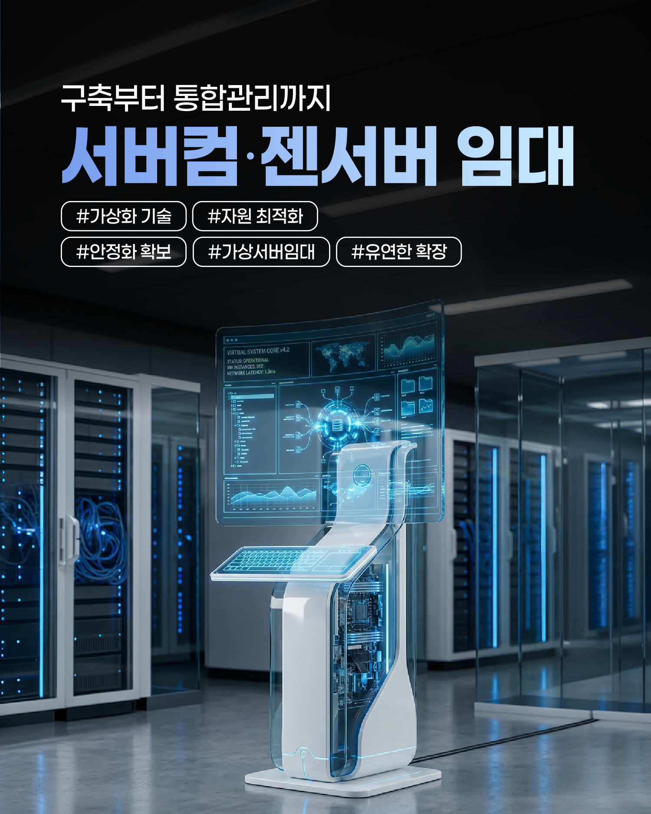
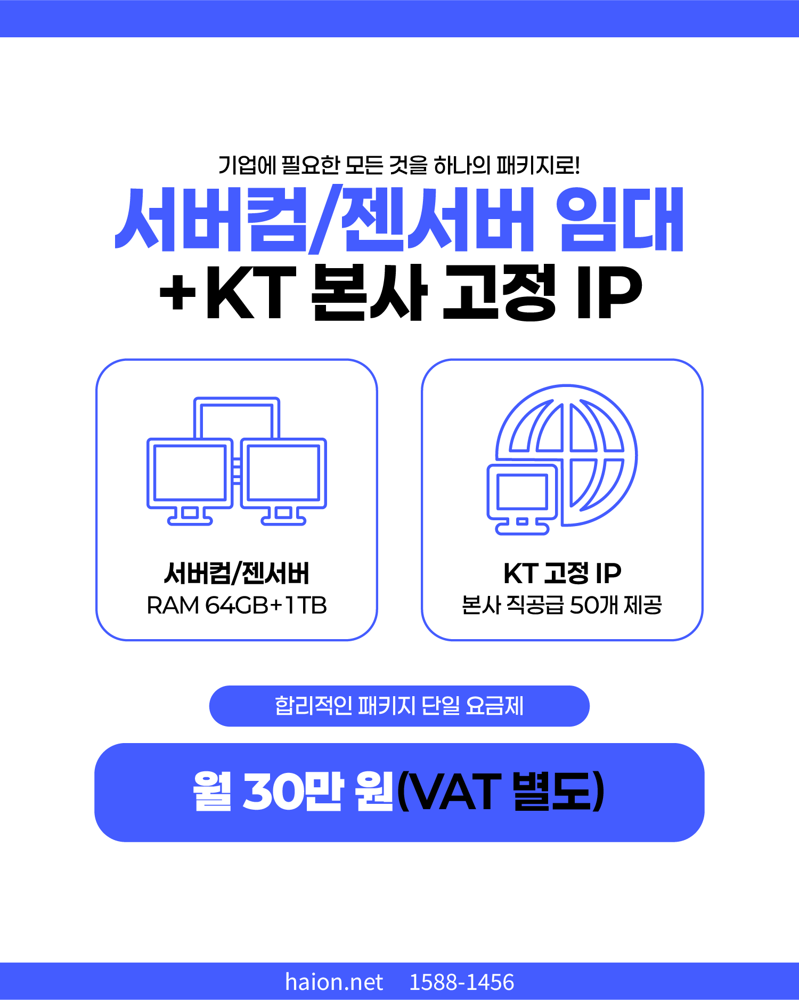
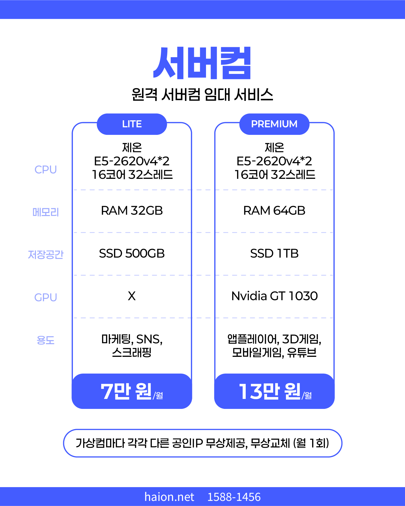
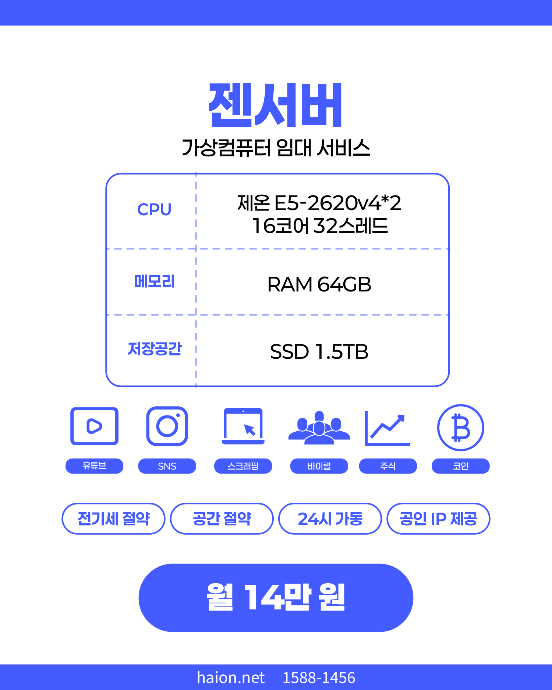

# 시끄러운 전산실 소멸 선언: 하이온넷 제온 가상서버 임대 및 KT 고정 IP 올인원 패키지

사무실 구석에서 24시간 내내 웅웅거리는 시끄러운 팬 소리와 뜨거운 발열을 뿜어내며 엄청난 가정·일반용 전력 누진세를 유발하는 소형 PC 서버 하드웨어 때문에 골치 아프지 않으신가요? 

더구나 장마철 누전 정전이나 주말 사내 빌딩 전기 점검 시 인터넷이 통째로 툭 끊겨, 24시간 영속해야 할 마케팅 자동화 프로그램, 스크래핑 시스템, 주식 자동 매매 봇이 수시로 다운되어 엄청난 금전적 비즈니스 손실을 보셨던 실무 담당자분들이 대단히 많습니다. 물리 하드웨어 소유의 무거운 짐을 완벽하게 덜어 드리고, 24시간 365일 데이터센터의 정밀 전력 백업선 위에서 물 흐르듯 가동되는 **하이온넷 차세대 제온(Xeon) 원격 가상서버 가상컴퓨터 대여 솔루션**을 전격 공개합니다.

## 올인원 가성비 종결: 제온 서버컴 대여와 KT 본사 고정 IP 50개 패키지

귀사의 완벽한 재정 다이어트를 위해 하이온넷이 야심 차게 기획한 단일 통합 패키지 솔루션입니다.

* **최강 가성비 서버 스펙**: 제온 16코어 고사양 원격 서버컴 하드웨어 (RAM 64GB + SSD 1TB 장착 대용량 사양)를 완벽 가설 대여합니다.
* **KT 본사 공인 고정 IP 50개 패키지 결합**: 대량의 마케팅 대역이나 사내 인트라넷 보안 구획 형성에 탁월한 최고 품질의 KT 정식 공인 고정 IP 대역 무려 50개를 단일 묶음 공급합니다.
* **파격적인 단일 통합 요금제**: 이 모든 하드웨어 임대료와 깨끗한 고정 IP 50개 결합 금액을 합쳐, 월 단돈 **300,000원** (VAT 별도)이라는 업계 최저 실측 가성비 가격으로 정합 제공해 드립니다.

## 용도별 맞춤 설계: 하이온넷 가상 서버컴 임대 사양표

고객사의 실행 비즈니스 어플리케이션 강도와 무인 연산 성격에 맞게 LITE 요금제와 PREMIUM 요금제를 명쾌하게 선택하실 수 있습니다.

* **LITE 요금제 (월 70,000원)**
  * **하드웨어 사양**: CPU Xeon E5-2620v4 듀얼 프로세서 (무려 16코어 32스레드의 압도적인 병렬 연산력), 대용량 RAM 32GB, 초고속 SSD 500GB 장착.
  * **최적 타겟 용도**: 바이럴 SNS 마케팅 무인 가동, 대용량 웹 데이터 수집 스크래핑/크롤러 가동, 마케팅 자동화 에이전트 구동 전용.
* **PREMIUM 요금제 (월 130,000원)**
  * **하드웨어 사양**: CPU Xeon E5-2620v4 듀얼 프로세서 (16코어 32스레드), 대용량 RAM 64GB, SSD 1TB 저장공간 장착, 고사양 **Nvidia GT 1030 외장 그래픽카드(GPU)** 탑재.
  * **최적 타겟 용도**: 다중 모바일 앱플레이어(녹스, LD플레이어 등) 동시 멀티 윈도우 가동, 주식/가상자산 자동 고대역 거래 프로그램 구동, 3D 게임 무인 채굴 및 유튜브 실시간 멀티캐스팅 전용.
* **압도적인 단독 특전**: 대여하는 가상 컴퓨터마다 각각 고유하고 충돌 없는 다른 공인 IP를 무상 기본 할당해 드리며, 추가로 마케팅 연속성을 보장할 수 있도록 **월 1회 깨끗한 IP로의 무상 정기 교체** 권한을 보장해 드립니다.

## 전기세 제로 공간 절약: 하이온넷 젠서버(XenServer) 단독 대여 요금제

물리 서버를 직접 사무실에 설치하고 OS 가상화(Hypervisor)를 직접 골치 아프게 엔지니어링하느라 수개월을 허비하셨나요? 하이온넷 젠서버 가상컴퓨터 단독 임대 상품은 신청 즉시 가상 통로를 안전하게 뚫어 대령합니다.

* **서버 하드웨어 구성 사양**: CPU 제온 E5-2620v4 듀얼 (16코어 32스레드), 메모리 대용량 RAM 64GB, 무정전 초고속 SSD 1.5TB of 거대한 단독 스토리지 보장.
* **젠서버 월 요금**: 월 단돈 **140,000원** (VAT 별도)의 파격적인 단독가 공급.
* **최적 추천 비즈니스**: 유튜브 채널 멀티 캐스팅, 사내 주식/코인 보안 거래 서버, 고대역 크롤링 봇 전산 아카이빙, 기밀 바이럴 마케팅 전산망 전용.

## 24시간 365일 무정전 하이온넷 긴급 실시간 기술 서포트

네트워크 연결이나 윈도우 원격 데스크톱 연결 장애 시, 담당자가 없어서 주말 내내 서버가 방치되어 마케팅 기회를 날렸던 아픈 기억이 있으신가요? 하이온넷은 전담 전문 기술진이 상시 대기하여 기업 인프라 연속성을 철저히 보위합니다.

* **네트워크 통합 케어 문의**: 대표 번호 📞 **1588-1456**
* **전담 기술 가이드라인 실시간 창구**: 모바일 직통 번호 📱 **010-9945-7510** (업무 시간 09:00~18:00 상시 원격 다이렉트 기술 보정 적용 가능)
* **카카오 플러스 실시간 기술 교정 대조**: **@하이온넷** 온라인 채널 검색 등록
* **선제적 안심 데모 세션**: 실제 원격 접속 끊김도나 제온 연산 마우스 무손실 성능을 직접 눈으로 비교 검증하실 수 있도록 **100% 무상 사전 가상 컴퓨터 원격 포트 데모**를 상시 무료 지원합니다.
