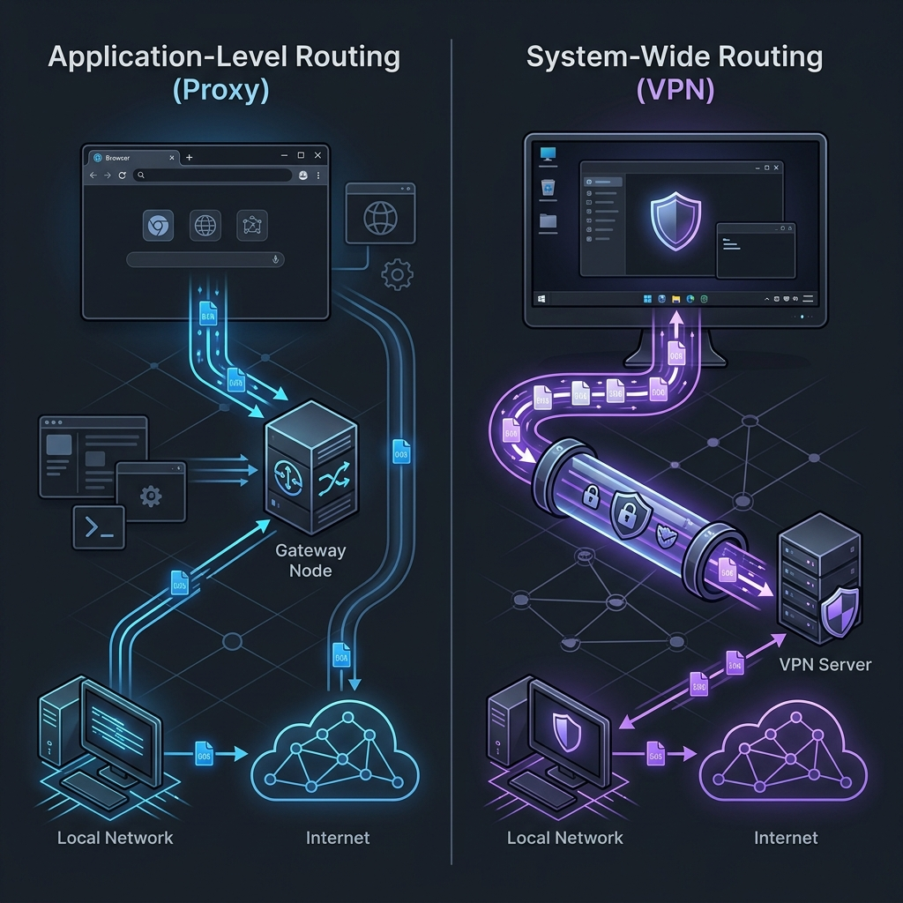

# 보안과 효율의 갈림길: VPN vs 프록시(Proxy) 기술 원리 및 비즈니스 최적 선택 가이드

인터넷 서핑을 하거나 해외 직구 사이트 우회 접속, 혹은 기업 내부망 시스템 보안 구축을 준비하다 보면 반드시 마주치게 되는 두 가지 핵심 네트워크 용어가 있습니다. 바로 <strong>VPN(가상 사설망)</strong>과 <strong>프록시(Proxy) 서버</strong>입니다. 

두 기술 모두 사용자의 실제 IP 주소를 목적지 사이트로부터 숨기고, 마치 다른 장소에서 접속한 것처럼 보이게 우회해 준다는 점에서는 유사해 보입니다. 이 때문에 많은 사용자들이 두 기술을 혼동하거나 완전히 동일한 서비스로 오해하고는 합니다. 

하지만 두 기술은 <strong>도입 목적, 보안 아키텍처, 작동 계층</strong> 면에서 완전히 다른 원리로 설계되어 있습니다. 기기 내부의 통신 프로토콜 단계에서 이들이 구체적으로 어떻게 개입하고 작동하는지, 5대 핵심 지표를 통해 깊이 있게 파헤쳐 보겠습니다.

## 01. 작동 단위: 특정 애플리케이션 vs 운영체제(OS) 네트워크 어댑터 전체

두 기술이 가장 극명한 차이를 보이는 지점은 바로 <strong>기기의 네트워크 계층(Layer) 중 어느 단계에 개입하여 제어하는가</strong>입니다.

* <strong>프록시(Proxy) - 특정 응용 프로그램 단위 작동</strong>
  * <strong>원리</strong>: 프록시는 웹 브라우저(크롬, 사파리, 토렌트 등)나 특정 프로그램 내부의 로컬 애플리케이션 레벨에 설정 정보를 수동 기입하는 방식으로 동작합니다. 
  * <strong>작동 과정</strong>: 사용자가 크롬 브라우저를 켜고 네이버에 접속하면, 오직 브라우저 내부 트래픽만 "나 대신 프록시 서버를 통해 네이버 정보를 가져다줘"라고 부탁하여 중계됩니다. 이때 브라우저 이면에서 작동하는 백그라운드 카카오톡, 스포티파이, 시스템 업데이트 등의 타 프로그램 통신은 프록시를 거치지 않고 원래 사용자의 리얼 IP로 직접 소통합니다.
* <strong>VPN(Virtual Private Network) - 운영체제(OS) 가상 네트워크 어댑터 탑재</strong>
  * <strong>원리</strong>: VPN 프로그램이 기기(PC, 스마트폰)에 설치 및 활성화되면, 윈도우나 macOS/iOS의 <strong>물리 네트워크 하드웨어 위에 가상의 네트워크 가상 드라이버(TAP/TUN 어댑터)</strong>를 씌워버립니다.
  * <strong>작동 과정</strong>: 기기에서 외부 네트워크로 출발하려는 <strong>모든 통신 데이터 패킷</strong>이 이 가상 어댑터로 강제 집중 집하되어 VPN 서버로 일괄 송출됩니다. 사용자가 따로 세팅하지 않아도 브라우저는 물론이고 온라인 게임, 메신저, 클라우드 백그라운드 동기화 트래픽까지 완벽하게 강제 우회 통과됩니다.

## 02. 데이터 암호화: 투명한 유리 상자 vs 군사 등급의 이중 철벽 금고

이 두 기술이 탄생하게 된 근원적인 목적과 사상의 차이는 <strong>'암호화(Cryptography)의 탑재 여부'</strong>에서 가장 뚜렷하게 발현됩니다.

* <strong>프록시(Proxy) - 포장되지 않은 투명한 유리 상자</strong>
  * <strong>원리</strong>: 프록시의 본래 탄생 목적은 보안이 아니라 <strong>'효율적인 전달과 중계(Caching)'</strong>입니다. 사용자가 보낸 데이터는 아무런 보안 래핑 없이 포장되지 않은 유리 상자에 담겨 움직입니다.
  * <strong>보안 위험</strong>: 통신사(KT, SKT 등)나 공용 카페 Wi-Fi 네트워크 관리자, 혹은 악의적인 해커가 중간에서 흐르는 트래픽을 스니핑(패킷 감청)하면 사용자가 어떤 웹사이트에서 무엇을 입력하고 어떤 글을 열람하는지 날것 그대로 탈탈 털려 보일 수 있습니다.
* <strong>VPN - 군사 등급(AES-256)의 복합 철제 금고</strong>
  * <strong>원리</strong>: VPN은 철저하게 <strong>'적대적 환경에서의 안전한 통신망 구축(Tunneling)'</strong>을 목적으로 고안되었습니다. 기기에서 패킷이 전산망에 올라타기 전, 군사 정보 기관에서 사용하는 수준의 극강 암호화 기술(AES-256 등)을 사용해 견고한 철제 금고에 봉인합니다.
  * <strong>보안 수준</strong>: 중간 경로에서 해커나 기관이 패킷을 탈취하더라도 그 안의 내용은 의미를 전혀 유추할 수 없는 고난도의 난수 배열(예: *h7z#9pX!q...*)로만 보이기 때문에 물리적으로 내용을 가로채거나 가공하는 해독 자체가 원천적으로 불가합니다.

## 03. 인터넷 속도: 단순한 문지기 하이패스 vs 복잡한 수학 연산 병목

데이터가 출발하고 도착하는 과정 속에서 발생하는 <strong>'물리적/컴퓨팅 연산 오버헤드 부하'</strong>에 따라 연결 속도와 레이턴시(Latency, 핑)에서 확연한 격차가 발생합니다.

* <strong>프록시(Proxy) - 가벼운 신원 교체와 초고속 통과</strong>
  * <strong>속도 특성</strong>: 프록시는 마치 고속도로 요금소의 문지기가 들어오는 차량의 번호판(IP 주소)만 신속하게 가짜 번호판으로 슬쩍 갈아 끼워 바로 내보내는 원리와 같습니다. 
  * <strong>네트워크 컨디션</strong>: 무거운 데이터 패킷 검사나 복잡한 수학 암호화 연산 루프가 없기 때문에 패킷 전송 시 지연 시간(Ping)이 매우 짧고 본래 회선의 기가비트 물리적 속도를 거의 고스란히 온전히 보존합니다.
* <strong>VPN - 철저한 이중 자물쇠 패키징 연산과 레이턴시 축적</strong>
  * <strong>속도 특성</strong>: VPN은 나가는 패킷 하나하나마다 수학적 수식을 활용해 암호화(자물쇠 걸기)하고, VPN 물리 서버에 수신되면 다시 이를 복호화(자물쇠 풀기)하는 실시간 하드웨어 연산 루틴을 반복해야 합니다.
  * <strong>네트워크 컨디션</strong>: 패킷 처리 시 단말기의 CPU 자원 소모가 동반되며, 이 이중 가공 처리 공정과 가상 터널 우회로 인해 거리가 누적되어 본래의 순수 회선 속도 대비 일정 수준의 다운그레이드(속도 저하 및 핑 상승)를 필연적으로 감수해야 합니다.

## 04. IP 숨김 및 추적성: 보내는 이 이름 화이트 수정 vs 편지 전체 이중 밀봉 밀폐

IP를 변경한다는 큰 기능은 동일하지만, 목적지 사이트에서 역추적을 시도할 때 드러나는 <strong>'추적 은닉성의 깊이(투명도)'</strong>에서 구조적 설계 급수가 다릅니다.

* <strong>프록시(Proxy) - 요청서 겉면 발신 주소만 수정 (흔적 존재)</strong>
  * <strong>작동 원리</strong>: 목적지에 보내는 신호의 겉부분에 적힌 '보내는 사람(내 원래 IP)' 영역 위에 화이트를 칠해 '프록시 IP'로 단순 덮어쓰기하는 형태입니다. 
  * <strong>투명도 한계</strong>: 목적지 웹사이트 서버가 일반적인 상태에서는 프록시 IP로 인식하지만, 정밀한 역추적 분석이나 보안 방화벽 로직을 가동하면 전송 패킷 헤더 내부 구석에 숨은 사용자 원본 식별 흔적(`X-Forwarded-For` 헤더 등)을 잡아낼 가능성이 상시 열려 있습니다. (특히 투명 프록시나 저가형 프록시에서 흔히 발생)
* <strong>VPN - 편지 전체를 전용 겉봉투에 담아 완벽 캡슐화 (추적 불가)</strong>
  * <strong>작동 원리</strong>: 사용자 패킷 데이터를 날것 그대로 전송하지 않고, 전체 데이터를 완전히 캡슐로 감싸서(Capsulation) 겉에 완전 새로운 VPN 서버 전용 프로토콜 외피를 입혀버립니다. 
  * <strong>투명도 강점</strong>: 목적지 사이트 입장에서는 애초에 그 안의 내용물이나 원본 송신자에 도달하는 통로가 완벽하게 은닉되어 있어, 오직 겉을 둘러싼 대리인인 'VPN 서버' 정보 외에는 구조적으로 본원 IP를 역추적하는 것이 불가능에 가깝습니다.

## 05. 비용 및 인프라 구조: 간이 서버의 무료 배포 vs 고품질 '노로그' 정책 중심의 유료화

인프라를 안정적으로 유지하기 위해 소요되는 <strong>'서버 장비 투자비 및 정보 신뢰 보안 비용'</strong>의 현실에 의해 가격 모델이 갈리게 됩니다.

* <strong>프록시(Proxy) - 최소한의 리소스, 무료 서비스 중심</strong>
  * <strong>원리</strong>: 프록시는 패킷 암호화 부하가 없으므로 서버 컴퓨터 사양이 아주 낮아도 수많은 사용자의 패킷을 무리 없이 중계할 수 있습니다. 덕분에 인터넷상에 수많은 공개 무료 프록시가 존재합니다.
  * <strong>함정</strong>: 세상에 공짜는 없습니다. 대다수의 무료 프록시 운영자는 유지비를 충당하기 위해 <strong>사용자의 검색 로그와 브라우징 원격 정보를 제3의 광고 회사에 무단으로 넘기거나</strong> 패킷 사이에 억지로 광고 스크립트를 끼워 넣어 수익을 창출하는 리스크를 안고 있습니다.
* <strong>VPN - 막대한 하드웨어 비용과 '노로그(No-Log)' 철학 유지의 비용화</strong>
  * <strong>원리</strong>: 고화질 동영상이나 비즈니스 기밀 전송 시 실시간 대용량 패킷을 끊임없이 복호화/암호화하는 연산 처리를 위해 수천 대의 최고사양 고성능 하드웨어 서버가 필요하며, 압도적인 기가비트 대역폭 회선료가 상시 발생합니다. 
  * <strong>비용의 정당성</strong>: 특히 사용자 로그 정보를 수사 기관이나 본사 데이터베이스에도 일절 남기지 않는 <strong>'노로그(No-Log)' 보안 감사</strong>를 글로벌 기관에 주기적으로 검증받기 위해 엄청난 자본과 인력이 지속 투입되므로, 신뢰할 만한 VPN은 필연적으로 유료 구독 기반의 서비스 모델을 유지합니다.

## 💡 실전 최적 적용 가이드: 내 상황에는 어떤 것을 써야 할까?

비즈니스 업무 및 개인 네트워크 목적에 맞게 두 기술을 적재적소에 전략적으로 선택해 성능과 안전을 모두 영위해 보시기 바랍니다.

### 📌 프록시(Proxy) 도입이 탁월한 상황 (키워드: #속도, #단순 우회, #단발성 작업)

1. <strong>차단된 해외 직구 사이트 초고속 접속</strong>
   * 특정 글로벌 패션 브랜드 등이 한국 IP 대역을 막아둔 경우, 내 개인 기밀 정보나 금융 결제를 기입하지 않고 단순히 어떤 신상품 카탈로그가 올라왔는지 빠르게 훑어보는 용도로 브라우저에 프록시 확장 프로그램을 장착하는 것이 가볍고 경제적입니다.
2. <strong>마케팅 데이터 수집을 위한 대규모 웹 스크래핑/크롤링</strong>
   * 파이썬(Python) 등을 사용해 특정 웹사이트에서 마케팅 통계 자료를 무수히 긁어올 때, 하나의 IP로 연속 요청을 때리면 디도스로 간주되어 즉각 밴을 먹습니다. 이때 수백 개의 깨끗한 IP 주소로 계속 번갈아 가며 요청을 우회 송출하는 <strong>'프록시 로테이션'</strong>을 결합해야 포털 차단을 무력화하고 빠른 시간 안에 크롤링을 영속 완수할 수 있습니다.
3. <strong>가벼운 로컬 방화벽 우회</strong>
   * 사내 혹은 도서관 등의 공용 로컬 네트워크에서 업무용 외 일부 비필수적 사이트(커뮤니티 등)를 단순 차단해 두었을 때, 강력한 암호화 보호가 필요치 않고 가볍게 길을 우회해 가기 위한 저비용 수단으로 적합합니다.

### 📌 VPN 도입이 생명선이 되는 상황 (키워드: #철통 보안, #개인정보 보호, #사내 내부망 전용 통로)

1. <strong>스타벅스, 공항, 호텔 등 공용 무료 Wi-Fi 접속 시 (필수!)</strong>
   * 오픈된 공용 와이파이는 악의적 해커가 동일 와이파이 망 내부에서 패킷을 훔쳐보는 '스니핑 툴'을 켜 두었을 때 무조건 해킹되는 최악의 요충지입니다. 이곳에서 모바일 은행 뱅킹 앱을 켜거나, 업무용 그룹웨어 로그인을 해야 한다면 <strong>반드시 기기 전반을 보호하는 암호화 VPN을 먼저 활성화</strong>하고 접속해야 나의 ID, 비번, 공인인증 패킷 유출을 100% 철저히 차단할 수 있습니다.
2. <strong>보안이 생명인 기업 재택근무 및 본-지사 원격 전용망 연동</strong>
   * 외부 집 컴퓨터에서 사내 ERP 시스템이나 핵심 고객 DB, 소스코드 저장소에 직접 붙는 행위는 심각한 오염 통로를 여는 행위입니다. 이때 회사는 <strong>'기업 전용 사설 VPN망'</strong>을 가설하여, 직원의 PC 단말기와 사내 메인 인프라 서버 간에만 인가된 강력한 전용 암호화 통신 터널을 뚫어 전사적인 원격 거점 보안을 완벽히 구축합니다.
3. <strong>토렌트(P2P) 다운로드 및 개인 익명성 상시 극대화</strong>
   * 토렌트 파일 공유 특성상 내 실제 접속 IP가 같은 공유 무리에 가담된 불특정 다수에게 투명하게 노출되는 취약점이 있습니다. 기기 전체의 흐름을 새로운 겉봉투로 봉인하는 고품질 VPN을 실행하여 패킷 감시 기관 및 외부 제3자 추적으로부터 사생활 주권을 완벽하게 사수합니다.

## 📊 VPN vs 프록시(Proxy) 핵심 비교 분석 요약표

| 비교 기준 | 🛡️ VPN (가상 사설망) | ⚡ 프록시 (Proxy Server) |
| :--- | :--- | :--- |
| <strong>작동 위치</strong> | 운영체제(OS) 네트워크 어댑터 커널단 | 응용 애플리케이션(앱, 브라우저) 설정단 |
| <strong>데이터 암호화</strong> | 강력한 이중 암호화 처리 (AES-256 등) | 암호화 지원 없음 (평문 패킷 전송) |
| <strong>작동 범위</strong> | 컴퓨터/모바일 기기 내부의 <strong>모든 아웃바운드 트래픽</strong> | 수동으로 경로를 매핑한 <strong>해당 소프트웨어만</strong> |
| <strong>연결 속도</strong> | 암/복호화 연산 부하로 속도 및 핑 일부 지연 | 별도 보안 가공 연산이 없어 본래 속도 근접 유지 |
| <strong>추적 은닉성</strong> | 완벽한 캡슐화 포장으로 역추적 물리적 불가능 | 전송 패킷 헤더 내 우회 흔적 및 IP 유출 위험 상존 |
| <strong>인프라 비용</strong> | 글로벌 서버 유지, 노로그 감사 유지를 위한 <strong>유료 구독형</strong> | 저성능 서버로 구축 가능, <strong>대다수 무료 위주 배포</strong> |
| <strong>적합한 상황</strong> | 공용 Wi-Fi, 재택 사내망 접속, 개인 기밀 처리, 전체 익명 보호 | 단순 접속 국가 우회, 대량 스크래핑 IP 로테이션 |

