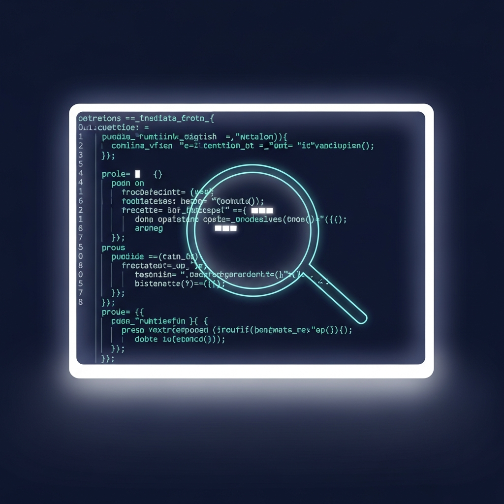
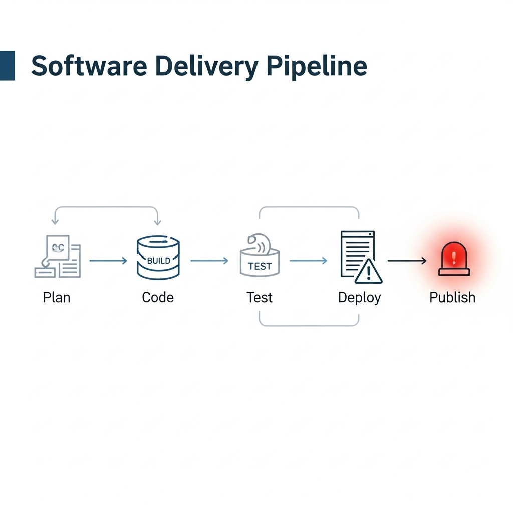

セキュリティと安全性を最優先事項として掲げてきたAnthropicが、最近、困惑すべき状況に直面しています。わずか1週間の間隔で発生した2度のデータ流出事故が原因です。一つはコンテンツ管理システム（CMS）の設定ミス、もう一つは開発者の単純なデプロイミスに起因するものでした。

注目すべきは、今回の事故によって、これまでベールに包まれていたAnthropicの次世代ロードマップが大幅に露呈したという点です。約51万行に及ぶ「Claude Code」のソースコードと3,000件余りの内部文書は、現在Anthropicが準備している技術的な方向性を明確に示しています。今回の事故の技術的な文脈と、流出データを通じて確認されたAIの未来について整理しました。

****

## デプロイプロセスの盲点：ソースマップ（Sourcemap）が残した痕跡

今回のソースコード流出は、技術的に非常に基礎的な段階から始まりました。AnthropicはターミナルベースのAIコーディングツールである「Claude Code」を`npm`パッケージリポジトリにデプロイする際、バージョン2.1.88にデバッグ用のソースマップファイルを誤って含めてしまいました。

一般的に、JavaScriptやTypeScriptのコードは、デプロイ時に容量の最適化とセキュリティのためにコードを圧縮（Minify）および難読化します。この際、開発者がデバッグのために元のコードと圧縮されたコードを紐付ける「地図」の役割を果たすのがソースマップです。Anthropicが使用しているビルドツール「Bunバンドラー」は、デフォルト設定でソースマップを生成しますが、デプロイパイプラインにおいてこれを除外するオプション（`--sourcemap=none`）が漏れていたことが致命的なミスとなりました。

このソースマップファイルには、Anthropicの非公開クラウドストレージへのリンクが含まれており、これを経由して約1,900件のソースファイルが外部に露出しました。巨大なユニコーン企業であっても、デプロイ自動化スクリプトの些細な設定一つが、核心的な知的財産（IP）の流出に直結するという事実を端的に示す事例となりました。

****

## 競合他社の学習を妨害する技術的仕掛け：アンチ・ディスティレーション

流出したコードの中で特に目を引くのが、「アンチ・ディスティレーション（Anti-distillation）」ロジックです。これは、競合他社がAnthropicのAPIレスポンス結果を収集し、自社のモデル学習に利用する行為、すなわち「知識蒸留（Distillation）」を根本から遮断するための防御メカニズムです。

この機能が有効になると、Claude CodeはAPIリクエスト時に、実際には存在しない「偽のツール（Fake Tool）」の定義をランダムに混ぜて送信します。競合他社がこのデータをそのまま収集して学習に利用すると、そのAIモデルは存在しない機能を実在するものと誤認して学習してしまいます。結果として、モデルのハルシネーション（幻覚）が深刻化し、全体的な品質を低下させる「データ汚染」を誘導する仕組みです。

> 「技術保護のために、モデル自体の性能だけでなく、通信データレベルでの心理戦や撹乱作戦がすでに実務に適用されていることを示す事例です。」

また、「アンダーカバーモード（Undercover Mode）」という機能も発見されました。コミットログやレビュー依頼時に、Anthropic内部のコード名やAIによる作成痕跡を強制的に削除する機能です。セキュリティのための措置とも言えますが、オープンソースコミュニティではAIの寄与を人間の作業として偽装できるという点で、倫理的な議論の余地がありそうです。

****

## 次世代モデル「Mythos」と自律型エージェントの実体

CMS流出事故を通じて公開された次世代モデル「Claude Mythos（コード名：Capybara）」は、Anthropicが準備している核心的な切り札です。文書によると、このモデルは既存の最上位モデルである「Claude Opus 4.6」を上回る新しい階層（Tier）に分類されています。

Anthropic内部では、このモデルの登場を「ステップチェンジ（Step Change）」と表現しています。単なる性能改善を超え、質的な飛躍を遂げたという意味です。特にソフトウェアコーディングや学術的な推論、サイバーセキュリティの領域で、目覚ましい性能向上があったと把握されています。

注目すべきキーワードは「KAIROS」と「autoDream」です。KAIROSは、ユーザーの明示的な命令がなくてもバックグラウンドで常時実行される「自律型エージェント」モードです。5分間隔でプロジェクトを点検し、GitHubイベントを購読しながら、能動的にコードを修正します。autoDreamは、AIがアイドル時間中に自身のメモリを整理し、矛盾する情報を精査する機能です。人間が睡眠中に記憶を整理するプロセスに似た構造を採用したものと解釈されます。

****

## 責任あるスケーリングポリシー（RSP）v3.0と実務的な示唆

技術的な変化と同様に注目すべきは、Anthropicのポリシーの方向転換です。Anthropicは昨年2月に「責任あるスケーリングポリシー（RSP）v3.0」を発効し、以前明示していた「安全措置が不十分な場合は学習を中断する」という強制条項を削除しました。

市場競争が加速する状況において、一方的な開発中断は実効性がないという判断が働いたようです。その代わりに、「リスク報告書（Risk Reports）」の発行と「業界共同勧告」という緩和された方式を選択しました。Mythosモデルがサイバーセキュリティのリスクを招く可能性があることを認識しながらも、開発スピードは落とさないという意志の表れと読み取れます。

今回の流出事故とAnthropicの動向は、現場の開発者や企業のセキュリティ担当者にいくつかの重要な示唆を与えています。

1.  **サイバーセキュリティの非対称性への備え**: Mythos級のモデルが普及すれば、脆弱性の探知速度が防御速度を圧倒することになります。Anthropicがセキュリティ防御組織に優先権を付与した戦略を参考に、企業もまたAIベースのセキュリティスキャンツールの導入を検討すべき時期に来ています。
2.  **エージェンティック・ワークフロー（Agentic Workflow）への対応**: KAIROS機能が示唆するように、AIはもはや「ツール」を超えて「自律的な協働者」へと進化しています。開発プロセス全般を自動化できるインフラとワークフローの再設計が必要です。
3.  **サプライチェーン・セキュリティの基本の再点検**: 大規模な流出の始まりは、結局のところソースマップの設定一つでした。ビルドツールのデフォルト設定を過信するのではなく、デプロイ前に成果物を自動検修するセキュリティチェックリストをパイプラインに組み込む努力が不可欠です。

Anthropicの今回の事故は、逆説的に彼らが開発中のツールの威力を証明する機会となりました。技術の華やかさの裏に隠された基本的なミスを反面教師とし、私たちも来たるべき自律型AI時代をより綿密に準備していく必要があるでしょう。結局のところ、システムの成否は壮大な議論ではなく、ごく小さな設定一つで決まるものなのです。