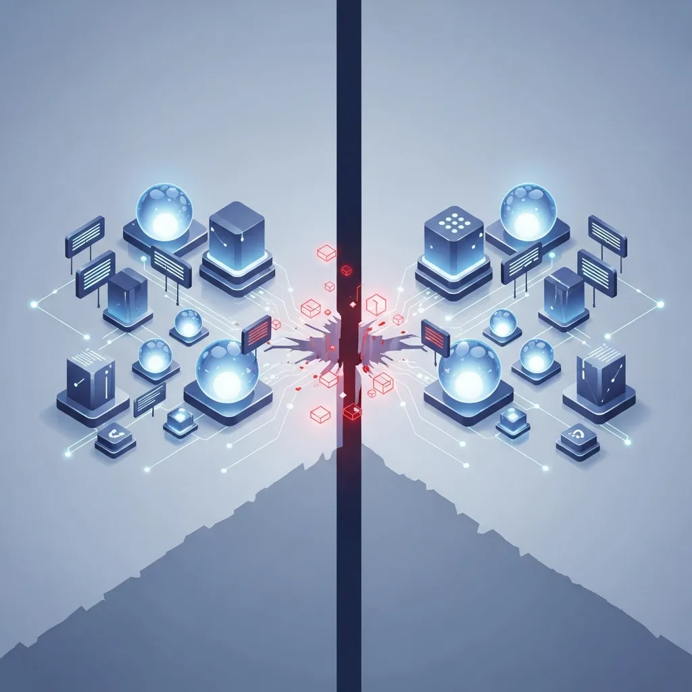

ネットワークで接続された数多くのサーバーが、あたかも一つの巨大なコンピュータのように有機的に作動するシステムを設計する過程で、エンジニアは必然的な限界に直面します。データがリアルタイムですべての地点に複製され、どのような状況でもサービスが中断されず、即座の応答速度を保証するアーキテクチャは、理論的な理想郷に近いものです。2000年にエリック・ブリュワーが提示した <a href="/ja/glossary/cap-theorem-distributed-systems" class="glossary-tooltip" data-definition="分散コンピューティングシステムにおいて、データの一貫性(Consistency)、可用性(Availability)、分断耐性(Partition Tolerance)という3つの特性を同時にすべて満たすことはできないという理論的原則です。">CAP定理</a>は、このような分散システム設計の物理的な限界を明確に規定しています。

CAP定理は、一貫性（Consistency）、可用性（Availability）、分断耐性（Partition Tolerance）という3つの属性を一つのシステムが同時に完璧に満たすことはできないことを意味します。特に現代のCloudインフラにおいて、ネットワーク障害や遅延は避けることのできない「定数」です。つまり、分断耐性は選択の対象ではなく必須の前提条件であり、設計者は最終的に一貫性（CP）と可用性（AP）のどちらを取るかという戦略的選択を迫られることになります。

具体的に見ていくと、一貫性はシステムのすべてのノードがどの時点においても最新かつ同一のデータを保証しなければならないことを指します。一方、可用性は特定のノードに障害が発生しても、システム全体がリクエストに対して応答を返さなければならないという原則です。分散環境でネットワーク断絶が発生した際、データの正確性のために応答を拒否するのか（CP）、あるいは多少古いデータであってもサービスを継続するのか（AP）を決定することが設計の核心となります。

| 区分 | CP (Consistency + Partition Tolerance) | AP (Availability + Partition Tolerance) |
| :--- | :--- | :--- |
| 優先順位 | データの完全性および正確性 | サービスの連続性および応答性 |
| 障害対応 | 同期失敗時に応答拒否または遅延 | 稼働可能なノードからデータを優先応答 |
| 主なモデル | Google Spanner, ZooKeeper, MongoDB | Amazon DynamoDB, Apache Cassandra |
| 主な事例 | 金融決済、資産管理、在庫システム | ソーシャルメディア、コンテンツ配信、カート |

このような選択はビジネスの性質によって異なります。Netflixの事例を見ると、彼らは徹底して可用性を最優先するAP戦略をとっています。ユーザーが昨日見ていた地点がデバイス間でリアルタイムに完璧に同期されなくても、まずは動画再生が中断なく開始されることの方が、ユーザーエクスペリエンスの側面で重要だからです。一方、Google Spannerは分散環境でも強力な一貫性を維持するために、原子時計とGPSを活用した精密な同期メカニズムを動員しています。金融サービスのように、データの1円の誤差も許されない環境では、CP設計がその価値を証明します。

結局、CAP定理は単にどの技術を選択するかという問題ではなく、ビジネスが許容できるリスクのポイントを探る過程です。分散システムで発生するトレードオフを明確に理解し、システムの目的に合致する最適な妥協点を見出す能力が、現代のソフトウェアアーキテクチャの成否を分ける尺度となります。

## 🔗 あわせて読みたい記事
- [トークン所持者モデルから証明ベースのセキュリティへ：DPoPが再定義するWeb認証の信頼モデル](/ja/posts/dpop-proof-based-web-authentication)
- [大規模言語モデルのアライメント、人間の好みを学習するRLHFのメカニズム](/ja/posts/llm-alignment-rlhf-mechanism)