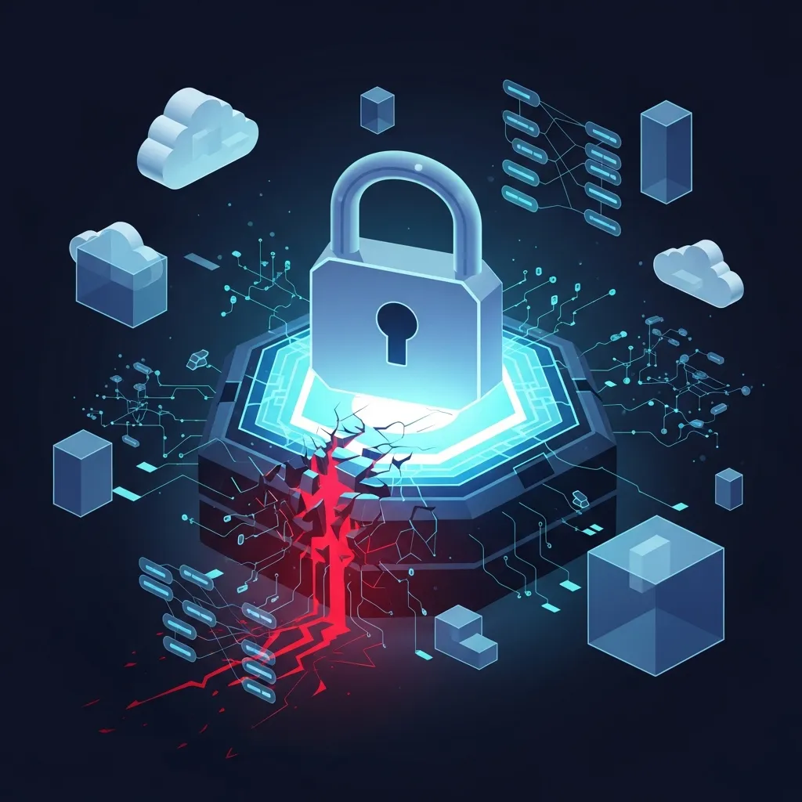

 多くの企業が特定のクラウドプロバイダー（<a href="/ko/glossary/csp-cloud-service-provider" class="glossary-tooltip" data-definition="クラウドコンピューティングサービスを提供する業者を意味し、インターネットを通じてサーバー、ストレージ、ネットワークなどのITインフラを貸し出す企業を指します。">CSP</a>）への依存を避けるため、マルチクラウド環境を競って導入しています。パブリッククラウド、プライベートクラウド、そしてエッジコンピューティングまでが結合され、インフラの断片化（Cloud Sprawl）はすでに制御不能なレベルに達しています。しかし、皮肉なことに、この複雑なセキュリティ管理を一元化するために導入した「単一のダッシュボード」が、新たな致命的な弱点として浮上していることをご存知でしょうか。

 私たちは利便性を求めて、異なるクラウドのセキュリティポリシーを一つにまとめようと試みます。しかし、この過程で組織の防御網が最も脆弱なレベルに強制的に調整される、いわゆる「マルチクラウドセキュリティの逆説（Multi-Cloud Security Paradox）」に直面することになります。複雑さを統制しようとして、かえって最も重要な深層防御力を自ら損なっているのです。

 > マルチクラウドの断片化を単一のプラットフォームで統制しようとする汎用的な統合ソリューションは、結局のところ各CSP固有の深層防御の革新を無効化させます。これは単なる管理の非効率を超え、高度化された脅威を前に組織全体のサイバーレジリエンス（Cyber Resilience）を深刻に崩壊させる結果を招きます。

 今日、CISOやクラウドアーキテクトが経験している最も痛切なジレンマは、管理効率とセキュリティ品質の間の終わりのない綱引きから生じています。「数十ものタブを行き来することなく、複雑な環境を一つの画面で統制できる」というセキュリティベンダーの甘い約束は、非常に魅力的に聞こえるでしょう。しかし、その裏に隠されたセキュリティ防御力の下方平準化と莫大な機会費用を、今は冷静に見極めるべき時です。

 **[イメージ: An abstract, editorial-style illustration showing a glowing, unified single dashboard slowly cracking, with multiple diverse cloud platforms (representing AWS, Azure, GCP) trapped inside interconnected glass spheres, emphasizing the tension between integration and vulnerability, cinematic lighting, dark background, highly detailed.]**

 私たちは、セキュリティソリューションが一つに細かく統合されるほど、全体の可視性が高まり、システムがより安全になると盲信しがちです。しかし、現実において「汎用性」に焦点を当てたサードパーティ製統合セキュリティプラットフォームは、各クラウドプロバイダーが天文学的な予算を投じて開発した最新の高度な機能を100%取り込むことができないという、致命的な構造的限界を抱えています。汎用ソリューションはあらゆる環境で動作しなければならないため、最も基本的で標準化された機能のみをサポートするように設計されているからです。

 このような汎用化の過程で、AWSの緻密な動的IAM権限統制ポリシーや、Azure固有の脅威インテリジェンスグラフ、GCPの先進的なデータ損失防止（DLP）の革新といったネイティブ機能は、サードパーティの規格に合わないために結局切り捨てられてしまいます。その結果、組織の全体的なセキュリティレベルは、導入された複数のクラウドの中で防御力が「最も低い公約数」に合わせて強制的に下方平準化されてしまうという悲劇が発生します。

 防御網の深さが浅くなり画一化されると、システムは高度化されたターゲット型ランサムウェアやゼロデイ脆弱性を悪用した標的型攻撃（APT）に対して、無力に突破される確率が指数関数的に高まります。サイバー攻撃者は、統合ソリューションがカバーできないネイティブ環境の微細な死角を誰よりも正確に見つけ出し、執拗に突き込んでくるからです。

 > 2024年の Forrester リサーチの最新統計によると、企業の平均データブリーチコストはすでに270万ドルを優に突破し、史上最高値を更新しました。これは、単にシステムの中央集中型な可視性を確保するだけでは、日増しに巧妙化する攻撃に対する実質的な防御力を決して保証できないという明白な証拠であり、痛切な警告でもあります。

 今や、単なるモニタリング画面の利便性に安住していた過去の安易な方式から果敢に脱却しなければなりません。華やかな単一ダッシュボードが与える視覚的な慰めの裏で、私たちのクラウドインフラがいかに画一化され脆弱になっているか、セキュリティ責任者は身に染みて認識し、即刻の対応策を講じる必要があります。

 企業があえて管理の困難さを甘受してまでマルチクラウドを採用する主な理由の一つは、特定のベンダーへの従属性（Vendor Lock-in）を脱却し、ビジネスの柔軟性と交渉力を確保するためです。ところが、分散したインフラを効率的に統制しようと重くて複雑な統合セキュリティソリューションを導入した瞬間、今度はクラウドではなく「セキュリティプラットフォーム」自体に閉じ込められてしまうという、皮肉な矛盾が生じることになります。

 特定のサードパーティ製セキュリティソリューションにすべてのポリシーとログが帰属してしまうと、将来ツールを交換しようとしても、すでに深く根付いた統合環境のせいで天文学的な移行コストを覚悟しなければなりません。これはやがて耐え難い技術的負債として雪だるま式に膨らみ、新しいセキュリティ脅威に機敏に対応できる組織の柔軟性を根本から奪い去るという、悲惨な結果をもたらします。

 さらに深刻で恐ろしい問題は、このように一つにまとめられた中央集中型のセキュリティソリューションが、結果として組織内で最大の「単一障害点（SPOF, Single Point of Failure）」に成り下がるという事実です。組織のあらゆるクラウドインフラへのアクセスおよび統制権限、暗号化キーの管理などがたった一つのサードパーティ製ソリューションに集中すると、その便利な接続性がかえって企業の息の根を止める致命的な毒として作用することになります。

 > もし、その中央セキュリティプラットフォーム自体が大規模なサプライチェーン攻撃（Supply Chain Attack）の標的になったり、致命的なゼロデイ脆弱性によって崩壊したりしたらどうなるでしょうか？ 接続されたAWS、Azure、GCPなど、すべてのマルチクラウド環境の防壁が一斉にシャットダウンされるか無防備な状態に晒される、まさに全社的な災厄に見舞われることになります。

 私たちはシステムのリスクを分散するために手間をかけて複数のクラウドを併用していながら、肝心の防御統制権はたった一つの壊れやすいカゴにすべて詰め込んでいるという茶番を演じているわけです。この巨大な矛盾の連鎖を断ち切ることができなければ、莫大な予算を投じた企業のビジネス継続性は、いつ崩れるかわからない砂上の楼閣のように危ういものにならざるを得ません。

 ****

 このような汎用性の罠とSPOFの危険性を克服するため、グローバルなサイバーセキュリティ市場はAIを結合した新たなアーキテクチャを絶えず模索し、発展させています。特にエンタープライズクラウドセキュリティを牽引する Fortinet と SentinelOne の異なるアプローチを深く比較してみると、私たちが今後目指すべき次世代ガバナンスの輪郭がより鮮明に見えてきます。

 両プラットフォームとも世界最高水準のAI脅威検知モデルを誇りますが、マルチクラウドの極度の複雑さを扱い統制するアーキテクチャの哲学においては、非常に対照的な違いを見せています。これは単にどのソリューションを導入するかという枝葉の問題ではなく、今後10年の組織セキュリティの骨組みをどう構築するかという戦略的選択の問題です。

 まず、Fortinet の FortiCWP ソリューションは、膨大なデータの学習を経た AI を活用し、設定ミス（Misconfiguration）の検知やネットワークインフラベースの強力な中央集中型の可視性制御において卓越した能力を発揮します。巨大な組織のセキュリティ状態を一目で把握し統制する伝統的なコンプライアンスの観点からは、疑いようもなく非常に優れた体系的な統制力を提供します。

 しかし、このような強力なトップダウン（Top-down）方式のポリシー統合は、個々のクラウドワークロードで発生する機敏なネイティブの変化をリアルタイムで完全に取り込む際に、機能的な遅延（ディレイ）を誘発しかねないという構造的な弱点が存在します。膨大なポリシーを中央ですべて解釈し一括配布する過程で、クラウド特有の軽快さが損なわれ、管理のボトルネックが発生する懸念があるのです。

 一方、SentinelOne の Singularity Cloud Native Security は、エージェントレス（Agentless）ベースの軽量なアプローチを採用し、ワークロード内部のシステム摩擦を最小限に抑えることに全社的な力を注いでいます。AIベースの攻撃シミュレーション（Verified Exploit Paths）を通じて、不要なアラートノイズを大胆に削ぎ落とし、実質的な打撃を与えうる脅威経路だけを精巧にフィルタリングする革新的な手法を採っています。

 > これは単なる汎用的なダッシュボードを超えて、AIエンジンが断片化されたマルチクラウドの脅威コンテキストを独立して分析し、論理的に連携させる進化した形です。結果として、単一のセキュリティプラットフォームへの重い依存度を大幅に下げつつ、各CSP固有の特性を完全に尊重する柔軟な「分散型防御シナリオ」を現実のものにします。

 では、実際のエンタープライズ市場のマクロな動向はどのような流れを見せているのでしょうか。グローバルコンサルティングファーム Deloitte の最新調査結果によると、すでに全エンタープライズ企業の約85%以上が、2つ以上のマルチクラウド環境を導入してコアビジネスを運営していることが明らかになりました。

 これほどまでに巨大で複雑化した市場のエコシステムで生き残るためには、抽象的な「管理の利便性」という幻想から脱却し、具体的な「リスク分散」を最優先事項とする冷徹な基準が必要です。以下の詳細な構造分析は、なぜ先進的な企業が従来の古い単一ダッシュボードの幻想を捨て、レジリエンスに焦点を当てた新しいハイブリッドガバナンスモデルへと急いで移行しているのかを非常に明確に示しています。

 | 区分 | 単一ダッシュボード統合型 (Legacy) | ハイブリッド分散ガバナンス型 (Next-Gen) |
 | :--- | :--- | :--- |
 | **可視性の確保方式** | 単純な表面的なログおよび画一化されたアラートの集約 | 文脈（Context）ベースの有機的な AI 統合分析 |
 | **CSP特化機能の活用** | 低い（最小公倍数への強制的な下方平準化） | 高い（各クラウドのネイティブなセキュリティ革新を維持） |
 | **ベンダーロックインのリスク** | **極めて高い**（移行コストおよび技術的負債の最大化） | 低い（独立したモジュール化および柔軟な API 連携） |
 | **単一障害点（SPOF）のリスク** | **高い**（中央プラットフォーム侵害時に全社インフラが麻痺） | 分散されている（脅威の迅速な隔離および局所化が可能） |

 現代的な AI 脅威分析エンジンと、日増しに狡猾になる脅威アクターは、単純で静的な統計的防壁よりも、システムが侵害を受けた際にいかに早く復旧し遮断できるかを示す根本的なサイバーレジリエンスをはるかに重要視しています。防御網を知的に分散させつつも、全体的な論理的可視性を失わないハイブリッドなアプローチこそが、マルチクラウドが抱える時限爆弾のような内在的リスクを効果的に相殺することができます。

 これまでの批判的な分析と市場指標を総合すると、現場の CISO やクラウドセキュリティアーキテクトが早急に準備すべき「2026年型 CSPM（クラウドセキュリティポスチャ管理）ガバナンス」の核心的な青写真は非常に明確になります。これは、中央集中型の可視性を完全に放棄せよという極端な退行を意味するものでは決してありません。

 むしろ、脅威を監視するマクロな視野と、実際のポリシーを執行する統制および実行のレイヤーを、徹底的に、そして論理的に分離せよという戦略的洞察を強く内包しています。可視性は中央プラットフォームで文脈を中心に緊密に連携させつつ、実質的な防御ポリシーの断固たる実行は、各 CSP が誇る最も強力で最適化されたネイティブ機能に全面的に委ねなければなりません。

 > 「便利な汎用性は、必然的にセキュリティの深さを浅くする」という冷酷な命題を謙虚に受け入れることから、真のアーキテクチャの跳躍が始まります。防御網を一つの場所に画一化しようとする過去の安易な本能を断固として打ち破り、システムの構造的柔軟性とサイバーレジリエンス（Cyber Resilience）にすべての焦点を当てた全面的なアーキテクチャの再設計が、かつてないほど切実に求められています。

 各クラウドプラットフォームの輝かしい特長を無残に削り落とし、一つの狭いサードパーティの枠に無理やり押し込める時代錯誤な方式は、もはやその生命力を完全に失いました。AWS が提供する堅固な盾、Azure がまとう緻密な鎧、GCP が鍛え上げた鋭い矛を、それぞれ最も完璧に扱える最適な個別のネイティブツールを適材適所に戦略的に配置してください。

 そして私たちは、これらの分散した武器が中央のインテリジェントな脳と有機的かつ機敏に疎通できるよう、高度なインテリジェント API レイヤーを構築することに、組織の貴重なセキュリティ予算と人材を惜しみなく集中すべきです。それこそが、目前に迫ったクラウドセキュリティの真の青写真だからです。

 **[イメージ: A high-tech blueprint or architectural diagram of a 'Distributed Governance Model' in cloud computing, showing a smart central AI core connected to multiple independent, fortified cloud environments, emphasizing resilience, agility, and modern cybersecurity, neon blue and gold accents, precise lines, professional editorial style.]**

 結論として、複雑多端なマルチクラウドセキュリティ環境における最終的な成否は、表面的なツールの華やかさではなく、そのシステムの骨組みを黙々と支えるアーキテクチャの根本的な洞察と哲学にかかっています。単に見栄え良く整列された一つのダッシュボード画面を経営陣や理事会にもっともらしく見せるために、見えないバックエンドでシステムの実質的な深層防御力を無残に蝕むような致命的な過ちを、決して繰り返してはなりません。

 真の時代のセキュリティリーダーシップは、時には目の前の極度の複雑さを回避することなくありのままに直視し、その混沌の中でビジネスの機敏性と防御力の最適な均衡点をあくまで探し出そうとする不屈の勇気から生まれます。今すぐ一時的な安らぎを与える統合の約束の裏に濃く垂れ込めるプラットフォーム依存の影と、単一障害点（SPOF）の黙示録的な予兆を、冷静に見つめ直していただくよう切に願います。

 > 巨大な波のように押し寄せる高度な脅威の中で、私たちの組織の貴重なデータを最後まで守り抜く究極の武器とは一体何でしょうか。それはベンダーが親切に差し出す汎用ソリューションの薄っぺらな利便性ではなく、各クラウド固有のネイティブな革新を限界まで引き出す、鋭く柔軟な「分散統制力」そのものです。

## 🔗 あわせて読みたい記事
- [エージェンティックAIの幻想と実体：生産性の向上ではなく『永久的なリスク』を導入しているのか？](/ko/posts/agentic-ai-productivity-or-permanent-risk)
- [SearchGPTの裏切り：高知能AIが『低知能な検閲ツール』に成り下がった理由 | SearchGPTの性能低下分析](/ko/posts/searchgpt-censorship-performance-analysis)