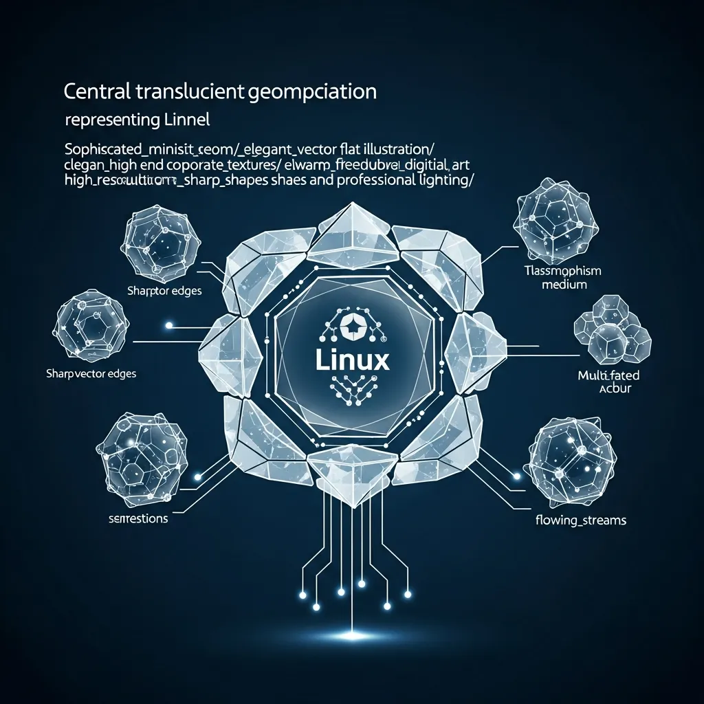

---
title: "eBPF, プログラマブルカーネルの革命：万能の鍵か、巨大な障壁か？"
author: editornom
author_role: Senior Tech Editor
author_url: https://editornom.com/about
pubDatetime: 2026-05-08 14:19:04.719136+09:00
slug: "ebpf-programmable-kernel-revolution"
featured: false
draft: false
ogImage: "../../../../../source/posts/eBPF/910752d9-0.webp"
description: "リナックスカーネルのパラダイムを変えたeBPFの技術的進化と実務的制約事項を分析し、OpenTelemetryと結合してシステム可視性を最大化する戦略を提示します。カーネルレベルの高性能制御とアプリケーション層のインサイトを統合する、最適なオブザーバビリティ実装方法を確認してください。"
references:
- https://oneuptime.com/blog/post/2025-12-10-what-is-ebpf-and-how-does-it-work/view
- https://www.kentik.com/kentipedia/what-is-ebpf-extended-berkeley-packet-filter/
- https://www.suse.com/c/ebpf-kubernetes/
modDatetime: 2026-05-08 14:29:04.719136+09:00
faqs:
- q: "eBPF技術とは何であり、なぜ革命的だと評価されているのですか？"
  a: "eBPFは、リナックスカーネルを修正したり再コンパイルしたりすることなく、カーネル内部で安全にプログラムを実行できるようにする技術です。静的だったカーネルをプログラマブルな動的環境に変えたという点で、インフラのパラダイムを変えた革命であると評価されています。"
- q: "過去のBPFと現代のeBPFにはどのような違いがありますか？"
  a: "1992年のBPFが単純なネットワークパケットフィルタリングツールであったのに対し、2014年に進化したeBPFは、64ビットレジスタと状態保存構造であるMapsを備えたカーネル内の汎用仮想マシンです。現在ではシステムコール、セキュリティ、関数トレースなど、システム全般を制御できます。"
- q: "eBPFが提供するゼロタッチ可視性の利点は何ですか？"
  a: "アプリケーションコードを修正したり、別途SDKを組み込んだりすることなく、システム全体の流れを観察できる点です。サイドカーエージェントなしでも、インフラレベルで発生するすべてのイベントをリアルタイムで把握できるため、運用の利便性が非常に高いです。"
- q: "カーネルレベルでプログラムを実行する際の安全性はどのように保証されますか？"
  a: "リナックスカーネル内部にある検証器（Verifier）が、コードを実行する前に事前に検査します。無限ループに陥っていないか、許可されていないメモリ領域にアクセスしていないかを厳密に確認し、eBPFプログラムがシステム全体を崩壊させないように事前に遮断します。"
- q: "eBPFプログラムがデータを保存し、ユーザー空間と通信する方法は何ですか？"
  a: "Mapsと呼ばれる効率的な共有メモリ構造を使用します。これにより、カーネル空間で収集したデータを状態情報として保存したり、ユーザー空間の制御プログラムとリアルタイムでデータをやり取りしながら複雑なロジックを遂行したりできます。"
- q: "eBPF活用時に言及されるセマンティックギャップとは、具体的に何を意味しますか？"
  a: "カーネルが見るシステム指標と、開発者が見るビジネス文脈の間の断絶を指します。eBPFは特定のプロセスのI/O発生を知ることはできますが、それがどのユーザーIDのリクエストなのか、あるいはどの注文案件によるものなのかといった詳細なサービス情報は把握できません。"
- q: "実務でeBPFプログラムを直接開発する際に直面する技術的障壁は何ですか？"
  a: "検証器の厳格な制約条件を通過することが最も困難です。スタックサイズが512バイトに制限され、複雑なループの実装が難しいため、単純なロジックであってもカーネルに対する深い理解がなければ、実装やロードに失敗する確率が非常に高いです。"
- q: "多様なリナックスカーネル環境におけるeBPFの移植性問題はどのように解決しますか？"
  a: "以前はカーネルバージョンごとに再コンパイルが必要でしたが、現在はBTFとCO-RE技術を通じて解決されています。これらを活用すれば、一度作成してコンパイルしたeBPFプログラムを、異なるバージョンのカーネルを持つ多数のノードで修正なしに実行できます。"
- q: "eBPFを使えばコードを直さなくてもすべて見えるとのことですが、OpenTelemetryのようなツールはもう不要になるのでしょうか？"
  a: "いいえ、両技術は併用したときに最も効果を発揮します。eBPFはインフラ全般を広く見せますがビジネスコンテキストが不足しており、OpenTelemetryはコード内の深いコンテキストを見せます。したがって、システム全体を立体的に把握するには、両ツールを統合して使用するのが最善です。"
- q: "サーバーのカーネルバージョンが少し低いのですが、eBPFを導入するとシステムが遅くなったり、突然ダウンしたりする危険はありませんか？"
  a: "eBPFはJITコンパイルを通じて非常に高速に実行され、検証器が危険なコードを事前にフィルタリングするため、カーネルを直接修正するよりもはるかに安全です。ただし、最新機能を完全に活用するには4.18バージョン以上のカーネルを推奨しており、導入前の互換性確認は必須です。"
---
<strong>[BLUF]</strong>
eBPFは、リナックスカーネルを修正したり再コンパイルしたりすることなく、高性能なネットワーキングやセキュリティ機能を実装可能にした技術的なパラダイムシフトです。しかし、カーネルレベルのデータのみに集中するため、実際のサービスのビジネスロジックを把握できない「セマンティックギャップ」と、厳格な検証器（Verifier）の制約という実務的な障壁が存在します。したがって、eBPFは単独の解決策ではなく、<a href="/jp/glossary/what-is-opentelemetry" class="glossary-tooltip" data-definition="アプリケーションの実行状態を観察するために必要なログ、指標、トレース情報を標準化された方法で収集し、外部システムに送信するオープンソースプロジェクトおよび標準です。">OpenTelemetry</a>のようなアプリケーション層の可視化ツールと相互補完的に組み合わされたとき、初めて真の価値を発揮します。

## 1. リナックスカーネルの停滞期を打破したeBPFの歴史的価値

 リナックスカーネルは、長い間、安定性とセキュリティを理由に外部からのアクセスを極度に制限してきた堅牢な城壁のような存在でした。新しい機能を追加するためには、カーネルソースを直接修正し、数ヶ月の検証を経て再コンパイルするという苦痛なプロセスを耐え忍ばなければなりませんでした。

 このような停滞したエコシステムに、eBPF（extended Berkeley Packet Filter）は、あたかもウェブブラウザのJavaScriptのような柔軟性を与えて登場しました。カーネルのソースコードを一行も触ることなく、ランタイムにカーネルの動作を拡張できるようになったのです。

### 1.1 1992年から2014年まで：単純なフィルターから汎用仮想マシンへの進化

 eBPFのルーツは1992年に発表されたBPFにまで遡りますが、当時は単純なネットワークパケットフィルタリングのための補助ツールに過ぎませんでした。32ビットレジスタを使用し、非常に限定的な演算のみを行っていたこの技術は、2014年にアレクセイ・スタロボイトフによって画期的に生まれ変わりました。

 現代のeBPFは、10個の64ビットレジスタとMapsという状態保存構造を備えた、カーネル内の汎用仮想マシン（eBPF VM）へと進化しました。今ではネットワークパケットだけでなく、システムコール、カーネル関数のトレース（kprobes）、ユーザー空間の関数（uprobes）まで監視できる全天候型のツールとなりました。

### 1.2 「カーネル再コンパイル不要の拡張」：ITインフラのJavaScriptモーメント

 ウェブページが静的なHTMLからJavaScriptを通じて動的なプラットフォームへと変貌したように、eBPFはカーネルを「プログラマブルな対象」に変えました。これは、インフラエンジニアがカーネル開発者でなくても、望むロジックを安全に挿入できる通路を開いた出来事です。

 MetaやGoogleのようなテック巨人がこの技術に熱狂する理由は明白です。数万台のサーバーにリアルタイムでセキュリティポリシーを配布したり、高性能な負荷分散（Load Balancing）機能を即座に適用したりできるからです。

## 2. 「ゼロタッチ」可視性の魔法とその裏に隠されたインフラ偏向性

 eBPFが提供する最も魅力的な約束は、アプリケーションコードを修正せずにすべてを観察できるという「ゼロタッチ（Zero-Touch）」の可視性です。サイドカー（Sidecar）エージェントを立ち上げたりSDKを組み込んだりしなくても、インフラ全体の流れを一目で把握できるのです。

 しかし、この魔法の裏には「インフラ偏向的なデータ」という手痛い限界が隠されています。eBPFはカーネルレベルで発生するパケットやシステムコールを収集しますが、そのデータが実際にどのようなビジネス上の意味を持つのかまでは理解していません。

### 2.1 カーネルレベルデータの限界：なぜeBPFはあなたの「ビジネスロジック」を理解できないのか

 例えば、eBPFは特定のプロセスがディスクI/Oを発生させたことは分かりますが、それがどの「ユーザーID」のリクエストなのか、あるいはどの「注文情報」によるものなのかは分かりません。カーネルはプロセス番号（PID）とメモリ番地で世界を見ていますが、開発者はユーザー名と決済リクエストという文脈で世界を見ているからです。

 このような情報の欠如は、実務において致命的な問題となります。インフラ指標が急上昇しても、それがビジネスの収益に直接影響を与えるVIP顧客のリクエストなのか、それとも重要度の低いバックグラウンドタスクなのかを区別するのが難しいということです。

### 2.2 セマンティックギャップ（Semantic Gap）：インフラ指標とユーザーコンテキストの断絶

 専門家はこれを「セマンティックギャップ（Semantic Gap）」と呼びますが、これは低レベルのシステムデータと高レベルのアプリケーションコンテキストの間の断絶を意味します。eBPFが収集した断片的なデータだけでは、障害の根本原因がどのコード行から始まったのかを追跡するのは非常に困難です。

 結局、「コード修正不要の利便性」を得る代わりに、私たちはデータの深さと文脈を犠牲にしていることになります。次の表は、eBPFと従来のアプリケーション層トレースツールの明白な違いを示しています。

| 比較項目 | eBPF (Zero-Touch) | OpenTelemetry (SDK/Agent) |
| :--- | :--- | :--- |
| データソース | カーネルイベント、システムコール | アプリケーションランタイム、コード内注入 |
| 負荷 (Overhead) | 極めて低い (JITコンパイル) | 相対的に高い (SDK処理コスト) |
| 文脈の深さ | インフラ中心 (CPU, Disk I/O) | ビジネス中心 (User ID, 注文 ID) |
| 実装難易度 | 非常に高い (カーネル構造の理解が必須) | 中程度 (標準ライブラリの活用) |

## 3. 実務適用のブーメラン：実装難易度が低いという幻想

 多くの人がeBPFツールを「インストールすれば終わりの解決策」と誤解していますが、自分でツールを開発したりカスタマイズしたりした瞬間に現実の壁にぶつかります。eBPFプログラムはカーネル内部で実行されるため、たった一つのミスでもシステム全体を崩壊させる危険性を孕んでいます。

 これを防ぐために、リナックスカーネルは「検証器（Verifier）」という非常に厳格な門番を配置しています。しかし、この門番が実務エンジニアにとっては最大の技術的障壁となることが多々あります。

### 3.1 検証器（Verifier）との死闘：安全のための制約が開発コストを急増させる理由

 検証器は、eBPFコードが無限ループに陥らないか、無効なメモリにアクセスしないかを厳密に検査します。特にスタックサイズを512バイトに厳しく制限し、ループ回数までも制約するため、少しでも複雑なロジックを実装しようとするとロードに失敗します。

 エンジニアは、この検証器を通過させるためにClang/LLVMコンパイラと格闘し、コードのロジックを何度も削ぎ落とさなければなりません。開発生産性の側面から見れば、eBPFは決して「楽な道」ではなく、むしろ深いカーネル知識を要求される高難易度の作業です。

> "eBPFは強力な魔法ですが、その杖を振るためには、カーネルの心臓部を理解するという過酷な代償を払わなければなりません。"

### 3.2 メンテナンスのジレンマ：カーネルバージョンによる移植性の問題（CO-RE）と管理負荷

 以前は、カーネルバージョンが少し異なるだけでeBPFプログラムが動作しなくなる移植性の問題が大きな悩みでした。BTF（BPF Type Format）とCO-RE（Compile Once, Run Everywhere）技術が導入されたことでこの問題は緩和されましたが、依然として管理負荷は無視できません。

 クラウドネイティブな環境で、異なるバージョンのカーネルを使用する数百のノードを運用する場合、各ノードでeBPFプログラムが同様に動作することを保証する作業は決して容易ではありません。BCC（BPF Compiler Collection）やbpftraceのような優れたツールも、結局は運用の複雑さを完全に除去してくれるわけではありません。

## 4. 結論：eBPFとOpenTelemetryの共存、統合オブザーバビリティを目指して

 結局のところ、私たちはeBPFを「すべての問題を解決する万能の鍵」と見なすべきではありません。インフラの透明性を高める強力な基盤技術として認めつつも、その限界が明確であることを認識する冷静さが必要です。

 真の意味でのオブザーバビリティ（Observability）は、eBPFの「広範なインフラデータ」とOpenTelemetryの「奥行きのあるアプリケーションコンテキスト」が出会ったときに完成します。eBPFがインフラの死角を照らし、OpenTelemetryがビジネスの流れを追跡するとき、初めて私たちはシステム全体を立体的に俯瞰することができます。

> "技術の革新は、対象を代替することではなく、既存の限界を補完しながら新しい可能性の領域を拡張することにあります。eBPFとアプリケーション可視性の結合こそが、まさにその地点です。"

 単なる称賛を超えて、この技術の鋭い側面まで理解したとき、初めてあなたのインフラは一段上のレベルへと進化することができるでしょう。eBPFは革命の始まりに過ぎず、完成された終着駅ではないことを忘れてはなりません。

## 🔗 あわせて読みたい記事
- [分散システムアーキテクチャ：無限の拡張がもたらした複雑性の祝福と呪い](/jp/posts/distributed-systems-scaling-complexity)
- [トランスフォーマーアーキテクチャの逆説：並列性の勝利か効率性の破産か？](/jp/posts/transformer-architecture-paradox)
