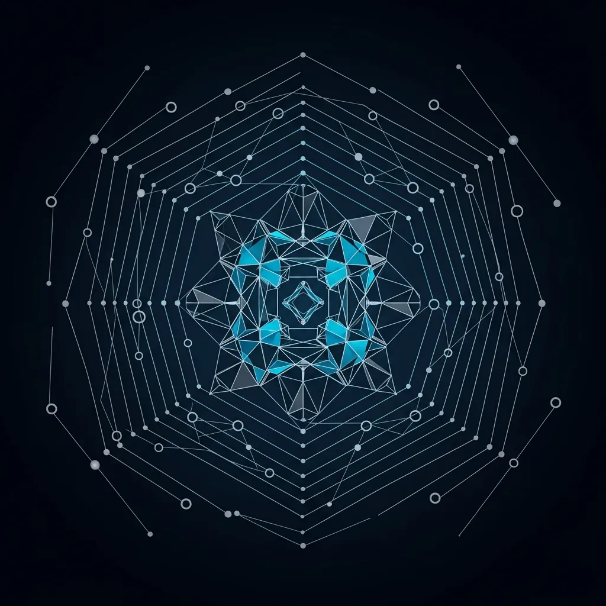

---
title: "ゼロトラストのパラドックス：NIST 800-207が見落とした単一障害点とサイバーレジリエンスの未来"
author: editornom
author_role: Senior Tech Editor
author_url: https://editornom.com/about
pubDatetime: 2026-05-09 14:37:13.421832+09:00
slug: "zero-trust-paradox-nist-800-207-cyber-resilience"
featured: false
draft: false
ogImage: "../../../../../source/posts/Zero_Trust_Architecture/89e3c191-0.webp"
description: "ゼロトラストアーキテクチャが招くIAMの単一障害点（SPOF）のリスクを分析し、技術的な複雑さとヒューマンエラーを克服してシステムの自己修復能力を確保するサイバーレジリエンスの重要性について考察します。"
references:
- https://www.microsoft.com/ko-kr/security/business/security-101/what-is-zero-trust-architecture
- https://www.nist.gov/news-events/news/2025/06/nist-offers-19-ways-build-zero-trust-architectures
- https://zeronetworks.com/resource-center/topics/zero-trust-security-a-complete-guide-to-principles-architecture-and-best-practices
modDatetime: 2026-05-09 14:47:13.421832+09:00
faqs:
- q: "ゼロトラスト（Zero Trust）とは正確には何ですか？"
  a: "「決して信頼せず、常に検証せよ」という哲学に基づいた現代のセキュリティ標準です。ネットワークの内部と外部を区別せず、すべてのアクセス要求を潜在的な脅威とみなし、ユーザーの身元やデバイスの状態をその都度明示的に確認する手法です。"
- q: "ゼロトラストアーキテクチャの核となる技術は何ですか？"
  a: "マイクロセグメンテーションとIAM（アイデンティティおよびアクセス管理）が中心です。ネットワークを細かく分割してアクセスを制御し、ポリシー決定ポイントであるPDPを通じてユーザーの権限をリアルタイムで検証し、データへのアクセスを制御します。"
- q: "NIST 800-207ガイドラインはどのような役割を果たしていますか？"
  a: "ゼロトラストの抽象的な概念を具体的な技術フレームワークとして確立したグローバルな標準文書です。現代のIT環境においてセキュリティ体系を設計する際に遵守すべき原則、構成要素、論理アーキテクチャを提示し、組織のセキュリティ強化を支援します。"
- q: "なぜサイバーレジリエンス（Cyber Resilience）という概念が強調されているのですか？"
  a: "完璧な防御は不可能であるという前提のもと、攻撃を受けたりシステムに障害が発生したりしても、ビジネスを中断させることなく継続し、元の状態へ迅速に復旧する能力が重要視されているためです。これは単なるセキュリティを超えた、企業の生存における核心的な戦略です。"
- q: "ゼロトラストが従来の境界防御方式と異なる点はどこですか？"
  a: "従来の手法は城壁を築くように内部ネットワークを安全だと信じていましたが、ゼロトラストは境界そのものをなくします。接続者の場所に関係なく検証を繰り返し、一度の認証が永久的な信頼を保証しないという点が最大の違いです。"
- q: "ゼロトラスト導入時にIAMが単一障害点（SPOF）になるというのはどういう意味ですか？"
  a: "すべての権限管理がIAMシステムに集中するため、このシステムに技術的な欠陥が生じたり、ハッキングを受けたりした場合、組織のすべての資産に対するアクセスが麻痺したり、無力化されたりするリスクがあることを意味します。これは中央集中型検証体系の構造的な限界です。"
- q: "ゼロトラストの運用過程で発生する「ヒューマンエラー」の主な原因は何ですか？"
  a: "絶え間なく繰り返される認証要求と複雑なポリシー設定が、管理者に極度の疲労を引き起こすためです。このようなセキュリティ疲労は設定ミスにつながったり、ユーザーが不便さを避けるために勝手にセキュリティを回避する結果を招いたりします。"
- q: "技術的負債と複雑性の問題を解決しながらゼロトラストを高度化する方法は？"
  a: "人間による手動管理を超え、AIベースの自動化システムを導入する必要があります。リアルタイムの状況認識に基づいた可変的な検証体系を構築し、システム自らエラーを修正する自己修復能力を確保することで、管理効率とセキュリティを同時に高めるべきです。"
- q: "実際にゼロトラストを構築してみると管理負担が大きすぎるのですが、軽減する現実的な方法はありますか？"
  a: "すべてのポリシーを手動で管理するのではなく、AIと自動化ツールを積極的に活用してください。セキュリティ制御が業務フローを妨げないようユーザーエクスペリエンスを考慮し、システム自ら修復する機能を強化して、管理者が逐一対応しなくても済むレジリエンス中心の設計を検討する必要があります。"
- q: "NISTガイドラインに合わせてシステムを刷新すれば、今後ハッキングやサーバーダウンの心配はなくなりますか？"
  a: "標準を遵守することが完璧な安全を保証するわけではありません。技術はいつでも失敗する可能性があることを認め、侵害事故が発生したとしても被害を最小限に抑え、迅速に復旧できるガバナンスを備えることが重要です。セキュリティはツールではなく、継続的な進化のプロセスです。"
---
<strong>[BLUF]</strong>
ゼロトラスト（Zero Trust）は「決して信頼せず、常に検証せよ」という哲学によって現代セキュリティの標準となりましたが、皮肉にもアイデンティティ権限管理（IAM）システムを巨大な単一障害点（SPOF）へと変貌させています。真のサイバーセキュリティの完成は、単なるソリューションの導入を超え、技術的な複雑さが招く「ヒューマンエラー」を克服し、システムの自己修復能力を確保するサイバーレジリエンス（Cyber Resilience）にかかっています。

## 1. ゼロトラストアーキテクチャとNIST 800-207標準

 2000年代初頭、セキュリティ専門家の集まりであるジェリコ・フォーラム（Jericho Forum）は、城壁を築いて内部を保護する伝統的な境界防御の終焉を予告しました。当時彼らが提唱した「脱境界化（De-perimeterization）」の議論は、今日私たちが知るゼロトラストアーキテクチャ（ZTA）の思想的なルーツとなりました。

 その後、NIST 800-207標準が確立されたことで、ゼロトラストは単なるバズワードを超え、現代のITアーキテクチャの根幹を揺るがす哲学的な大転換として定着しました。しかし、技術的な完成度とは裏腹に、現場では理論と現実の間に深い乖離が生じているのが実情です。

### 技術的観点からの詳細分析

 ゼロトラストの核心は、「信頼」という言葉をセキュリティの方程式から完全に排除することにあります。すべてのアクセス要求を潜在的な脅威とみなし、ユーザーのidentityとデバイスの状態を常に明示的に検証するマイクロセグメンテーション（Microsegmentation）技術がその中心にあります。

 このようなアプローチは、ハイブリッドワークやCloudへの移行が加速した環境において、セキュリティ態勢を画期的に強化しました。しかし、すべてのセキュリティ制御権が強力なIAMシステムに集中したことで、これまでに見られなかった新しい形態の脆弱性が現れ始めました。

> 「セキュリティの軸足がネットワークからアカウント（アイデンティティ）へと移動したことで、皮肉にもその軸足自体が、攻撃者が狙う最も致命的な単一障害点（SPOF）になってしまったのです。」

## 2. 暗黙の信頼地帯の終焉とリアルタイム検証

 ポリシー決定ポイント（PDP）であるIAMシステムが侵害されたり、技術的な欠陥で麻痺したりした場合、組織のすべての資産に対するアクセスが一時に遮断されるか、あるいは逆に無力化される可能性があります。これは中央集中型の検証体系が持たざるを得ない構造的な限界であり、ゼロトラストが抱える致命的なアキレス腱と言えます。

 実際にNIST 800-207ガイドラインは技術的なフレームワークを明確に提示していますが、それを運用する過程で発生する人間の認知的な限界は見過ごされる傾向にあります。セキュリティ専門家の90%がゼロトラストを中核戦略として挙げながらも、その88%が実装過程で運用上の障害を経験している理由は、まさにここにあります。

 絶え間なく続く認証要求と複雑化したポリシー設定は、管理者に極度のセキュリティ疲労を引き起こします。この疲労は結局、設定ミスという「ヒューマンエラー」につながったり、ユーザーが不便さを避けるためにセキュリティポリシーを回避する「シャドーIT」現象を深化させる起爆剤となったりしています。

## 3. 複雑性の増加に伴う新しいセキュリティ脆弱性の浮上

 私たちは今、技術的負債と運用の複雑さが招くタイムリミットに直面すべきです。単に「検証を強化する」という論理から脱却し、システムが攻撃を受けたり麻痺したりしてもビジネスを継続できるサイバーレジリエンスの観点へとパラダイムをシフトさせる時です。

 以下の比較表は、私たちが目指すべきゼロトラストの進化の方向性を明確に示しています。従来の標準的なアプローチを超え、どのようにレジリエンス中心のガバナンスへと進むべきか、熟考が必要な時期です。

## 4. サイバーレジリエンスを中心としたエンタープライズ防衛

| 評価項目 | 従来の境界防御 | 標準的なゼロトラスト(ZTA) | レジリエンス中心のZTA |
 |---|---|---|---|
 | 信頼モデル | 場所ベースの暗黙の信頼 | すべての要求を明示的に検証 | 状況認識ベースの可変的な検証 |
 | 制御構造 | 分散型ネットワーク制御 | IAMベースの中央集中制御 | 自動化された分散ポリシー執行 |
 | 障害リスク | 物理的なセキュリティ境界の崩壊 | IAM/PDPの単一障害点(SPOF) | 自己修復型のガバナンス体系 |
 | 運用中心 | ネットワークの可用性 | セキュリティ制御の完結性 | ユーザーエクスペリエンス(UX)および回復力 |

 真のゼロトラストの成功は、特定のソリューションを導入するかどうかではなく、AIベースの自動化を通じて管理の複雑さをいかに効果的に解消するかにかかっています。人間がすべてのポリシーを手動で管理する時代はすでに過ぎ去り、機械的な検証と人間の判断が調和するインテリジェントなセキュリティ体系が求められています。

 また、C-Levelの意思決定者は、セキュリティを単なるコストや技術的な課題ではなく、企業の永続性を保証する核心的な経営戦略として認識する必要があります。完璧な不信がもたらし得る逆説的な脆弱性を認識し、柔軟でありながら強力なガバナンスモデルを構築することこそが、デジタル大転換時代の真の生存戦略です。

> 「技術は決して完璧ではないため、私たちはシステムの崩壊を想定し、その後に備える『レジリエンス（回復力）』の哲学をゼロトラストの上に重ね合わせる必要があります。」

 結局のところ、ゼロトラストは目的地ではなく、絶えず進化し続けるプロセスそのものと言えます。標準文書を超えて現場の声に耳を傾け、技術と人間の間のバランスを見出していく道のりこそが、組織を真に安全に守ることができる唯一の道です。

 これからのセキュリティ設計は、単に「誰を防ぐか」を超え、「いかに耐え抜くか」に焦点を当てるべきです。このような哲学的考察が込められたゼロトラストこそが、不確実性に満ちた未来のサイバーエコシステムにおいて、信頼できる唯一の羅針盤となってくれるでしょう。
