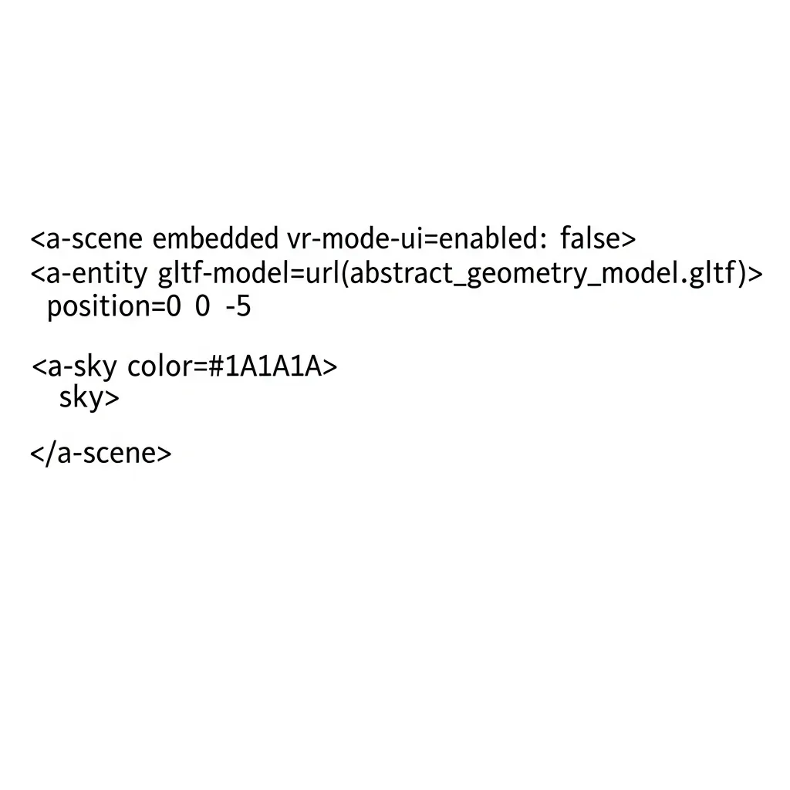
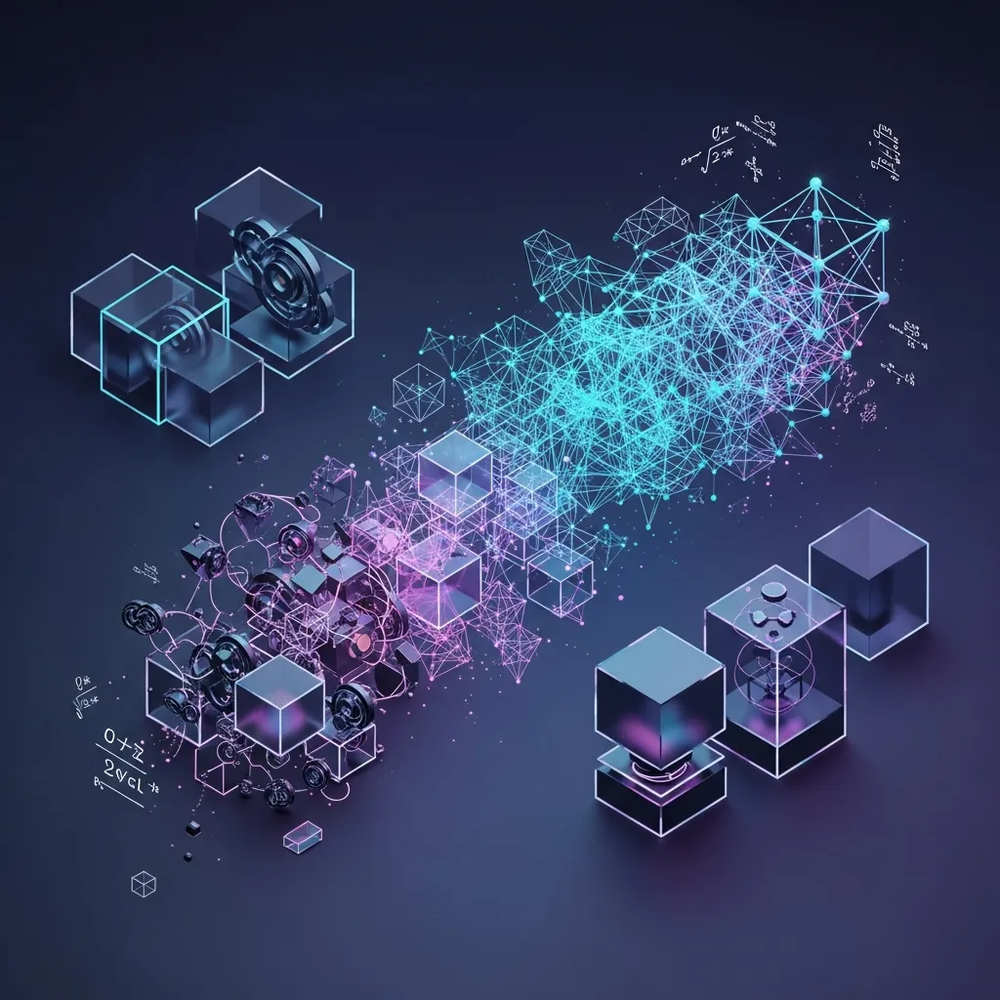

<strong>[BLUF]</strong>
非対称暗号は情報権力を分散させたデジタル民主主義の礎でしたが、数学的難題のみに依存する構造的限界と量子コンピューティングという物理的実体を前に、「時限付きのセキュリティ」という運命を迎えました。もはや完璧なアルゴリズムを求める傲慢さを捨て、脅威に応じて即座に暗号体系を交換できる「クリプト・アジリティ（暗号の俊敏性）」を確保することこそが、唯一の生存戦略です。

人類が秘密を共有してきた歴史は、すなわち権力の流れを決定づける闘争の歴史でもありました。かつて中央集権的な機関が信頼を保証していた時代から脱却し、個別の主体が数学的論理だけで信頼を構築できるようになったことは、現代文明における最も巨大な跳躍の一つでした。

この変化の中心にあったのが、まさに非対称暗号（Asymmetric Cryptography）です。私たちはこれを通じて、目に見えないデジタル空間で互いを確認し、安全に価値を交換し、巨大なウェブエコシステムを構築することができたのです。

# 1. 信頼のパラダイムシフト：鍵配送の呪いを解く

非対称暗号の登場は、暗号学界における「ビッグバン」のような出来事でした。それ以前の共通鍵方式は、情報をやり取りする前に必ず「鍵」をあらかじめ共有しておかなければならないという致命的な弱点、すなわち「鍵配送問題」を抱えていました。

1970年代、ディフィーとヘルマン、そしてRSAの登場は、この不可能に思えた問題を数学的に解決しました。公開鍵と秘密鍵という二重構造を通じ、誰にでも公開された鍵で暗号化し、自分だけが持つ鍵で復号するという革新的な方式を提案したのです。

この技術は、やがて現代インターネットの根幹であるPKI（公開鍵基盤）へと発展しました。私たちが毎日使用するブラウザの鍵アイコンや <a href="/jp/glossary/what-is-ssl-tls" class="glossary-tooltip" data-definition="Webブラウザとサーバ間の通信を暗号化し、データを安全にやり取りできるように支援する標準的なセキュリティプロトコルです。">SSL/TLS</a> 通信は、すべてこの目に見えない数学的な網の上に築かれた信頼の賜物と言えます。

何よりも重要な成果は、「電子署名」の誕生でした。非対称性を活用してデータの出所を明確にし、改ざんを防止することで、デジタル空間における否認防止（Non-repudiation）と完全性を完璧に具現化したからです。

> 「非対称暗号は単にデータを隠す技術ではありません。それは信頼の主体を中央機関から個人の数学的鍵へと移動させた、最も優雅な形態のデジタル民主主義なのです。」

# 2. セキュリティのパラドックス：巨大な城壁の裏に隠された「ガラスの鍵」

しかし、私たちは数学の完璧さに没頭するあまり、最も根本的な脆弱性を忘れていました。いかに堅牢な数学的障壁を築いても、結局その障壁を開ける「プライベートキー（秘密鍵）」は、人間という不完全な存在が管理しなければならないという点です。

プライベートキーが奪取された瞬間、いかなる複雑な暗号化体系も瞬時に崩壊してしまう「単一障害点（SPOF）」の悲劇が始まります。数学は完璧だったかもしれませんが、それを実装し管理する現実世界のハードウェアと人間は、決して完璧ではあり得なかったのです。

効率性を追求する過程でも、私たちは防御力を一部犠牲にする必要がありました。巨大な整数の素因数分解に依存していたRSAから、より効率的な楕円曲線暗号（ECC）へと進化しましたが、これは技術的な効率を高めただけであり、根源的な数学的限界を克服したわけではありませんでした。

| アルゴリズムの種類 | 基盤となる数学的難題 | 鍵長 (128-bit セキュリティレベル) | 量子脅威レベル | 主な用途 |
| :--- | :--- | :--- | :--- | :--- |
| RSA | 素因数分解 | 3072 bits | 非常に高い (Shorに脆弱) | Webセキュリティ (SSL/TLS), PKI |
| ECC | 楕円曲線離散対数 | 256 bits | 非常に高い (Shorに脆弱) | モバイル, ブロックチェーン, IoT |
| PQC (格子ベース) | 格子内の最短ベクトル問題 | 数千 bits 以上 | 低い (量子耐性を確保) | 次世代国家セキュリティ標準 |

上の表からわかるように、現在広く使用されているRSAとECCは、いずれも量子コンピューティングという巨大な波の前で同じ運命を共有しています。効率のために選択した短い鍵長は、量子コンピュータにとってはむしろ格好の餌食にすぎません。

# 3. 時限付きセキュリティの終焉：量子コンピューティングとショア（Shor）の影

数十年にわたり暗号学界を支えてきた「数学的難題」は、今や時限付きの宣告を受けました。スーパーコンピュータで万年かかっても解けないとされていた素因数分解の問題が、量子コンピュータの「ショアのアルゴリズム（Shor's Algorithm）」の前では、わずか数秒で解決される可能性があるからです。

これは単に演算速度が速くなるというレベルではなく、セキュリティのパラダイムそのものが崩壊することを意味します。抽象的な数学的複雑性にのみ依存してきた人類の傲慢さが、量子コンピューティングという強力な物理的実体の前で崩れ去ろうとしているのです。

今、私たちは「耐量子計算機暗号（PQC）」という新たな出口を探さなければなりません。NIST（米国国立標準技術研究所）が主導する格子ベース暗号（Lattice-based cryptography）のような新しいアルゴリズムは、量子コンピュータでも攻略が困難な複雑さを提供します。

しかし、真の解決策は単に新しいアルゴリズムを導入することに留まりません。脅威が迫ったとき、既存の暗号体系を遅滞なく新しいものへと交換できる柔軟性、すなわち「クリプト・アジリティ（Cryptographic Agility）」こそが核心となります。

> 「これからのセキュリティは『何を使うか』の問題ではなく、『いかに迅速に変えるか』の戦いになるでしょう。静的な城壁は崩れ、柔軟な流れだけが生き残る時代が来たのです。」

# 4. 結論：非対称暗号以後の世界に備えて

非対称暗号が私たちにプレゼントしてくれた50年の平和は、今まさに終わりを告げようとしています。数学的抽象が与える安楽さに留まるには、量子コンピューティングという物理的な現実があまりにも近くまで迫っているからです。

私たちは今、「永久的なセキュリティ」という幻想から目覚めなければなりません。代わりに、脅威の変化に合わせてシステムを絶えず更新し、進化させる動的な防御体系への大転換を準備すべき時です。

非対称暗号が切り開いたデジタル民主主義の価値は、今なお有効です。しかし、その価値を守り抜くためには、過去の成功体験に安住しない冷静な批判精神と、新しい時代に向けた暗号学的な決断が不可欠となるでしょう。

## 🔗 あわせて読みたい記事
- [RLHF：人工知能の知能を完成させる最後のボタンか、人間の偏向を映し出す精巧な鏡か](/jp/posts/rlhf-ai-intelligence-human-bias)
- [トランスフォーマー・アーキテクチャの逆説：並列性の勝利か、効率性の破綻か？](/jp/posts/transformer-architecture-paradox)