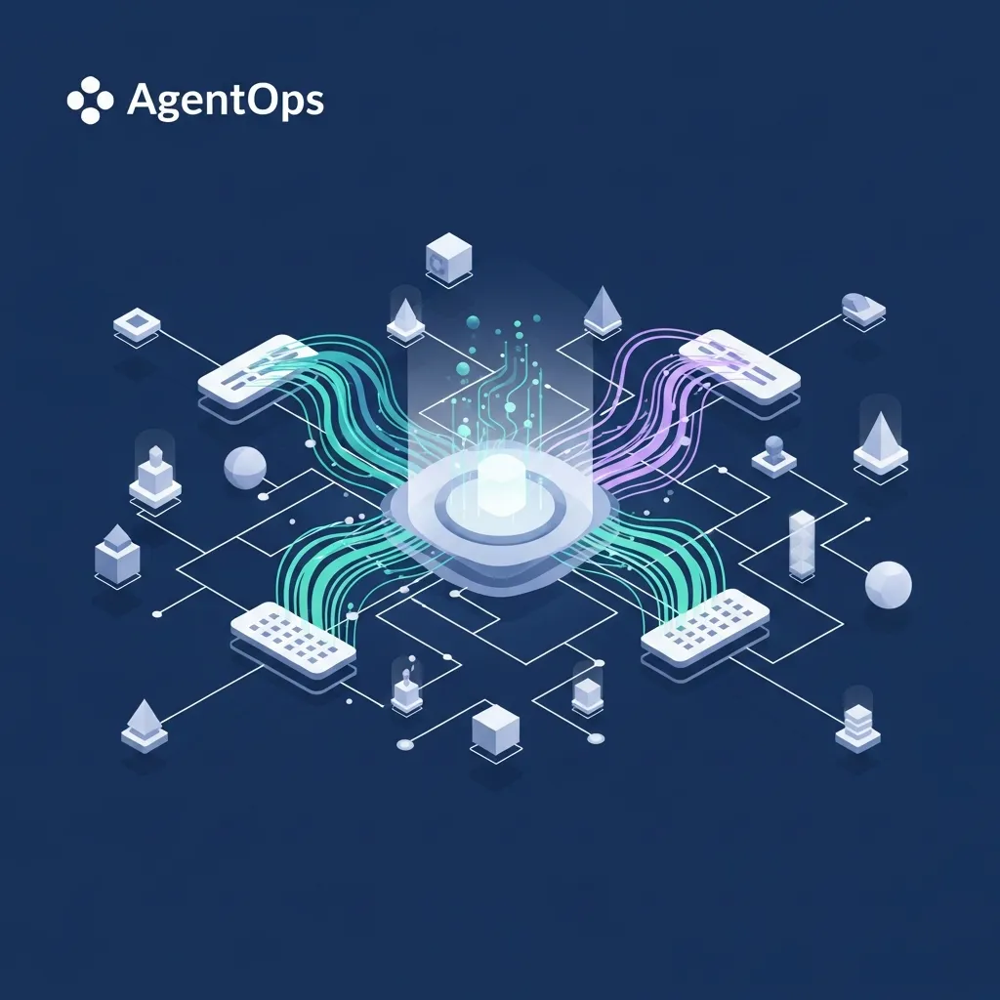

<strong>[BLUF]</strong>
AgentOpsは最大30:1のROIを約束しますが、データの断片化と不透明な意思決定構造は、企業に深刻なガバナンスの危機をもたらす可能性があります。導入を成功させるには、単なる自動化を超えて、MCPやA2Aプロトコルを通じた透明なオーケストレーションと、「人間-AI協調（Human-on-the-loop）」モデルの確立が不可欠です。

市場がエージェンティックAIという蜃気楼に没頭している様子は、実に興味深いものです。自律的に判断し行動するAIエージェントが企業のあらゆる問題を解決してくれるという信念は、実は私たちが過去数十年間経験してきた「技術万能主義」の再来に過ぎないのかもしれません。

## 1. AgentOpsの台頭と「エージェンティックAI」の幻想：ROI 30倍の裏側

### データの断片化とレガシーシステムが作り出す「エラーの増幅器」

企業が <a href="/jp/glossary/agentops" class="glossary-tooltip" data-definition="AIエージェントの開発、デプロイ、および運用を最適化し管理するための一連のフレームワークとプロセス">AgentOps</a> の導入に熱狂する理由は明白です。しかし、サイロ化されたデータと老朽化したレガシーシステム上で駆動するエージェントは、効率性ではなくエラーを全社的に拡散させる増幅器にしかなりません。

適切に精製されていないデータの山の上に構築されたエージェントは、ハルシネーション（幻覚）をあたかも確信に満ちたビジネス戦略であるかのように提示し、意思決定者を混乱に陥れます。インフラの基礎が不十分な状態でエージェンティックな自動化を試みるのは、砂の上に超高層ビルを建てながらエレベーターの速度だけを自慢しているようなものです。

### バラ色のROI数値の裏に隠された莫大なデータ精製コスト

IBM IBVのレポートは、AIエージェントが18ヶ月以内に最大30:1の収益率を達成できると主張していますが、これはあくまで「完璧なデータ可用性」を前提とした数値です。現実におけるエージェンティックAIは、そのバラ色の収益を実現する前に、企業が数年間放置してきたデータ負債を清算するためだけに、数十億円もの埋没費用を要求することがよくあります。

果たして現在の技術成熟度が、そのコストを正当化できるほどの価値を創出しているのか、私たちは冷静に見極める必要があります。目に見えるROIの数値に惑わされ、目に見えない運用リスクやメンテナンスコストを見逃すという過ちを犯してはなりません。

> 「バラ色のROIの裏に隠されたAgentOpsは、統制権を喪失した高性能なブラックボックスになる危険性が高い。」

## 2. セキュリティと運用の境界で発生する「責任の空白」

### AI SOCエージェントと自律的意思決定がもたらすガバナンスリスク

セキュリティ運用センターに導入されるAI SOCエージェントは検知速度を飛躍的に改善しますが、その裏には監査不可能な「ブラインドスポット」が存在します。自律的な推論を通じてセキュリティポリシーを修正したりアクセス権限を調整したりする過程で発生するミスは、単なるシステム障害を超えて法的責任の問題へと発展します。

| 比較項目 | 伝統的な自動化 (<a href="/jp/glossary/what-is-rpa" class="glossary-tooltip" data-definition="ソフトウェアロボットを活用してビジネスプロセスの中で定型化され繰り返される業務を自動化する技術。">RPA</a>) | エージェンティックAI (AgentOps) | ハイブリッド・オーケストレーション |
| :--- | :--- | :--- | :--- |
| 意思決定方式 | ルールベース (Rule-based) | 自律的推論 (Reasoning) | 人間介入型自律制御 |
| データ依存度 | 定型データ中心 | 非定型/マルチソース統合 | ガバナンスフィルタ適用データ |
| 主要リスク | プロセス中断 | 意思決定のブラックボックスと責任の空白 | 初期システム統合コスト |
| 技術標準 | 専用API/スクリプト | Anthropic MCP / Google A2A | 統合ワークフローエンジン |

### 不透明な意思決定経路：事故発生時の責任は誰にあるのか？

エージェントが独立した判断で数億円規模の取引を承認したり、主要資産へのアクセスを遮断したりした際、その結果に対する責任の所在は曖昧になります。開発者でしょうか、それともモデルを提供したビッグテック企業でしょうか、あるいはそれを放置した運用者でしょうか？このような「責任の真空状態」は、現代の企業ガバナンスが直面している最も致命的な脆弱性です。

## 3. 必勝のAgentOps戦略：「AI Readiness」を超えた「Orchestration」の再定義

### MCPとA2Aプロトコル：単なる接続を超えた透明性の確保が優先だ

単なる接続を超えて、実質的な <a href="/jp/glossary/ai-readiness" class="glossary-tooltip" data-definition="企業がAIを効果的に導入し活用するために備えるべきデータアーキテクチャ、ガバナンス、インフラ、および組織的準備状態">AI Readiness</a> を確保するには、AnthropicのMCPのような標準化されたインターフェースが不可欠です。エージェント間の通信プロトコルを規格化することで、私たちは初めて、ブラックボックス内部でどのような論理構造で命令がやり取りされているかを監視し、制御するための最小限の装置を手に入れることになります。

### 人間-AI協調(Human-on-the-loop)モデルの実効性の再検討

完全な自律性はまだ時期尚早であり、人間が重要な意思決定の要所を守る「Human-on-the-loop」モデルこそが、リスクを管理する唯一の代替案です。エージェントが提案するすべての行動を無批判に受け入れるのではなく、検証されたガバナンスフレームワーク内でのみ動作するように、オーケストレーション層を厚く設計する必要があります。

<b>[データに基づくAgentOpsの成果と市場展望]</b>
- <b>IBM IBVレポートデータ</b>: AIエージェント導入企業は平均1.7倍のROIを記録中であり、最適化された場合は18ヶ月以内に最大30:1の収益率を達成。
- <b>運用効率</b>: 予測メンテナンスエージェントの導入により、インフラ障害発生率が73%減少し、メンテナンスコストを10〜40%削減可能。
- <b>市場トレンド</b>: Gartnerによると、2024年第2四半期と比較して第4四半期には「エージェンティックAI」に関する問い合わせが750%急増し、最高戦略技術として浮上。
- <b>セキュリティリスク</b>: AI SOC導入により検知速度は改善されるが、透明性が欠如した場合、監査不適合判定の確率が上昇。

> 「エージェンティックAIの自律性は、すなわち責任の空白を意味し、これは現代の企業ガバナンスにおける最も致命的な脆弱性である。」

技術の華やかな外見に酔いしれて、基本を忘れるような過ちを犯してはなりません。真のインテリジェント運用の時代は、エージェントの数ではなく、それらをいかに精巧に統制し、透明に運用するかにかかっています。今、あなたのエージェントは統制されていますか、それとも放置されていますか？

## 🔗 あわせて読みたい記事
- [トランスフォーマー革命7年の逆説：確率的巨人の誕生と説明不可能性の障壁](/jp/posts/transformer-revolution-7-years-paradox)
- [非対称暗号化の誕生と没落：数学的信頼が直面した量子という物理的実体](/jp/posts/birth-fall-asymmetric-encryption-quantum)