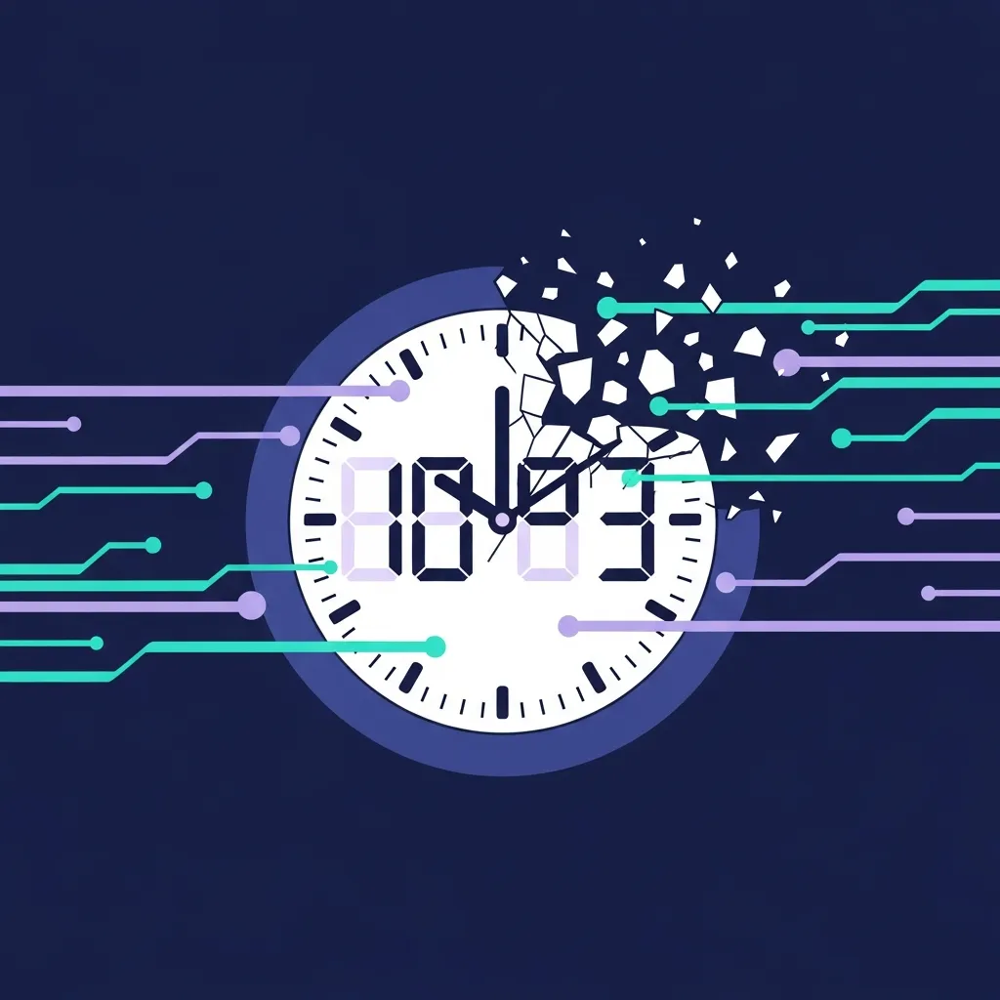
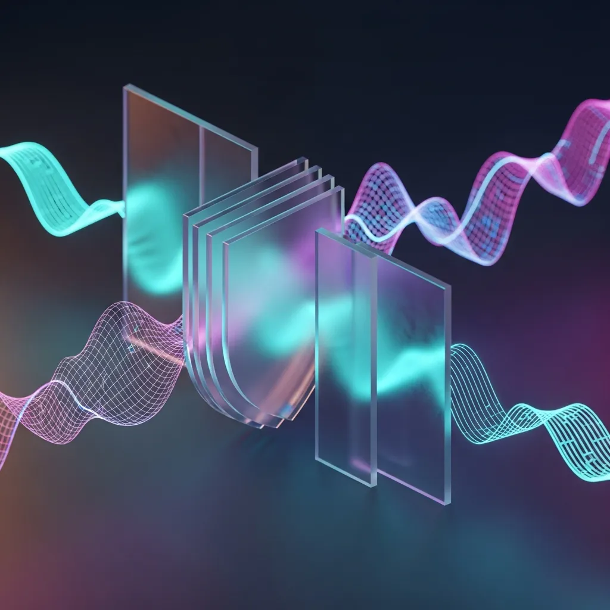

<strong>[<a href="/jp/glossary/what-is-bluf" class="glossary-tooltip" data-definition="'Bottom Line Up Front'の略称で、核心となる結論を文章の冒頭に配置し、読者が最も重要な情報を即座に把握できるようにするビジネスおよび技術文書の作成技法です。">BLUF</a>]</strong>
AIサイバーセキュリティにおいて、ガバナンスの「安定性」はイノベーションの遅延を正当化する危険な言い訳になり得ます。F5のCEOは、攻撃のテンポが加速した環境において「速度」こそが唯一のセキュリティ対策であることを強調し、Anthropicの安定的なガバナンスモデルよりもOpenAIの破壊的なイノベーション速度が、実質的な脅威対応において有利である可能性が高いという批判的な洞察を提示しています。

 ## 1. F5 CEOが診断するAIサイバーセキュリティの根本的変化

 ### 1.1. 加速する脅威：攻撃のテンポに追いつけない伝統的セキュリティ

 サイバーセキュリティの前線が、かつてない速度で再編されています。F5のCEOは最近、AIが主導する攻撃のテンポが、既存の防御体系が対応できる物理的な限界をすでに超えていると強く警告しました。

 もはや、単にファイアウォールを高くするだけでは巨大な波を防ぐことはできません。攻撃者は生成AIを活用して脆弱性の探索から実際の攻撃までのプロセスを自動化し、リアルタイムに近い速度で私たちを追い詰めています。

 伝統的なセキュリティプロセスは、意思決定と検証にあまりにも多くの時間を費やす傾向があります。このような遅延は、結局のところ攻撃者にはチャンスを、防御者には致命的な穴を残す結果につながっているのが現実です。

 

 ### 1.2. 技術的優位の再定義：いまや速度こそがセキュリティである

 現代のサイバーセキュリティの核心は、静的な防御力ではなく、動的な対応速度へと移行しています。技術的優位に立つということは、単により複雑なアルゴリズムを持つことではなく、脅威が発生した瞬間にそれを無力化できるテンポを確保することなのです。

 ここで注目すべき概念が、<a href="/jp/glossary/ai-governance" class="glossary-tooltip" data-definition="AIシステムの倫理的使用、安全性、透明性、および法規制の遵守を保証するための組織的な管理体系。">AIガバナンス</a>です。組織の管理体系がイノベーションの速度を支えられないのであれば、そのガバナンスは事実上、セキュリティの脆弱性へと転落してしまいます。

 セキュリティリーダーは今、「安全に、ゆっくりと」ではなく「速く、柔軟に」という価値を最優先すべきです。速度こそがセキュリティであるという新しい定義を受け入れたとき、初めて真の防御力が完成するからです。

 ## 2. Anthropic vs. OpenAI：ガバナンスの逆説と市場の非情さ

 ### 2.1. Anthropicの「安定性」に対するGary Marcusの評価とその裏側

 ニューヨーク大学のGary Marcus教授は、AnthropicのモデルがOpenAIに比べて相対的に高い信頼性と安定性を備えていると評価してきました。これはガバナンスを最優先する企業哲学が反映された結果と言えます。

 しかし、この「相対的な安定性」が急変するセキュリティ市場では毒になる可能性があるという点を見逃してはなりません。安定性を確保するために経る数多くの検証ステップが、実戦では対応の遅延を招く要因になるからです。

 Anthropicの事例は、私たちに非常に重要な問いを投げかけています。完璧なガバナンスを追求するあまり、市場の破壊的イノベーションと対応テンポを逃してはいないか、深く熟考する必要があります。

 ### 2.2. 安定したガバナンスが破壊的イノベーションを阻むメカニズム

 ガバナンスが強固になるほど組織は保守的な選択をするようになり、それは破壊的な技術導入を躊躇させる原因となります。特に、予期せぬ<a href="/jp/glossary/zero-day-exploit" class="glossary-tooltip" data-definition="セキュリティ脆弱性が発見されてからパッチが適用される前に攻撃が行われるサイバー脅威の形態。">ゼロデイ攻撃</a>が相次ぐ状況において、過度な手続き主義は致命的な結果をもたらします。

| 比較要素 | Anthropic | OpenAI | 戦略的示唆 |
| :--- | :--- | :--- | :--- |
| ガバナンスの性質 | 安定的・保守的構造 | 破格的・イノベーション中心 | 安定性が革新不在の言い訳になる可能性 |
| Gary Marcusの評価 | 高い信頼性と安定性 | 相対的な不安定さの露呈 | ガバナンスの安定とセキュリティテンポのトレードオフ |
| セキュリティ対応テンポ | 検証ベースの対応 | 先制的な技術優位 | F5 CEOが警告した「加速する脅威」への対応能力の差 |

 > ガバナンスの安定という名の盾が、イノベーションの足を引っ張る足枷となるとき、セキュリティはすでに崩壊している。現代のセキュリティは静的な防御ではなく、動的な加速である。攻撃者のテンポを追い越せないすべてのガバナンスは、安逸さの産物に過ぎない。

 結局、ガバナンスはイノベーションを統制する手段ではなく、イノベーションが正しい方向へより速く進むためのアクセルにならなければなりません。これを実現するためには、既存の硬直した管理モデルを完全に解体し、再構成する必要があります。

 

 ## 3. 結論：「安全な淘汰」を拒絶せよ

 ### 3.1. ガバナンスに潜む安逸さ：セキュリティ専門家への警告

 現在、多くのセキュリティ専門家が安定したガバナンスシステムの影に隠れて「安全な淘汰」を選択してはいないか、自問自答すべきです。規定を遵守しているという事実だけで安堵感を得ることは、攻撃者にとって最も歓迎すべき態度に過ぎません。

 F5 CEOの診断通り、AIベースの攻撃は物理的な限界を超えるレベルで加速しています。このような状況下で過去のマニュアルに依存するガバナンスは、何の保護膜にもならず、むしろ実質的な対応能力を麻痺させる原因となります。

 私たちは今、安定という幻想から目覚めなければならず、技術革新を阻むあらゆる障壁を取り払わなければなりません。実質的な脅威対応能力を伴わないガバナンスは、単に華やかにパッケージングされた「失敗の記録」に過ぎないという事実を銘記すべきです。

 ### 3.2. 未来の生存戦略：安定したシステムを超えた破壊的セキュリティ革新の方向性

 未来の生存戦略は、単にシステムを維持することではなく、技術的な飛躍を通じて攻撃者よりも常に一歩先を行くことにあります。そのためにセキュリティリーダーが注目すべき、具体的な変化の流れを整理しました。

 * F5 CEOの診断：AIベースの攻撃はサイバーセキュリティのテンポを物理的に追いつけないレベルまで加速させる。
 * Gary Marcus（NYU教授）の指標：Anthropicの「相対的な安定性」は、急変するセキュリティ市場において致命的なイノベーションの遅延を招く恐れがある。
 * Kevin Warsh FRB理事体制の始動とマクロ変数：改革志向の金融環境の変化は、テクノロジー企業に対し、安定性よりも攻撃的なセキュリティイノベーションへの投資を強いる要因として作用する。

 ![A futuristic command center with shifting holographic glass panels, representing dynamic security intelligence, blurred background with glowing neon accents, abstract digital art style]

 結論として、私たちはガバナンスの本質を再定義しなければならず、それがイノベーションの速度を遅らせる言い訳になっては決してなりません。真のセキュリティは、最も速く破壊的なイノベーションを通じて、敵よりも高い位置を先占したときに初めて達成されるということを忘れないでください。

## 🔗 関連リンク
- [エンタープライズ生成AI導入のジレンマ：緻密なガバナンスがかえってセキュリティ事故を助長するのか？](/jp/posts/enterprise-ai-governance-security-dilemma)
- [Attention Is All You Need：AIの巨大な跳躍か、華やかな統計的蜃気楼か？](/jp/posts/attention-is-all-you-need-ai-leap-or-mirage)