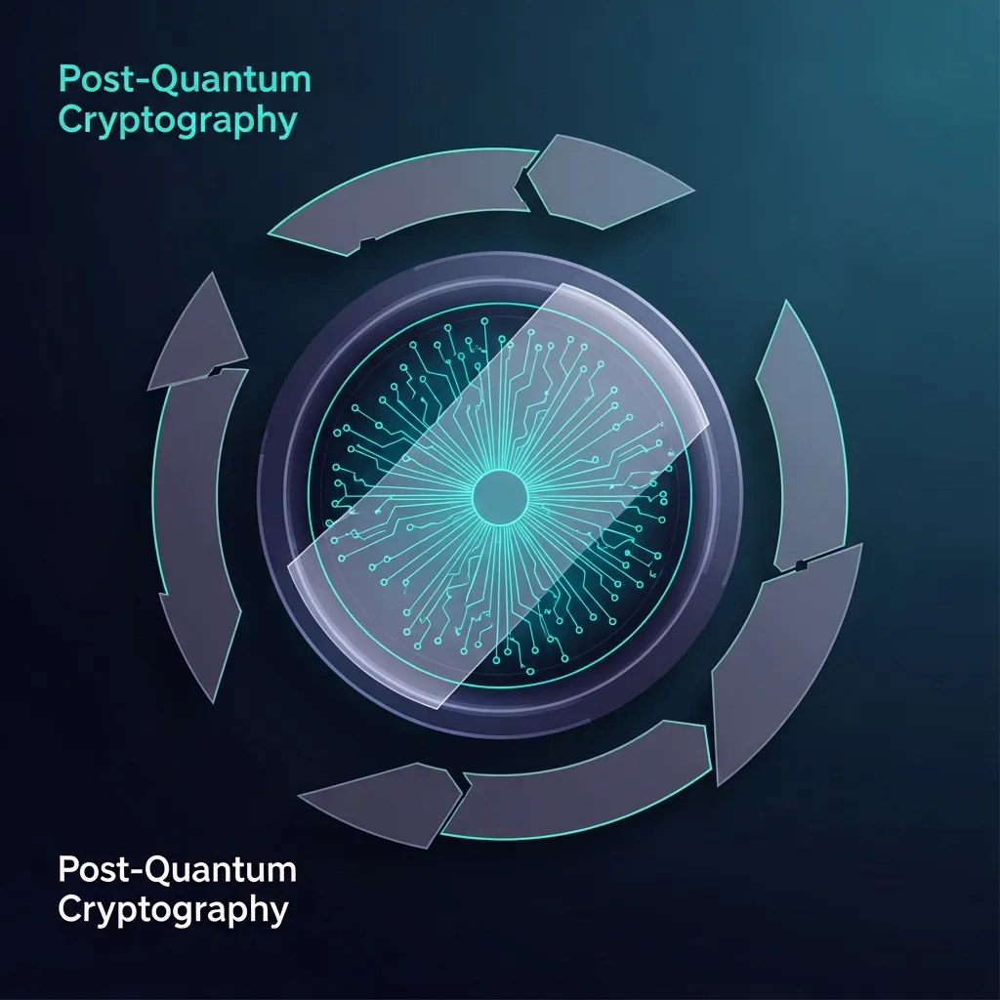

<strong>[BLUF]</strong>
Cloudflareの現在のPQCサポートは「鍵合意（<a href="/jp/glossary/ml-kem" class="glossary-tooltip" data-definition="格子ベース暗号を活用し、量子コンピュータの攻撃に対しても安全に秘密鍵を交換できるように設計された次世代のキーカプセル化方式です。">ML-KEM</a>）」を通じて将来の解読攻撃（HNDL）を防ぐことに集中していますが、「デジタル署名（ML-DSA）」の標準化不足により、リアルタイムの中間者攻撃（MITM）の防御には限界があります。真のエンドツーエンドセキュリティを実現するためには、WARPトンネル以降の「オリジンサーバー」区間に対するPQCアップグレードが不可欠であり、これは単なるクライアントのアップデート以上のインフラ移行を要求します。

量子コンピュータが現代の暗号化体系を崩壊させるという「Q-Day」の警告は、もはや空想科学の領域ではありません。グローバルセキュリティの巨人であるCloudflareがWARPクライアントに<a href="/jp/glossary/post-quantum-cryptography" class="glossary-tooltip" data-definition="量子コンピュータの計算能力でも解読できない次世代の暗号アルゴリズム体系">Post-Quantum Cryptography</a>を電撃導入したのは心強い兆しですが、技術的な裏側を覗いてみると、私たちはまだ「不完全な盾」を手にしているに過ぎないという事実に気づかされます。今回の分析では、CloudflareのPQC宣言が持つ現実的な価値と、その背後に隠された致命的な空白を、セキュリティアーキテクトの視点から冷静に紐解いていきます。

## 1. 現在のPQC支援が「HNDL」攻撃にのみ偏っている理由

### 鍵合意（ML-KEM）導入とデジタル署名（ML-DSA）不在のギャップ

Cloudflareが最初に導入したML-KEM（Module-Lattice-Based Key-Encapsulation Mechanism）は、データを暗号化するための秘密鍵を安全に生成し、共有する技術です。これは、現在の暗号化されたトラフィックをあらかじめ収集しておき、将来解読しようとする<a href="/jp/glossary/harvest-now-decrypt-later" class="glossary-tooltip" data-definition="現在の暗号化されたトラフィックを収集しておき、将来強力な量子コンピュータが開発された際に解読しようとする攻撃">Harvest-now-decrypt-later</a>攻撃を防御する上で非常に効果的な手段です。しかし、暗号化通信のもう一つの柱である「デジタル署名」分野は、依然として古典的なRSAや楕円曲線暗号（ECC）に依存しており、サーバーの正当性を証明する段階では依然として量子の脅威にさらされています。

### 能動的攻撃（MITM）に対し依然として無防備な現在のPQCトンネリング構造

デジタル署名が欠落したPQCトンネルは、まるで金庫の鍵を最新式に変えたものの、金庫の持ち主の身分証は偽造しやすい紙切れである状態と同じです。攻撃者がリアルタイムで介入し、偽の証明書を提示する中間者攻撃（MITM）環境では、ML-KEMのみで構築されたセキュリティトンネルが無力化される可能性が高いのです。NISTのFIPS 204標準であるML-DSAがインフラ全般に完全に浸透するまでは、現在のPQCは受動的な傍受を防ぐ限定的な防御体系にとどまらざるを得ません。

## 2. エンドツーエンド（End-to-End）量子セキュリティの巨大な空白：オリジンサーバーの限界

### WARPクライアントが解決できない「ラストワンマイル」のセキュリティリスク

ユーザーがWARPを通じてCloudflareのエッジ（Edge）サーバーまで安全に接続されたとしても、エッジサーバーから実際のデータが保存されているオリジンサーバーまでの区間が問題です。この区間で依然として古典暗号体系が使用されているならば、全体のセキュリティチェーンは結局、最も弱い輪から切れてしまいます。セキュリティアーキテクチャで言うこの「ラストワンマイル」の不在は、企業がCloudflareのPQCサポートを直ちにインフラ全体の安全だと誤認してはならない核心的な理由です。

### 自動SSL/TLSアップグレードの技術的障壁と標準化の問題

CloudflareはAutomatic SSL/TLS機能を通じてオリジンサーバーとの接続をアップグレードしようと試みていますが、ハードウェアの互換性とパフォーマンスの低下という巨大な壁に突き当たっています。ML-KEMは古典暗号に比べて鍵サイズが格段に大きいため、ネットワークパケットの断片化やハンドシェイクの遅延を引き起こす可能性があります。こうした技術的負債を解決できないまま、マーケティング的な修辞としてのみPQCを強調することは、実質的なセキュリティ強化というよりはブランドイメージの向上に近いという批判を免れません。

## 3. Android 17のハードウェアベースPQC戦略との比較分析

### OSレベルの信頼チェーン（Chain of Trust）構築とネットワークレイヤーセキュリティの違い

CloudサービスであるCloudflareとは異なり、GoogleのAndroid 17はより根本的なアプローチを採っています。ハードウェアレベルのAndroid検証済みブート（AVB）段階にML-DSAを統合することで、ブート時点から量子抵抗性を確保する戦略を示しています。これは、ネットワークレイヤーでのみセキュリティを被せる方式よりもはるかに強力な「信頼の根源（Root of Trust）」を提供し、オペレーティングシステム全般の完全性を保証する上で決定的な差を生みます。

### 企業用クライアント（Cloudflare One）ユーザーのための実質的な対応ガイド

現在Cloudflare Oneを使用している企業のセキュリティ管理者は、単にボタン一つでPQC設定をオンにすることで満足してはいけません。MDM（Mobile Device Management）ポリシーを通じて「PQC Only」モードを強制し、攻撃者がセキュリティレベルを強制的に下げるダウングレード攻撃を試行できないよう、厳格なポリシーオーバーライドを適用する必要があります。また、内部オリジンサーバーのライブラリを最新のNIST標準に合わせてアップデートする作業を並行して初めて、真の量子耐性アーキテクチャを完成させることができます。

| セキュリティ主体 | 適用アルゴリズム | 主要セキュリティレイヤー | NIST標準準拠および権威 |
| :--- | :--- | :--- | :--- |
| Cloudflare | ML-KEM (鍵合意) | ネットワーク/トンネリング (MASQUE) | FIPS 203 (ML-KEM-768 ハイブリッド) |
| Android 17 | ML-DSA (デジタル署名) | ハードウェア/カーネル (AVB) | FIPS 204 (Chain of Trust) |
| Cisco (SKIP) | PSK-DHE / ML-KEM | VPN/IPSec インフラ | IOS-XE ベースのグローバル標準化先取り |
| Google Play | ML-DSA (ハイブリッド署名) | アプリケーション流通レイヤー | アプリの完全性検証および改ざん防止 |

> 「PQCトンネリングは『収穫後解読』という静的な脅威は遮断するが、デジタル署名が欠落した現在の構造は、中間者攻撃（MITM）という能動的な脅威の前では依然として古典的な盾に過ぎない。」

> 「Android 17がハードウェアベースの信頼チェーンを構築し根本的なセキュリティを強化している一方で、クラウドエッジセキュリティは依然としてオリジンサーバーとの標準化の格差という技術的負債に直面している。」

## 結論：Q-Dayへ向けた真のセキュリティ自立、マーケティング用語を超えたインフラ革新が核心だ

量子セキュリティは単なるチェックボックスのオプションではなく、インフラ全体のパラダイムシフトを意味します。Cloudflareの歩みは明らかに正しい方向に向かっていますが、デジタル署名の不在とオリジンサーバーの孤立は、私たちが解決すべき宿題として残っています。技術の華やかさの裏に隠された脆弱性を明確に認識し、段階的なインフラ高度化を実践してこそ、私たちは来たる量子時代を安全に迎えることができるでしょう。

* NISTおよび業界の量子セキュリティ対応状況：
  - **45%以上**: Cloudflareへ送信される人間由来のトラフィックのうち、すでにポスト量子暗号化が適用されている割合。
  - **2030年**: NISTガイドラインに基づき、112ビット以下の古典暗号（RSA, ECC）アルゴリズムの使用が公式に停止（Deprecated）される時期。
  - **2035年**: 古典暗号アルゴリズムの使用が全面的に禁止（Disallowed）され、すべての連邦セキュリティシステムがPQCへ完全移行しなければならない最終期限。
  - **5-15年**: 専門家が予想する、暗号学的に有効な量子コンピュータ（CRQC）の登場および現代の暗号体系崩壊の時期。

## 🔗 あわせて読みたい記事
- [Rustのパラドックス：革新的な安全性がもたらした経営のボトルネックと生産性の危機](/jp/posts/rust-paradox-safety-productivity)
- [Warpのオープンソース宣言：エージェント優先時代、開発者の自由かAIへの従属か？](/jp/posts/warp-open-source-agent-first-era)