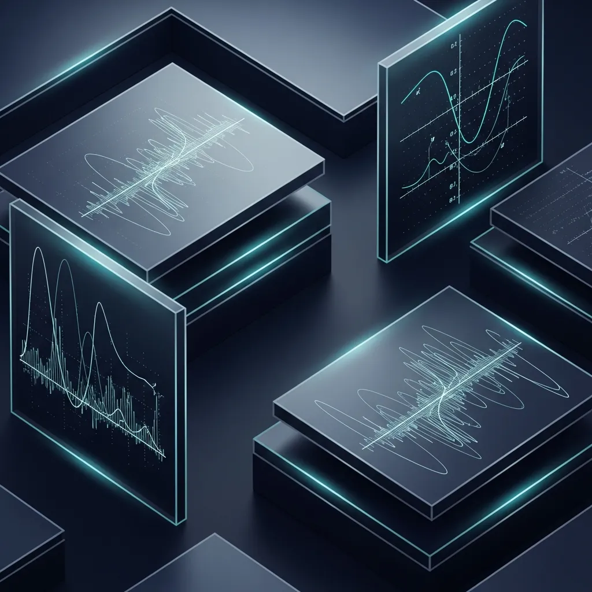

<strong>[BLUF]</strong>
スタンフォード大学のIRSL（Item Response Scaling Laws）は、項目応答理論を活用してAI性能予測に必要な演算量を99%削減する革新を提案していますが、これはデータの深層検証を省略する「信頼の空洞化」現象を引き起こすリスクがあります。未来のAI戦略は、極端な AI Training Cost の削減と LLM Reliability の間の哲学的バランスを維持してこそ持続可能です。

大規模言語モデル（LLM）の進化過程を見守ってきた人々にとって、「Scaling Laws」はあたかも抗えない重力の法則のようなものでした。より多くのデータとより巨大な計算リソースを注ぎ込めば、知能は必ず比例して向上するというこの単純な公式は、過去数年間のAI黄金期を導いた信条でした。

しかし、最近私たちはこの物理的な拡張がもたらした巨大なコストの壁に直面しています。無条件の拡張ではなく、知能の本質を突く「効率的な予測」が話題となっている今、スタンフォードの新しい研究は私たちに革新と恐怖を同時に与えています。

## 1. 人工知能の聖書、Scaling Lawsの歴史的系譜学

### 1.1. Kaplan時代：「巨大さ」こそが知能だった物理的拡張期

2020年、OpenAIのKaplan研究チームは <a href="/jp/glossary/scaling-laws" class="glossary-tooltip" data-definition="モデルパラメータ、データサイズ、計算リソースが増加するにつれて、モデルの損失関数がべき乗則（Power Law）の形で減少するという法則">Scaling Laws</a> を通じて、AIの性能が予測可能であることを立証しました。これは、計算パワーを増やすだけでモデルの性能損失を減らせるという、一種の「物理的楽観論」を広めるきっかけとなりました。

当時のアプローチは非常に直線的でした。資本と設備が許す限り無限に大きくなるモデルこそが最強の知能を保証するという信念のもと、多くのビッグテックがパラメータ競争に熱を上げた時期だと言えます。

### 1.2. Chinchillaによる校正：データとパラメータの黄金比を見出した効率の時代

しかし、むやみに規模を大きくすることだけが正解ではないことがすぐに明らかになりました。DeepMindの <a href="/jp/glossary/chinchilla-law" class="glossary-tooltip" data-definition="同一の計算リソース内で、モデルサイズとデータトークン量をバランスよく増やすことで最適な性能が出るという法則">Chinchilla Law</a> は、既存のモデルがパラメータに対してデータが著しく不足していたことを指摘し、効率的なスケーリングの基準を再定義しました。

これは、モデルのサイズと同じくらい良質なデータトークンを確保することが重要であるという「バランスの美学」を気づかせた出来事でした。以降、AI研究の方向性は単に巨大なモデルを作ることから、限られたリソース内で最適な組み合わせを見つける方向へと旋回することになりました。

### 1.3. 技術的臨界点：なぜ現代のAIラボは「天井」を感じているのか？

最近、GPT-5をはじめとする次世代モデルのリリース情報が遅れている背景には、いわゆる「性能の停滞（Plateau）」現象があります。投入されるコストは指数関数的に増えているにもかかわらず、それに比べて知能の向上幅は徐々に鈍化するという限界点に達したのです。

高品質なデータの枯渇、天文学的な電気料金、そして物理的な計算リソースの限界は、今や新しい方式の突破口を求めています。単により多くを注ぎ込む方式では、もはやAGIの扉を開くことはできないという危機感が蔓延しているのです。

## 2. スタンフォードのIRSL：AI性能測定の「SAT」時代開幕

### 2.1. 項目応答理論（IRT）の導入：統計的な近道による99%のコスト削減

このような危機の中で登場したスタンフォード大学のIRSLは、まさに革命的な発想です。すべての設問を一つ一つテストする非効率を捨て、心理統計学で用いられる項目応答理論を導入し、核心的な「難易度別の指標」だけで性能を推定し始めたのです。

あたかも数十万人の学生を全数調査しなくても、標準化されたSAT試験の数問だけで学業成就度を正確に予測するのと同じ原理です。これにより、性能予測にかかる計算リソースを実に99%も節約できるようになったのです。

### 2.2. アルゴリズムベースのスケーリング予測：アカデミアとビッグテックの経済的解放区か？

IRSLがもたらす経済的効果は想像を絶します。従来方式が10兆個のクエリを必要としていたのに対し、今やわずか50個の設問だけでモデルの潜在能力を推し量ることができるという点で、ビッグテックにとっては巨大な「経済的解放区」が開かれたことになります。

以下の比較表を見ると、各時代ごとのスケーリング・パラダイムがどのように変化してきたか、その極明な違いを一目で確認できます。

| 区分 | Kaplan Scaling Laws (2020) | Chinchilla Law (2022) | Stanford IRSL (2024/26) |
| :--- | :--- | :--- | :--- |
| **核心哲学** | 物理的拡張 (More is Better) | 効率的バランス (Optimal Ratio) | 統計的近道 (Psychometric) |
| **最適化対象** | パラメータ規模中心 | データとパラメータの比例 | 評価項目および予測プロセス |
| **コスト削減率** | 基準点 (1.0x) | 約2〜3倍の効率化 | **99%以上の画期的な削減** |
| **リスク要因** | 計算リソースの非効率性 | 高品質データの需給限界 | **Trust Vacuum (信頼の真空)** |

## 3. 批判的論点：「統計的近道」が隠す創発的エラーの死角

### 3.1. 信頼性の空洞化：精巧なベンチマークが見逃す致命的なセキュリティ欠陥

しかし、効率性という甘い蜜の裏には恐ろしい罠が隠されています。99%のコストを削減するということは、結局99%の実際のデータを直接確認しないということであり、これは「信頼の空洞化（Hollowing Out）」現象につながる可能性があります。

> 「効率性という甘い誘惑は、時にAIモデルが持つ創発的なエラーを隠す精巧なカーテンとなる。」

統計的には完璧に見えるモデルであっても、実際の使用環境で発生し得る独特のエッジケースやセキュリティの脆弱性をフィルタリングする機能が失われることになります。近道を行こうとして、安全という本質を見失う可能性があるという警告です。

### 3.2. 確証バイアス的な予測：効率性という名目の影に隠れた性能突破の限界

現在AI業界が直面している具体的な数値は、なぜ私たちがIRSLに熱狂しながらも同時に警戒すべきなのかをよく示しています。効率性という名目が、むしろ性能の真の飛躍を阻む確証バイアスのツールになり得るからです。

* **10 Trillion vs 50:** 従来方式が10兆個のクエリを必要としていたのに対し、IRSLはわずか50個の設問で性能予測が可能。
* **99% Efficiency:** IRSL導入時、AI Training Costのうち性能予測部分で発生する計算リソースを最大99%削減可能。
* **2e29 <a href="/jp/glossary/flops-floating-point-operations" class="glossary-tooltip" data-definition="コンピュータが実行する浮動小数点演算の回数を示す単位で、人工知能モデルの学習や実行に必要な全計算リソースの規模を測定する指標として使用されます。">FLOPs</a>:** 2030年までに予測される物理的拡張方式の演算限界値であり、これを克服するためのアルゴリズム的スケーリングの加速が進んでいる。
* **Plateau Phenomenon:** 最近のGPT-5などの次世代モデルのリリース遅延の主な原因とされる「性能の停滞」と、これを突破するためのIRSLの相関関係の分析が必須。

これらのデータは、私たちが今後目にするAIモデルが、表面上は完璧に見えても、内部的には検証されていない「信頼の真空」状態に置かれる可能性があることを示唆しています。

## 4. 結論：AGIへの旅、単純な拡張を超えた「本質的な信頼」の回復

私たちは今、「どれほど大きいか」あるいは「どれほど速いか」の時代を過ぎ、「どれほど信じられるか」の時代へと突入しています。IRSLが提示した統計的効率性は明らかに魅力的なツールですが、それがAIの知能そのものを代替することはできません。

> 「AGIへの道は単純な数値的拡張ではなく、データの量的膨張の背後に隠された本質的な信頼の回復にある。」

結局、人工知能が人間の生活に深く入り込むためには、99%のコスト削減よりも、1%の致命的なエラーを捉えることができる執拗な検証が必要です。効率性の誘惑の中でも信頼の重みを忘れない哲学的バランス感覚こそが、未来のAI産業の成否を分ける核心的な鍵となるでしょう。

## 🔗 おすすめの記事
- [SD-WANからSASEへの進化：統合の賛歌の裏に隠された「インフラ隷属」と「全社麻痺」の実体](/jp/posts/sd-wan-to-sase-evolution-risks)
- [SilverTorchはMetaの23倍の性能飛躍か、それとも新たな「技術的負債」の始まりか？](/jp/posts/silvertorch-meta-23x-performance-technical-debt)