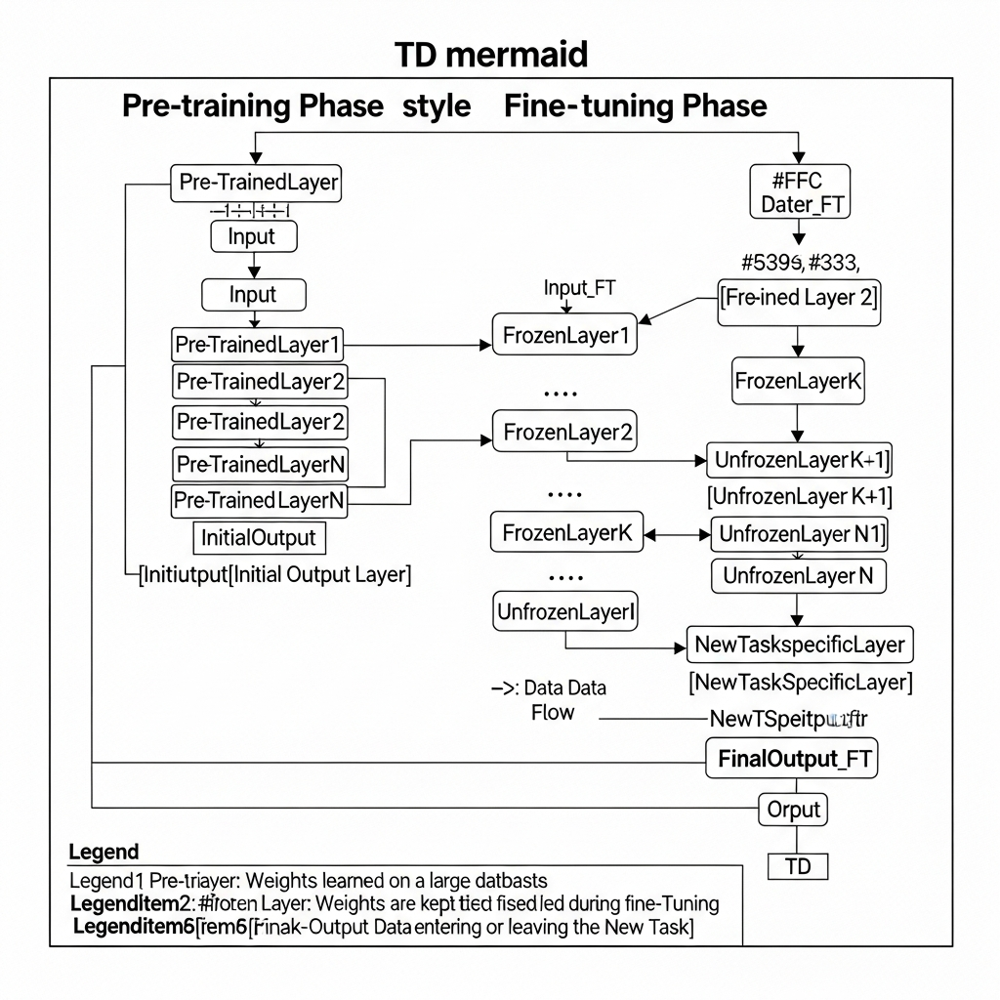

| 항목 | 내용 |
| :--- | :--- |
| **영문명** | Fine-tuning |
| **한글명** | 파인튜닝, 미세 조정 |
| **약어** | - |
| **관련 기술** | 전이 학습(Transfer Learning), 딥러닝, LLM, PEFT, LoRA |

### 특정 작업에 맞춰 모델을 최적화하는 과정
파인튜닝은 방대한 데이터로 이미 학습을 마친 기초 모델(Pre-trained Model)의 가중치를 시작점으로 삼아, 특정 목적을 가진 데이터셋으로 추가 학습을 진행하는 기법입니다. 이는 전이 학습(Transfer Learning)의 일종으로, 일반적인 지식을 갖춘 모델을 특정 업무(Downstream Task)나 전문 산업 분야에 최적화된 상태로 만드는 것이 핵심입니다.

### 효율적인 모델 학습과 전문성 확보
거대 언어 모델(LLM)이나 대규모 신경망을 처음부터 학습(Training from scratch)시키는 작업에는 천문학적인 컴퓨팅 자원과 시간이 들어갑니다. 파인튜닝은 이러한 비용 부담을 획기적으로 줄여줍니다. 이미 일반적인 특징을 파악한 모델의 지능을 재사용하기 때문에, 적은 데이터와 자원만으로도 의료 상담이나 법률 문서 요약처럼 전문성이 필요한 비즈니스 요구사항을 충족할 수 있습니다.

### 파인튜닝의 핵심 메커니즘
*   **가중치 업데이트 전략**: 모델 전체의 파라미터를 다시 학습시키는 '전체 파인튜닝(Full Fine-tuning)' 방식과, 특정 레이어만 학습시키고 나머지는 고정하는 '동결(Freezing)' 기법을 상황에 맞춰 선택합니다. 최근에는 효율성을 극대화한 파라미터 효율적 미세 조정(PEFT) 기술이 많이 쓰이는 추세입니다.
*   **LoRA 등 효율적 기법 활용**: 모델 구조는 그대로 유지하면서 소량의 추가 파라미터(Adapter)만 삽입하거나, 저차원 행렬을 이용해 가중치를 조정하는 LoRA(Low-Rank Adaptation) 방식을 활용하기도 합니다. 이를 통해 메모리와 연산 비용을 크게 아낄 수 있거든요.
*   **도메인 적응 및 성능 향상**: 일반 데이터셋에서는 접하기 어려운 산업 특화 용어나 고유의 패턴을 학습시켜, 특정 작업에서의 응답 정확도와 맥락 이해도를 높입니다.

### 사전 학습(Pre-training)과의 차이
사전 학습이 라벨링되지 않은 대규모 데이터를 활용해 모델의 기초적인 지능과 표현력을 구축하는 단계라면, 파인튜닝은 그렇게 만들어진 모델을 라벨링된 특정 데이터로 정교하게 다듬는 최적화 단계라고 이해하면 쉽습니다. 기초 공사를 마친 건물에 특정 용도에 맞는 인테리어를 하는 것과 비슷하죠.

### 현업에서의 활용과 주요 개념들
*   **실무 적용 사례**: 일반 GPT 모델에 기업 내부의 기술 문서와 매뉴얼을 파인튜닝하면, 해당 기업 제품에 대해서만 전문적으로 상담하는 고객 지원 챗봇을 만들 수 있습니다.
*   **연관 용어**:
    *   **PEFT (Parameter-Efficient Fine-tuning)**: 최소한의 파라미터만 수정해 효율적으로 모델을 개선하는 기술입니다.
    *   **RLHF (Reinforcement Learning from Human Feedback)**: 사람의 피드백을 반영해 모델의 답변이 의도에 부합하도록 정렬(Alignment)하는 기법입니다.
    *   **Catastrophic Forgetting (파멸적 망각)**: 새로운 데이터를 학습할 때 이전에 배운 일반적인 지식을 잊어버리는 현상입니다. 파인튜닝 과정에서 반드시 유의해야 할 지점이죠.
