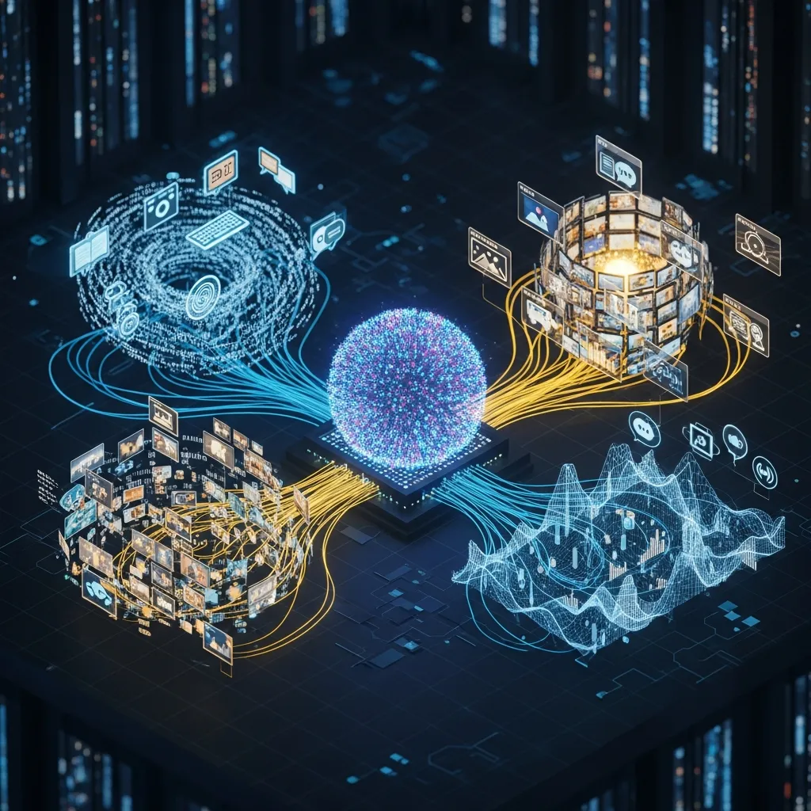

### 1. 기술 요약

| 항목 | 내용 |
| :--- | :--- |
| 영문명 | Multimodal |
| 한글명 | 멀티모달 |
| 약어 | MLLM (Multimodal Large Language Model) |
| 관련 기술 | 딥러닝(Deep Learning), 컴퓨터 비전, 자연어 처리(NLP), 확산 모델(Diffusion Model) |

### 2. 복합적인 감각 정보를 통합하는 멀티모달

멀티모달(Multimodal)은 텍스트와 이미지, 오디오, 비디오 등 서로 다른 형식의 데이터(모달리티)를 동시에 결합해 학습하고 처리하는 기술입니다. 단일 유형의 데이터만 다루던 기존 인공지능의 한계를 넘어, 인간이 오감을 동원해 정보를 수집하고 판단하는 것과 유사한 방식으로 데이터를 통합 이해합니다. 이 과정을 통해 단순한 정보 처리를 넘어 더 정교하고 맥락에 맞는 결과물을 만들어냅니다.

### 3. 유니모달의 한계를 넘어선 진화 과정

초기 AI 모델은 자연어 처리(NLP)나 이미지 인식(Computer Vision)처럼 특정 분야에 최적화된 유니모달(Unimodal) 방식이 주를 이뤘습니다. 하지만 우리가 마주하는 현실 데이터는 여러 감각 정보가 복합적으로 얽혀 있는 경우가 많죠. 텍스트만으로는 시각적 맥락을 온전히 파악하기 어렵고, 이미지만으로는 그 안에 담긴 세부 의도를 해석하는 데 한계가 있습니다. 이러한 간극을 메우기 위해 상황을 입체적으로 인지하고 인간과 더 자연스럽게 상호작용할 수 있는 멀티모달 기술이 등장하게 되었습니다.

### 4. 핵심 동작 원리와 주요 특징

- <b>데이터의 정렬과 융합(Fusion & Alignment)</b>: 이미지 벡터나 텍스트 벡터처럼 서로 다른 형태의 데이터를 공통된 수학적 공간으로 변환해 연관성을 학습합니다. 예를 들어 '사과'라는 단어와 실제 사과 사진이 같은 개념을 지칭한다는 사실을 인식하는 과정입니다.
- <b>교차 모달리티(Cross-modal) 처리</b>: 입력된 데이터와 다른 형태의 결과물을 내놓을 수 있습니다. 텍스트 설명을 토대로 이미지를 생성(Text-to-Image)하거나, 음성 데이터를 실시간 텍스트로 변환하는 작업 등이 여기에 해당합니다.
- <b>심층적인 맥락 파악</b>: 언어적 정보뿐만 아니라 이미지의 구도, 화자의 음성 톤, 영상의 움직임 같은 비언어적 데이터를 결합합니다. 이를 통해 키워드 중심의 분석을 넘어선 고차원적인 문맥 이해가 가능해집니다.

### 5. 유니모달과 멀티모달의 차이

- <b>유니모달(Unimodal) AI</b>: 단일 모드 데이터만 처리합니다. 텍스트 전용 모델은 문장의 의미는 정확히 읽어내지만, 그 문장이 어떤 시각적 상황에서 나온 것인지는 알 수 없습니다.
- <b>멀티모달(Multimodal) AI</b>: 다중 모드 데이터를 동시에 처리합니다. 사용자의 음성 명령과 카메라로 들어오는 시각 정보를 결합해 처리할 수 있습니다. "지금 내가 들고 있는 이 물건(이미지) 이름이 뭐야?(음성)"와 같은 복합적인 질의에 대응할 수 있는 이유입니다.

### 6. 실제 산업 현장 활용 및 관련 개념

- <b>실무 활용</b>: 의료 현장에서 환자의 엑스레이(영상)와 과거 진료 기록(텍스트), 실시간 바이탈 사인(데이터)을 종합 분석해 정확한 진단을 내리거나 맞춤형 치료법을 제안할 때 핵심적인 역할을 합니다.
- <b>연관 용어</b>: 파운데이션 모델(Foundation Model), 임베딩(Embedding), CLIP(Contrastive Language-Image Pre-training) 등이 기술적으로 밀접하게 연관되어 있습니다.
