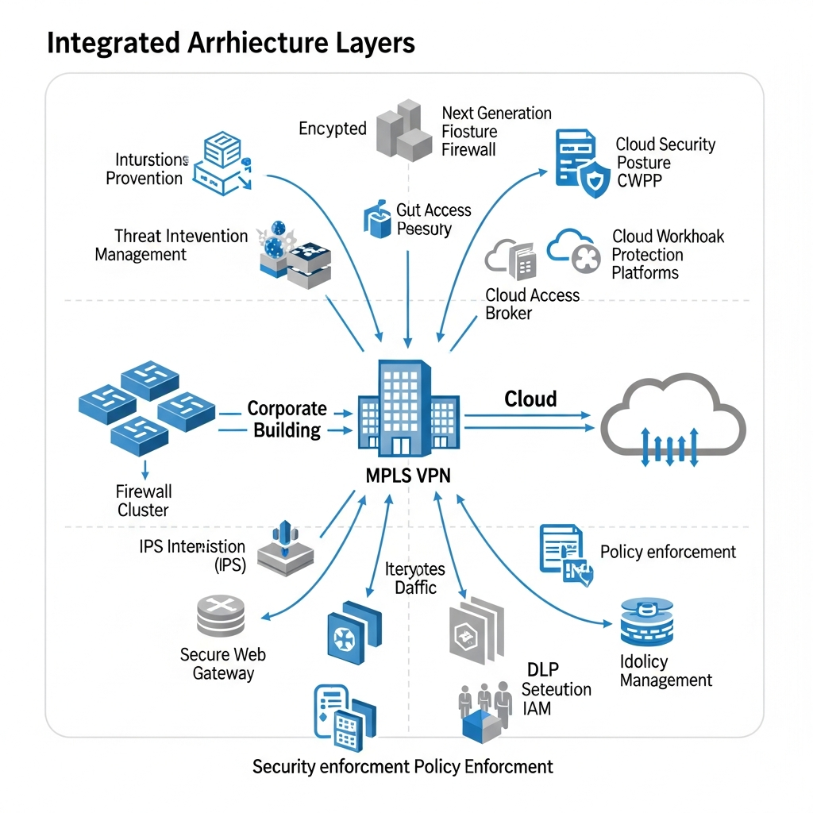
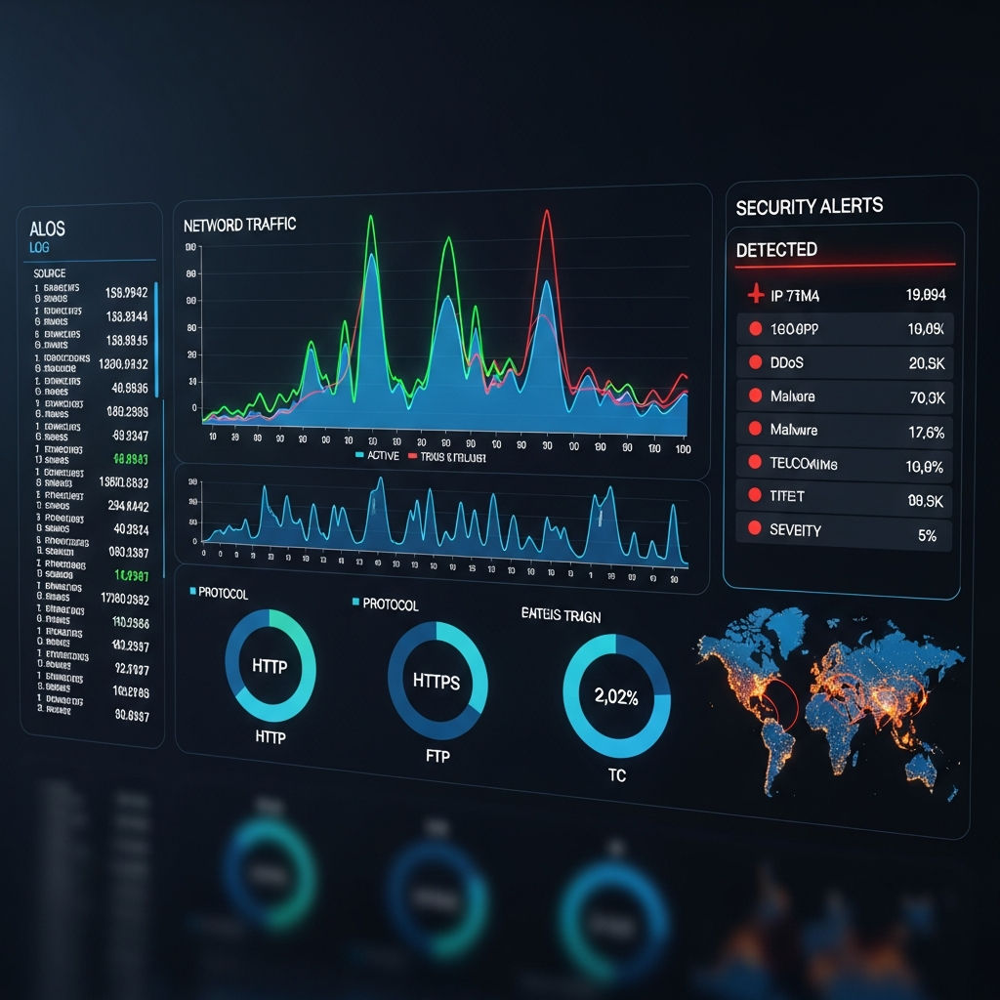
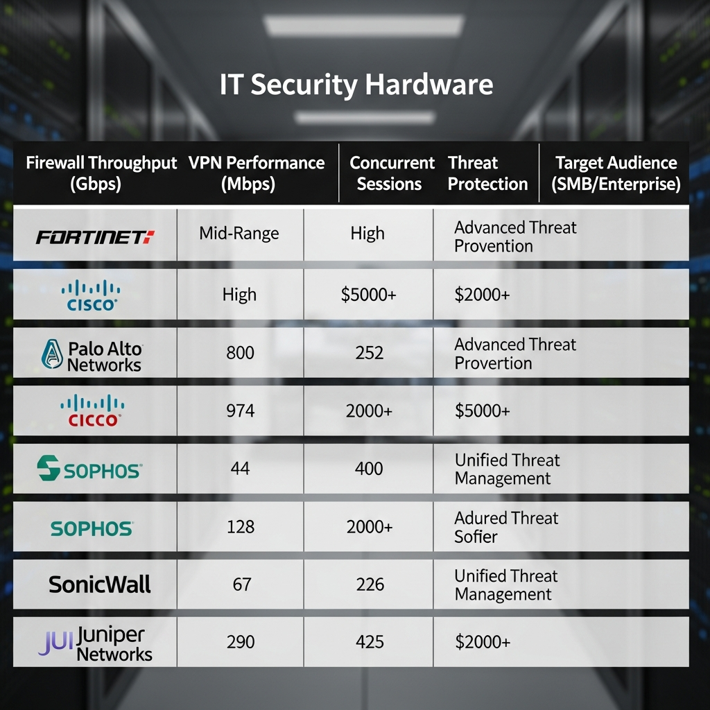

### 단일 장비로 구현하는 강력한 방어 체계, UTM

UTM(Unified Threat Management)은 방화벽, VPN, 침입방지시스템(IPS), 안티바이러스, 웹 필터링 등 보안에 필요한 여러 기능을 하나의 장비나 서비스로 묶은 통합 보안 솔루션입니다. 위협 요소가 다양해지면서 보안 관리 포인트가 늘어나는 문제를 해결하기 위해 등장했죠. 본사는 물론 지사나 원격 근무지에서도 통일된 보안 정책을 손쉽게 적용할 수 있다는 점이 가장 큰 특징입니다.

## 파편화된 보안 도구를 하나로 관리해야 하는 이유

네트워크 구성이 복잡해지는 만큼 기업이 직면하는 리스크도 커지고 있습니다. 기존처럼 보안 솔루션을 개별적으로 관리하면 운영 번거로움은 물론, 보안 사고 발생 시 통합적인 가시성을 확보하기 어렵습니다. UTM 서비스는 이러한 파편화된 환경을 하나로 묶어 신속한 위협 탐지와 대응을 가능하게 합니다.

특히 'Stateful Packet Inspection' 기술이 적용된 차세대 방화벽 기능은 패킷의 상태 테이블을 실시간으로 추적하며 비정상 트래픽을 걸러냅니다. 단순한 포트 제어 수준을 넘어 애플리케이션 계층까지 깊숙이 들여다보기 때문에, 기업 내부 데이터를 보호하는 든든한 1차 방어선 역할을 수행하죠.

### 네트워크 환경에 맞춘 유연한 패킷 필터링

최근의 UTM 서비스는 L3(Route/NAT) 모드는 물론, 기존 구성을 변경하지 않고 도입할 수 있는 투명한 브릿지 모드(L2)와 802.1Q VLAN 등 폭넓은 환경을 지원합니다.

*   <b>효율적인 라우팅 관리:</b> RIP, OSPF 등 정적 및 동적 라우팅을 지원해 복잡한 네트워크 경로를 안정적으로 제어합니다.
*   <b>유연한 IP 운용:</b> DHCP 서버, 클라이언트, 릴레이 기능을 통해 사내 IP 자원을 유동적으로 배분하고 관리할 수 있습니다.
*   <b>세션 기반 탐지:</b> 유입되는 패킷을 세션 테이블에 등록하고, 애플리케이션 특성에 맞춰 허용 여부를 실시간으로 판단해 보안성을 높입니다.

## 공중망을 전용선처럼, VPN 연동 기술의 활용

VPN은 UTM 서비스에서 빼놓을 수 없는 핵심 요소입니다. 일반 인터넷망을 마치 전용 사설망처럼 안전하게 사용할 수 있도록 돕기 때문이죠. 원격지 지사나 재택근무자가 사내 시스템에 접속할 때, 전송되는 데이터를 암호화하여 외부 유출을 원천적으로 차단합니다.

### 안정적인 연결을 보장하는 터널링과 대역폭 관리

단순한 연결을 넘어 네트워크 품질(QoS) 관리와 장애 대비가 함께 이루어져야 진정한 기업용 VPN이라 할 수 있습니다.

1.  <b>용도에 맞는 프로토콜 구성:</b>
    *   <b>Gateway to Gateway:</b> IPSec VPN으로 본사와 지사 간 상시 연결 통로를 구축합니다.
    *   <b>Client to Gateway:</b> SSL VPN이나 L2TP를 활용해 개별 직원이 어디서든 안전하게 접속하도록 지원합니다.
2.  <b>비즈니스 연속성 유지:</b> 터널 페일오버(Tunnel Failover) 기능을 통해 주 회선에 문제가 생기더라도 예비 회선으로 자동 전환되어 업무 중단을 막습니다.
3.  <b>트래픽 효율화:</b> 분할 터널링(Split Tunneling) 기술을 쓰면 보안이 꼭 필요한 데이터만 VPN을 타게 설정할 수 있어 네트워크 부하를 효과적으로 줄일 수 있습니다.

## 지능형 위협 차단, IPS와 콘텐츠 필터링

침입방지시스템(IPS)은 UTM 내부에서 12,000여 개 이상의 공격 패턴을 실시간으로 스캔합니다. 알려진 공격을 차단하는 것은 물론, 평소와 다른 비정상적인 행위(Anomaly Detection)를 탐지해 변종 위협에도 유연하게 대응하는 것이 강점입니다.

### 제로데이 공격 및 유해 요소 필터링

아직 보안 패치가 나오지 않은 '제로데이(Zero-Day)' 공격에 대비하기 위해 UTM은 고도화된 자가 학습 기능을 활용합니다.

*   <b>심층 검사(Deep Inspection):</b> DNS, FTP, HTTP는 물론 SQL이나 P2P, 메신저 등 다양한 프로토콜에 숨겨진 위협을 감시합니다.
*   <b>스팸 및 웹 필터링:</b> 90여 가지 이상의 카테고리 분류를 통해 업무와 무관한 유해 사이트 접속을 막고, 스팸 스코어링 시스템으로 메일 보안을 강화합니다.
*   <b>접근 권한 차등화:</b> 화이트리스트 기반의 운영은 물론 Active Directory와 연동해 사용자별로 접근 권한을 세밀하게 제어할 수 있습니다.

## 기업별 맞춤형 UTM 도입을 위한 벤더별 특징

솔루션마다 강점이 다르므로 기업 규모와 운영 목적에 맞는 선택이 필요합니다. 하이온넷은 글로벌 벤더와 자체 기술력을 결합해 최적의 장비를 제안하고 있습니다.

| 구분 | 주요 특징 | 추천 환경 |
| :--- | :--- | :--- |
| <b>Fortinet</b> | Security Fabric 기반, 고성능 Firewall/IPS 제공 | 통합 보안 가시성과 대용량 처리가 필요한 중대형 기업 |
| <b>Sophos</b> | Next-Gen UTM, 직관적인 관리 인터페이스 강점 | 운영 편의성과 핵심 보안 기능을 중시하는 기업 |
| <b>SonicWall</b> | 실시간 클라우드 위협 정보 업데이트 및 연동 | 최신 보안 위협에 대한 즉각적인 대응이 필요한 기업 |
| <b>하이온넷 자체 장비</b> | Firewall, IPS, VPN, QoS 등 필수 기능 최적화 | 합리적인 비용으로 고성능 보안 체계를 갖추려는 중소기업 |

## 데이터 기반의 보안 운영과 비즈니스 안정성

UTM 도입은 단순히 보안 장비를 설치하는 행위에 그치지 않습니다. 전체적인 로그 분석과 리포팅 시스템을 구축함으로써 보안 사고의 원인을 추적하고, 향후 보안 정책 수립을 위한 실질적인 근거를 마련하는 과정이죠.

전문적인 매니지드 서비스를 병행하면 복잡한 보안 업데이트와 정책 설정을 전문가에게 맡기고, 내부 IT 인력은 비즈니스 본연의 가치를 높이는 일에 집중할 수 있습니다. 안정적인 네트워크 회선과 강력한 UTM 보안이 결합된 환경에서 더욱 탄탄한 글로벌 비즈니스 기반을 다져보시길 바랍니다.

https://www.haion.net/service/utm/
