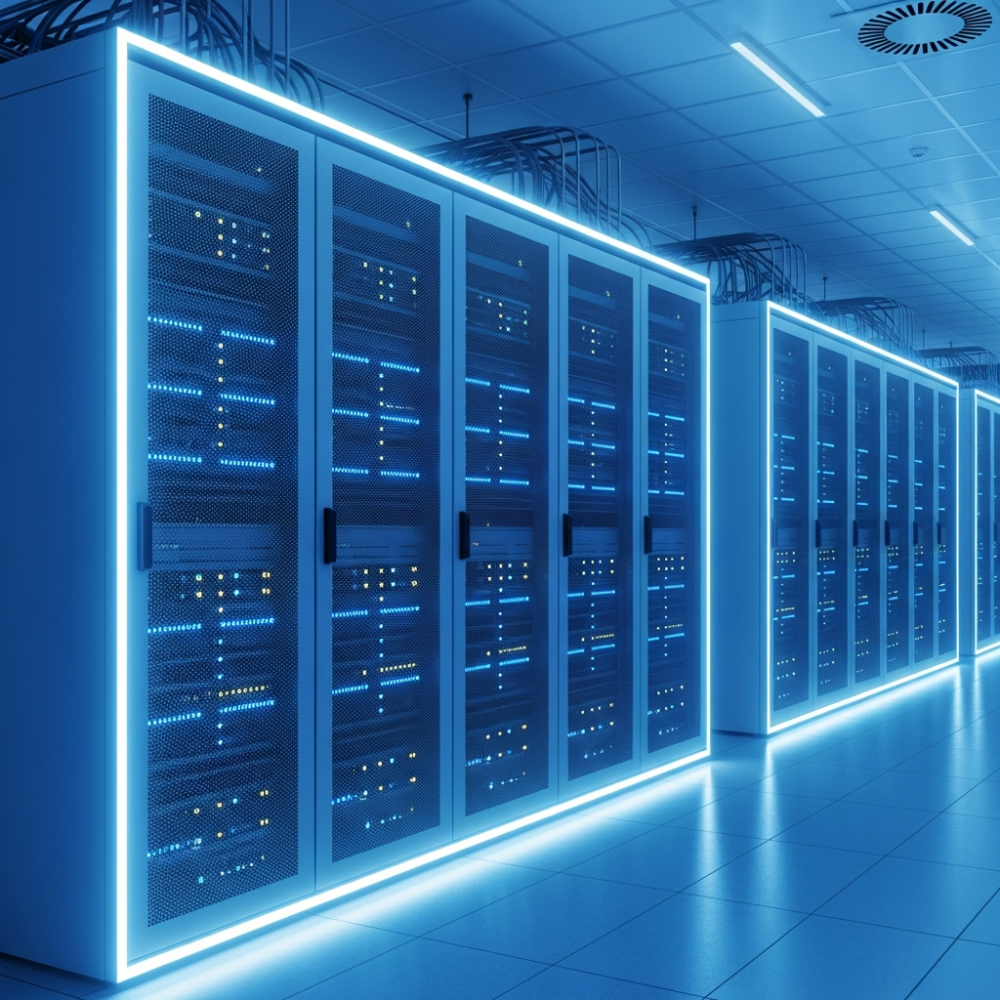
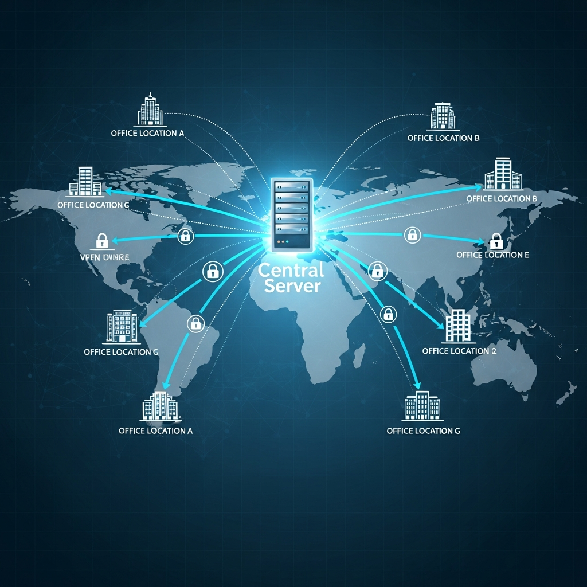
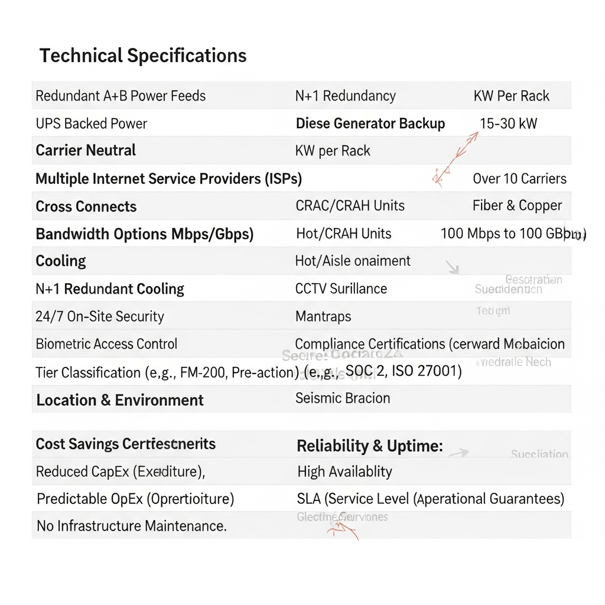

# 기업용 코로케이션: 네트워크 안정성과 통합 보안을 동시에 확보하는 실무 전략

코로케이션은 기업 소유의 서버를 전문 데이터센터(IDC)에 입주시추어 최적화된 상면 공간과 네트워크 회선을 제공받는 서비스입니다. 단순히 서버를 맡기는 공간 대여 개념을 넘어, <b>업무 환경에 맞춘 VPN 전용회선, IDC 백본 직접 연결을 통한 고속 인터넷, 그리고 AI 기반 안티멀웨어 보안</b>까지 결합된 통합 인프라를 구축하는 것이 비즈니스 안정성을 결정짓는 핵심이죠.

## 비즈니스 요구에 맞춘 유연한 네트워크 설계

서버가 입주할 IDC를 선택할 때 가장 먼저 살펴야 할 요소는 네트워크 품질입니다. 하이온넷은 기업별 서비스 특성과 트래픽 패턴에 맞춰 최적의 네트워크 경로를 설계합니다.

*   <b>용도별 맞춤형 VPN 전용회선:</b> 본사와 지사 간, 혹은 데이터센터 간 보안 통신이 필요한 구간에 최적화된 터널링 기술을 적용해 안전한 통신 환경을 보장합니다.
*   <b>고가용성 IDC 백본망:</b> IDC 내부에 구축된 대용량 백본 네트워크에 직접 연결하여 병목 현상 없는 초고속 인터넷 회선을 제공합니다.
*   <b>글로벌 비즈니스 최적화:</b> 해외 지사나 파트너사와 빈번하게 데이터를 주고받는 기업을 위해, 국가 간 지연 시간을 최소화한 전용 회선 서비스를 지원하여 업무 효율을 높여줍니다.

## 지능형 보안 체계와 데이터 보호 고도화

사이버 공격이 날로 교묘해지면서, 이제 코로케이션 서비스에도 일반적인 방화벽을 상회하는 능동적인 보안 체계가 필수입니다. 하이온넷은 차세대 기술을 통해 기업의 자산을 보호합니다.

*   <b>차세대 AI 안티멀웨어:</b> AI 엔진이 실시간으로 시스템 내 의심 프로세스를 탐지합니다. 변종 랜섬웨어나 알려지지 않은 위협(Zero-day Attack)을 사전에 식별하고 차단하여 데이터 유실을 방지합니다.
*   <b>엔드포인트 통합 관리:</b> 보안 위협 탐지부터 관리까지 한곳에서 제어하는 통합 기능을 통해 운영 리소스를 대폭 줄이면서도 방어 수준은 한 단계 높였습니다.
*   <b>클라우드 기반 페일오버(Failover):</b> 예기치 못한 물리적 재난 상황이 발생하더라도 서비스가 중단되지 않도록, 즉시 클라우드 인프라로 전환하여 비즈니스 연속성을 유지합니다.

## 하이온넷 코로케이션 서비스 핵심 사양 요약

| 구분 | 주요 기술 특징 | 도입 시 기대 효과 |
| :--- | :--- | :--- |
| <b>네트워크</b> | IDC 백본 기반 초고속망 및 맞춤형 VPN 지원 | 트래픽 병목 해소 및 안정적인 가용성 확보 |
| <b>보안 엔진</b> | AI 기반 차세대 안티멀웨어 시스템 적용 | 지능형 위협 탐지 및 랜섬웨어 완벽 방어 |
| <b>재해 복구</b> | 신속한 클라우드 페일오버 아키텍처 제공 | 장애 발생 시 무중단 비즈니스 운영 가능 |
| <b>통합 관리</b> | 중앙 집중식 보안 및 엔드포인트 관리 솔루션 | 운영 편의성 향상 및 인프라 관리 비용 절감 |

## 효율적인 인프라 운영을 위한 코로케이션 활용 제언

자체 전산실 운영의 물리적 한계를 극복하기 위해 많은 기업이 IDC 코로케이션으로 눈을 돌리고 있습니다. 이는 단순한 외주 관리를 넘어 기술적 안정성을 확보하기 위한 전략적 판단이기도 합니다.

1.  <b>인프라 신뢰도 향상:</b> 항온항습 및 이중화된 전력 공급 시스템이 완비된 전문 IDC 환경은 서버 수명을 연장하고 예기치 못한 하드웨어 장애율을 낮춰줍니다.
2.  <b>보안 거버넌스 강화:</b> 개별 서버 단위의 단편적인 보안을 넘어, 네트워크 전체에 걸친 일관된 AI 보안 정책을 적용함으로써 전사적인 보안 수준을 평준화할 수 있습니다.
3.  <b>성장에 최적화된 확장성:</b> 갑작스러운 트래픽 증가나 상면 확장 이슈가 발생했을 때 신속하게 대역폭을 늘리거나 랙 공간을 확보할 수 있어 유연한 대응이 가능합니다.

안정적인 인프라는 곧 기업의 경쟁력으로 직결됩니다. 인프라 운영 부담은 하이온넷의 전문 솔루션에 맡기고, 기업 본연의 비즈니스 가치를 높이는 데 집중해 보시기 바랍니다. 전문 엔지니어와의 상담을 통해 귀사 환경에 가장 적합한 설계를 제안받을 수 있습니다.

https://haion.net/colocation/detail.php
