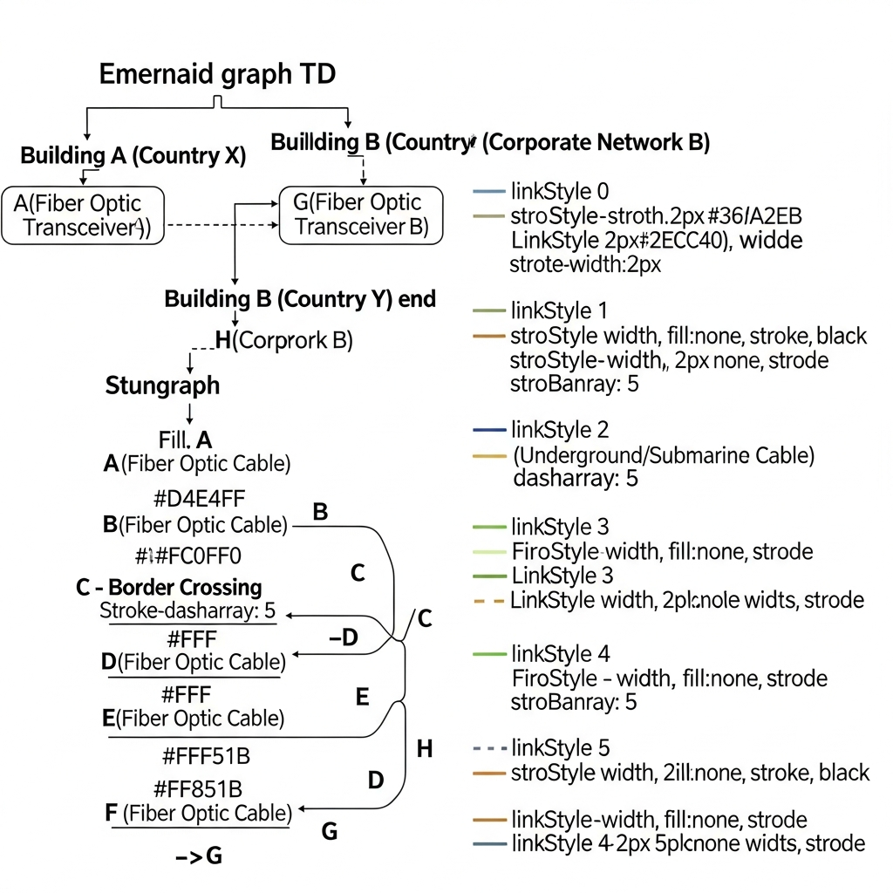
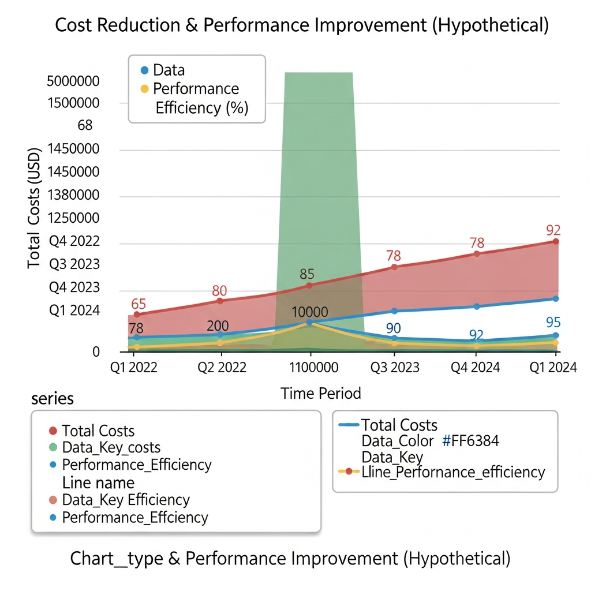
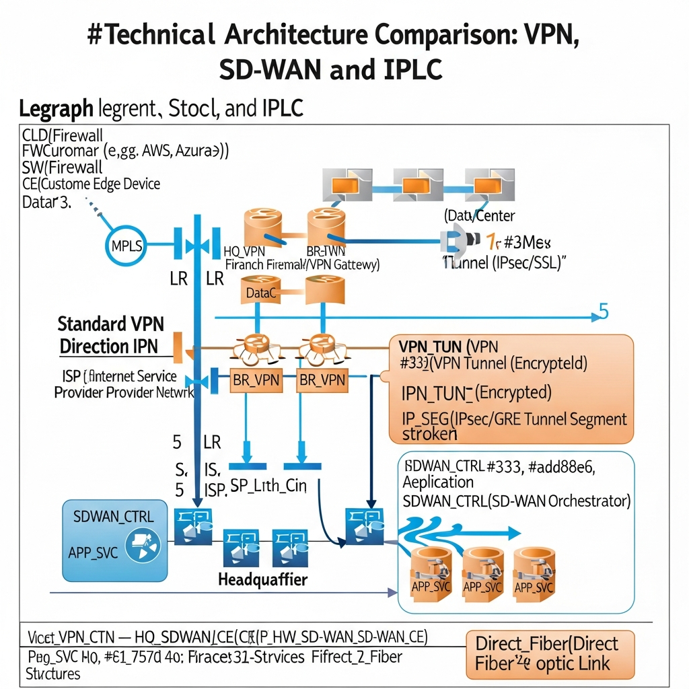

!

### <b>국제전용회선 HGX: 글로벌 비즈니스 환경의 필수 인프라</b>

해외 지사와의 데이터 통신에서 발생하는 지연과 끊김 현상은 업무 생산성을 떨어뜨리는 주요 원인입니다. 국제전용회선(IPLC) HGX는 지사 간 독립된 전용 경로를 구성하여 24시간 안정적인 품질과 보안을 유지하는 프리미엄 서비스입니다. 특히 중국이나 베트남, 필리핀처럼 네트워크 환경이 불안정한 지역에서 그 진가를 발휘하죠. 기존 인프라를 유지하면서도 도입 비용은 최대 75%까지 낮출 수 있다는 점이 가장 큰 특징입니다.

---

!

## <b>1. 공용 인터넷의 한계와 전용회선의 필요성</b>

해외와 데이터를 주고받을 때 일반 인터넷(공중망)을 사용하면 불특정 다수와 회선을 공유하게 됩니다. 이 과정에서 병목 현상이 발생하거나 보안 취약점이 노출될 우려가 큽니다.

*   <b>IPLC(International Private Leased Circuit)란?</b> 국가 간 지점을 일대일로 연결하는 독립적인 전용 회선입니다. 외부 간섭이 전혀 없어 속도와 보안 측면에서 가장 높은 신뢰도를 보여줍니다.
*   <b>어떤 기업에 필요할까?</b> 중국, 베트남, 인도네시아 등지에 공장이나 지사를 둔 기업이 대표적입니다. 본사와 지사 간 ERP/MES 시스템 접속이 잦거나, 실시간 화상회의 품질이 업무 흐름에 영향을 미친다면 전용회선 검토가 필요합니다.

---

!

## <b>2. 하이온넷 HGX 서비스가 제공하는 실질적 혜택</b>

하이온넷의 HGX 솔루션은 국제 통신사 수준의 품질을 유지하면서도, 고가의 구축 비용을 현실적인 수준으로 조정했습니다.

### <b>비용 효율 및 구축 편의성 비교</b>
| 항목 | 일반 국제전용회선 | <b>하이온넷 HGX</b> |
| :--- | :--- | :--- |
| <b>월 이용료 (5M 기준)</b> | 약 270만 원 | <b>65만 원</b> |
| <b>연간 절감 예상액</b> | - | <b>약 2,500만 원 절감 가능</b> |
| <b>도입 소요 시간</b> | 수주 단위 소요 | <b>5분 내 데모 테스트 가능</b> |
| <b>인프라 변경 여부</b> | 대대적인 설정 변경 필요 | <b>기존 IP 및 장비 그대로 사용</b> |

### <b>서비스 운영의 특징</b>
1.  <b>직결망 기반의 품질 관리:</b> 해외 직결망을 통해 그룹웨어, ERP, 파일 서버 접속 시 끊김 없는 환경을 지원합니다. 전문 운영팀이 24시간 모니터링을 진행하기에 안심하고 업무에만 집중할 수 있죠.
2.  <b>동남아시아 전역 커버리지:</b> 중국과 베트남을 비롯해 필리핀, 인도네시아 등 주요 비즈니스 거점에 최적화된 경로(PoP)를 확보하고 있습니다.
3.  <b>유연한 확장성:</b> 복잡한 공사 없이 전용 프로그램 설치만으로 성능을 즉시 개선할 수 있어 도입 장벽이 낮습니다.

---

!

## <b>3. 인프라 환경에 따른 맞춤형 네트워크 구성</b>

단순히 회선 하나만 연결하는 것에 그치지 않고, 기업의 업무 성격에 맞춰 하이브리드 형태의 네트워크를 설계할 수 있습니다.

*   <b>IPLC (전용회선):</b> ERP 데이터나 핵심 회의 시스템처럼 보안과 속도가 최우선인 트래픽을 처리합니다.
*   <b>VPN (가상사설망):</b> 상대적으로 중요도가 낮은 일반 업무용 데이터를 경제적으로 처리할 때 유용합니다.
*   <b>SD-WAN+하이브리드:</b> 중요 데이터는 전용선으로, 일반 트래픽은 공중망으로 분산 라우팅하여 전체적인 운영 효율을 극대화하는 방식입니다.

---

!

## <b>4. 기업 데이터를 보호하는 다중 보안 시스템</b>

안정적인 연결만큼 중요한 것이 바로 보안입니다. HGX 솔루션은 외부 공격으로부터 기업 자산을 보호하기 위한 체계적인 방어막을 갖추고 있습니다.

*   <b>차세대 방화벽 및 침입방지시스템(IPS):</b> 1만 2천 개 이상의 공격 패턴을 실시간으로 감지하고 차단합니다. 알려지지 않은 보안 위협(Zero-Day)에 대응하는 자가학습 기능도 포함되어 있습니다.
*   <b>강력한 데이터 암호화:</b> Blowfish 알고리즘 등을 활용해 터널링 구간의 보안을 강화함으로써 데이터 탈취 가능성을 원천 봉쇄합니다.
*   <b>통합 관제 및 리포트:</b> L3/L4 수준의 실시간 트래픽 분석을 통해 장애 징후를 사전에 포착하고, 주기적인 운영 리포트를 제공합니다.

---

!

## <b>5. 현업 적용 시나리오와 도입 효과</b>

실제 현장에서는 HGX 솔루션을 통해 다음과 같은 업무 환경 개선이 이루어지고 있습니다.

1.  <b>본사와 지사 간 업무 통합:</b> 흩어져 있던 네트워크 관리 포인트를 단일화하여 파일 공유와 프린터 사용 등 기본적인 협업 환경을 쾌적하게 만듭니다.
2.  <b>데이터 보안 및 망 분리:</b> 부서별 권한 설정과 IP 관리를 통해 내부 정보 유출을 차단합니다. 이는 보안 검열이 엄격한 산업군에서 특히 중요하게 작용합니다.
3.  <b>유연한 재택근무 지원:</b> 별도의 추가 라이선스 부담 없이도 외부에서 사내 시스템에 안전하게 접근할 수 있는 VPN 환경을 구축할 수 있습니다.

---

!

## <b>6. 지속 가능한 네트워크 운영을 위한 제언</b>

하이온넷의 국제전용회선 HGX는 통신 비용을 대폭 절감하면서도 업무 효율을 비약적으로 높일 수 있는 선택지입니다. 전문 엔지니어가 상주하는 관제 서비스를 통해 장애 발생 시에도 즉각적인 대응이 가능하며, 투명한 로그 분석 리포트로 네트워크 운영의 가시성을 확보할 수 있습니다.

글로벌 시장 진출을 앞두고 있거나 현재 해외 지사와의 통신 품질 문제로 고민하고 계신다면, 5분 내외로 완료되는 무료 데모 테스트를 통해 실제 체감 속도를 직접 확인해 보시길 권장합니다.

https://haion.net/global/hgx/
