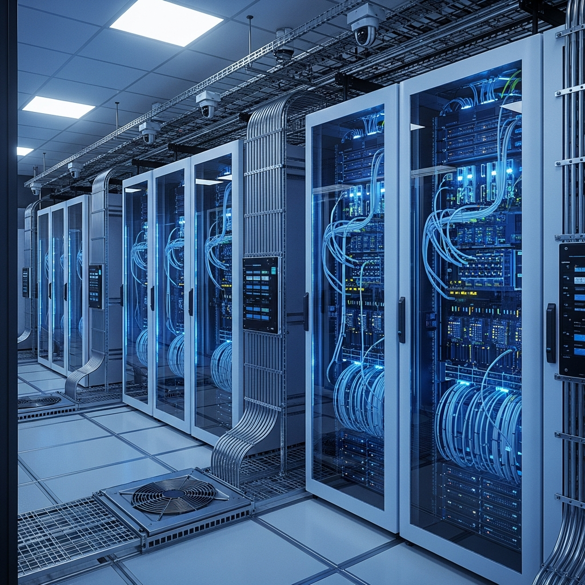
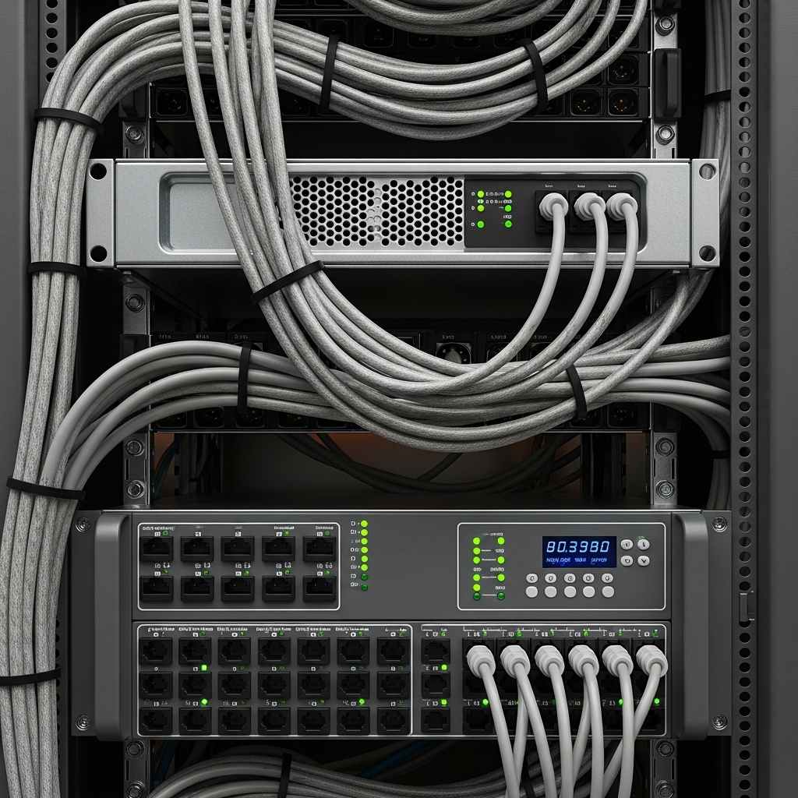
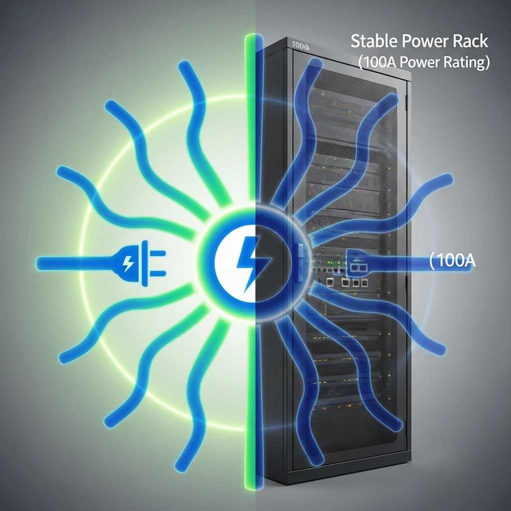
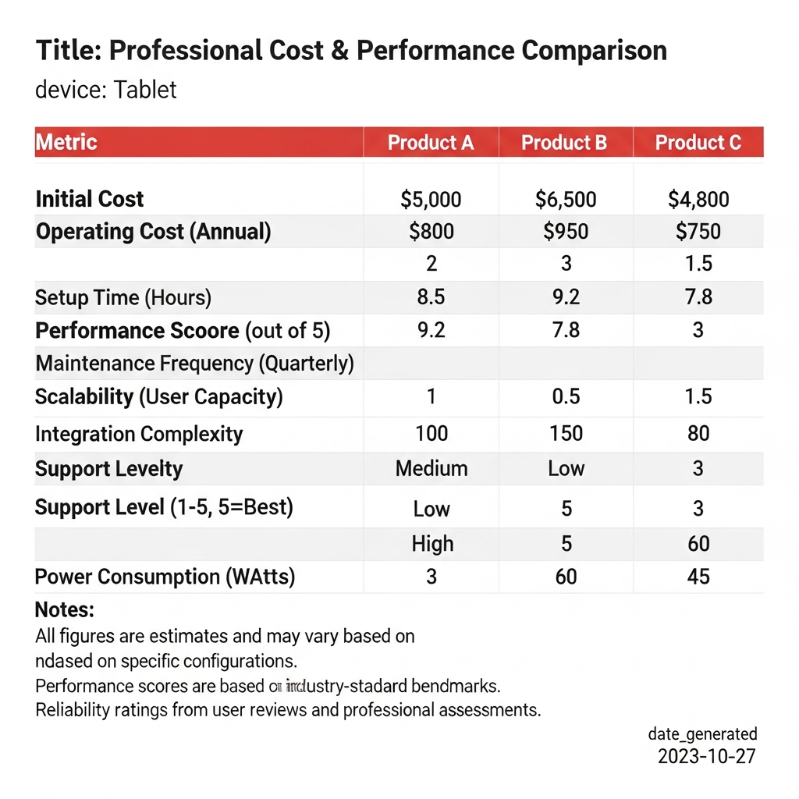
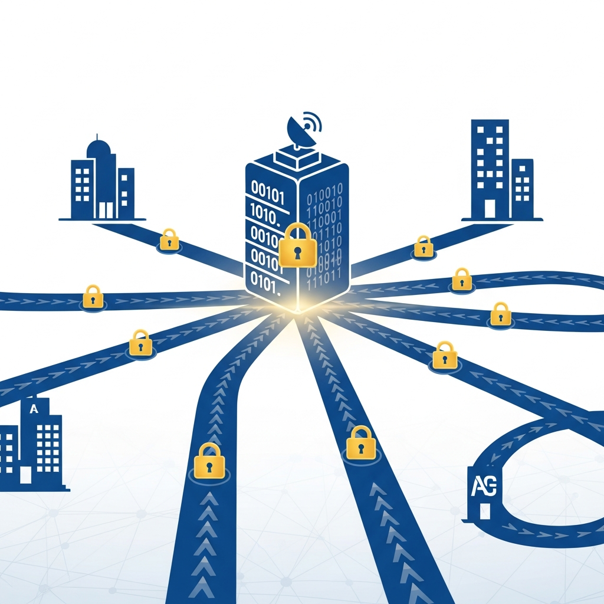
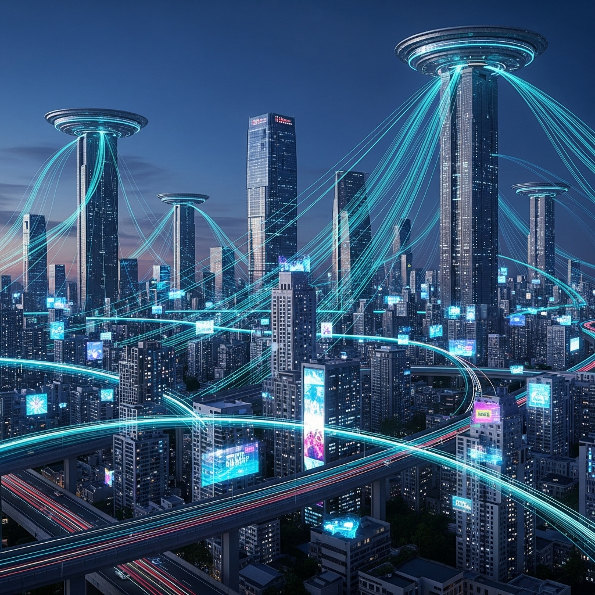

### 고밀도 컴퓨팅 환경을 위한 고전력 코로케이션의 정의

**고전력 코로케이션(High-Density Colocation)**은 AI 연산이나 딥러닝 등 대규모 연산이 필요한 GPU 서버를 위해 설계된 데이터 센터 서비스입니다. 일반적인 코로케이션이 랙당 2~4kW 수준의 전력을 제공하는 반면, 고전력 코로케이션은 **랙당 10kW(약 45A)에서 최대 22kW 이상의 전력**을 공급합니다. 단순히 전력량만 늘리는 것이 아니라, 고밀도 서버에서 발생하는 열을 식히기 위한 냉각 시스템과 안정적인 네트워크 보안 인프라가 통합된 형태를 갖추고 있습니다.

---

### 기존 데이터 센터 환경에서 겪는 주요 기술적 병목

AI 비즈니스를 위해 GPU 서버를 도입하더라도, 기존의 일반적인 데이터 센터 환경에서는 인프라의 한계로 인해 장비의 성능을 100% 활용하기 어려운 경우가 많습니다.

1.  **전력 밀도 부족에 따른 공간 낭비**: NVIDIA HGX 시스템 같은 최신 GPU 서버는 단일 장비만으로도 막대한 전력을 소모합니다. 일반적인 랙 환경에서는 전력 용량이 금방 한계에 도달해, 랙의 절반 이상이 비어 있음에도 서버를 더 이상 추가하지 못하는 비효율이 발생하곤 하죠.
2.  **발열 제어 및 성능 저하**: 고전력 장비는 운영 중 대량의 열을 방출합니다. 공조 시설이 뒷받침되지 않으면 장비의 과열을 막기 위해 스스로 성능을 낮추는 스로틀링(Throttling) 현상이 발생하고, 이는 곧 서비스 품질 저하와 장비 수명 단축으로 이어집니다.
3.  **네트워크 확장성 문제**: 대용량 데이터를 실시간으로 처리해야 하는 환경에서는 단순한 회선 연결만으로는 부족합니다. 충분한 대역폭과 함께 원활한 데이터 처리를 위한 공인 IP 자원 확보가 필수적입니다.

---

### 안정적인 고성능 서버 운영을 위한 기술적 요건

고성능 인프라를 안정적으로 가동하기 위해서는 전력, 네트워크, 보안이라는 세 가지 요소가 유기적으로 맞물려야 합니다.

#### 1. 랙당 최대 100A(22kW) 수준의 전력 공급
고성능 GPU 서버가 중단 없이 가동되려면 넉넉한 전력 설계가 선행되어야 합니다. 랙당 최대 100A의 전력을 지원하면 고밀도 집적 환경에서도 전력 부족에 대한 우려 없이 장비를 자유롭게 배치할 수 있습니다.

#### 2. 대규모 IP 자원과 고품질 네트워크 구성
*   **넉넉한 공인 IP 리소스**: 마케팅이나 게임, 대규모 서버 클러스터 운영 등 용도에 따라 대량의 IP가 필요한 경우가 많습니다. 약 50만 개의 공인 IP를 보유한 환경이라면 필요할 때 즉각적인 대응이 가능합니다.
*   **광케이블 기반의 프리미엄 회선**: 전 구간 광케이블 인입과 다중 회선 병합 기술(MAT)을 통해 네트워크 장애 리스크를 낮추고 전송 속도를 안정적으로 유지합니다.

#### 3. 기업급 보안 관제 및 실시간 대응
*   **통합 보안 엔진**: 방화벽은 물론 QoS, NAT, AI 기반 안티멀웨어 기능을 통해 외부의 비정상적인 접근을 차단하고 트래픽을 관리합니다.
*   **엔지니어 상주 모니터링**: 전문 인력이 24시간 365일 상주하며 실시간으로 상태를 점검해야 합니다. 장비에 문제가 생겼을 때 즉시 현장에서 대응할 수 있는 체계가 갖춰져 있어야 하거든요.

---

### 일반 코로케이션과 고전력 코로케이션의 실무적 차이

| 구분 | 일반 코로케이션 | 고전력 코로케이션 (권장) |
| :--- | :--- | :--- |
| **제공 전력** | 랙당 2kW ~ 4.4kW | 랙당 최대 22kW (100A) |
| **주요 용도** | 웹서버, 일반 스토리지 | GPU 서버, AI 학습, HPC(고성능 연산) |
| **네트워크** | 표준 공유 회선 | 전용 대역폭 및 VPN 연동 지원 |
| **보안 설정** | 기본 방화벽 위주 | 통합 보안 솔루션 및 엔드포인트 보호 |
| **비용 효율** | 상면 대비 전력 비용 높음 | 고밀도 구성을 통한 TCO 절감 |

---

### VPN 및 전용회선을 활용한 인프라 확장

단순히 물리적인 공간을 빌리는 것을 넘어, 본사와 데이터 센터 간의 유기적인 연결도 중요합니다. 맞춤형 **VPN 전용회선**을 구축하면 물리적으로 떨어진 환경에서도 마치 내부 네트워크처럼 안전하게 데이터를 주고받을 수 있습니다.

*   **효율적인 비용 설계**: 고가의 전용선을 직접 구축하는 것보다 비용을 크게 절감하면서도 유사한 수준의 보안성을 확보할 수 있습니다.
*   **강력한 데이터 암호화**: Blowfish 등 검증된 알고리즘을 사용하여 데이터 전송 구간에서의 유출 가능성을 방어합니다.
*   **유연한 네트워크 토폴로지**: Bridge 방식이나 Routing 방식 중 사내 인프라 구조에 가장 적합한 방식을 선택해 최적의 통신 환경을 만들 수 있습니다.

---

### 인프라 최적화가 비즈니스에 미치는 영향

고전력 코로케이션을 선택하는 것은 단순히 서버를 배치할 장소를 찾는 과정이 아닙니다. 이는 기업의 IT 자산을 가장 효율적으로 관리하기 위한 전략적 판단에 가깝습니다. 실무적으로 기대할 수 있는 효과는 다음과 같습니다.

*   **비즈니스 연속성 확보**: 고가용성 기반의 통합 관리를 통해 시스템 다운타임 없는 안정적인 서비스 운영이 가능해집니다.
*   **운영 비용 절감**: 효율적인 전력 배분과 합리적인 요금 체계를 통해 전체적인 총 소유 비용(TCO)을 낮출 수 있습니다.
*   **신속한 확장성**: 서비스 규모가 커져 GPU 서버를 증설해야 할 때, 인프라 재공사 없이 즉시 랙을 채울 수 있어 시장 대응 속도가 빨라집니다.

AI 시대의 경쟁력은 데이터 처리의 속도만큼이나 그 데이터를 처리하는 인프라의 안정성에서 결정됩니다. 현재 운영 중인 서버 환경이 고성능 장비의 부하를 견디기에 충분한지 점검해 보고, 전문가의 컨설팅을 통해 귀사만의 최적화된 인프라 모델을 구축해 보시기 바랍니다.

https://haion.net/colocation/gpu.php
